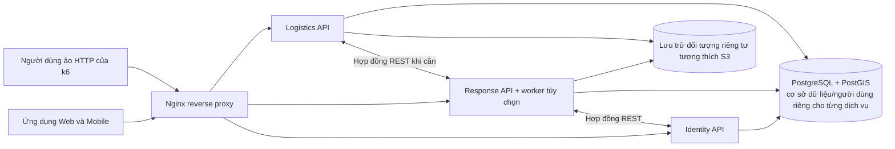
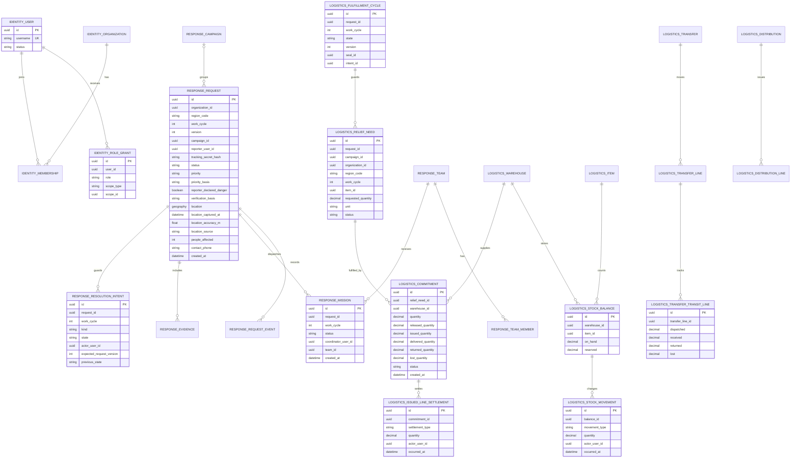
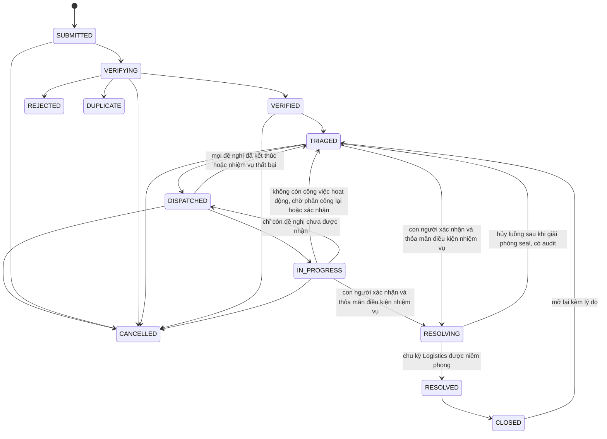
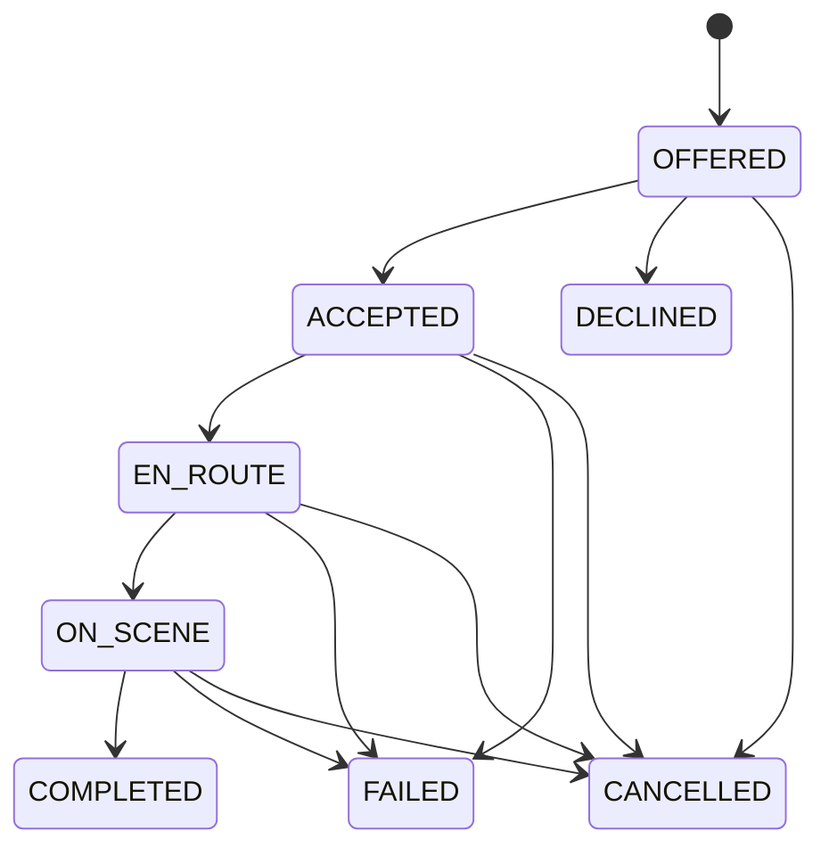
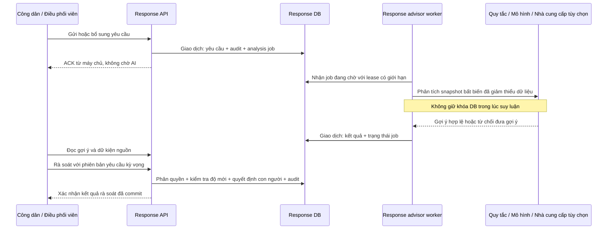
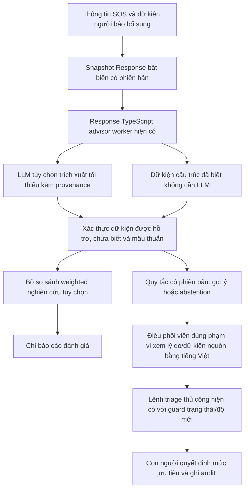
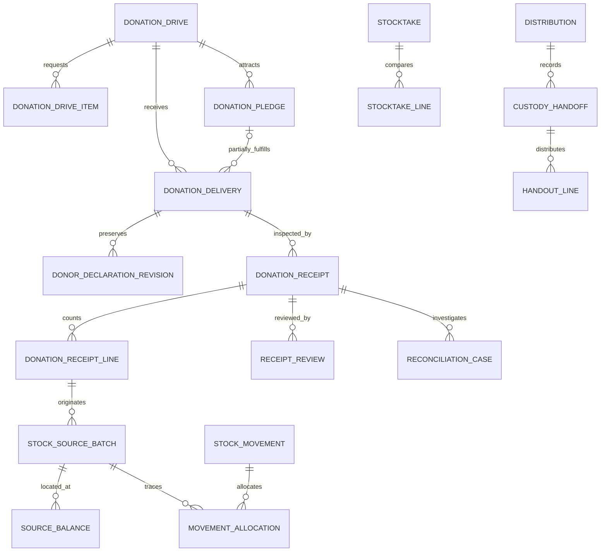

> **LƯU Ý — BẢN LỖI THỜI (v2.8):** tài liệu này chưa phản ánh PROXY, cân bằng tải đội, bản đồ nhiệt, quyên góp rút gọn và các sửa đổi v3.x. Bản tiếng Anh `c48-technology-and-delivery-plan.md` là bản chuẩn.

# Kế hoạch Công nghệ và Triển khai C48

| Thuộc tính | Giá trị |
|---|---|
| Dự án | Hệ thống quản lý ứng phó khẩn cấp và cứu trợ thiên tai |
| Mã dự án | C48 |
| Phiên bản | 2.8 — các điều chỉnh sau rà soát bảo vệ đồ án: bí mật theo dõi SOS do ứng dụng khách tạo, quy tắc xác minh và xử lý người báo tin không liên lạc được, tiêu chí P1–P4, phạm vi được bảo vệ bằng dấu niêm phong, lịch trình tích hợp và hạch toán nhu cầu đã hủy; kế thừa phần mở rộng quyên góp ở phiên bản 2.7 |
| Nghiên cứu ban đầu / cập nhật kế hoạch | 2026-09-29 / 2026-10-04 |
| Bối cảnh nhóm | Đề cương có ba thành viên; một thành viên phụ trách backend |
| Vai trò tài liệu | Kế hoạch kỹ thuật thống nhất cho triển khai và nghiên cứu tiếp theo |

Tài liệu này đề xuất cơ sở kỹ thuật cho SRS, SDD, thiết kế cơ sở dữ liệu/API, ca kiểm thử và hướng dẫn sử dụng. Kiến trúc ba dịch vụ và các quy trình được điều chỉnh dưới đây là đề xuất thiết kế của C48, không phải yêu cầu do khoa ban hành hay chính sách cứu hộ đã được phê duyệt.

**Dành cho triển khai và nghiên cứu tiếp theo:** đây là kế hoạch kỹ thuật thống nhất. Phụ lục A bổ sung hướng dẫn thực hiện và các điều kiện hợp đồng còn phải chốt cho từng lát chức năng. Mục 22 và 23 xác định cấu trúc backend, bất biến nghiệp vụ và các quyết định kiến trúc đã được giải quyết sau rà soát; Mục 25 mở rộng cơ sở thiết kế với quyên góp hiện vật, xác minh tiếp nhận độc lập, hạch toán nguồn hàng và bàn giao cứu trợ. Mục 12 mô tả phần mở rộng hỗ trợ ra quyết định bằng AI (tùy chọn); Mục 6.3 ghi nhận lựa chọn lưu trữ đối tượng. Kế hoạch này không tuyên bố đã đo hiệu năng triển khai hay thực hiện kiểm thử sản phẩm.

## 1. Hướng dẫn đọc và mức độ chắc chắn

| Nhãn | Ý nghĩa |
|---|---|
| **Đề cương dự án** | Các yêu cầu được tổng hợp trong [bối cảnh dự án](c48-project-context.md). |
| **Đề xuất** | Lựa chọn kỹ thuật hoặc quy tắc nghiệp vụ được đề xuất làm cơ sở cho đồ án. |
| **Cần xác nhận** | Câu hỏi cần trao đổi với giảng viên hướng dẫn hoặc người có kinh nghiệm vận hành phù hợp. |

Tài liệu OCHA/IFRC cung cấp thông tin tham khảo cho thiết kế quy trình nhân đạo; chúng không thay thế quy định do cơ quan có thẩm quyền tại Việt Nam ban hành. OCHA mô tả một chu trình gồm phân tích, lập kế hoạch, huy động nguồn lực, triển khai, giám sát/đánh giá và báo cáo. [OCHA — Chu trình Chương trình Nhân đạo](https://knowledge.base.unocha.org/wiki/spaces/hpc/overview)

## 2. Tóm tắt khuyến nghị

| Lĩnh vực | Cơ sở đề xuất | Lý do |
|---|---|---|
| Backend | NestJS + TypeScript trên một bản Node.js LTS còn được hỗ trợ | Phù hợp với ngăn xếp TypeScript ở các ứng dụng khách, đồng thời hỗ trợ API mô-đun, xác thực dữ liệu và OpenAPI. Chốt các phiên bản tương thích khi thiết lập dự án. |
| Cơ sở dữ liệu | PostgreSQL + PostGIS, truy cập qua TypeORM và SQL có tham số cho các thao tác không gian | Phù hợp với quy trình quan hệ, giao dịch tồn kho và truy vấn vị trí có chỉ mục; tài liệu TypeORM mô tả hỗ trợ geometry/geography của PostgreSQL. [Các kiểu dữ liệu không gian PostgreSQL của TypeORM](https://typeorm.io/docs/drivers/postgres/) |
| Dịch vụ backend | Ba dịch vụ có thể triển khai độc lập: Identity, Response, Logistics | Thể hiện ranh giới sở hữu rõ ràng nhưng vẫn giúp một thành viên phụ trách backend có thể triển khai và kiểm thử đồ án. |
| Giao tiếp giữa dịch vụ | REST/JSON cho lệnh từ người dùng và lệnh liên dịch vụ; giao dịch cơ sở dữ liệu cục bộ | Quy trình có nhịp độ do con người xử lý và cần phản hồi tức thì. Chỉ xem xét nhắn tin qua broker khi có trường hợp sử dụng được đo lường cần phát tán sự kiện, phát lại hoặc nhiều bên nhận độc lập. |
| Web | React + TypeScript + Vite | Phù hợp với bảng điều hành; các màn hình cần đăng nhập không đòi hỏi SSR/SEO. [Hướng dẫn Vite](https://vite.dev/guide/) |
| Mobile | React Native + Expo + TypeScript | Dùng chung kiến thức TypeScript và hỗ trợ GPS, ảnh, thông báo. Chỉ xin quyền vị trí khi cần; mặc định không theo dõi nền. [TypeScript trong React Native](https://reactnative.dev/docs/typescript), [Expo Location](https://docs.expo.dev/versions/latest/sdk/location/) |
| Tệp | MinIO AIStor Free, triển khai một nút trong phòng lab, qua AWS SDK for JavaScript S3 client | Lựa chọn cuối cùng cho đồ án với dữ liệu demo tổng hợp. Nhận và sử dụng phần mềm theo điều khoản giấy phép hiện hành; không phân phối lại phần mềm. Gói miễn phí không có HA/SLA và không bao gồm mã hóa dữ liệu lưu trữ; duy trì quyền truy cập riêng tư và bản sao lưu đã kiểm thử. |
| Triển khai | Docker Compose trên một máy chủ demo; Nginx reverse proxy | Nhiều container không đòi hỏi nhiều máy vật lý. [Docker Compose trong môi trường production](https://docs.docker.com/compose/how-tos/production/) |
| AI | Công cụ tư vấn có giải thích; điều phối viên là người ra quyết định | Hướng nghiên cứu tùy chọn; không tự động thay đổi mức ưu tiên hoặc điều động cứu hộ. |

**Quy mô demo:** ba dịch vụ ứng dụng, PostgreSQL/PostGIS với thông tin đăng nhập cơ sở dữ liệu riêng cho từng dịch vụ, lưu trữ đối tượng và hệ thống số liệu gọn nhẹ nếu cần, tất cả chạy trên một máy demo. k6 có thể tạo tải người dùng ảo qua HTTP đến API mà không cần Kafka. [Người dùng ảo trong Grafana k6](https://grafana.com/docs/k6/latest/get-started/running-k6/)

## 3. Phân tích vấn đề và quy trình nghiệp vụ

### 3.1. Các rủi ro cần xử lý

Bối cảnh dự án có thông tin được trao đổi qua nhiều kênh và nhóm. Cần kiểm chứng các giả thuyết rủi ro sau bằng phỏng vấn hoặc khảo sát:

- Yêu cầu có thể thiếu vị trí, số người bị ảnh hưởng hoặc thời điểm quan sát.
- Các báo cáo trùng lặp có thể không được liên kết, làm sai lệch thống kê hoặc dẫn đến điều động lặp lại.
- Điều phối viên có thể không nắm được yêu cầu đang chờ xác minh, nhiệm vụ đã được nhận và nguồn lực hiện có.
- Sổ tồn kho và việc bàn giao cứu trợ có thể lệch nhau giữa khâu tiếp nhận, điều chuyển, cam kết, xuất kho và phân phối nếu không có lịch sử truy vết.
- Kết nối yếu có thể khiến người dân không biết máy chủ đã nhận SOS hay chưa.
- Bảng điều hành có thể gây hiểu nhầm nếu không nêu rõ nguồn dữ liệu, phạm vi bộ lọc hoặc thời điểm dữ liệu được cập nhật gần nhất.
- Quyền truy cập quá rộng có thể làm lộ thông tin vị trí/liên hệ nhạy cảm.

Đây là các giả thuyết về vấn đề, không phải kết luận về một địa phương hay cơ quan cụ thể.

### 3.2. Quy trình mục tiêu

1. **Tiếp nhận:** người dân gửi yêu cầu kèm tọa độ, độ chính xác, thời điểm ghi nhận và nguồn vị trí. Bản gửi khi ngoại tuyến vẫn ở trạng thái chờ; chỉ xác nhận từ máy chủ (ACK) mới có nghĩa là đã tiếp nhận.
2. **Sàng lọc:** kiểm tra dữ liệu đầu vào, dùng khóa idempotency để tránh gửi trùng và đưa yêu cầu vào hàng đợi nghiệp vụ.
3. **Xác minh:** điều phối viên liên hệ người báo tin hoặc bổ sung thông tin. Từ chối yêu cầu và liên kết báo cáo trùng lặp phải có lý do và lịch sử.
4. **Ưu tiên:** điều phối viên áp dụng tiêu chí đã thống nhất. Nếu bật AI, kết quả chỉ có tính bổ trợ.
5. **Điều động:** giao nhiệm vụ cho đội phù hợp. Đội nhận/từ chối và ghi nhận quá trình di chuyển, thời điểm đến nơi và kết quả.
6. **Phân bổ nguồn lực:** điều phối viên ghi nhận nhu cầu có cấu trúc trong Logistics; một hoặc nhiều kho cam kết đóng góp. Cam kết, xuất hàng thực tế và xác nhận giao hàng vẫn là các giai đoạn riêng.
7. **Xác nhận kết quả:** đội cung cấp kết quả/bằng chứng; điều phối viên xác nhận nhu cầu đã được đáp ứng hay chưa. Hoàn tất một nhiệm vụ không tự động đóng yêu cầu còn nhu cầu chưa được đáp ứng.
8. **Giám sát:** mỗi dịch vụ có thẩm quyền sở hữu dữ liệu cung cấp trạng thái vận hành và thời điểm dữ liệu bảng điều hành hiện tại được đọc.

### 3.3. Các mô hình được điều chỉnh cho C48

Các khuyến nghị dưới đây áp dụng lại ý tưởng quy trình được ghi nhận trong [nghiên cứu nền tảng ứng phó thiên tai](research/disaster-response-platform-patterns.md). Chúng mở rộng đề cương dự án dưới dạng đề xuất, không phải yêu cầu chính thức.

| Nguồn tham khảo | Điều chỉnh cho C48 | Mức độ phù hợp |
|---|---|---|
| Hàng đợi rà soát, kiểm duyệt và tìm kiếm đã lưu của Ushahidi | Màn hình điều phối viên cho yêu cầu chờ xác minh, đã xác minh nhưng chưa phân công, nhiệm vụ đang diễn ra và yêu cầu mới được đáp ứng một phần; chỉ hiển thị vị trí/liên hệ chính xác trong phạm vi quyền hạn | Làm rõ điểm bàn giao và lượng việc tồn đọng mà không tự động hóa quyết định của con người |
| Cam kết một phần và hồ sơ logistics tách biệt của Sahana ShaRe | Bảng đáp ứng nhu cầu hiển thị số lượng được yêu cầu, đã cam kết, đã xuất, đã giao và còn thiếu; nhiều kho/tổ chức có thể cùng đóng góp | Yêu cầu vẫn có thể mở dù đã giao một phần; một khoản đóng góp không che khuất nhu cầu còn lại |
| Các đồ án cùng loại trong danh mục CNTT: khả năng quan sát điều động/logistics, xử lý vé đồng thời cao và số liệu mô phỏng lưu lượng có thể so sánh | Bổ sung thời gian quy trình có thể đo và chế độ xem cứu trợ còn thiếu được lọc theo yêu cầu/khu vực/mặt hàng trong phạm vi được cấp quyền; dùng k6 cho một kịch bản tải API vừa phải | Giúp demo thể hiện rõ kết quả vận hành và có số liệu minh chứng mà không sao chép broker, giao dịch hoặc miền mô phỏng không liên quan |

Sổ tay dự án là danh mục mô tả đồ án, không phải bằng chứng rằng mọi công nghệ hay khối lượng công việc được liệt kê đều đã được triển khai. Điểm khác biệt của C48 là quy trình truy vết từ xác minh báo cáo đến tiến độ nhiệm vụ và đáp ứng cứu trợ một phần, với số lượng kiểm toán được cùng số đo thời gian phản hồi.

Quy trình tham khảo khái niệm chu trình OCHA. Cần xác nhận thuật ngữ và trách nhiệm áp dụng cho dự án này. [OCHA HPC](https://knowledge.base.unocha.org/wiki/spaces/hpc/overview)

## 4. So sánh công nghệ

### 4.1. Cơ sở dữ liệu và lớp persistence của NestJS

| Tiêu chí | PostgreSQL + PostGIS | MySQL 8.4 + InnoDB | MongoDB |
|---|---|---|---|
| Quan hệ và ràng buộc | Phù hợp với người dùng, nhiệm vụ, giao dịch tồn kho và kiểm toán | Phù hợp; InnoDB hỗ trợ giao dịch và khóa ngoại | Quan hệ và báo cáo liên thực thể cần thiết kế thêm ở tầng ứng dụng |
| GPS/bản đồ | Toán tử không gian PostGIS và chỉ mục GiST; TypeORM ánh xạ geometry/geography của PostgreSQL sang GeoJSON | MySQL có tính năng không gian, nhưng cần xác minh thêm đường truy vấn/ORM đã chọn | Có chỉ mục 2dsphere; mô hình tài liệu không làm đơn giản các ràng buộc sổ tồn kho |
| Cập nhật tồn kho đồng thời | Giao dịch, ràng buộc check/unique và khóa dòng ngăn xuất vượt tồn | InnoDB hỗ trợ giao dịch và khóa | Có giao dịch nhiều tài liệu; vẫn cần quy tắc rõ ràng để bảo đảm nhất quán tồn kho |
| Tích hợp NestJS | PostgreSQL driver và `@nestjs/typeorm`; TypeORM hỗ trợ kiểu dữ liệu không gian | Có TypeORM hỗ trợ; GIS không phải lý do để chọn | Nest có tích hợp Mongoose; không phù hợp bằng cơ sở quan hệ cho sổ cái |
| Quyết định | **Chọn** | Không chọn | Không chọn làm cơ sở dữ liệu chính |

Chọn TypeORM vì Nest ghi nhận tích hợp `@nestjs/typeorm` được duy trì và PostgreSQL driver của TypeORM có kiểu geometry/geography cùng cơ chế trao đổi GeoJSON. Dùng migration, không đồng bộ schema lúc chạy. Dùng giao dịch và khóa dòng của TypeORM cho tồn kho; dùng SQL có tham số/QueryBuilder cho vị từ không gian như `ST_DWithin` khi phương thức repository không biểu đạt được thao tác cần thiết. Nêu rõ SRID, lựa chọn chỉ mục/toán tử và việc dùng geography hay geometry. [Tích hợp cơ sở dữ liệu NestJS](https://docs.nestjs.com/techniques/database), [Cột không gian PostgreSQL trong TypeORM](https://typeorm.io/docs/drivers/postgres/), [Chỉ mục không gian PostGIS](https://postgis.net/documentation/faq/spatial-indexes/)

Prisma là một lựa chọn TypeScript đáng cân nhắc với kiểu dữ liệu được sinh tự động, nhưng truy cập PostGIS dựa vào kiểu tùy chỉnh/không được hỗ trợ và truy vấn thô. Drizzle cũng khả thi nếu nhóm ưu tiên truy vấn theo hướng SQL và xác minh được nhu cầu migration/không gian. Dùng thống nhất một ORM trong các dịch vụ. Lựa chọn là **TypeORM**, với điều kiện thực hiện sớm một thử nghiệm tương thích về migration geometry, truy vấn không gian và giao dịch/khóa dòng trên image PostgreSQL/PostGIS được chọn. [Các tính năng cơ sở dữ liệu không được Prisma hỗ trợ](https://www.prisma.io/docs/orm/prisma-schema/data-model/unsupported-database-features), [PostgreSQL với Drizzle](https://orm.drizzle.team/docs/get-started-postgresql)

Lưu điểm theo GeoJSON với thứ tự kinh độ, vĩ độ và SRID 4326; kiểm tra phạm vi giá trị trước khi lưu. Cân nhắc `geography(Point,4326)` cho phép tính bán kính theo mét và geometry cho ranh giới; kiểm tra đơn vị/chỉ mục bằng truy vấn đại diện. [RFC 7946](https://datatracker.ietf.org/doc/html/rfc7946), [Chỉ mục không gian PostGIS](https://postgis.net/documentation/faq/spatial-indexes/)

Các thao tác ghi tồn kho dùng giao dịch PostgreSQL ngắn, thứ tự khóa dòng xác định trước và ràng buộc như `on_hand >= 0`, `reserved >= 0` và `reserved <= on_hand`. Không gọi dịch vụ khác hoặc kho đối tượng khi đang giữ khóa cơ sở dữ liệu. Kiểm thử đồng thời trên PostgreSQL/PostGIS, không dùng SQLite. [Khóa tường minh trong PostgreSQL](https://www.postgresql.org/docs/18/explicit-locking.html)

### 4.2. Đánh giá và lựa chọn framework backend

**Phương pháp đánh giá:** so sánh định tính dựa trên nhu cầu của C48 về ba dịch vụ, TypeScript, PostgreSQL/PostGIS, GIS và backend do một người phụ trách; sử dụng tài liệu chính thức được rà soát ngày 2026-09-30. Đây không phải phép đo hiệu năng. NestJS/TypeScript là backend được chọn; ngăn xếp triển khai không dùng framework Python.

| Framework | Điểm mạnh liên quan đến C48 | Công việc tích hợp và đánh đổi | Đánh giá |
|---|---|---|---|
| **NestJS (TypeScript/Node.js)** | Module/provider/guard, TypeScript, tích hợp OpenAPI và validation; cùng họ ngôn ngữ giữa backend và ứng dụng khách | ORM/migration, truy vấn PostGIS, phân quyền nghiệp vụ và giao diện vận hành vẫn cần triển khai rõ ràng | **Chọn** cho ba ranh giới dịch vụ và phát triển TypeScript |
| **Spring Boot (Java/Kotlin)** | Hệ sinh thái ứng dụng/bảo mật/vận hành trưởng thành | Ngôn ngữ/công cụ JVM khác với ứng dụng khách; là phương án tốt nếu nhóm đã có kinh nghiệm Spring nhiều hơn | Đủ năng lực về kỹ thuật, nhưng đòi hỏi chuyển đổi ngôn ngữ/công cụ lớn hơn cho dự án này |
| **Django + DRF (Python)** | ORM, admin/auth tích hợp và quy ước API trưởng thành | Ngôn ngữ backend khác; vẫn phải làm rõ hợp đồng API liên dịch vụ và quy tắc miền | Phương án có năng lực nhưng không dùng trong kế hoạch này |
| **FastAPI (Python)** | Validation định hướng kiểu, OpenAPI sinh tự động, hỗ trợ API bất đồng bộ | Cần kết hợp ORM/migration, admin, auth, phân quyền và thành phần GIS | Phù hợp API chuyên biệt nhưng tạo thêm khác biệt ngôn ngữ/công cụ |
| **Flask (Python)** | Phần lõi nhỏ, linh hoạt khi chọn thành phần | Phải đưa ra thêm nhiều quyết định nền tảng về cơ sở dữ liệu, schema, xác thực và quản trị trên các dịch vụ | Linh hoạt nhưng tăng phần việc lắp ghép và tạo khác biệt ngôn ngữ/công cụ |

**Cơ sở tham khảo:** Nest mô tả module/provider, guard, validation, OpenAPI và tích hợp cơ sở dữ liệu. Spring Boot, Django/DRF, FastAPI và Flask vẫn là các phương án có năng lực với những đánh đổi tích hợp khác nhau. [Tích hợp cơ sở dữ liệu NestJS](https://docs.nestjs.com/techniques/database), [Validation trong NestJS](https://docs.nestjs.com/techniques/validation), [OpenAPI trong NestJS](https://docs.nestjs.com/openapi/introduction), [Spring Boot](https://docs.spring.io/spring-boot/index.html), [Tổng quan Django](https://docs.djangoproject.com/en/5.2/intro/overview/), [Tính năng FastAPI](https://fastapi.tiangolo.com/features/), [Thiết kế Flask](https://flask.palletsprojects.com/en/stable/design/)

**Lý do lựa chọn — theo dự án:** NestJS phù hợp quy trình dùng TypeScript cho cả client và backend, đồng thời có hướng dẫn về module, guard, OpenAPI và validation. Kiểu dữ liệu không gian PostgreSQL của TypeORM hỗ trợ cơ sở GIS. Lựa chọn này giảm việc chuyển đổi ngôn ngữ/công cụ nhưng vẫn giữ tường minh phần cơ sở dữ liệu, phân quyền và giao dịch cục bộ. Điều đó không có nghĩa Nest luôn tốt hơn hay nhanh hơn trong mọi trường hợp.

**Lựa chọn triển khai:** ba dịch vụ REST NestJS trên Express adapter mặc định; TypeScript; TypeORM + PostgreSQL/PostGIS; `ValidationPipe` của Nest với DTO validation; `@nestjs/swagger` cho OpenAPI; Passport/JWT cho xác thực; AWS SDK for JavaScript v3 S3 client cho MinIO. Sau thử nghiệm tương thích, chốt các phiên bản Node/Nest/phụ thuộc tương thích; tránh dùng tag `latest` không cố định.

Dùng một repository/workspace cho ba ứng dụng Nest; mỗi ứng dụng có bootstrap, môi trường, image, bộ migration, thông tin xác thực cơ sở dữ liệu và triển khai riêng. Giữ mô hình miền và mã persistence bên trong dịch vụ sở hữu chúng. Chỉ chia sẻ DTO API khi có hợp đồng cụ thể cần thiết; không chia sẻ thực thể miền hay module cơ sở dữ liệu giữa các dịch vụ.

### 4.3. Web, mobile và API

| Kênh | Đề xuất | Phạm vi |
|---|---|---|
| Web | React + TypeScript + Vite; React Router; TanStack Query cho trạng thái từ máy chủ | Bảng điều hành, bản đồ/hàng đợi, xác minh/phân loại, nhiệm vụ, tồn kho, báo cáo, quản trị |
| Mobile | React Native + Expo + TypeScript | SOS/theo dõi trạng thái cho người dân; nhiệm vụ/tiến độ tình nguyện viên; GPS khi ứng dụng ở foreground và bằng chứng ảnh/video có giới hạn |
| API | REST/JSON `/api/v1`; OpenAPI theo từng dịch vụ qua `@nestjs/swagger` | Hợp đồng Web/mobile, mock và kiểm tra API |
| Bản đồ | Tách giao diện bản đồ khỏi logic nghiệp vụ; truy vấn PostGIS; chọn nhà cung cấp tile/geocoding sau khi rà soát giấy phép, hạn mức và quyền riêng tư | Không gửi mô tả sự cố hoặc thông tin nhận dạng cá nhân (PII) cho nhà cung cấp bản đồ |

Màn hình khẩn cấp nên giảm số bước, cung cấp điều khiển dễ tiếp cận, hiển thị rõ trạng thái gửi và cho phép ghim vị trí thủ công khi GPS bị từ chối hoặc thiếu chính xác. Mặc định không bật theo dõi nền. Quyền Expo phụ thuộc nền tảng và cách truy cập. [Expo Location](https://docs.expo.dev/versions/latest/sdk/location/), [Quyền trong Expo](https://docs.expo.dev/guides/permissions/)

### 4.4. Giao tiếp dịch vụ và công việc bất đồng bộ

| Nhu cầu | Cơ sở C48 | Chỉ bổ sung broker khi… |
|---|---|---|
| Đăng nhập, tiếp nhận yêu cầu, xác minh, cập nhật nhiệm vụ, lệnh tồn kho/đáp ứng nhu cầu | REST/JSON với thời gian chờ có giới hạn, mã lỗi ổn định và idempotency cho lệnh có thể thử lại | Thao tác từ người dùng phải phát tán đến nhiều bên nhận triển khai độc lập và API đồng bộ không còn phù hợp |
| Bảng điều hành và thông báo | Đọc API có thẩm quyền của từng dịch vụ; lưu thông báo trong ứng dụng cùng thay đổi nghiệp vụ tại dịch vụ sở hữu | Bên nhận độc lập cần phát lại sự kiện bền vững hoặc lưu lượng đo được cho thấy cách hiện tại không đủ |
| Phân tích AI tùy chọn | Bản ghi công việc do Response sở hữu cùng worker nhận việc đang chờ; khâu tiếp nhận không phải đợi phân tích | Khối lượng công việc, nhu cầu mở rộng độc lập hoặc yêu cầu vận hành biện minh cho hàng đợi riêng |

Không cần Kafka để tạo người dùng ảo k6: k6 gửi các yêu cầu HTTP/API theo kịch bản và cấu hình số người dùng ảo cùng ngưỡng kiểm tra trong bài kiểm thử. [Yêu cầu HTTP trong Grafana k6](https://grafana.com/docs/k6/latest/using-k6/http-requests/), [Người dùng ảo trong k6](https://grafana.com/docs/k6/latest/get-started/running-k6/)

Chỉ xem xét lại Kafka nếu C48 có nhiều bên nhận độc lập, cần phát lại/xử lý lại sự kiện bền vững hoặc hàng đợi/phát tán bất đồng bộ đo được không thể xử lý bằng worker nhỏ dùng cơ sở dữ liệu. Kafka cung cấp lưu trữ và xử lý luồng sự kiện bền vững nhưng làm phát sinh công việc vận hành broker, schema, retry, khử trùng lặp, giám sát và phục hồi. Không cần các năng lực này chỉ vì thiết kế có nhiều dịch vụ hoặc kiểm thử tải. [Tài liệu Apache Kafka](https://kafka.apache.org/documentation/)

### 4.5. Phân rã dịch vụ

| Mô hình | Lợi ích | Chi phí/rủi ro | Đánh giá |
|---|---|---|---|
| Một modular monolith | Triển khai và giao dịch xuyên miền đơn giản nhất | Không tạo ranh giới sở hữu có thể triển khai độc lập | Phương án đã đánh giá; người dùng xác nhận cơ sở ba dịch vụ và thời gian triển khai đủ vào ngày 2026-10-01 |
| Ba dịch vụ: Identity, Response, Logistics | Ranh giới rõ cho tài khoản, quy trình ứng phó khẩn cấp và nguồn cung; ranh giới API có thể quản lý | Cần ghi thành tài liệu hợp đồng REST và cách xử lý lỗi liên dịch vụ | **Được chọn** |
| Năm dịch vụ trở lên | Nhiều thành phần có thể triển khai độc lập hơn | Thêm cơ sở dữ liệu, hợp đồng và công việc vận hành khi chưa có nhu cầu tải được chứng minh | Hoãn |

Mỗi dịch vụ được chọn có ranh giới ứng dụng và thông tin xác thực cơ sở dữ liệu riêng; bản demo có thể chạy cả ba dịch vụ trên một máy và một máy chủ PostgreSQL. Không dịch vụ nào đọc bảng của dịch vụ khác. Dùng REST đồng bộ cho một số ít thao tác kiểm tra liên dịch vụ; mỗi giao dịch cơ sở dữ liệu nằm trong dịch vụ sở hữu dữ liệu.

## 5. Kiến trúc đề xuất

### 5.1. Sơ đồ



Cả ba dịch vụ có thể chạy dưới dạng container trên một máy demo. Có thể dùng chung máy chủ PostgreSQL cho bản demo, nhưng mỗi dịch vụ dùng cơ sở dữ liệu và thông tin xác thực riêng. Không dịch vụ nào được truy vấn bảng của dịch vụ khác. k6 tạo yêu cầu HTTP đến API; k6 không thuộc kiến trúc lúc chạy.

### 5.2. Ranh giới và quyền sở hữu dữ liệu

| Dịch vụ | Sở hữu | Ví dụ về bề mặt API |
|---|---|---|
| **Identity** | Tài khoản, thông tin xác thực, tổ chức, tư cách thành viên, quyền vai trò theo phạm vi, phiên refresh | Đăng ký/đăng nhập/phiên, quản lý người dùng/vai trò |
| **Response** | Chiến dịch, yêu cầu hỗ trợ và loại sự cố, lịch sử xác minh/ưu tiên, đội, nhiệm vụ/tiến độ, bằng chứng yêu cầu, dòng thời gian yêu cầu | Tiếp nhận, xác minh, rà soát trùng lặp, phân loại ưu tiên, phân công, thao tác nhiệm vụ, bản đồ/hàng đợi theo phạm vi |
| **Logistics** | Danh mục mặt hàng, kho, số dư/sổ cái tồn kho, nhu cầu cứu trợ và cam kết liên kết bằng ID yêu cầu không hàm nghĩa, điều chuyển, phương tiện, điểm cứu trợ, hồ sơ phân phối | Tiếp nhận/xuất kho/điều chuyển, cam kết và đáp ứng một phần, chế độ xem tồn kho và nhu cầu còn thiếu |

Quy tắc ranh giới:

- Mỗi dịch vụ sở hữu schema, migration, thông tin xác thực và giao dịch cục bộ của mình. ID đi qua ranh giới là tham chiếu UUID không hàm nghĩa; không dùng khóa ngoại hay truy vấn bảng xuyên dịch vụ.
- Response tiếp tục là nguồn dữ liệu có thẩm quyền về trạng thái yêu cầu và nhiệm vụ. Logistics là nguồn có thẩm quyền về tồn kho, cam kết, số lượng đã xuất/đã giao và trạng thái đáp ứng.
- Bảng điều phối viên kết hợp kết quả API Response và Logistics trong phạm vi được cấp quyền. Nếu một API không khả dụng, hiển thị bảng nào đã cũ/không khả dụng; không ngụ ý dịch vụ còn lại đã hoàn thành công việc.
- Thông báo trong ứng dụng về yêu cầu/nhiệm vụ thuộc Response; thông báo về tồn kho/công việc thuộc Logistics. Mỗi dịch vụ cung cấp báo cáo và dấu thời gian theo phạm vi riêng; không có dịch vụ Notification hay Reporting độc lập.
- Lời gọi REST liên dịch vụ diễn ra ngoài giao dịch cơ sở dữ liệu. Lệnh có thể thử lại phải dùng khóa idempotency. Không ngụ ý có tính nguyên tử xuyên dịch vụ.

### 5.3. Bảng theo dõi từ yêu cầu đến đáp ứng

Đây là điều chỉnh quy trình chính, tham khảo cam kết một phần của Sahana ShaRe và hàng đợi do con người rà soát của Ushahidi. [Chi tiết nghiên cứu và nguồn](research/disaster-response-platform-patterns.md)

1. Response tiếp nhận yêu cầu và giữ yêu cầu trong hàng đợi xác minh nội bộ. Điều phối viên ghi nhận VERIFIED, REJECTED kèm lý do hoặc DUPLICATE kèm yêu cầu chuẩn và lý do. Công cụ tìm kiếm có thể gợi ý báo cáo lân cận theo thời gian, nhóm sự cố và vị trí, nhưng con người đưa ra quyết định.
2. Sau khi xác minh, điều phối viên được cấp quyền ghi nhận nhu cầu hỗ trợ có cấu trúc trong Logistics. Logistics liên kết từng nhu cầu với `request_id` không hàm nghĩa và mã chu kỳ xử lý của yêu cầu; bảng điều hành có thể đọc yêu cầu cùng nhu cầu mà không chia sẻ bảng dữ liệu.
3. Nhu cầu ghi nhận số lượng cần có cùng mặt hàng/đơn vị. Có thể cam kết đóng góp từ một hoặc nhiều kho/tổ chức. Trong giao dịch khóa dòng nhu cầu, tổng đã giao + đã cam kết/đặt trước + đã xuất nhưng chưa giao không được vượt quá số lượng yêu cầu. Hủy cam kết sẽ giải phóng phần chưa xuất; lượng đã xuất phải được giao, hoàn trả hoặc ghi nhận là tổn thất.
4. Theo dõi riêng các lượng: được yêu cầu, đã cam kết/đặt trước, đã xuất, đã giao và còn thiếu. Với nhu cầu không ở trạng thái CANCELLED, `outstanding = requested - delivered`, trong đó `requested` là số lượng hiệu lực hiện tại sau các lần giảm được cấp quyền (giữ lịch sử số lượng ban đầu và mọi thay đổi); giao một phần không làm nhu cầu hoàn tất. Nhu cầu CANCELLED đóng góp 0 vào lượng còn thiếu/tồn đọng; phần chưa giao được báo cáo riêng theo `cancelled_remaining = requested_at_cancellation - delivered`. Điều phối viên có thể chủ động giảm/hủy nhu cầu kèm lý do và lưu lại lịch sử.
5. Trạng thái yêu cầu, trạng thái nhiệm vụ và trạng thái đáp ứng luôn tách biệt. Hoàn tất nhiệm vụ không đóng yêu cầu; giao hàng không đánh dấu nhiệm vụ cứu hộ hoàn tất. Điều phối viên xác nhận giải quyết tổng thể sau khi xem xét bằng chứng nhiệm vụ và đáp ứng hiện tại.

**Kịch bản demo:** một yêu cầu đã xác minh cần 20 bộ cứu trợ và hỗ trợ cứu hộ. Một kho cam kết rồi giao 12 bộ; bảng hiển thị PARTIALLY_FULFILLED với 8 bộ còn thiếu, yêu cầu vẫn mở. Khoản đóng góp thứ hai giao 8 bộ còn lại; bảng ghi nhận cả hai người thực hiện và thời điểm, sau đó điều phối viên chủ động xác nhận đã giải quyết. Demo cũng trình bày một báo cáo bị nghi là trùng lặp để điều phối viên tự rà soát và liên kết.

### 5.4. REST và xử lý công việc nền

- REST xử lý thao tác tức thì của người dùng và một số ít lượt tra cứu liên dịch vụ. Dùng thời gian chờ có giới hạn, thông báo hiển thị cho người dùng bằng tiếng Việt, mã lỗi máy ổn định và idempotency cho thao tác thử lại.
- Việc tổng hợp báo cáo do từng dịch vụ sở hữu dữ liệu thực hiện hoặc do client kết hợp hai kết quả API theo phạm vi. Mỗi phản hồi có `generated_at`; không gọi đó là dữ liệu toàn hệ thống theo thời gian thực.
- Nếu bật phân tích AI tùy chọn, ghi công việc bền vững vào cơ sở dữ liệu Response trong cùng giao dịch với ý định yêu cầu phân tích. Worker nhận việc đang chờ bằng lease, gọi mô hình suy luận ngoài giao dịch rồi lưu một kết quả có phiên bản. Worker lỗi để lại công việc trong cơ sở dữ liệu để có thể thử lại; không cần message broker.
- Không đưa Kafka, Redis, service mesh, schema registry, workflow engine hay dịch vụ thông báo/báo cáo riêng vào cơ sở mặc định. Chỉ xem xét lại theo các tiêu chí ở Mục 4.4.

## 6. Mô hình dữ liệu và tính toàn vẹn

### 6.1. ERD logic theo dịch vụ



Mỗi nhiệm vụ có đúng một đội; đội bổ sung nhận nhiệm vụ riêng thuộc cùng một yêu cầu. Yêu cầu có thể chưa thuộc chiến dịch cho đến khi điều phối viên theo phạm vi gắn yêu cầu vào chiến dịch ACTIVE. `request_id` trong Logistics là tham chiếu liên dịch vụ không hàm nghĩa, không phải quan hệ ERD hay khóa ngoại. Các quan hệ khác trên sơ đồ nằm trong nội bộ từng dịch vụ. Khi triển khai vẫn cần bổ sung đầy đủ dấu thời gian, trường kiểm toán, chỉ mục, ràng buộc unique, migration và chính sách lưu trữ.

### 6.2. Các thực thể cốt lõi

| Cơ sở dữ liệu | Bảng/thực thể tối thiểu |
|---|---|
| Identity | User, Organization, danh mục Region được kiểm soát, Membership, RoleGrant, trạng thái tài khoản, RefreshSession có xoay vòng/thu hồi, AuditRecord |
| Response | Campaign, ResolutionIntent, RegionBoundary tham chiếu mã region được kiểm soát, AssistanceRequest có `organization_id` và `region/campaign` có thể rỗng, RequestEvent, ContactAttempt, AuthorityReferral, RescueTeam, TeamMember có user ID không hàm nghĩa, VolunteerProfile, Mission có một `team_id`, EvidenceMetadata, Notification trong ứng dụng theo phạm vi; tùy chọn AnalysisSnapshot, AnalysisJob, TriageRecommendation, RecommendationReview (Mục 12) |
| Logistics | Warehouse, Item, StockBalance, StockMovement, ReliefNeed/tham chiếu yêu cầu, Commitment (mỗi đóng góp cho một nhu cầu/mặt hàng), FulfillmentCycle, Transfer/lines, Distribution/lines, IssuedLineSettlement, TransferTransitLine, Vehicle, ReliefPoint, Notification trong ứng dụng theo phạm vi |

Định nghĩa thực thể người dùng Identity và migration trước khi các dịch vụ khác phụ thuộc hợp đồng đó; dịch vụ bên ngoài chỉ lưu UUID người dùng không hàm nghĩa, không sao chép thông tin xác thực.

### 6.3. GPS và tệp bằng chứng

- Tọa độ dùng WGS84/SRID 4326; thứ tự GeoJSON là kinh độ, vĩ độ. Kiểm tra kinh độ trong khoảng -180..180, vĩ độ -90..90 và độ chính xác không âm. [RFC 7946](https://datatracker.ietf.org/doc/html/rfc7946)
- Lưu riêng thời điểm ghi nhận, độ chính xác theo mét, nguồn (GPS, ghim thủ công, geocoded) và thời điểm máy chủ nhận dữ liệu. Độ chính xác do thiết bị báo cáo không bảo đảm độ chính xác thực địa.
- Lưu ảnh chụp vị trí cùng SOS. Chỉ bổ sung lịch sử vị trí khi có yêu cầu cụ thể; theo dõi liên tục ở chế độ nền không thuộc MVP.
- Giới hạn truy vấn bản đồ theo quyền, khu vực/thời gian/trạng thái/khung bao. Không để lộ toàn bộ PII qua phản hồi bản đồ.
- Lưu tệp trong kho đối tượng. Cơ sở dữ liệu giữ object key, loại/ID chủ sở hữu, MIME đã xác thực, kích thước, checksum, người tải lên, thời gian và phạm vi hiển thị. Giữ bucket ở chế độ riêng tư; nếu truy cập trực tiếp thì dùng URL ký số có thời hạn ngắn.
- Xác thực MIME thực tế, phần mở rộng và kích thước; không tin tên/MIME do client cung cấp. Tải lên phải được phân quyền dựa trên đối tượng nghiệp vụ sở hữu tệp.
- Dữ liệu demo phải là dữ liệu tổng hợp; không dùng ảnh hay thông tin cá nhân của nạn nhân thật.
- Dùng AWS SDK for JavaScript v3 S3 client từ dịch vụ NestJS sở hữu tệp. Cấu hình thông tin xác thực dịch vụ riêng và bucket riêng tư cho Response và Logistics. Unit test có thể mock S3; kiểm tra tích hợp nhà cung cấp và phục hồi phải dùng máy MinIO AIStor Free lab đã chọn.

#### Lựa chọn kho đối tượng: MinIO AIStor Free

**Lựa chọn cuối cùng cho đồ án: MinIO AIStor Free, triển khai một nút trong phòng lab, dùng dữ liệu tổng hợp.** Không chọn MinIO Community: repository của phiên bản này đã lưu trữ và được đánh dấu không còn bảo trì. AIStor Free là sản phẩm độc quyền riêng; thỏa thuận cho phép dùng độc lập phục vụ giáo dục/nghiên cứu, còn tài liệu vận hành quy định giới hạn riêng theo từng edition. Đây là lựa chọn cho môi trường lab, không phải khuyến nghị production. Kế hoạch này chưa cài đặt hay xác minh artifact/giấy phép MinIO, tích hợp ứng dụng hoặc kiểm thử phục hồi nào. [Repository Community](https://github.com/minio/minio), [Thỏa thuận AIStor Free](https://www.min.io/legal/aistor-free-agreement), [Vận hành giấy phép AIStor](https://docs.min.io/aistor/operations/licenses/)

| Quyết định | Cơ sở C48 |
|---|---|
| Sản phẩm/edition | MinIO AIStor Free; không thay bằng image Community hoặc bản dựng lại của bên thứ ba |
| Cấu trúc/dữ liệu | Một nút cho lab; chỉ dùng dữ liệu demo tổng hợp; không tuyên bố có HA hoặc khả dụng production |
| Giấy phép/gói phần mềm | Người vận hành phải nhận và sử dụng sản phẩm theo thỏa thuận hiện hành cùng giấy phép còn hiệu lực. Không sửa đổi hay phân phối lại binary/image AIStor hoặc giấy phép trong repository/bài nộp, trừ khi điều khoản áp dụng cho phép rõ ràng. Ghi lại bản phát hành chính xác và hiệu lực giấy phép trước buổi demo. |
| Giới hạn gói miễn phí | Không phụ thuộc vào triển khai phân tán, replication, chuyển đổi lifecycle, xóa theo phiên bản, mã hóa dữ liệu lưu trữ hoặc SLA/SLO. Tài liệu hiện tại ghi AIStor Free bắt đầu hỗ trợ từ `minio.RELEASE.2025-12-20T04-58-37Z`; cần kiểm tra lại yêu cầu này với bản phát hành được chọn lúc thiết lập. |
| Tích hợp ứng dụng | API S3 riêng tư; AWS SDK for JavaScript v3; thông tin xác thực/bucket Response và Logistics riêng theo nguyên tắc đặc quyền tối thiểu; không cấp quyền chung cho dịch vụ khác |

Với triển khai đầu tiên, mọi tệp đi qua dịch vụ NestJS sở hữu. Phân quyền đối tượng nghiệp vụ, ghi trạng thái tệp đính kèm PENDING trong giao dịch cơ sở dữ liệu ngắn, xác thực rồi truyền luồng nội dung có giới hạn đến key bất biến được tạo tự động ở ngoài giao dịch, sau đó ghi READY trong giao dịch ngắn thứ hai. Khi lỗi, giữ lại SOS và cho biết tệp đính kèm FAILED/PENDING có thể thử lại; đối soát trường hợp tiến trình dừng giữa lúc tải đối tượng lên và commit metadata. Áp dụng quy tắc phần mở rộng/loại/kích thước theo nội dung nhận diện được, không dựa vào MIME/tên tệp client gửi. Không giữ khóa cơ sở dữ liệu trong lúc gọi S3 và không tuyên bố có giao dịch nguyên tử xuyên cơ sở dữ liệu/kho đối tượng. [S3 client cho AWS SDK for JavaScript](https://docs.aws.amazon.com/AWSJavaScriptSDK/v3/latest/client/s3/), [Hướng dẫn tải tệp của OWASP](https://cheatsheetseries.owasp.org/cheatsheets/File_Upload_Cheat_Sheet.html)

Giữ bucket riêng tư và chỉ lưu metadata đối tượng (chủ sở hữu, key được tạo, MIME nhận diện, kích thước, checksum, người tải lên, dấu thời gian, phạm vi hiển thị/trạng thái) trong PostgreSQL. Không lưu byte của đối tượng hoặc URL ký số trong PostgreSQL, log, analytics hay báo cáo. Trước khi tạo URL ký số ngắn hạn, phân quyền từng lượt tải dựa trên đối tượng nghiệp vụ hiện hành; dùng hostname mà backend, trình duyệt và thiết bị mobile thật đều truy cập được. URL ký số là quyền truy cập mang theo (bearer capability) cho đến khi hết hạn, vì vậy cần ghi rõ khoảng thời gian chưa thể thu hồi hoặc proxy tải xuống nếu cần thu hồi ngay. Tải trực tiếp từ client nằm ngoài phạm vi ban đầu: URL tải lên ký sẵn có thể được tái sử dụng và ghi đè key hiện có cho đến khi hết hạn. [Cách hoạt động của URL ký sẵn S3](https://docs.aws.amazon.com/AmazonS3/latest/userguide/using-presigned-url.html)

Sao lưu metadata của dịch vụ sở hữu cùng byte đối tượng, kèm manifest gồm key, kích thước và checksum. Giữ bản sao lưu bên ngoài máy demo; thử phục hồi trong môi trường cô lập rồi xác minh tải có phân quyền và truy cập bị từ chối sau phục hồi. Chỉ có PostgreSQL dump hoặc volume nằm cạnh các đối tượng gốc chưa phải bản sao lưu được xác minh. Chưa thực hiện kiểm thử sao lưu/phục hồi nào.

Mục 23.5 chốt allowlist media demo, giới hạn kích thước/số lượng/tổng dung lượng và TTL tải xuống 60 giây.

### 6.4. Tồn kho và kiểm toán

- StockMovement chỉ ghi nối tiếp, không sửa/xóa: RECEIPT, RESERVE, RELEASE, ISSUE, TRANSFER_OUT, TRANSFER_IN, RETURN, ADJUSTMENT.
- StockBalance là số dư/ảnh chiếu hiện tại, được cập nhật trong cùng giao dịch với movement; khả dụng = `on_hand - reserved`.
- Ràng buộc: `on_hand ≥ 0`, `reserved ≥ 0`, `reserved ≤ on_hand`; số lượng phải dương và đơn vị khớp với mặt hàng. Điều chỉnh cần người thực hiện, lý do và quyền phù hợp.
- Đặt unique cho cặp kho/mặt hàng trong StockBalance. Khóa số dư nhiều mặt hàng theo thứ tự ID ổn định để tránh cập nhật trùng và giảm deadlock.
- Kho đích xác nhận nhận hàng ở bước riêng. Chỉ tạo lệnh điều chuyển không làm tăng tồn kho ở kho đích.
- Hồ sơ phân phối ghi mặt hàng, số lượng, kho/điểm cứu trợ, chiến dịch, thời gian và người thực hiện. Không yêu cầu tên/giấy tờ định danh người nhận nếu chưa có nhu cầu được phê duyệt.
- Dùng khóa unique/idempotency cho thao tác thử lại khi tiếp nhận/xuất/phân phối và khóa dòng để ngăn xuất kho đồng thời vượt tồn.

## 7. Yêu cầu hệ thống

Với mức ưu tiên FR, **M** là cần thiết cho demo cốt lõi, **S** là nên có nếu kịp thời gian và **O** là phần mở rộng tùy chọn. Đây là mức ưu tiên đề xuất, không phải phân loại trong đề cương gốc.

### 7.1. Yêu cầu người dùng (UR)

| ID | Tác nhân | Nhu cầu |
|---|---|---|
| UR-01 | Người dân | Gửi SOS/yêu cầu có vị trí, số người bị ảnh hưởng và thông tin sự cố; nhận xác nhận máy chủ đã tiếp nhận. |
| UR-02 | Người dân | Theo dõi tiến độ, bổ sung thông tin và hiểu lý do từ chối, đánh dấu trùng lặp hoặc đóng yêu cầu. |
| UR-03 | Điều phối viên | Xác minh, liên kết yêu cầu trùng lặp, ưu tiên, xem bản đồ và phân công đội phù hợp. |
| UR-04 | Tình nguyện viên/đội | Chỉ truy cập nhiệm vụ được phân công; nhận/từ chối, cập nhật tiến độ và gửi bằng chứng kết quả. |
| UR-05 | Quản lý vận hành | Quản lý chiến dịch, kho, phương tiện, điểm cứu trợ, cam kết, điều chuyển, xuất kho và phân phối có thể truy vết. |
| UR-06 | Quản trị viên/quản lý | Quản lý tài khoản/quyền theo phạm vi và xem bảng điều hành/báo cáo vận hành. |
| UR-07 | Đội vận hành | Xem hàng đợi công việc, nhu cầu mới được đáp ứng một phần, tình trạng dịch vụ, dấu thời gian bảng điều hành và hướng dẫn phục hồi. |
| UR-08 | Người quyên góp đã đăng nhập hoặc khách | Tìm đợt tiếp nhận quyên góp, khai báo vật phẩm đã bàn giao, xem biên nhận đã xác minh và tiến độ phân phối, đồng thời khiếu nại chênh lệch. |
| UR-09 | Quản lý kho / nhân viên tiếp nhận / người rà soát độc lập | Mở đợt tiếp nhận, tự kiểm đếm hàng nhận, phê duyệt tiếp nhận và đối soát tồn kho mà không ghi đè khai báo của người quyên góp. |
| UR-10 | Nhân viên phân phối / bên nhận | Phê duyệt xuất hàng, ghi nhận thay đổi bên giữ hàng và bàn giao cho người hưởng lợi; đối soát thiếu hụt, hàng trả lại và thất thoát. |

### 7.2. Yêu cầu chức năng (FR)

| ID | Ưu tiên | Yêu cầu chức năng đề xuất | Tiêu chí xác minh |
|---|---:|---|---|
| FR-IAM-01 | M | Đăng ký công dân, đăng nhập, làm mới/đăng xuất, vô hiệu hóa tài khoản và đổi thông tin xác thực | Token sai/hết hạn hoặc tài khoản bị vô hiệu nhận 401; đăng xuất vô hiệu hóa phiên refresh |
| FR-IAM-02 | M | Vai trò giới hạn theo tổ chức/khu vực/chiến dịch; kiểm tra thao tác và đối tượng | Công dân không truy cập yêu cầu của công dân khác; tình nguyện viên chỉ thấy nhiệm vụ của đội mình |
| FR-IAM-03 | M | Quản trị tài khoản, tổ chức và vai trò theo đặc quyền tối thiểu | Thay đổi quyền ghi lại người thực hiện/thời gian và giá trị trước/sau |
| FR-REQ-01 | M | Tạo yêu cầu với nhóm sự cố, mô tả ngắn, số người, số điện thoại liên hệ người báo tin (bắt buộc; xác minh cần cách liên hệ), vị trí/ghim thủ công, thời gian/nguồn, cờ “nguy hiểm tức thời” do người báo tin tự khai báo (chưa xác minh; xem FR-REQ-10) | Xác thực đầu vào, gồm định dạng điện thoại; trả ID và thời gian máy chủ nhận; chỉ người báo tin, điều phối viên đúng phạm vi và trưởng đội được phân công mới thấy số liên hệ; không đưa số này vào bản đồ, báo cáo hoặc đầu vào AI |
| FR-REQ-02 | M | Bất kỳ ai cũng có thể gửi SOS không cần tài khoản (SOS khách); yêu cầu của công dân đã đăng nhập được liên kết tùy chọn với tài khoản. Khách theo dõi/bổ sung bằng bí mật theo dõi entropy cao do client tạo trước khi gửi (Mục 22.2); máy chủ chỉ trả ID yêu cầu không phải thông tin xác thực và mã theo dõi. Khách có thể nhận quyền sở hữu yêu cầu sau khi đăng nhập | Tạo yêu cầu không xác thực thành công có giới hạn tần suất; máy chủ chỉ lưu hash bí mật gắn với mục đích, không bao giờ trả lại hay ghi log; nếu mất phản hồi tạo yêu cầu, có thể gửi lại với cùng key/body/secret; không có secret (hoặc quyền sở hữu) thì từ chối xem/bổ sung; đăng ký vẫn chỉ cấp CITIZEN; tạo SOS và theo dõi bằng secret không gọi Identity |
| FR-REQ-03 | M | Thử lại tạo SOS theo cách idempotent | Cùng key/payload/secret không tạo bản ghi thứ hai và trả ID yêu cầu cùng mã theo dõi ban đầu; cùng key nhưng payload hoặc secret khác bị từ chối (409) |
| FR-REQ-04 | M | Xác minh, từ chối và liên kết yêu cầu trùng lặp; quyết định từ chối/trùng lặp cần có lý do | Giữ lại yêu cầu trùng và liên kết chúng đến yêu cầu chuẩn |
| FR-REQ-05 | M | Gán mức ưu tiên P1–P4 thủ công kèm người thực hiện/thời gian/lý do và lịch sử ghi đè | Mức ưu tiên tách biệt trạng thái; AI không được tự đổi mức |
| FR-REQ-06 | M | Lọc danh sách/bản đồ theo phạm vi bằng bbox/khu vực, trạng thái, mức ưu tiên và thời gian | Áp dụng bộ lọc phân quyền trước khi phân trang |
| FR-REQ-07 | M | Công dân xem dòng thời gian và bổ sung yêu cầu của chính mình ở trạng thái cho phép | Chỉ chủ sở hữu được truy cập; nội dung bổ sung ghi người thực hiện/thời gian |
| FR-MSN-01 | M | Quản lý đội, kỹ năng, tình trạng sẵn sàng và thành viên qua user ID không hàm nghĩa | Từ chối đội không hoạt động/không sẵn sàng hoặc thiếu kỹ năng bắt buộc |
| FR-MSN-02 | M | Tạo nhiệm vụ, đề nghị/giao nhiệm vụ, nhận/từ chối, chuyển trạng thái và ghi kết quả | Chỉ cho phép chuyển trạng thái hợp lệ; ghi người thực hiện/thời gian/lý do |
| FR-MSN-03 | M | Một yêu cầu có thể có nhiều nhiệm vụ; trong MVP, mỗi nhiệm vụ thuộc một yêu cầu và một đội | Một nhiệm vụ hoàn tất không đóng yêu cầu còn nhu cầu chưa đáp ứng |
| FR-MSN-04 | M | Tải bằng chứng yêu cầu/nhiệm vụ lên và để điều phối viên xác nhận kết quả | Metadata và quyền tải tuân theo phạm vi đối tượng |
| FR-CAM-01 | M | Response quản lý chiến dịch, nhóm sự cố gắn với yêu cầu, khu vực hoạt động, thời gian và trạng thái | Tạo/sửa theo phạm vi; Logistics lưu tham chiếu chiến dịch |
| FR-LOG-01 | M | Quản lý kho, mặt hàng, phương tiện, điểm cứu trợ và tham chiếu chiến dịch khi cần | Thực thể có trạng thái hoạt động/không hoạt động; giữ lịch sử đã phát sinh |
| FR-LOG-02 | M | Tiếp nhận hàng, điều chuyển, xác nhận hàng đến, đặt trước/giải phóng, xuất, trả và điều chỉnh | Sổ cái ghi người thực hiện/thời gian/số lượng/lý do; số dư không âm |
| FR-LOG-03 | M | Liên kết nhu cầu và cam kết Logistics với yêu cầu bằng ID không hàm nghĩa; ghi nhận cam kết/giải phóng/xuất/giao tại dịch vụ này | Hỗ trợ nhiều khoản đóng góp; không có giao dịch xuyên dịch vụ hoặc truy cập bảng trực tiếp |
| FR-LOG-04 | M | Phân phối theo chiến dịch, điểm, mặt hàng, số lượng và người thực hiện | Thử lại không tạo bản phân phối trùng |
| FR-LOG-05 | M | Hiển thị số lượng yêu cầu, đã cam kết/đặt trước, đã xuất, đã giao và còn thiếu; cho phép đáp ứng một phần | Đã giao + cam kết/đặt trước còn hiệu lực + đã xuất chưa giao không vượt số lượng yêu cầu; một đóng góp một phần không đóng nhu cầu |
| FR-DON-01 | M | Quản lý theo kho công bố đợt quyên góp với mặt hàng cần, đơn vị, thời gian tiếp nhận và tiêu chí chấp nhận | Chỉ quản lý được cấp quyền mới mở/tạm dừng/đóng đợt; đợt quyên góp khác với chiến dịch Response |
| FR-DON-02 | M | Công dân đã đăng nhập và khách có thể đăng ký ý định quyên góp rồi khai báo riêng số lượng thực tế đã bàn giao | Khả năng cho khách được giới hạn trong quyên góp; thử lại không nhân đôi bản ghi; khai báo không tự cộng vào tồn kho |
| FR-DON-03 | M | Lưu khai báo của người quyên góp, số lượng kiểm đếm độc lập tại chỗ, tình trạng hàng và số lượng được nhận/từ chối/tạm giữ | Lưu phiên bản đã gửi theo cách bất biến và trạng thái chưa xác nhận rõ ràng; so sánh theo đơn vị quy chuẩn giống nhau |
| FR-DON-04 | M | Rà soát độc lập và ghi sổ chính xác một lần cho hàng quyên góp được chấp nhận | Người rà soát khác nhân viên tiếp nhận; hàng chờ/tạm giữ không được phân bổ; ghi sổ, ledger và audit có tính nguyên tử |
| FR-DON-05 | M | Biên nhận riêng tư cho người quyên góp, thông báo chênh lệch và lịch sử khiếu nại | Chỉ biết số biên nhận không cấp quyền truy cập; im lặng không được coi là đồng ý; không xóa bất đồng |
| FR-DON-06 | M | Truy vết phân bổ theo nguồn từ biên nhận qua đặt trước, xuất, điều chuyển, trả lại và quyết toán | Số dư từng nguồn đối soát được với tồn kho tổng; hàng trộn được mô tả là phân bổ kế toán |
| FR-REC-01 | M | Đối soát khai báo, bàn giao/bảo quản, tồn kho và khâu bàn giao cứu trợ | Phương trình chuẩn hóa đơn vị, số liệu lũy kế hiện tại tách riêng, phần chưa khớp và bàn giao quá hạn được hiển thị rõ |
| FR-REC-02 | M | Kiểm kê tồn kho có phiên bản và các movement điều chỉnh được phê duyệt độc lập | Không ghi đè số đếm đã ghi sổ; kiểm kê lỗi thời bị báo xung đột; điều chỉnh không vi phạm ràng buộc tồn kho đã đặt trước/không âm |
| FR-LOG-06 | M | Phê duyệt độc lập kế hoạch phân phối và ghi bằng chứng xuất/nhận | Không tự phê duyệt hay ISSUE trùng; điểm cứu trợ xác nhận nhận hàng riêng với bàn giao cho người hưởng lợi |
| FR-LOG-07 | M | Ghi việc bàn giao một phần cho người hưởng lợi và lượng hàng giữ tại điểm, cùng quyết toán hàng trả/mất | Ghi nhận đơn vị ở đúng giai đoạn bàn giao thực tế; giao hàng không trừ tồn kho kho lần nữa |
| FR-AI-07 | O | Chỉ trích xuất tài liệu quyên góp bằng AI sau khi vượt qua tiêu chí lợi ích đo lường được | Không tự phê duyệt, sửa tồn kho, phân bổ hay cáo buộc; đối soát xác định vẫn hoạt động khi tắt AI |
| FR-REQ-08 | S | Gợi ý báo cáo có thể trùng bằng bộ lọc thời gian/nhóm sự cố/vị trí | Gợi ý thể hiện rõ là không có thẩm quyền; chỉ điều phối viên được liên kết/từ chối |
| FR-REQ-09 | M | Con người xác nhận giải quyết với seal Logistics bền vững cho chu kỳ hiện tại và intent có khả năng phục hồi | Thay đổi đáp ứng đồng thời không làm vô hiệu một quyết định đã commit; phục hồi khi timeout giữ lại đúng một kết quả |
| FR-REQ-10 | M | Bằng chứng xác minh tối thiểu và xử lý khi không liên lạc được: log lần liên hệ, cơ sở xác minh, nhắc khi quá hạn, hồ sơ chuyển cơ quan, cờ nguy hiểm do người báo tin khai riêng biệt với trạng thái và ưu tiên | NO_ANSWER không bao giờ tự xác minh hay từ chối; từ chối do không liên lạc được cần đủ số lần thử tối thiểu cho demo và lý do; TWO_COORDINATOR_JUDGMENT cần một điều phối viên thứ hai khác; yêu cầu quá hạn và có cờ nguy hiểm được hiển thị cho điều phối viên khác trong phạm vi; không tự động xếp hạng, phân loại hay điều động |
| FR-NOT-01 | M | Thông báo trong ứng dụng nằm tại dịch vụ sở hữu yêu cầu, nhiệm vụ hoặc việc tồn kho đã thay đổi; push/email là phần mở rộng | Ghi thông báo cục bộ với giao dịch nghiệp vụ; áp dụng phạm vi người nhận |
| FR-NOT-02 | S | Push tới thiết bị đã đăng ký cho đề nghị nhiệm vụ mới và thay đổi trạng thái yêu cầu (Expo push), gửi từ dịch vụ sở hữu sau commit qua một outbox nhỏ; khách dùng trang theo dõi bằng secret | Push lỗi không rollback hoặc chặn thay đổi nghiệp vụ; payload chỉ có nội dung chung bằng tiếng Việt và notice ID, không có vị trí chính xác/số liên hệ; retry idempotent theo thông báo và thiết bị |
| FR-RPT-01 | M | Bảng điều hành theo phạm vi cho trạng thái/thời gian yêu cầu và thiếu hụt tồn kho/đáp ứng | Tổng số khớp bộ dữ liệu cố định; mỗi phản hồi API có `generated_at` |
| FR-RPT-02 | S | Xuất CSV theo phạm vi, che PII theo vai trò | Không có trường trái quyền; kiểm toán thao tác xuất dữ liệu nhạy cảm |
| FR-AUD-01 | M | Lưu lịch sử trạng thái, quyết định, điều chỉnh, phân phối và thay đổi vai trò | Không ghi mật khẩu/token trong audit; giới hạn người đọc |
| FR-EVT-01 | O | Hoãn tìm hiểu luồng/phát lại sự kiện qua broker | Loại khỏi tiêu chí chấp nhận cốt lõi trừ khi chứng minh được tiêu chí xem xét lại ở Mục 4.4 |
| FR-FILE-01 | M | Tải tệp riêng tư, xác thực loại/kích thước, metadata và kiểm soát tải xuống | Từ chối MIME giả/tệp quá cỡ; liên kết hết hạn không tải được |
| FR-OFF-01 | S | Bản nháp SOS ngoại tuyến và thao tác cập nhật tiến độ nhiệm vụ gửi lại cùng khóa idempotency | Phân biệt QUEUED_ON_DEVICE với SUBMITTED; không hiển thị thao tác nhiệm vụ chưa gửi được như đã hoàn tất |
| FR-AI-01 | O | Gợi ý bằng AI/quy tắc kèm yếu tố/phiên bản, điều phối viên chấp nhận/ghi đè; yêu cầu chi tiết tùy chọn FR-AI-02..06 ở Mục 12.8 | Không tự điều động/ghi đè ưu tiên; chức năng cốt lõi hoạt động khi tắt AI |

### 7.3. Yêu cầu phi chức năng (NFR)

Đề cương không đặt ngưỡng số liệu. Mục 23.6 chốt các mục tiêu số cho demo tổng hợp theo quyền thiết kế đã giao; các mục tiêu này không tạo thành SLA vận hành.

| ID | Thuộc tính | Yêu cầu/tiêu chí đề xuất |
|---|---|---|
| NFR-SEC-01 | Bảo mật | Mặc định yêu cầu xác thực. Các route công khai không xác thực duy nhất là đăng ký/đăng nhập/refresh; tạo SOS khách, tải bằng chứng và theo dõi bằng secret; cùng các route quyên góp ở Mục 25: xem danh sách/chi tiết đợt quyên góp chỉ đọc đã làm sạch và tạo ý định/khai báo quyên góp của khách theo capability, theo dõi, khiếu nại và tải bằng chứng. Route khách giới hạn tần suất theo IP và số liên hệ theo quy tắc không được làm rơi yêu cầu ở Mục 14, kiểm tra đầu vào nghiêm ngặt và không để lộ báo cáo khác. Báo cáo của khách không đáng tin cho đến khi điều phối viên xác minh; không được đưa vào phân loại ưu tiên hoặc điều động trước đó. Dịch vụ tự kiểm tra phạm vi, không tin vai trò do client gửi. |
| NFR-SEC-02 | Bảo mật | Lọc queryset danh sách theo quyền; kiểm tra quyền đối tượng ở chi tiết/thao tác, xác thực input/tệp và giới hạn tần suất phù hợp. Guard ở cấp route không tự giới hạn các dòng được trả về; cần kiểm thử quyền đối tượng và danh sách riêng. [NestJS guards](https://docs.nestjs.com/guards), [Validation trong NestJS](https://docs.nestjs.com/techniques/validation) |
| NFR-SEC-03 | Bảo mật | Không ghi token, mật khẩu, URL ký số hoặc vị trí chính xác không cần thiết vào log; dùng HTTPS ngoài môi trường phát triển cục bộ. |
| NFR-SEC-04 | Bảo mật | Gia cố Web theo Mục 14: CSP nghiêm ngặt, nosniff, no-referrer, no-store cho phản hồi nhạy cảm, escape toàn bộ văn bản do người dùng nhập, chỉ gửi secret trong authorization header, lưu hồ sơ kiểm tra phụ thuộc trước buổi demo. Kiểm thử bằng TC-BE-27. |
| NFR-PRV-01 | Quyền riêng tư | Chỉ đối tượng liên quan, điều phối viên theo phạm vi và đội được phân công mới truy cập vị trí chính xác; mặc định báo cáo ở dạng tổng hợp. Cần xác nhận thời hạn lưu trữ. |
| NFR-REL-01 | Độ tin cậy | Tồn kho không âm, trạng thái hợp lệ, API retry idempotent, lỗi liên dịch vụ hiển thị rõ và kiểm tra khả năng phục hồi bản sao lưu. Giới hạn thời gian chờ khóa/câu lệnh cơ sở dữ liệu và pool kết nối theo dịch vụ (Mục 22.4); timeout trả lỗi tiếng Việt có thể thử lại, không treo hoặc ghi một phần. |
| NFR-PERF-01 | Hiệu năng | Mục tiêu demo tổng hợp đã chốt: lưu 10.000 yêu cầu hỗ trợ; 20 người dùng ảo k6 đồng thời; p95 API đọc phổ biến ≤ 2 giây và p95 tạo SOS ≤ 3 giây, không tính tải tệp lên; tỷ lệ lỗi HTTP ngoài dự kiến < 1% trong khoảng ổn định đo được 10 phút sau 2 phút khởi động. Bao gồm bước introspection Identity. Ghi cấu hình phần cứng và phân bố tải theo Mục 23.6. |
| NFR-PERF-02 | Hiệu năng | Dùng chỉ mục không gian/khung bao/giới hạn kết quả cho bản đồ; từng panel bảng điều hành hiện dấu thời gian nguồn dữ liệu, không tuyên bố thời gian thực một cách không xác định. |
| NFR-UX-01 | Khả dụng | Ít bước SOS, điều khiển dễ dùng, trạng thái gửi rõ, ghim thủ công và lỗi GPS dễ hiểu. |
| NFR-OFF-01 | Kết nối yếu | Nếu triển khai hàng đợi ngoại tuyến, thao tác gửi lại phải idempotent; không đồng bộ vị trí liên tục ở chế độ nền. |
| NFR-OBS-01 | Vận hành | Có health/readiness, correlation ID, độ trễ/lỗi API, tình trạng cơ sở dữ liệu/kho lưu trữ và số đo tuổi/lỗi job AI nếu bật. |
| NFR-OPS-01 | Phục hồi | Ghi tài liệu sao lưu DB/metadata đối tượng và thực hiện phục hồi demo; xác định RPO/RTO khi có yêu cầu thực tế. |
| NFR-COMP-01 | Tương thích | API/OpenAPI có phiên bản, migration được kiểm soát, backend dùng UTC, múi giờ UI cấu hình được. |
| NFR-TEST-01 | Kiểm thử | Kiểm thử trạng thái, quyền đối tượng, tranh chấp tồn kho, retry/idempotency, đáp ứng một phần, API gián đoạn và end-to-end; ngưỡng coverage vẫn còn bỏ ngỏ. |
| NFR-L10N-01 | Ngôn ngữ — đã xác nhận | Mọi nội dung Web/Mobile hiển thị cho người dùng và thông báo dễ đọc từ backend đều bằng tiếng Việt, gồm lỗi, thông báo và giải thích AI được hiển thị. Mã/trường ổn định cho máy vẫn bằng tiếng Anh. Tài liệu kỹ thuật vẫn bằng tiếng Anh. |

## 8. Quy tắc nghiệp vụ và máy trạng thái

### 8.1. Yêu cầu hỗ trợ



- Mức ưu tiên tách khỏi trạng thái và là quyết định của con người, ghi lại sau khi xác minh. Các tiêu chí dưới đây là **quy tắc mô phỏng C48 do nhóm đề xuất, không phải chính sách của cơ quan cứu hộ** (R-07); cần được chuyên gia miền rà soát trước khi dùng thực tế và không hàm ý SLA được bảo đảm.

| Mức | Tiêu chí dự thảo | Trường hợp minh họa demo |
|---|---|---|
| P1 | Đã xác minh có đe dọa tức thời hoặc đang diễn ra đến tính mạng | Hộ gia đình mắc kẹt do nước dâng có trẻ em/người bị thương; cấp cứu y tế không thể tiếp cận |
| P2 | Nguy cơ nghiêm trọng sẽ xảy ra trong vài giờ nếu không được trợ giúp | Mắc kẹt hơn một ngày không có nước uống, có người cao tuổi; nguy hiểm đang tiến gần vị trí xác định |
| P3 | Cần trợ giúp nhưng không có nguy cơ tức thời đến tính mạng | Nơi trú ẩn hư hại hoặc thiếu nguồn cung trong tình hình ổn định |
| P4 | Cung cấp thông tin, theo dõi hoặc không khẩn cấp | Hỏi trạng thái, cập nhật báo cáo trước đó, cung cấp thông tin |

Điều phối viên ghi lại yếu tố làm căn cứ: nguy cơ đến tính mạng, người dễ bị tổn thương (trẻ em, người cao tuổi, người khuyết tật, phụ nữ mang thai, người bị thương), số người, mức độ gấp theo thời gian, diễn biến hiểm họa và tình trạng bị cô lập/khả năng tiếp cận. Nếu sau xác minh vẫn thiếu thông tin, chọn theo trường hợp xấu nhất còn đáng tin, đặt `priority_basis = INCOMPLETE_INFO` và xem xét lại khi có thông tin mới. Điều phối viên trong phạm vi có quyền triage được đổi mức ưu tiên kèm lý do; mỗi lần đổi lưu người thực hiện/thời gian/trước/sau; hạ P1/P2 cần lý do và tạo sự kiện audit riêng. Các nhãn này không tự xếp thứ tự hàng đợi hay điều động.

- Tách biệt ba nội dung: **cờ nguy hiểm do người báo tin tự khai** (ô chưa xác minh “nguy hiểm tức thời đến tính mạng” lúc tiếp nhận), **trạng thái xác minh** và **mức ưu tiên do điều phối viên quyết định**. Cờ khai báo hiển thị thành nhãn và bộ lọc cho điều phối viên đúng phạm vi để chú ý sớm đến báo cáo khẩn cấp chưa xác minh; cờ này không tự đổi trạng thái, thứ tự hay mức ưu tiên, và thứ tự hàng đợi mặc định vẫn theo thời điểm máy chủ tiếp nhận.
- Theo cơ sở này, phải xác minh trước khi phân loại/điều động. **Xác minh tối thiểu:** ghi ít nhất một lần liên hệ hoặc lý do không thể liên hệ, rồi chọn đúng một kết quả cùng `verification_basis`: `CONTACT_CONFIRMED` (đã liên hệ người báo tin hoặc người liên hệ được nêu tên), `CORROBORATED` (báo cáo độc lập hoặc báo cáo trùng đã liên kết mô tả cùng sự cố), `EVIDENCE_REVIEWED` (ảnh/video/vị trí đính kèm phù hợp với báo cáo), hoặc `TWO_COORDINATOR_JUDGMENT` (xác minh không qua liên hệ/đối chiếu; cần lý do và ghi nhận đồng thuận của điều phối viên khác trong phạm vi).
- **Không liên lạc được với người báo tin:** mỗi lần thử được ghi thành `ContactAttempt` (thời gian, người thực hiện, kết quả `REACHED`, `NO_ANSWER`, `WRONG_NUMBER` hoặc `OTHER`, ghi chú). Chỉ `NO_ANSWER` không bao giờ đủ để xác minh hay từ chối: yêu cầu vẫn ở VERIFYING và hiển thị. Từ chối do không liên lạc được cần có lý do và theo mặc định demo ít nhất ba lần thử đã ghi trong tối thiểu 30 phút, trừ khi báo cáo rõ ràng không hợp lệ; báo cáo bị từ chối có thể được thay thế bằng báo cáo mới. Yêu cầu VERIFYING có cờ nguy hiểm do người báo tin khai, hoặc cũ hơn ngưỡng demo cấu hình được (mặc định 15 phút), sẽ mang nhãn quá hạn và tạo thông báo trong ứng dụng cho điều phối viên khác cùng quản lý tổ chức trong phạm vi; đây là cơ chế hiển thị, không phải tự động điều động. Khi chuyển vụ việc cho cơ quan có thẩm quyền ngoài hệ thống, điều phối viên có thể ghi sự kiện `AuthorityReferral` (thời gian, người thực hiện, cơ quan nhận, ghi chú tự do); đây là bằng chứng kiểm toán, không đổi trạng thái. Demo không gọi dịch vụ khẩn cấp; các ngưỡng trên là mặc định của nhóm, chờ rà soát chuyên môn.
- REJECTED phải có lý do; DUPLICATE phải có ID yêu cầu chuẩn và lý do. Giữ lại cả hai bản ghi.
- Nhu cầu Logistics mới được đáp ứng một phần không đổi trạng thái nhiệm vụ; không được hạ tiến độ từ nhiệm vụ đang hoạt động khác. Chỉ chuyển sang DISPATCHED khi đề nghị công việc mới được gửi và không còn công việc đã được nhận.
- DISPATCHED nghĩa là đã gửi đề nghị nhiệm vụ; IN_PROGRESS bắt đầu khi đội đầu tiên chấp nhận.
- Tính lại tiến độ điều động trong cùng giao dịch Response với lần chuyển trạng thái nhiệm vụ: có bất kỳ nhiệm vụ ACCEPTED/EN_ROUTE/ON_SCENE nào thì giữ IN_PROGRESS; nếu không, có nhiệm vụ OFFERED thì chuyển DISPATCHED; nếu không thì yêu cầu trở về TRIAGED, trừ khi điều phối viên đã xác nhận RESOLVED/CLOSED/CANCELLED. Nhiệm vụ hoàn tất là bằng chứng để con người quyết định, không tự động đóng yêu cầu. Mục 22 nêu điều kiện hủy và mở lại.
- Điều phối viên xác nhận RESOLVED khi nhu cầu của chu kỳ hiện tại đã được đáp ứng; CLOSED là hoàn tất hành chính. Nếu có phân công nhiệm vụ, cần bằng chứng hoàn thành và không còn nhiệm vụ hoạt động; nếu không cần nhiệm vụ cứu hộ thì ghi lại quyết định của con người. Hoàn tất nhiệm vụ không tự động đóng yêu cầu.
- Chỉ điều phối viên đúng phạm vi mới được mở lại/hủy, cần lý do/audit và xử lý tường minh các nhiệm vụ đang hoạt động.
- Chỉ được hủy từ SUBMITTED, VERIFYING, VERIFIED, TRIAGED, DISPATCHED và IN_PROGRESS. Từ chối hủy ở RESOLVING hoặc RESOLVED vì chu kỳ Logistics đang được niêm phong hoặc đã niêm phong và không thể đóng băng. Yêu cầu RESOLVED chuyển sang CLOSED hoặc được mở lại kèm lý do; luồng chốt bị bỏ dở dùng đường hủy có audit ở Mục 23.2.
- Yêu cầu chuẩn có liên kết trùng lặp trỏ vào không được chuyển thành DUPLICATE, REJECTED hoặc CANCELLED; khóa rồi kiểm tra lại các liên kết theo UC-02 và Mục 22.2.

### 8.2. Nhiệm vụ



- DECLINED, FAILED, CANCELLED và COMPLETED kết thúc một nhiệm vụ; phân công lại tạo nhiệm vụ/phân công mới.
- Trạng thái nhiệm vụ độc lập với trạng thái cam kết và giao hàng tồn kho. Đội có thể nhận/cập nhật nhiệm vụ trong khi Logistics thực hiện một khoản đóng góp riêng; điều phối viên thấy cả hai trên bảng yêu cầu.
- Thành viên đội xem nhiệm vụ đã phân công; chỉ trưởng đội đang hoạt động mới nhận/từ chối, cập nhật tiến độ và gửi kết quả/bằng chứng. Điều phối viên đúng phạm vi giám sát nhiệm vụ và có thể hủy/đánh dấu thất bại kèm lý do.
- Lưu người/thời gian chuyển trạng thái, lý do, ghi chú và tham chiếu bằng chứng. Cập nhật vị trí là tùy chọn, không theo dõi nền.
- Nhiều nhiệm vụ có thể phục vụ cùng một yêu cầu; điều phối viên xác nhận kết quả tổng thể trước khi giải quyết.
- Nhiệm vụ OFFERED quá ngưỡng quá hạn (Mục 22.3) được đánh dấu để con người theo dõi; hệ thống không tự phân công lại.

### 8.3. Tồn kho và điều chuyển

Với mỗi nhu cầu Logistics, hiển thị số lượng được yêu cầu, đã cam kết/đặt trước, đã xuất, đã giao và còn thiếu. Chỉ tính là đã giao sau khi xác nhận nhận hàng tại điểm cứu trợ hoặc người nhận được chỉ định. Bảng gắn nhãn OPEN trước lần giao đầu tiên, PARTIALLY_FULFILLED khi đã giao một phần nhưng chưa đủ, FULFILLED sau khi giao đủ và được điều phối viên rà soát, hoặc CANCELLED sau khi hủy có lý do bởi người được cấp quyền. Đây là nhãn đáp ứng nhu cầu, tách biệt với trạng thái yêu cầu và nhiệm vụ.

```text
Tóm tắt cam kết: PROPOSED -> COMMITTED -> ISSUED -> DELIVERED hoặc SETTLED
PROPOSED/COMMITTED -> CANCELLED chỉ khi chưa xuất số lượng nào.
Xuất/giao một phần và trả/mất hàng hỗn hợp là số liệu tóm tắt tính từ số lượng
theo Mục 23.4; không phải PATCH trạng thái tùy ý.

Điều chuyển: DRAFT -> RESERVED -> IN_TRANSIT -> RECEIVED
                |         |          |-> RECONCILED (đã nhận + trả lại + mất)
                +---------+-> CANCELLED (chỉ trước khi xuất phát)
```

- Lệnh phải kiểm tra trạng thái và quyền; client không được PATCH trạng thái tùy ý.
- `on_hand` là hàng đang giữ; `reserved` là hàng đã phân bổ; `available = on_hand - reserved`. Khoản đóng góp tồn kho đã cam kết sẽ đặt trước lượng hàng cục bộ trong Logistics; không đổi trạng thái Response hoặc nhiệm vụ.
- ISSUE giảm `on_hand` và `reserved` đúng một lần. Hủy cam kết chưa xuất giải phóng lượng `reserved`, không làm tăng `on_hand`. Hàng đã xuất phải được giao, trả lại có xác minh hoặc quyết toán thất thoát có audit.
- Khi xuất điều chuyển, giảm `on_hand` và `reserved` nguồn đúng một lần rồi tạo số lượng đang vận chuyển. Kho đích chỉ cộng phần thực tế đã nhận. Sau khi xuất phát thì cấm hủy; hàng trả có xác minh cộng lại kho nguồn, đối soát tổn thất được cấp quyền sẽ loại lượng đang vận chuyển kèm lý do/audit. Từng dòng phải thỏa `dispatched = received + returned + lost + remaining_in_transit`. Hai kho đều thuộc Logistics; các giao dịch cục bộ ngắn khóa số dư liên quan theo thứ tự ổn định.
- Điều chỉnh cần lý do, người thực hiện và audit; không sửa/xóa dòng ledger cũ để ép số dư khớp.
- Có hai luồng xuất kho, không được nhầm lẫn. (a) **Cứu trợ gắn với yêu cầu:** cam kết → ISSUE → giao/trả/quyết toán thất thoát theo ReliefNeed. (b) **Phân phối chiến dịch/điểm cứu trợ:** Distribution không gắn với nhu cầu yêu cầu thì đặt trước và xuất kho nguyên tử trong một giao dịch cục bộ. Mỗi đơn vị rời kho qua đúng một movement ISSUE; dòng Distribution cho cứu trợ gắn với yêu cầu tham chiếu cam kết đã xuất và không tạo ISSUE thứ hai. TC-16 kiểm tra luồng (b); TC-BE-05/06 kiểm tra luồng (a).

### 8.4. Quy tắc chung

- Thời điểm audit do server ghi theo UTC; lưu riêng thời điểm client ghi nhận.
- Lệnh dùng idempotency; kiểm tra trạng thái/phiên bản kỳ vọng để ngăn cập nhật lỗi thời.
- Không xóa cứng yêu cầu, nhiệm vụ hoặc movement tồn kho đã có hoạt động; dùng trạng thái/lưu trữ theo chính sách.
- Ghi đè ưu tiên/AI, từ chối, hủy nhiệm vụ, điều chỉnh tồn kho và đổi vai trò cần người thực hiện/thời gian/lý do.
- Response sở hữu chiến dịch. Vòng đời: DRAFT → ACTIVE; ACTIVE → PAUSED; PAUSED → ACTIVE; DRAFT/ACTIVE/PAUSED → CLOSED. Điều phối viên/quản lý đúng phạm vi thực hiện lệnh có kiểm tra phiên bản và nêu lý do khi tạm dừng/đóng. Chỉ chiến dịch ACTIVE nhận liên kết mới. Tạo SOS không bao giờ bắt buộc phải có chiến dịch. Không cho đóng chiến dịch khi còn yêu cầu liên kết chưa ở trạng thái kết thúc; vẫn cho phép Logistics xử lý trả hàng/quyết toán.

## 9. Các ca sử dụng chính

### UC-01 — Gửi SOS/yêu cầu hỗ trợ

**Tác nhân:** Người dân, có hoặc không có tài khoản (khách).

**Điều kiện trước:** GPS hoạt động hoặc người dùng ghim vị trí thủ công. Đăng nhập không bắt buộc; client khách tạo và lưu secret theo dõi cùng khóa idempotency trước khi gửi, máy chủ trả ID yêu cầu và mã theo dõi khi xác nhận.

**Luồng chính:** Chọn nhóm hỗ trợ → nhập số người/thông tin và số điện thoại liên hệ (điền trước từ yêu cầu gần nhất nếu có; lưu trong yêu cầu, không lưu Identity) → xác nhận vị trí/độ chính xác → tùy chọn đính kèm ảnh/video trong giới hạn Mục 23.5 → gửi với khóa idempotency và (với khách) secret theo dõi do client tạo → Response xác thực và lưu yêu cầu, audit, dòng thời gian trong một giao dịch cục bộ → trả ID yêu cầu và SUBMITTED → công dân xem trạng thái đã được máy chủ xác nhận và bổ sung thông tin khi trạng thái cho phép.

**Ngoại lệ:** Gửi khi ngoại tuyến vẫn ở QUEUED_ON_DEVICE, chưa được máy chủ nhận; GPS bị từ chối thì cho ghim thủ công; lỗi xác thực dữ liệu giữ lại biểu mẫu; cùng key/payload/secret trả về cùng yêu cầu khi thử lại, kể cả khi mất phản hồi đầu tiên. Màn hình gửi luôn hiện thông báo tiếng Việt rằng hệ thống không thay thế các số điện thoại khẩn cấp và người gặp nguy hiểm tức thời nên gọi 113/114/115 (nội dung cần rà soát); đồng thời nêu rõ yêu cầu chỉ được tiếp nhận sau khi máy chủ xác nhận.

**Điều kiện sau:** Có đúng một bản ghi yêu cầu với thời điểm máy chủ nhận; thử lại trả cùng yêu cầu.

### UC-02 — Xác minh và phân loại ưu tiên

**Tác nhân:** Điều phối viên theo phạm vi.

**Điều kiện trước:** Yêu cầu tồn tại và chưa ở trạng thái kết thúc.

**Luồng chính:** Mở hàng đợi/bản đồ theo phạm vi → chuyển sang VERIFYING → bổ sung/liên hệ, ghi từng `ContactAttempt` → chọn đúng một kết quả: VERIFIED kèm căn cứ xác minh (Mục 8.1), REJECTED kèm lý do, hoặc DUPLICATE kèm tham chiếu yêu cầu chuẩn/lý do. Nếu không liên lạc được với người báo tin, áp dụng quy tắc tương ứng ở Mục 8.1 (yêu cầu vẫn VERIFYING, có nhắc khi quá hạn, có thể ghi chuyển cơ quan). Chỉ VERIFIED mới được con người phân loại ưu tiên kèm lý do. Mỗi lệnh ghi trạng thái/lịch sử/audit nguyên tử.

**Điều kiện chống trùng lặp:** Đích chuẩn phải là yêu cầu khác được cấp quyền và không ở DUPLICATE/REJECTED/CANCELLED. Yêu cầu đã được tham chiếu làm chuẩn không thể chuyển thành DUPLICATE, REJECTED hoặc CANCELLED; thao tác liên kết và chuyển trạng thái phải khóa các dòng yêu cầu liên quan theo ID đã sắp xếp rồi kiểm tra lại liên kết đi vào. Không tạo chuỗi hoặc chu trình. Giữ báo cáo ban đầu cùng lịch sử; demo không chuyển lại đích liên kết trùng lặp.

**Ngoại lệ:** Từ chối thao tác ngoài phạm vi; trả conflict nếu trạng thái đã đổi; báo cáo trùng lặp cần liên kết chuẩn.

**Điều kiện sau:** Mức ưu tiên luôn tách khỏi trạng thái; bảng theo phạm vi đọc trạng thái Response có thẩm quyền.

### UC-03 — Giao và nhận nhiệm vụ

**Tác nhân:** Điều phối viên và trưởng đội đang hoạt động; tình nguyện viên khác chỉ đọc phân công của đội mình.

**Điều kiện trước:** Yêu cầu đã xác minh/phân loại; đội đang hoạt động; điều phối viên có quyền đúng phạm vi.

**Luồng chính:** Chọn đội theo kỹ năng/phạm vi/tình trạng sẵn sàng → gửi đề nghị phân công → trưởng đội đang hoạt động nhận → EN_ROUTE → ON_SCENE → kết quả/bằng chứng → điều phối viên xác nhận kết quả nhiệm vụ. Đội thực hiện phân công độc lập với việc Logistics đáp ứng nhu cầu; cả hai trạng thái xuất hiện trên bảng yêu cầu.

**Ngoại lệ:** Nếu đội từ chối/không sẵn sàng thì chọn đội khác. Phân công đồng thời dùng kiểm tra phiên bản/giao dịch; lệnh xung đột phải tải lại. Chiến dịch PAUSED chặn đề nghị/nhận mới; nhiệm vụ đã nhận có thể tiếp tục theo quy tắc chiến dịch.

**Điều kiện sau:** Lịch sử nhiệm vụ/yêu cầu nhất quán; chỉ điều phối viên xác nhận giải quyết.

### UC-04 — Cam kết và đáp ứng một phần nhu cầu cứu trợ

**Tác nhân:** Điều phối viên theo phạm vi và quản lý kho/vận hành.

**Điều kiện trước:** Kho/mặt hàng đang hoạt động; có thể có hàng sẵn.

**Luồng chính:** Mở yêu cầu đã xác minh trên bảng → xác định mặt hàng/số lượng cần trong Logistics → một hoặc nhiều kho được cấp quyền cam kết một phần → xác nhận xuất hàng thực tế và sau đó là giao hàng → xem lượng còn thiếu → tiếp tục hoặc chủ động hủy/giảm nhu cầu kèm lý do.

**Ngoại lệ:** Không thể cam kết lượng hàng không đủ; thử lại không tạo bản ghi trùng; hủy trước khi xuất giải phóng lượng đã đặt trước; hàng đã xuất cần giao, trả hoặc quyết toán thất thoát. Giao một phần vẫn giữ nhu cầu mở.

**Điều kiện sau:** Số dư khớp ledger; mỗi nhu cầu hiển thị lượng được yêu cầu/đã cam kết/đã xuất/đã giao/còn thiếu và lịch sử người thực hiện/thời gian.

### UC-05 — Bảng điều hành/báo cáo

**Tác nhân:** Điều phối viên/quản lý/quản trị viên theo phạm vi.

**Luồng chính:** Chọn thời gian/khu vực/chiến dịch → API theo phạm vi của Response và Logistics trả số liệu tổng hợp có thẩm quyền cùng `generated_at` → UI kết hợp kết quả và hiển thị thời điểm của từng nguồn → xuất báo cáo nếu được cấp quyền.

**Ngoại lệ:** API gián đoạn thì chỉ đánh dấu panel nguồn đó không khả dụng/đã cũ; từ chối và audit việc xuất không có quyền; quy ước cho kết quả không có dữ liệu cần được thống nhất.

**Điều kiện sau:** Không làm lộ PII trái phép; bảng điều hành không sửa dữ liệu nghiệp vụ có thẩm quyền.

### UC-06 — Quản lý tài khoản và quyền

**Tác nhân:** Quản trị viên; công dân đăng ký tài khoản; nhân viên/tình nguyện viên được mời.

**Luồng chính:** Công dân đăng ký bằng username và mật khẩu đã chuẩn hóa, duy nhất; chỉ nhận vai trò CITIZEN. Quản trị viên tạo tài khoản nhân viên/tình nguyện viên, vô hiệu hóa tài khoản hoặc cấp vai trò/phạm vi → Identity ghi audit → các dịch vụ áp dụng chính sách → UI chỉ hiển thị chức năng được phép. Đăng ký không chấp nhận vai trò/phạm vi đặc quyền do client gửi. Xác minh email/SMS và tự khôi phục mật khẩu nằm ngoài demo ban đầu; đặt lại có hỗ trợ của quản trị viên sẽ thu hồi phiên và yêu cầu đổi mật khẩu.

**Ngoại lệ:** Không thể gỡ quản trị viên cuối cùng; tài khoản vô hiệu không làm mới được token; token truy cập hiện hữu bị từ chối qua kiểm tra phiên hiện hành như mô tả ở Mục 22.

**Điều kiện sau:** Mọi API thực thi phân quyền ở backend; ẩn nút UI không phải ranh giới bảo mật.

### UC-07 — Gợi ý ưu tiên có hỗ trợ AI (phần mở rộng)

**Tác nhân:** Điều phối viên.

**Luồng chính:** Response lưu snapshot đã giảm thiểu dữ liệu theo cách bất biến và job bền vững → worker do Response sở hữu trả gợi ý có phiên bản hoặc từ chối đưa gợi ý → điều phối viên xem dữ kiện/lý do → bước rà soát được cấp quyền kiểm tra độ mới, phiên bản yêu cầu và trạng thái đã xác minh/đủ điều kiện → con người chấp nhận hoặc ghi đè kèm lý do → ghi ưu tiên/audit nguyên tử. Xem Mục 12 về hợp đồng job, API và xử lý lỗi.

**Ngoại lệ:** Timeout/lỗi không chặn phân loại thủ công; dữ liệu không đủ/không được hỗ trợ dẫn đến từ chối gợi ý; dữ liệu cũ, có đánh giá cạnh tranh, sai phạm vi hoặc trạng thái không đủ điều kiện thì từ chối chấp nhận. AI không tự đổi ưu tiên.

**Điều kiện sau:** Ưu tiên chính thức chỉ thay đổi qua thao tác của điều phối viên.

### UC-08 — Tạo và quản lý chiến dịch cứu trợ

**Tác nhân:** Điều phối viên hoặc quản lý vận hành có phạm vi chiến dịch.

**Điều kiện trước:** Người dùng đã xác thực và có quyền quản lý khu vực/tổ chức.

**Luồng chính:** Tạo tên/mục tiêu/khu vực/thời gian chiến dịch → lưu trong Response → kích hoạt → liên kết yêu cầu → Logistics lưu tham chiếu chiến dịch không hàm nghĩa cho nhu cầu/cam kết/phân phối liên quan → quản lý tạm dừng/đóng khi đủ điều kiện.

**Ngoại lệ:** Chiến dịch đã đóng không nhận yêu cầu mới; vẫn cho xử lý trả hàng/quyết toán; từ chối campaign ID không hợp lệ; đóng chiến dịch giữ nguyên ledger/lịch sử yêu cầu.

**Điều kiện sau:** Response là nguồn thẩm quyền về trạng thái chiến dịch; Logistics có thể lưu tham chiếu campaign không hàm nghĩa khi hữu ích.

### UC-09 — Quản lý phương tiện và điểm cứu trợ

**Tác nhân:** Quản lý vận hành theo phạm vi.

**Luồng chính:** Tạo/sửa tài sản cùng tổ chức/khu vực, loại/sức chứa đã xác thực hoặc thông tin vị trí/vận hành → chỉ liệt kê/xem tài sản được cấp quyền → chọn điểm cứu trợ đang hoạt động làm đích phân phối → vô hiệu hóa tài sản không dùng/đã nghỉ, có audit.

**Ngoại lệ:** Từ chối truy cập khác phạm vi, giá trị không hợp lệ và chọn điểm không hoạt động cho phân phối mới. Vô hiệu hóa không xóa tham chiếu phân phối cũ; quản lý tài sản không tạo ra tồn kho giả hay hàm ý có quy trình định tuyến/bảo trì.

**Điều kiện sau:** Danh mục tài sản và lịch sử vận hành nhất quán. FR-LOG-01/04 và TC-BE-21 xác định tiêu chí chấp nhận.

## 10. API và xác thực

Các ca sử dụng quyên góp UC-10..14, API quyên góp, chi tiết UI và ca kiểm thử chấp nhận tương ứng được nêu ở Mục 25. Chúng mở rộng lát Logistics hiện có, không tạo thêm dịch vụ.

### 10.1. Quy ước API

- Đường dẫn gốc `/api/v1`; REST/JSON; ID UUID; dấu thời gian UTC theo ISO-8601; phân trang/bộ lọc có giới hạn; định dạng lỗi thống nhất gồm code, message, lỗi trường và correlation ID.
- Schema OpenAPI riêng cho ba API, dùng chung thuật ngữ, phân trang, phong bì lỗi và ghi chú phân quyền.
- Dùng endpoint lệnh nghiệp vụ tường minh cho chuyển trạng thái, không PATCH trạng thái tùy ý.
- Lệnh POST có tác động đáng kể chấp nhận `Idempotency-Key`; cập nhật trạng thái kiểm tra trạng thái/phiên bản kỳ vọng ngay trong giao dịch.
- Sinh OpenAPI theo từng dịch vụ bằng `@nestjs/swagger`; rà soát và quản lý phiên bản hợp đồng đã công bố. [OpenAPI trong NestJS](https://docs.nestjs.com/openapi/introduction)

### 10.1.1. Phản hồi hiển thị cho người dùng bằng tiếng Việt

**Yêu cầu sản phẩm đã xác nhận:** thông báo API dễ đọc phải bằng tiếng Việt, bao gồm lỗi xác thực dữ liệu, xác thực tài khoản/quyền, xung đột nghiệp vụ, lỗi tải lên và thông báo. Tên trường JSON, mã lỗi, giá trị enum và URL vẫn là mã định danh ổn định cho máy. Client dùng code để xử lý logic và nhãn tiếng Việt để hiển thị; không phân tích nội dung chuỗi message.

Ví dụ phong bì lỗi:

```json
{
  "code": "REQUEST_VERSION_CONFLICT",
  "message": "Yêu cầu đã được cập nhật. Vui lòng tải lại trước khi tiếp tục.",
  "field_errors": {},
  "correlation_id": "uuid"
}
```

Triển khai exception filter tập trung trong NestJS và exception factory cho `ValidationPipe`, ánh xạ mã lỗi xác thực/ủy quyền/nghiệp vụ ổn định sang thông báo tiếng Việt đã rà soát. Không trả trực tiếp chuỗi lỗi của class-validator hay nhà cung cấp. Cố định locale API là tiếng Việt bất kể `Accept-Language`; worker ngoài ngữ cảnh HTTP cũng dùng cùng danh mục thông báo tiếng Việt. [Validation trong NestJS](https://docs.nestjs.com/techniques/validation), [Exception filter của NestJS](https://docs.nestjs.com/exception-filters)

Phản hồi backend có thể giữ nguyên văn bản do người dùng nhập. Không dịch tên, báo cáo gốc, ID không hàm nghĩa hay mã cho máy. Ánh xạ mã lý do nội bộ của AI sang giải thích tiếng Việt; phần tóm tắt LLM tùy chọn phải đáp ứng yêu cầu ngôn ngữ trước khi hiển thị, nếu không thì dùng nội dung dự phòng tiếng Việt đã rà soát.

### 10.2. Phác thảo endpoint

| Dịch vụ | Endpoint ví dụ | Phân quyền/ghi chú |
|---|---|---|
| Identity | POST `/identity/auth/register`, `/login`, `/refresh`, `/logout`; GET `/identity/me`; POST `/identity/users/{id}/roles` | Chỉ quản trị viên cấp vai trò; không đưa PII/vị trí vào token |
| Response | POST `/response/requests`; GET `/response/requests`; POST `/response/requests/{id}/verify`, `/triage`, `/duplicate`, `/resolve`; POST `/response/requests/{id}/missions` | Tiếp nhận công khai có giới hạn tần suất (khách hoặc đã đăng nhập); khách dùng `GET /response/requests/track` với secret theo dõi trong authorization header; danh sách/chi tiết nhân viên theo phạm vi; resolve lấy seal Logistics của chu kỳ hiện tại |
| Response | POST `/response/campaigns`; GET `/response/campaigns`; POST `/response/campaigns/{id}/close` | Response sở hữu chiến dịch và nhóm sự cố của yêu cầu; quản lý cần đúng phạm vi |
| Response | POST `/response/missions/{id}/accept`, `/decline`, `/transition`, `/evidence` | Trưởng đội đang hoạt động nhận/từ chối, cập nhật và tải bằng chứng; điều phối viên đúng phạm vi có thể hủy/đánh dấu thất bại |
| Logistics | POST `/logistics/needs`; POST `/logistics/needs/{id}/commitments`; POST `/logistics/commitments/{id}/issue`, `/deliver`, `/cancel` | Khóa dòng nhu cầu/cam kết; số lượng một phần; audit người thực hiện/lý do |
| Logistics | POST `/logistics/receipts`, `/transfers`, `/transfers/{id}/receive`, `/distributions`, `/adjustments`; GET `/logistics/stock?warehouse_id=...`; `/vehicles`; `/relief-points` | Idempotency, audit, xác thực đơn vị, khóa dòng, trường báo cáo theo phạm vi |
| Logistics (nội bộ) | GET `/logistics/requests/{request_id}/fulfillment?work_cycle=...`; POST `/logistics/requests/{request_id}/cycles/{cycle}/seal`, `/unseal`, `/freeze` | Đọc qua dịch vụ đã xác thực và seal giải quyết idempotent; trả tổng theo phạm vi hoặc seal bất biến sau khi mọi nhu cầu chu kỳ hiện tại và lượng đã xuất được quyết toán |
| Response / Logistics | GET `/{service}/notifications`; POST `/{service}/notifications/{id}/read` | Mỗi dịch vụ chỉ trả thông báo mình sở hữu, giới hạn theo người nhận |
| Response / Logistics | GET `/{service}/reports/...` | Báo cáo đọc dữ liệu của dịch vụ sở hữu và có `generated_at` |

Đây là phác thảo SDD, chưa phải hợp đồng cuối cùng. Hoàn thiện đường dẫn qua rà soát OpenAPI và luồng UI. API nội bộ không được tin tưởng mù quáng các header client.

**Phơi lộ API nội bộ và thông tin xác thực dịch vụ:** Identity introspection và các endpoint Logistics fulfillment/seal/unseal/freeze là nội bộ. Nginx chỉ phơi lộ route công khai và trả 404 cho đường dẫn nội bộ (ví dụ `/api/v1/identity/internal/*`, `/api/v1/logistics/internal/*`); lời gọi nội bộ dùng mạng riêng Compose. Giao tiếp dịch vụ với dịch vụ xác thực bằng JWT dịch vụ thời hạn ngắn, giới hạn audience, do Identity cấp theo client-credentials grant cho từng dịch vụ (secret riêng mỗi dịch vụ lấy từ môi trường, không commit). Dịch vụ nhận kiểm tra issuer, audience và caller được cho phép. Ngữ cảnh actor/scope đi trong claim token đã ký hoặc body được xác thực với session của chính actor, không lấy từ header tùy ý do client cung cấp. Kiểm thử caller công khai không thể gọi route nội bộ (bổ sung vào TC-BE-07 và TC-BE-20).

### 10.3. Ma trận phân quyền

| Tác nhân | Quyền cốt lõi đề xuất |
|---|---|
| Khách (không tài khoản) | Tạo SOS; có secret theo dõi SOS thì xem trạng thái/dòng thời gian và bổ sung thông tin. Xem các đợt quyên góp đang mở đã làm sạch; tạo đăng ký/khai báo giao hàng và, với secret capability dành cho quyên góp, chỉ theo dõi/khiếu nại/đính kèm bằng chứng cho khoản quyên góp đó (Mục 25.4). Secret SOS và secret quyên góp không dùng thay nhau. Không có quyền nào khác. |
| Công dân | Tạo/xem/bổ sung yêu cầu của mình (kể cả yêu cầu khách đã nhận quyền sở hữu); xem thông báo của mình. |
| Tình nguyện viên | Xem nhiệm vụ của đội được phân công và cập nhật hồ sơ/tình trạng sẵn sàng cá nhân. Chỉ trưởng đội đang hoạt động nhận/từ chối, cập nhật nhiệm vụ và gửi kết quả/bằng chứng. |
| Điều phối viên | Hàng đợi/bản đồ theo phạm vi; xác minh, liên kết trùng, phân loại ưu tiên, giao nhiệm vụ, hủy/mở lại, xác nhận kết quả. |
| Quản lý vận hành | Quản lý kho/điểm/phương tiện/phân phối theo phạm vi; điều chuyển/điều chỉnh theo chính sách; báo cáo vận hành. |
| Quản trị viên | Tài khoản/vai trò/cấu hình; không mặc nhiên được xem chi tiết vụ việc nếu không có nhu cầu nghiệp vụ. |

**Xác thực đề xuất:** Identity cấp JWT bất đối xứng chứa issuer, audience, subject, expiry và thông tin vai trò/phạm vi tối thiểu. Dịch vụ tự kiểm tra chữ ký. Token truy cập demo hết hạn sau 10 phút; phiên refresh hết hạn tuyệt đối sau 7 ngày, có xoay vòng và phát hiện tái sử dụng; xoay vòng không kéo dài hạn này. Đây là mặc định cấu hình cho đồ án. Mỗi HTTP request được bảo vệ kiểm tra JWT cục bộ rồi lấy tài khoản/session/grant hiện hành từ API introspection Identity đã xác thực, không dùng cache dương. Đăng xuất thu hồi phiên đó; vô hiệu hóa, đặt lại thông tin xác thực hoặc đổi vai trò thu hồi mọi phiên liên quan. Identity không khả dụng thì route đã xác thực trả 503 tiếng Việt và từ chối đóng khi an toàn. Tạo SOS khách, tải bằng chứng khách và theo dõi bằng secret được cố ý tách khỏi Identity: nếu có bearer token trong lúc tạo SOS, Response chỉ tự xác thực chữ ký (để liên kết quyền sở hữu), không gọi introspection, nhờ vậy sự cố Identity không chặn báo cáo khẩn cấp. Yêu cầu đã được cấp quyền có thể hoàn tất; đây là thu hồi ở ranh giới request, không phải hủy giao dịch đang chạy. Mục 22 mô tả đánh đổi khả dụng.

Mục 23.1 chốt cách truyền session trên trình duyệt/native, biện pháp cookie/CSRF và nơi client lưu session.

Không mã hóa toàn bộ chính sách vào JWT: Response tự kiểm tra quan hệ đội/khu vực/yêu cầu; Logistics tự kiểm tra kho/cam kết. Sau khi Nest guard cho phép thao tác, truy vấn dịch vụ vẫn phải lọc dòng theo phạm vi. [NestJS guards](https://docs.nestjs.com/guards)

## 11. Kiến trúc giao diện người dùng

**Ngôn ngữ:** mọi nội dung Web/Mobile hướng đến người dùng đều bằng tiếng Việt, gồm điều khiển, nhãn, placeholder, mô tả trạng thái, nhãn trợ năng, trạng thái rỗng/đang tải/lỗi, hộp thoại, thông báo và tiêu đề báo cáo/xuất dữ liệu. Hiển thị enum backend ổn định qua nhãn tiếng Việt; giữ nguyên nội dung gốc người dùng nhập. Yêu cầu này độc lập với ngôn ngữ tài liệu kỹ thuật tiếng Anh hay ngôn ngữ trao đổi với lập trình viên.

### Web

- **Điều phối viên:** chế độ xem đã lưu cho yêu cầu chờ xác minh, đã xác minh nhưng chưa phân công, nhiệm vụ đang hoạt động và nhu cầu mới đáp ứng một phần; bản đồ/bộ lọc theo phạm vi; chi tiết yêu cầu, tình trạng sẵn sàng của đội, bảng nhiệm vụ và dòng thời gian audit.
- **Quản lý vận hành:** chiến dịch, kho/mặt hàng, sổ tồn kho, cam kết/điều chuyển, phương tiện, điểm cứu trợ và phân phối.
- **Quản trị viên:** tài khoản, tổ chức, cấp vai trò, tình trạng dịch vụ; chỉ xem PII khi có vai trò vận hành liên quan.
- **Chỉ số vận hành:** vụ việc theo khu vực/trạng thái/ưu tiên; thời gian từ nhận đến xác minh/phân công/giao hàng; nhiệm vụ chưa xong; số lượng yêu cầu/đã cam kết/đã xuất/đã giao/còn thiếu theo từng yêu cầu được phép xem; dấu thời gian nguồn.

### Mobile

- **Công dân:** gửi SOS, ghim thủ công, ảnh/video tùy chọn, xác nhận có ID yêu cầu, dòng thời gian, thông tin bổ sung.
- **Tình nguyện viên:** nhiệm vụ được phân công, chi tiết cần thiết, nhận/từ chối, thao tác trạng thái, ảnh/video kết quả.
- Bản nháp/hàng đợi ngoại tuyến phải cho biết rõ đang chờ đồng bộ và tái sử dụng cùng khóa idempotency. Giảm thiểu PII lưu cục bộ; quyết định xóa cache và biện pháp bảo vệ nền tảng trước khi triển khai cache tồn tại lâu.
- Chat nội bộ, theo dõi trực tiếp nền, dẫn đường từng chặng và dịch vụ geocoding tự xây nằm ngoài MVP trừ khi được phê duyệt rõ.

## 12. Tích hợp AI backend — thiết kế dựa trên nghiên cứu

### 12.1. Mục tiêu, phạm vi và căn cứ

**Nghiên cứu ban đầu: 2026-09-29; rà soát điều chỉnh blueprint: 2026-09-30. Trạng thái: thiết kế tích hợp tùy chọn cho đồ án, không phải hệ thống phân loại khẩn cấp đã được kiểm chứng.** Mục tiêu là giúp điều phối viên xem xét báo cáo chưa đầy đủ và cân nhắc gợi ý ưu tiên, đồng thời giữ việc xác minh thủ công, phân công và quyết định cuối cùng cho con người. Mục 12.10 điều chỉnh các ý phù hợp từ blueprint AI được cung cấp; [ghi chú rà soát](c48-ai-blueprint-review.md) lưu phân tích và giới hạn của nguồn. Kiến trúc dưới đây là quyết định thiết kế C48; các nguồn trích dẫn nêu cơ chế kỹ thuật/phương pháp đánh giá, không chứng minh độ chính xác của ứng dụng được đề xuất.

NIST AI RMF tổ chức quản trị rủi ro thành Govern, Map, Measure và Manage, bao gồm trách nhiệm con người và đánh giá liên tục. C48 áp dụng các ý này qua ghi nhận người chịu trách nhiệm, mục đích giới hạn, đánh giá trước khi kích hoạt, rà soát bởi con người và đường tắt/tắt/quay lui. Đây không phải tuyên bố được chứng nhận hay sẵn sàng vận hành. [NIST AI RMF Core](https://airc.nist.gov/airmf-resources/airmf/5-sec-core/)

| Năng lực dự kiến | Đầu vào/đầu ra | Giá trị và giới hạn | Khuyến nghị C48 |
|---|---|---|---|
| Gợi ý ưu tiên | Dữ kiện sự cố có cấu trúc → đề xuất P1–P4, lý do, dữ kiện còn thiếu | Hỗ trợ rà soát nhất quán; phụ thuộc định nghĩa thống nhất và nhãn đại diện | Thử nghiệm AI chính, luôn do con người rà soát |
| Phát hiện thiếu thông tin | Trường bắt buộc và mâu thuẫn → danh sách cần hỏi thêm | Có ích mà không cần mô hình huấn luyện; dữ kiện chưa biết phải giữ là chưa biết | Trước tiên triển khai bằng validation/quy tắc xác định |
| Tóm tắt/trích xuất nhóm từ báo cáo | Nội dung đã loại thông tin nhận dạng → tóm tắt ngắn và nhóm dự kiến | Có thể giảm công đọc; có thể bỏ sót hoặc tự thêm chi tiết | Thử nghiệm LLM tùy chọn sau khi luồng có cấu trúc hoạt động |
| Gợi ý báo cáo trùng | Khoảng thời gian + khoảng cách PostGIS + độ tương đồng nhóm/văn bản → báo cáo có thể liên quan | Các hộ khác nhau có thể cùng vị trí và hiểm họa | Chỉ gợi ý tùy chọn; không tự gộp hoặc loại bỏ |
| Ghép đội/nguồn lực | Kỹ năng, phạm vi, sẵn sàng, khoảng cách → danh sách ứng viên | Điều kiện cứng và logic truy vấn đã đủ cho cơ sở ban đầu | Dùng bộ lọc/truy vấn thông thường trước; không cần AI |
| Suy luận mức độ nghiêm trọng từ ảnh/video, dự báo nhu cầu, điều động tự động | Media/lịch sử → mức độ nghiêm trọng/quyết định nguồn lực được suy luận | Cần dữ liệu chuyên biệt, đánh giá, năng lực tính toán và quản trị chặt hơn | Nằm ngoài phần AI đồ án này |

Bộ quy tắc có phiên bản là cơ sở hỗ trợ quyết định, không phải bằng chứng về học máy. Nếu đồ án tuyên bố có đóng góp ML, cần mô hình được huấn luyện/đánh giá riêng và so sánh với bộ quy tắc. Nếu không có dữ liệu gán nhãn phù hợp, báo cáo hạn chế đó và giữ lại demo tích hợp/quy tắc.

### 12.2. Các lựa chọn công nghệ và quyết định

| Lựa chọn | Triển khai | Điểm mạnh | Giới hạn | Quyết định |
|---|---|---|---|---|
| Bộ quy tắc có phiên bản | Hàm TypeScript cùng bảng quy tắc đã rà soát | Giải thích tái lập được; không phụ thuộc dữ liệu huấn luyện | Chất lượng quy tắc phụ thuộc rà soát miền; không tự khái quát theo dữ liệu đã học | Chế độ tư vấn cơ sở |
| Chấm điểm có trọng số | Bộ đánh giá TypeScript nhỏ, có phiên bản, trên các yếu tố tường minh đã biết | Bộ so sánh dễ giải thích cho thử nghiệm blueprint | Tính trung bình có thể làm loãng tín hiệu trọng yếu; trọng số/ngưỡng chưa được kiểm chứng | Bộ so sánh nghiên cứu tùy chọn; không đưa thẳng ra thành khuyến nghị có thể hành động |
| Mô hình giám sát | Hoãn thành thử nghiệm nghiên cứu riêng bằng runtime suy luận tương thích Node và artifact có phiên bản | Có thể bổ sung xếp hạng đã học sau khi có cơ sở quy tắc | Cần nhãn, kiểm soát rò rỉ, phân tích mất cân bằng lớp, tương thích runtime và hiệu chỉnh | Không thuộc ngăn xếp triển khai cốt lõi |
| LLM lưu trữ | Backend gọi nhà cung cấp với schema đầu ra nghiêm ngặt | Thử nghiệm hữu ích cho tóm tắt/trích xuất tường thuật tiếng Việt | Chi phí/khả dụng nhà cung cấp, quyền riêng tư, prompt injection, hallucination, thay đổi phiên bản | Tùy chọn; chưa chọn nhà cung cấp |
| Mô hình ngôn ngữ cục bộ | Tiến trình suy luận riêng do worker gọi | Giữ suy luận trong môi trường đã chọn | Phần cứng/bộ nhớ, triển khai, giấy phép và chất lượng vẫn cần xác minh | Chỉ thực hiện khi phần cứng và đánh giá chứng minh được giá trị |

Vectorizer văn bản tự nó không hiểu mức độ khẩn cấp. Cơ sở mặc định chưa chọn framework ML hay runtime huấn luyện nào. Thử nghiệm mô hình về sau phải dùng runtime tương thích Node.js, quản lý phiên bản phép biến đổi feature và đánh giá trên dữ liệu tách riêng theo nhóm trước khi xem xét tích hợp.

**Thử nghiệm tương lai tùy chọn:** nếu có dữ liệu gán nhãn phù hợp và công cụ mô hình tương thích Node.js, so sánh bộ quy tắc đã rà soát với mô hình dùng feature có cấu trúc nhỏ, rồi đánh giá liệu feature văn bản được phê duyệt có cải thiện kết quả trên tập giữ lại hay không. Đánh giá tiếng Việt có dấu, thiếu dấu, phủ định, viết tắt và phát biểu mâu thuẫn. Không giả định mô hình pretrained tiếng Anh phù hợp với báo cáo khẩn cấp bằng tiếng Việt. Tài liệu này chưa chọn hay benchmark mô hình/nhà cung cấp nào.

Cơ sở ban đầu không cần vector database, framework RAG/agent, GPU hay message broker bổ sung. Triển khai quy tắc trong module TypeScript nhỏ. Chỉ thêm adapter nhà cung cấp khi thực sự tích hợp mô hình hosted.

### 12.3. Vị trí trong kiến trúc ba dịch vụ

**Bắt đầu bằng thành phần advisor do Response sở hữu.** Chạy thành tiến trình worker dùng codebase Response và các bảng AI do Response sở hữu. Đây là worker xử lý công việc nền bền vững, không phải dịch vụ có quyền sở hữu độc lập. Worker không truy cập trực tiếp cơ sở dữ liệu Identity hoặc Logistics. Chỉ tạo dịch vụ AI độc lập trong tương lai khi có nhu cầu mở rộng hoặc quản trị được chứng minh; không dựng ranh giới đó chỉ để gọi một API.



Dòng job lưu ID yêu cầu, revision/hash đầu vào, phiên bản policy, trạng thái, số lần thử và lease. Worker nhận một job đang chờ trong giao dịch ngắn, rồi đọc snapshot bất biến từ các bảng Response do nó sở hữu. Dùng ràng buộc unique job/recommendation và claim token để retry không thể commit kết quả cạnh tranh. Không cần đưa mô tả thô, thông tin liên hệ, tệp hay tọa độ chính xác qua broker.

Dùng giao dịch cơ sở dữ liệu ngắn để nhận job và ghi kết quả. Lời gọi nhà cung cấp diễn ra ngoài TypeORM transaction/khóa dòng. Worker ngừng chạy thì job vẫn chờ để thử lại sau; quy trình thông thường do người xử lý vẫn hoạt động. [Giao dịch TypeORM](https://typeorm.io/docs/advanced-topics/transactions/)

### 12.4. Mô hình dữ liệu và hợp đồng đầu vào/đầu ra

Tất cả bảng dưới đây thuộc Response. Đây là phần bổ sung được đề xuất, chưa phải migration hiện hữu.

| Thực thể | Trường và ràng buộc tối thiểu |
|---|---|
| AnalysisSnapshot | UUID, ID yêu cầu, work_cycle, revision đầu vào, phiên bản schema feature, JSON feature đã chuẩn hóa/giảm thiểu có nguồn gốc dữ kiện, hash đầu vào/ngữ cảnh, thời điểm ghi nhận/đánh giá và tùy chọn nguồn/phiên bản/hiệu lực hiểm họa; nội dung bất biến; bảo vệ như yêu cầu |
| AnalysisJob | UUID, snapshot ID, phiên bản advisor/policy, trạng thái, số lần thử, available_at, lease_until, claim token, mã lỗi, dấu thời gian; tuple snapshot/advisor/policy unique |
| TriageRecommendation | UUID, job ID unique, mức ưu tiên đề xuất có thể rỗng, kết quả, mã lý do, trường thiếu/mâu thuẫn, nhận định trích xuất/tham chiếu nguồn, tín hiệu chất lượng dữ liệu/xác minh riêng biệt, điểm đã hiệu chuẩn có thể rỗng, ngữ nghĩa điểm, phiên bản model/rule/prompt, hash artifact, evaluated_at, generated_at, expires_at; kết quả bất biến |
| RecommendationReview | UUID, recommendation ID unique cho lần rà soát có thẩm quyền, quyết định, mức ưu tiên chọn có thể rỗng, lý do, ID người rà soát, phiên bản yêu cầu đã rà soát, thời điểm; xung đột nếu có lần rà soát cuối cạnh tranh |

Tách vòng đời job khỏi vòng đời rà soát recommendation:

- Job: PENDING → RUNNING → SUCCEEDED hoặc ABSTAINED; lỗi có thể thử lại → RETRY_WAIT → RUNNING; hết lượt thử/lỗi vĩnh viễn → FAILED. Khi tắt tính năng, hủy job chưa nhận; kết quả đang chạy bị bỏ qua hoặc giữ trong lịch sử đã tắt, không bao giờ áp dụng.
- Recommendation: PENDING_REVIEW → ACCEPTED, OVERRIDDEN hoặc DISMISSED. Thay đổi đầu vào làm recommendation chưa rà soát thành STALE. Hết hạn là một chốt độ mới bổ sung, thời lượng vẫn cần thống nhất. Kết quả đã rà soát vẫn là lịch sử, không gắn nhãn lại thành hiện hành.

Dùng revision đầu vào riêng cho dữ kiện sự cố ảnh hưởng phân tích; không làm gợi ý thành cũ chỉ vì thông báo được đánh dấu đã đọc. Mỗi lần cập nhật dữ kiện liên quan tạo snapshot/revision mới và khiến kết quả chưa rà soát cũ không còn đủ điều kiện chấp nhận. Lệnh rà soát cũng kiểm tra phiên bản yêu cầu hiện tại để phát hiện cập nhật cạnh tranh của con người.

Giữ riêng dữ kiện công dân báo, dữ kiện điều phối viên xác minh và gợi ý trích xuất của mô hình, kèm revision đầu vào/nguồn cùng xuất xứ reported/inferred. Nhận định trích xuất không bao giờ ghi đè dữ kiện đã xác minh hoặc số người/vị trí có thẩm quyền trên yêu cầu. Tổng số còn thiếu vẫn là null trong kết quả trích xuất; điều này không nới lỏng yêu cầu phải có số người hợp lệ khi tạo SOS. Nhóm dễ tổn thương có thể chồng lấp, nên không được cộng số đếm nhóm để suy ra tổng người. Phủ định, mâu thuẫn và suy luận không có căn cứ tạo chỉ dấu thiếu/mâu thuẫn và, khi dữ kiện trọng yếu chưa đủ, dẫn đến abstention. Sửa dữ kiện tạo revision/snapshot mới; kết quả lịch sử giữ bất biến.

Độ mới còn phụ thuộc thời gian và ngữ cảnh bên ngoài. Nếu dùng thời gian chờ, ghi nguồn gốc là thời điểm bắt đầu trên server của chu kỳ hiện tại (lần nhận đầu hoặc mở lại có audit), `evaluated_at` và thời hạn hết hiệu lực tại ranh giới policy liên quan kế tiếp hoặc tuổi kết quả tối đa đã cấu hình, lấy thời điểm nào đến trước. Thời điểm nhận ban đầu không được làm cũ chu kỳ đã mở lại. Nếu dùng feature hiểm họa, tính cục bộ trong Response từ geometry tổng hợp/thủ công được cấp quyền, kèm nguồn, phiên bản và hiệu lực; nhà cung cấp chỉ nhận nhóm dữ liệu đã giảm thiểu thay vì GPS chính xác. Dữ liệu hiểm họa thiếu/cũ vẫn là chưa biết. Bước rà soát kiểm tra work_cycle, hạn dùng và phiên bản hiểm họa/ngữ cảnh hiện tại kể cả khi input_revision chưa đổi. Đánh giá lại tạo snapshot/job ngữ cảnh bất biến mới; ngữ cảnh tương đương không đổi vẫn được khử trùng lặp bằng time bucket của policy cùng phiên bản hiểm họa/ngữ cảnh, không dùng một thời điểm đồng hồ khác nhau cho mỗi lần retry. Ghi nhận cấu hình hết hạn/đánh giá lại thực tế trước khi bật policy liên quan.

Đầu vào dùng dữ kiện có cấu trúc đã biết và giá trị null/chưa rõ tường minh: nhóm sự cố, nhu cầu khai báo, số người, thời gian sự cố/ghi nhận và cờ vận hành đã xác nhận từ taxonomy thống nhất. Mặc định loại GPS chính xác, định danh/số điện thoại người báo, tracking secret/token, URL ký số, ảnh, ghi chú ContactAttempt và AuthorityReferral. Cờ nguy hiểm do người báo tin khai báo (Mục 8.1) chỉ có thể được đưa vào như dữ kiện reported, chưa xác minh, kèm nguồn gốc; nó không được tính là xác minh và tự nó không đổi trạng thái xác minh, thứ tự hàng đợi hay mức ưu tiên. Nếu có lý do dùng vị trí thô, ghi rõ lý do và đánh giá thiên lệch vùng miền. Chưa biết không đồng nghĩa sai hoặc bằng 0; chỉ riêng số người không phải chính sách xác định mức khẩn cấp.

Phong bì kết quả minh họa, **không phải quy tắc lâm sàng hay chính sách phân loại có thể thực thi**:

```json
{
  "recommendation_id": "uuid",
  "request_id": "uuid",
  "input_revision": 3,
  "feature_schema_version": 1,
  "advisor_kind": "rules",
  "advisor_version": "rules-v1",
  "policy_version": "draft-policy-v1",
  "outcome": "SUGGESTION",
  "suggested_priority": "P2",
  "reason_codes": ["REVIEWED_RULE_MATCH"],
  "missing_fields": [],
  "confidence": null,
  "confidence_kind": "NOT_APPLICABLE",
  "generated_at": "2026-09-29T10:30:00Z"
}
```

Xác thực enum priority/outcome, độ dài, giới hạn mảng, tham chiếu nguồn và trường version. Phản hồi đúng schema vẫn có thể sai sự thật. Với đầu vào không đủ, mâu thuẫn, không được hỗ trợ hoặc ngoài phân bố, trả ABSTAIN với `suggested_priority = null`; chuyển vào hàng đợi người xử lý thông thường. Độ mạnh của khớp quy tắc và mức chắc chắn LLM tự khai không phải xác suất đã hiệu chuẩn.

Chất lượng dữ liệu và nhu cầu xác minh tách biệt với mức khẩn cấp: GPS chính xác hơn hoặc có thêm bằng chứng tự nó không được làm tăng/giảm mức nguy hiểm. Không đưa thành phần `0.05 * confidence` trong blueprint vào advisor vận hành. Bộ so sánh chỉ dùng weighted thuần có thể hiển thị điểm phiên bản trong chế độ nghiên cứu; không đủ điều kiện cho lệnh rà soát có thẩm quyền. Trong công thức PDF, severity=100 với mọi thành phần khác=10 cho kết quả 37/MEDIUM, cho thấy tín hiệu bị pha loãng chứ không phải quy tắc ưu tiên đã được kiểm chứng. Bảng quy tắc đã rà soát cho `draft-policy-v1` phải dẫn tiêu chí P1–P4 và yếu tố ở Mục 8.1, chỉ thay đổi cùng với các tiêu chí đó. Trong advisor, quy tắc trọng yếu đã được chuyên gia miền rà soát được ưu tiên hơn quy tắc mềm chỉ hỗ trợ. Cho đến khi có đủ dữ kiện và policy được rà soát, abstain và gắn cờ để con người xác minh, không phỏng đoán mức khẩn cấp thấp. Cờ xác minh không tự đổi ưu tiên chính thức, thứ tự hàng đợi hay điều động.

### 12.5. API, phân quyền và rà soát bởi con người

| Endpoint đề xuất trong `/api/v1` | Hành vi và quyền |
|---|---|
| POST `/response/requests/{id}/analysis-jobs` | Điều phối viên theo phạm vi yêu cầu/thử lại phân tích; bắt buộc idempotency; trả job ID và 202 hoặc job tương đương đã tồn tại |
| GET `/response/requests/{id}/recommendations` | Điều phối viên theo phạm vi đọc kết quả kèm tuổi, revision đầu vào, lý do, dữ kiện thiếu và đủ điều kiện; không cho truy cập công khai/khách |
| POST `/response/recommendations/{id}/review` | Điều phối viên theo phạm vi gửi ACCEPT/OVERRIDE/DISMISS, lý do, mức ưu tiên được chọn nếu ghi đè, phiên bản yêu cầu kỳ vọng và khóa idempotency |

Chỉ tự tạo job sau khi tiếp nhận nếu bật tính năng AI; gửi yêu cầu vẫn thành công khi AI tắt hoặc không khả dụng. Có thể hiển thị gợi ý sớm dưới dạng thông tin chưa xác minh. **Chấp nhận/ghi đè chỉ ảnh hưởng mức ưu tiên sau khi yêu cầu đã xác minh và chỉ ở trạng thái cho phép con người thay đổi mức này.** Dùng cùng lệnh miền như phân loại thủ công; không tạo cửa sau né các guard thông thường. Với yêu cầu VERIFIED, có thể thực hiện chuyển trạng thái TRIAGED theo quy trình được con người cấp quyền bình thường; ở trạng thái đủ điều kiện về sau, đổi mức ưu tiên mà không lùi tiến độ. Trạng thái kết thúc/không đủ điều kiện và đầu vào cũ phải bị từ chối với conflict.

Trong một giao dịch rà soát, kiểm tra vai trò/phạm vi, phiên bản yêu cầu, revision/work_cycle đầu vào hiện tại, độ mới ngữ cảnh/recommendation, điều kiện cho phép rà soát advisor và trạng thái được phép; sau đó ghi review, thay đổi ưu tiên do con người cấp quyền nếu phù hợp và audit. Không thể chấp nhận kết quả weighted chỉ dùng nghiên cứu qua lệnh này; điều phối viên vẫn có thể dùng triage thủ công đủ điều kiện riêng. DISMISS lưu phản hồi mà không đổi ưu tiên. OVERRIDE cần mức ưu tiên chọn và lý do. Lệnh idempotent lặp lại giống hệt trả kết quả ban đầu; lần rà soát cạnh tranh bị từ chối.

Worker không có thông tin xác thực cho API sửa ưu tiên/nhiệm vụ. Khi khả thi, chỉ cấp quyền kết nối cơ sở dữ liệu cho worker trên các thao tác snapshot/job/result cần thiết; không giả định dùng chung một application image tự nó đã bảo đảm đặc quyền tối thiểu. Web/mobile chỉ gọi Response và không bao giờ nhận API key nhà cung cấp. UI công dân/tình nguyện viên hiển thị quyết định có thẩm quyền do con người đưa ra, không hiển thị điểm mô hình chưa được rà soát.

UI điều phối viên phải hiển thị lời giải thích/tóm tắt bằng tiếng Việt, ánh xạ reason code ổn định sang nội dung đã rà soát. Cần hiển thị dữ kiện nguồn cạnh gợi ý, đánh dấu rõ chỉ là tham khảo, phân biệt dữ liệu thiếu với mức khẩn cấp thấp và luôn để triage thủ công sẵn dùng. Không âm thầm xếp lại hoặc ẩn hàng đợi vận hành theo điểm AI. Nếu sau này có chế độ xem xếp hạng bởi AI, đó phải là chế độ tùy chọn gắn nhãn rõ và luôn có hàng đợi thông thường.

### 12.6. Độ tin cậy, quyền riêng tư và triển khai

- **Ngân sách retry:** đề xuất tối đa ba lượt thử với backoff có giới hạn và deadline nhà cung cấp; chốt timeout thực tế sau khi đo. Lỗi xác thực/schema vĩnh viễn không retry vô hạn. Giới hạn tốc độ theo hướng dẫn nhà cung cấp và ngân sách chi phí dự án.
- **Phục hồi lease:** cấp claim token mới cho mỗi lần thử. Hết lease thì worker khác có thể thử lại; chỉ token hiện hành mới được commit kết quả. Nhờ vậy worker cũ trả muộn không ghi đè lượt mới hơn. Duy trì một recommendation đã commit cho mỗi job.
- **Lời gọi bên ngoài:** tiến trình dừng sau khi nhà cung cấp trả kết quả có thể dẫn tới gọi/chi phí lần hai. Dùng idempotency phía nhà cung cấp nếu hỗ trợ, nếu không thì ghi lại hành vi tồn dư này; khử trùng lặp DB không thể bảo đảm chỉ phát sinh một lần tính phí.
- **Cô lập lỗi:** worker/mô hình/nhà cung cấp lỗi thì job vẫn pending/failed. Tiếp nhận, xác minh, đổi ưu tiên, điều động và thao tác tồn kho do con người thực hiện vẫn tiếp tục.
- **Giới hạn tài nguyên:** bắt đầu với một worker và suy luận CPU; giới hạn đồng thời/bộ nhớ để phân tích không làm Response thiếu tài nguyên. Benchmark trước khi thêm hạ tầng LLM cục bộ/GPU. Model server riêng là phụ thuộc lúc chạy, không mặc nhiên là dịch vụ miền mới.
- **Giảm thiểu dữ liệu:** ưu tiên trường có cấu trúc; che văn bản đã được duyệt trước mọi lời gọi bên ngoài. Che thông tin có thể chưa đầy đủ, nên việc gửi dữ liệu nhạy cảm thực tế vẫn cần quyết định về nhà cung cấp/lưu giữ. Mặc định không ghi prompt/đầu ra đầy đủ, vị trí chính xác, thông tin xác thực hoặc URL ký số vào log.
- **Văn bản không đáng tin:** xem tường thuật của công dân, OCR và nội dung truy xuất là dữ liệu. Không cấp cho LLM công cụ, quyền sửa cơ sở dữ liệu, thao tác mạng hoặc thông tin xác thực lưu trữ. Chỉ thị nhúng trong báo cáo không được đổi luồng nghiệp vụ hay policy đầu ra. Chỉ thị prompt và xác thực JSON không loại bỏ hết rủi ro injection. [Prompt injection của OWASP](https://genai.owasp.org/llmrisk/llm01-prompt-injection/)
- **Artifact mô hình:** lưu artifact đáng tin cậy có version, checksum và metadata môi trường/huấn luyện; chỉ nạp artifact đã được duyệt. Không chấp nhận tệp mô hình do người dùng tải lên.
- **Quan hệ với lưu trữ:** MinIO có thể giữ bộ dữ liệu nghiên cứu riêng tư được cấp quyền hoặc artifact mô hình đáng tin; suy luận chạy trong NestJS worker hoặc endpoint nhà cung cấp đã duyệt. Không cần vector database để lưu ảnh, JSON hay tệp mô hình. Giữ bucket nghiên cứu/mô hình riêng với bằng chứng và giới hạn quyền.
- **Tắt/quay lui:** tắt feature flag sẽ dừng phân tích mới và vô hiệu chấp nhận gợi ý chưa rà soát; triage thủ công vẫn sẵn dùng. Cố định phiên bản cũ đã biết rõ cho việc quay lui. Quay lui không bao giờ hoàn tác quyết định của con người trong quá khứ.
- **Khả năng quan sát:** tuổi job, tỷ lệ hoàn tất/lỗi/abstain, số lần thử, kết quả cũ, độ trễ suy luận, độ trễ rà soát, tỷ lệ ghi đè và chi phí nhà cung cấp nếu có. Log dùng job/request/correlation ID; số đo dashboard phải tổng hợp, có phân quyền và không được xem là tuyên bố độ chính xác mô hình.

### 12.7. Thiết kế đánh giá và tính hợp lệ nghiên cứu

**Bắt đầu từ dữ liệu:** xác định đơn vị phân tích, đầu vào được phép, taxonomy nhãn, thời điểm gán nhãn và căn cứ sử dụng dữ liệu trước khi huấn luyện. Dùng nhãn đã được chuyên gia miền rà soát cùng quy trình bất đồng/phân xử được ghi chép. Không tự coi việc điều phối viên chấp nhận gợi ý là ground truth: việc thấy gợi ý có thể làm lệch quyết định. Ghi dữ kiện nào có sẵn tại thời điểm dự đoán; kết quả cứu hộ về sau và mức ưu tiên cuối không được rò rỉ thành feature huấn luyện.

Tách tập theo sự cố/chiến dịch và nếu khả thi theo thời gian để báo cáo gần trùng không xuất hiện ở cả tập huấn luyện và đánh giá. Không đụng đến tập test cho đến khi chốt thí nghiệm. Tách theo nhóm ngăn trùng nhóm dữ liệu nhưng không bảo đảm cân bằng lớp ở mọi bộ dữ liệu; báo cáo lớp hiếm/thiếu và giới hạn. Chỉ fit mỗi bước tiền xử lý đã học trên các fold huấn luyện.

| Hạng mục đánh giá | Báo cáo | Lý do |
|---|---|---|
| Phân loại mức ưu tiên | Precision/recall/F1 theo lớp, macro-F1, confusion matrix, số mẫu mỗi lớp | Accuracy tổng thể có thể che giấu hiệu năng kém ở trường hợp khẩn cấp hiếm |
| Ưu tiên thấp hơn thực tế | Ca P1/P2 bị gợi ý ít khẩn cấp hơn, tách theo độ chênh | Sai một bậc và sai từ khẩn cấp sang không khẩn cấp không nên bị gộp thành một điểm |
| Abstention | Coverage, tỷ lệ abstain, abstain theo lớp, lỗi trên ca có trả lời | Mô hình không thể trông có vẻ thành công chỉ bằng cách né đầu vào khó |
| Đầu ra xác suất | Phân tích độ tin cậy/hiệu chuẩn và metric phù hợp nếu hiển thị xác suất | Điểm thô chưa chắc mang ý nghĩa xác suất |
| Trích xuất/tóm tắt văn bản | Độ đúng trường, nhận định không có căn cứ, thiếu sót trọng yếu, xử lý mâu thuẫn | Ngôn ngữ trôi chảy không chứng minh thông tin sự cố đúng |
| Độ vững | Phủ định, trường thiếu, báo cáo trùng, văn bản dài, phương ngữ/dấu tiếng Việt, injection, nhóm chưa gặp | Kiểm tra biến thể đầu vào có khả năng xuất hiện và trường hợp không được hỗ trợ |
| Vận hành | Tuổi phân tích end-to-end, p95 suy luận, CPU/RAM, phục hồi lỗi, chi phí | Xác định worker tùy chọn có phù hợp môi trường demo không |
| Quy trình con người | Tỷ lệ/thời gian rà soát, lý do ghi đè, quan sát khả dụng | Đánh giá mức hữu ích mà không mặc định chấp nhận nghĩa là đúng |

Metric phân loại và khái niệm hiệu chuẩn trong kế hoạch đánh giá C48 là đề xuất; chỉ chọn công cụ tương thích nếu có bổ sung mô hình.

So sánh cơ sở thủ công/quy tắc và ML trên cùng tập dữ liệu giữ lại. Báo cáo kích thước dữ liệu, xuất xứ, phân bố lớp, cách chia tập, tiền xử lý, seed, model/phiên bản, tham số, cách chọn ngưỡng và giới hạn mẫu/độ bất định. Giữ fixture tổng hợp cho kiểm thử luồng nhưng không trình bày mức khớp với nhãn do chính rule/LLM tạo là kiểm chứng độc lập. Không tự đặt ngưỡng accuracy hay recall ca trọng yếu bắt buộc trước khi chuyên gia miền rà soát.

Trong thử nghiệm weighted so với rule+LLM của PDF, phân biệt hai so sánh: đánh giá end-to-end trên cùng snapshot gốc (tính cả lỗi trích xuất/dữ kiện thiếu); và đánh giá chỉ policy trên cùng dữ kiện cấu trúc được biên soạn độc lập. Không quy mức cải thiện do có thêm thông tin tường thuật thành cải thiện của riêng policy ưu tiên. Cố định trọng số, thứ tự ưu tiên rule, ngưỡng và phiên bản prompt/model trước đánh giá held-out. Nếu dùng nhãn nghiên cứu LOW/MEDIUM/HIGH/CRITICAL, ánh xạ tường minh sang P4/P3/P2/P1 và giữ nguyên enum API hiện tại. Đề xuất 150–300 ca tổng hợp là cỡ thử nghiệm ban đầu, không chứng minh đủ độ chính xác thực tế; nhãn cần độc lập với rule/model đang thử, sự cố liên quan/các cách diễn đạt lại phải nằm cùng nhóm khi chia tập. Báo cáo độ chính xác trích xuất và nhận định không có căn cứ cùng metric khẩn cấp, abstention, thời gian xử lý và chi phí nhà cung cấp. [Hướng dẫn đánh giá NIST AI RMF](https://nvlpubs.nist.gov/nistpubs/ai/NIST.AI.100-1.pdf), [NIST Generative AI Profile](https://nvlpubs.nist.gov/nistpubs/ai/NIST.AI.600-1.pdf)

**Chấp nhận cho demo:** suy luận tái lập được, abstention trung thực, đánh giá có tài liệu, không có quyết định tự động, phục hồi lỗi đã xác thực và integration test đạt. **Dùng thực tế:** cần kiểm chứng vận hành và quyết định về dữ liệu/quyền riêng tư riêng; benchmark đồ án không đủ làm bằng chứng.

### 12.8. Yêu cầu tùy chọn bổ sung và kiểm thử dự kiến

Các yêu cầu này mở rộng FR-AI-01 và UC-07 nhưng không biến AI thành bắt buộc. TC-26/TC-27 hiện có vẫn thuộc ma trận cốt lõi.

| ID | Ưu tiên | Yêu cầu | Tiêu chí chấp nhận |
|---|---|---|---|
| FR-AI-02 | O | Job phân tích bất đồng bộ, bền vững, idempotent | Retry/phát lại không commit nhiều kết quả cho một job; khâu tiếp nhận không chờ suy luận |
| FR-AI-03 | O | Đầu vào/kết quả có phiên bản và bảo vệ khỏi kết quả cũ | Sửa dữ kiện liên quan ngăn chấp nhận gợi ý cũ |
| FR-AI-04 | O | Rà soát bởi con người có phân quyền và audit | Chỉ điều phối viên đúng phạm vi được chấp nhận/ghi đè; áp dụng phiên bản kỳ vọng và guard trạng thái thông thường |
| FR-AI-05 | O | Abstention, timeout, tắt/quay lui và số đo vận hành | Quy trình thủ công tiếp tục khi lỗi; UI không ánh xạ lỗi/unknown thành mức khẩn cấp thấp |
| FR-AI-06 | O | Đánh giá tái lập và xuất xứ artifact | Ghi nhãn/tập/phiên bản/metric; không bịa độ chính xác hoặc dùng artifact không đáng tin |

Tất cả kiểm thử dưới đây **mới được lên kế hoạch, chưa thực hiện**. Mở rộng thành ca chạy được theo các trường bản ghi kiểm thử ở Mục 13.2.

| Test ID | Yêu cầu / ca sử dụng | Điều kiện trước và thao tác | Kết quả mong đợi |
|---|---|---|---|
| TC-AI-01 | FR-AI-02 / UC-07 | Bật advisor; gửi SOS hợp lệ trong lúc chặn suy luận | SOS ACK thành công; job bền vững vẫn chờ; mức ưu tiên không đổi |
| TC-AI-02 | FR-AI-02 / UC-07 | Gửi lại cùng lệnh analysis-job và chạy hai worker trên job chờ | Một job logic và nhiều nhất một kết quả commit; lease ngăn commit cạnh tranh |
| TC-AI-03 | FR-AI-03 / UC-07 | Tạo kết quả tại revision 3; sửa dữ kiện liên quan sang revision 4; chấp nhận kết quả cũ | Conflict; trạng thái/mức ưu tiên không đổi; kết quả cũ giữ vai trò lịch sử |
| TC-AI-04 | FR-AI-04 / UC-07 | Hai điều phối viên đúng phạm vi cùng rà soát một gợi ý/phiên bản yêu cầu | Một lượt rà soát cuối thành công; lượt hai conflict; chỉ có một quyết định có thẩm quyền |
| TC-AI-05 | FR-AI-04 / UC-07 | Công dân, điều phối viên không liên quan hoặc worker thử rà soát | Bị từ chối, không làm lộ yêu cầu hay đổi mức ưu tiên |
| TC-AI-06 | FR-AI-01, FR-AI-05 / UC-07 | Thiếu/mâu thuẫn đầu vào hoặc nhóm không được hỗ trợ | ABSTAIN/gợi ý null kèm lý do; giữ hàng đợi thủ công, không mặc định P4 |
| TC-AI-07 | FR-AI-05 / UC-07 | Nhà cung cấp timeout/giới hạn tốc độ hết ngân sách retry | Retry hữu hạn rồi hiển thị lỗi; tiếp nhận/điều động vẫn hoạt động |
| TC-AI-08 | FR-AI-01, FR-AI-04 / UC-07 | Mô hình gợi ý mức thấp hơn P1 do điều phối viên gán | Không tự hạ mức; chỉ lệnh tường minh của con người đủ điều kiện mới được đổi |
| TC-AI-09 | FR-AI-04 / UC-07 | Yêu cầu chưa xác minh hoặc đã kết thúc; thử ACCEPT | Guard trạng thái từ chối; không bỏ qua xác minh hay mở lại |
| TC-AI-10 | FR-AI-02 / UC-07 | Worker dừng sau khi nhận job; lease hết hạn; lượt mới hoàn tất; lượt cũ trả kết quả | Phục hồi hoạt động; claim token cũ không ghi đè kết quả mới |
| TC-AI-11 | FR-AI-01, FR-AI-05 / UC-07 | Tường thuật yêu cầu bỏ qua policy/gọi công cụ; đầu ra chứa priority không hợp lệ | Văn bản được xử lý như dữ liệu; không chạy công cụ; từ chối đầu ra sai; không sửa dữ liệu có thẩm quyền |
| TC-AI-12 | FR-AI-05 / UC-07 | Tắt advisor khi có job đang chờ/đang chạy và gợi ý pending | Quy trình thủ công vẫn dùng được; chặn chấp nhận AI pending; lịch sử con người đã hoàn tất không đổi |
| TC-AI-13 | FR-AI-06 / UC-07 | Chuẩn bị train/test có báo cáo liên quan; kiểm tra chia tập/tiền xử lý đã fit | Không trùng nhóm sự cố; không fit phép biến đổi trên test; manifest đánh giá ghi kiểm tra |
| TC-AI-14 | FR-AI-06 / UC-07 | Hash/version artifact sai hoặc tệp mô hình chưa duyệt | Từ chối nạp và hiển thị lỗi; không fallback sang artifact tùy tiện |
| TC-AI-15 | FR-AI-04 / UC-07 | Yêu cầu VERIFIED/gợi ý hiện tại; ACCEPT hoặc OVERRIDE được cấp quyền kèm lý do | Ghi review/priority/audit nguyên tử theo thao tác con người; retry trả kết quả ban đầu |
| TC-AI-16 | FR-AI-05 / UC-07 | Rà soát request/log nhà cung cấp có phone/token/location đánh dấu thử | Không có trường bị cấm; không lộ secret nhà cung cấp trong phản hồi web/mobile |
| TC-AI-17 | FR-AI-03/04 / UC-07 | Tường thuật thiếu tổng người, có nhóm dễ tổn thương chồng lấp hoặc triệu chứng phủ định; nhận định trích xuất xung đột số người đã xác minh | Tổng không có căn cứ vẫn null; không bịa tổng/triệu chứng; giữ provenance/xung đột; dữ kiện yêu cầu đã xác minh không đổi |
| TC-AI-18 | FR-AI-01/05 / UC-07 | Giữ nguyên dữ kiện nguy hiểm; thay đổi độ chính xác GPS/độ tin cậy bằng chứng | Tín hiệu chất lượng/xác minh có thể đổi; mức khẩn cấp không đổi chỉ vì confidence thay đổi; unknown không mặc định P4 |
| TC-AI-19 | FR-AI-01/04/06 / UC-07 | Đánh giá ví dụ pha loãng weighted; thử chấp nhận kết quả chỉ nghiên cứu; đánh giá rule trọng yếu xung đột với rule chỉ về lương thực trong fixture policy đã rà soát | Bộ so sánh ghi 37/MEDIUM và giới hạn đã biết; từ chối chấp nhận; rule trọng yếu thắng hoặc dữ kiện trọng yếu chưa đủ dẫn abstain; không tự đổi ưu tiên chính thức |
| TC-AI-20 | FR-AI-03/05 / UC-07 | Qua ranh giới thời gian chờ, đổi hiệu lực/phiên bản hiểm họa hoặc mở lại yêu cầu mà không có tường thuật mới liên quan | Không chấp nhận kết quả cũ; ngữ cảnh mới tạo job đã khử trùng lặp; chu kỳ mở lại dùng thời điểm bắt đầu riêng; hiểm họa không có vẫn là chưa biết |
| TC-AI-21 | FR-AI-04/05, NFR-L10N-01 / UC-07 | Nhà cung cấp tùy chọn trả nội dung tiếng Anh, JSON lỗi hoặc kết quả muộn sau khi người xử lý sửa | Dùng fallback tiếng Việt đã duyệt hoặc hiển thị abstention/lỗi; từ chối nội dung sai schema; kết quả cũ không ghi đè dữ kiện đã xác minh/ưu tiên chính thức/tiến độ nhiệm vụ |
| TC-AI-22 | FR-AI-06 / UC-07 | So sánh phương pháp có dữ kiện sẵn có khác nhau, nhãn do chính engine được thử tạo hoặc paraphrase cùng sự cố chia sang hai tập | Đánh giá phát hiện so sánh không hợp lệ; báo cáo riêng end-to-end và policy-only dùng đầu vào khớp nhau, nhãn độc lập và ca giữ lại đã nhóm |

### 12.9. Trình tự triển khai và sản phẩm nghiên cứu

1. **Hợp đồng và fixture:** thống nhất mục đích advisor, taxonomy dự thảo, schema đầu vào, abstention, quyền, phiên bản và ca biên tổng hợp. Thực hiện trong lúc thiết kế hợp đồng Response.
2. **Tích hợp quy tắc:** xây worker Response tùy chọn, job bền vững, API kết quả/đọc/rà soát, panel điều phối viên và kiểm thử lỗi sau khi triage thủ công hoạt động.
3. **Thử nghiệm ML tùy chọn:** chỉ làm nếu có dữ liệu phù hợp, hỗ trợ đánh giá và runtime tương thích Node.js; lập manifest dữ liệu tái lập và so sánh với cơ sở quy tắc. Nếu không thì giữ advisor chỉ có quy tắc như tài liệu mô tả.
4. **Hỗ trợ văn bản và so sánh blueprint tùy chọn:** chỉ thêm trích xuất/tóm tắt sau khi chốt quyền riêng tư/chi phí/đầu ra; đo dữ kiện không có căn cứ và thiếu sót trọng yếu. Chạy bộ so sánh weighted và thử nghiệm rule+LLM theo Mục 12.7; kết quả bộ so sánh chỉ phục vụ nghiên cứu. Hoãn hybrid cho đến khi đánh giá cho thấy có lợi ích. Không mở rộng sang agent có thể dùng công cụ.
5. **Demo/báo cáo:** trình bày từ chối kết quả cũ, fallback khi gián đoạn, ghi đè bởi con người và đánh giá tái lập. Đóng băng tính năng với AI tắt nếu tích hợp/đánh giá chưa hoàn chỉnh.

Sản phẩm cần bàn giao: ghi chú thiết kế advisor ngắn, manifest dữ liệu/nhãn, báo cáo thử nghiệm, model/rule card nêu mục đích/giới hạn, schema API và hồ sơ chạy kiểm thử đã lên kế hoạch. Có thể đặt trong SDD/báo cáo kiểm thử hiện tại; không cần nền tảng hoặc registry riêng.

### 12.10. Tích hợp blueprint AI được cung cấp theo định hướng C48

**Quyết định điều chỉnh: 2026-09-30.** Blueprint đã cung cấp, như phân tích trong [ghi chú rà soát](c48-ai-blueprint-review.md), đóng góp một thử nghiệm trích xuất/quy tắc và quy trình con người rà soát. Phạm vi được giao, máy trạng thái, phân quyền, quyền sở hữu dữ liệu và ưu tiên triển khai của C48 quyết định việc tích hợp. AI vẫn là tùy chọn; blueprint không thay kiến trúc đã chọn hay bổ sung tính năng nghiên cứu bắt buộc.



- **Tái sử dụng cơ sở hiện tại:** snapshot/job/recommendation/review của Response và quy tắc TypeScript đã có. Lời gọi LLM chạy ngoài giao dịch DB và không có công cụ vận hành/quyền sửa dữ liệu. Hai hàm đánh giá nhỏ là đủ cho so sánh; chỉ thêm abstraction khi có tái sử dụng thực tế.
- **Quyết định do con người nắm giữ:** trích xuất chỉ đề xuất dữ kiện; quy tắc chỉ gợi ý ưu tiên hoặc nhu cầu xác minh. Không bên nào sửa dữ kiện đã xác minh, P1–P4 chính thức, trạng thái nhiệm vụ hoặc phân công. Quy trình thủ công vẫn dùng được khi AI tắt/không khả dụng.
- **Chỉ dùng ngữ cảnh được hỗ trợ:** giữ tổng chưa biết, nhóm chồng lấp, phủ định và cập nhật mâu thuẫn theo Mục 12.4. Feature hiểm họa tùy chọn tính cục bộ; quản lý phiên bản và hết hạn kết quả phụ thuộc thời gian/hiểm họa. `peopleCount=4` không có căn cứ và `semanticUrgency=0.95` chưa hiệu chỉnh trong PDF là phản ví dụ, không phải mặc định hợp đồng.
- **Tách advisor vận hành và thí nghiệm:** quy tắc là advisor cơ sở; rule+LLM tùy chọn hỗ trợ trích xuất/tóm tắt. Weighted scoring là bộ so sánh nghiên cứu, có giới hạn pha loãng được ghi rõ, confidence riêng và nhãn rà soát độc lập. Hybrid tương lai cần đánh giá và sửa policy tường minh trước khi đủ điều kiện cho bước rà soát.
- **Hoãn các phần mở rộng liền kề:** theo dõi trực tiếp/nền, phát lại lộ trình, feed dự báo, định tuyến xét ETA/hiểm họa, Redis/WebSocket và ranh giới dịch vụ bổ sung không được tích hợp AI này chấp nhận. Phạm vi đội, kỹ năng bắt buộc và tình trạng sẵn sàng vẫn là điều kiện cứng trong truy vấn Response thông thường. Ngăn xếp đã chọn vẫn là ba dịch vụ NestJS với TypeORM, PostgreSQL/PostGIS và MinIO AIStor Free; không bổ sung runtime Python hay broker.

Trước khi bật phần mở rộng này, chốt schema provenance trích xuất, taxonomy/thứ tự ưu tiên rule, giới hạn trường, kiểm tra thời hạn/phiên bản ngữ cảnh, ánh xạ lý do tiếng Việt, quyết định nhà cung cấp/chuyển dữ liệu khi có và các kiểm thử ở Mục 12.8. Trọng số/ví dụ quy tắc khẩn cấp trong PDF là đề xuất nghiên cứu chưa được kiểm chứng, không phải chính sách cơ quan cứu hộ. Triển khai cốt lõi tiến hành độc lập với tích hợp tùy chọn này.

## 13. Kiểm thử và ca kiểm thử

### 13.1. Chiến lược

| Lớp | Phạm vi | Công cụ gợi ý |
|---|---|---|
| Miền/unit | Chuyển trạng thái, ưu tiên, phép tính tồn kho, điều kiện phân quyền, ánh xạ DTO | NestJS TestingModule/Jest và Supertest; dùng PostgreSQL/PostGIS thật cho khóa và GIS. [Kiểm thử NestJS](https://docs.nestjs.com/fundamentals/testing) |
| Tích hợp cơ sở dữ liệu | PostGIS, rollback, tranh chấp/khóa, ràng buộc/migration | PostgreSQL/PostGIS thật trong Compose test profile; SQLite không có hành vi GIS/khóa tương đương |
| API/bảo mật | 401/403/404, đăng ký/thu hồi, phạm vi đối tượng/bộ lọc danh sách, validation, rate limit, tải tệp | Supertest và ma trận vai trò × endpoint × phạm vi |
| Tích hợp liên dịch vụ | JWT/phạm vi, timeout/lỗi REST, retry idempotent, kết quả một phần khi một API không khả dụng | Supertest với ba API trong Compose test profile |
| Frontend | Biểu mẫu, nhãn trạng thái, điều hướng theo quyền, bảng điều hành cũ, đang chờ ngoại tuyến | Unit/component test và ca dùng smoke |
| E2E/demo | Công dân gửi → điều phối viên xác minh → đội cập nhật + Logistics đáp ứng một phần → con người giải quyết | Playwright hoặc checklist/video thủ công; dùng dữ liệu tổng hợp |
| NFR | Ngưỡng trễ/lỗi API, phục hồi, giới hạn tải tệp, tranh chấp DB, che log | Script HTTP k6, kịch bản phục hồi, checklist bảo mật; ghi cấu hình máy đo |
| Mobile thiết bị thật | GPS bị từ chối/độ chính xác thấp, mất mạng giữa lúc gửi, retry sau khi mất phản hồi, lưu secret, theo dõi khách, thao tác nhiệm vụ chưa gửi | Thiết bị Android/iOS thật với Expo build; ghi thiết bị, OS và kết quả từng ca |
| Khả dụng và trợ năng | Số bước/thời gian hoàn thành SOS, lỗi, hiểu trạng thái đã/chưa tiếp nhận, nhãn trợ năng và tương phản trên màn hình khẩn cấp | Kiểm tra theo tác vụ với số người thử được nêu; báo cỡ mẫu/giới hạn, không khái quát quá mức |

### 13.2. Các ca kiểm thử cốt lõi

Các ca dưới đây **được lập kế hoạch, không phải kết quả đã thực hiện**. Bản ghi kiểm thử phải có ID, FR/UR liên quan, điều kiện trước, dữ liệu, bước, kết quả mong đợi/thực tế, trạng thái và build/commit được kiểm thử.

#### Đặc tả chi tiết cho kiểm thử rủi ro cao

| ID / FR | Điều kiện trước và dữ liệu | Bước | Kết quả mong đợi |
|---|---|---|---|
| TC-01 / FR-REQ-01, 03 | Khách hoặc công dân demo; tọa độ tổng hợp, độ chính xác 12 m, 3 người; key chưa dùng; với khách, có secret theo dõi do client tạo | POST yêu cầu hợp lệ; dùng lại key/payload/secret, kể cả sau khi bỏ phản hồi đầu | Một yêu cầu, một ID và một mã theo dõi; retry trả cùng kết quả; tách thời điểm ghi nhận và nhận |
| TC-06 / FR-IAM-02, FR-REQ-07 | Công dân A/B; yêu cầu thuộc B | A đọc yêu cầu của B, thử cập nhật rồi liệt kê yêu cầu | Không đọc/cập nhật được yêu cầu B; danh sách chỉ có ca của A; không lộ mô tả/vị trí |
| TC-16 / FR-LOG-02 | `on_hand = 5`, `reserved = 0`; hai nhân viên được phép; mỗi người yêu cầu xuất và phân phối trực tiếp 4 đơn vị cùng SKU/kho | Chạy lệnh đồng thời với hai key; mỗi lệnh nguyên tử đặt trước/xuất lượng khả dụng và ghi phân phối | Một lệnh thành công; lệnh kia conflict/báo thiếu hàng; lượng khả dụng = 1; có một movement ISSUE |
| TC-21 / FR-NOT-01 | Chuyển trạng thái yêu cầu và một người nhận; lệnh có thể retry có idempotency key cố định | Gửi hai lần cùng lệnh đổi trạng thái | Một lần chuyển trạng thái và một thông báo trong ứng dụng cho người nhận của lần chuyển đó |
| TC-25 / FR-OFF-01, FR-REQ-03 | Bản nháp SOS mobile có idempotency key; có thể tắt/bật mạng | Tắt mạng và gửi; kiểm tra UI; kết nối lại rồi retry hai lần | Chờ trước ACK, thành đã gửi sau ACK; đúng một yêu cầu phía máy chủ |
| TC-30 / FR-CAM-01 | Chiến dịch ACTIVE; điều phối viên đúng phạm vi; đã có lịch sử | Liên kết yêu cầu; thử đóng khi yêu cầu chưa kết thúc; hoàn tất/resolve/đóng yêu cầu; đóng chiến dịch; thử liên kết tiếp; đọc lịch sử | Đóng sớm trả conflict; đóng sau khi yêu cầu kết thúc thành công; từ chối liên kết mới; lịch sử còn xem được theo phạm vi |
| TC-31 / FR-LOG-03, FR-LOG-05, FR-MSN-02 | Yêu cầu đã xác minh cần 20 bộ; kho A cấp được 12, kho B cấp được 8 | Tạo nhu cầu; cam kết/giao 12; xem bảng; cam kết/giao 8; điều phối viên resolve yêu cầu | Đóng góp đầu hiện 12 đã giao, 8 còn thiếu; đóng góp hai hoàn tất 20; trạng thái nhiệm vụ/yêu cầu/đáp ứng tách riêng, giữ audit cả hai đóng góp |

| ID | Tình huống | Kết quả mong đợi |
|---|---|---|
| TC-01 | SOS GPS hợp lệ | Lưu vị trí, độ chính xác, nguồn, thời điểm ghi nhận/nhận; trả một ID và SUBMITTED |
| TC-02 | Tọa độ ngoài phạm vi, số người âm hoặc thiếu trường | 400; không có bản ghi yêu cầu/audit |
| TC-03 | GPS bị từ chối; có ghim thủ công | Nguồn MANUAL_PIN; UI không khẳng định GPS chính xác |
| TC-04 | Retry cùng Idempotency-Key sau timeout | Cùng ID yêu cầu; không thêm dòng thứ hai |
| TC-05 | Cùng key nhưng payload hoặc tracking secret khác | Conflict; yêu cầu hiện có không đổi |
| TC-06 | Công dân A đọc/cập nhật yêu cầu B | Từ chối truy cập mà không làm lộ thông tin nhạy cảm |
| TC-07 | Tình nguyện viên liệt kê nhiệm vụ | Chỉ thấy nhiệm vụ đã phân công cho đội/thành viên |
| TC-08 | Điều phối viên Khu vực A truy cập ca Khu vực B | Từ chối; bản đồ/danh sách không tiết lộ đối tượng |
| TC-09 | Từ chối không nêu lý do | Lỗi validation; trạng thái/lịch sử không đổi |
| TC-10 | Đánh dấu trùng lặp không có yêu cầu chuẩn | Không lưu trạng thái DUPLICATE |
| TC-11 | Chuyển thẳng SUBMITTED sang CLOSED | Conflict/lỗi validation; trạng thái/audit không đổi |
| TC-12 | Giao nhiệm vụ cho đội không hoạt động/không sẵn sàng | Bị từ chối; yêu cầu không chuyển dispatched |
| TC-13 | Hai điều phối viên giao cùng yêu cầu/phiên bản | Một người thành công; người kia conflict và tải lại |
| TC-14 | Một trong hai nhiệm vụ hoàn tất | Nhiệm vụ hoàn tất; yêu cầu không tự resolve/đóng |
| TC-15 | Xuất vượt lượng khả dụng | Rollback; không có movement; `on_hand/reserved` không đổi |
| TC-16 | Xuất đồng thời cùng lượng tồn có sẵn | Khóa/ràng buộc ngăn tổng xuất vượt tồn |
| TC-17 | Retry nhận điều chuyển với cùng key | Tồn kho đích chỉ được cộng một lần |
| TC-18 | Hủy cam kết chưa xuất | Giải phóng lượng reserved; on_hand không đổi; nhu cầu vẫn còn thiếu |
| TC-19 | Hủy cam kết sau ISSUE | Từ chối hủy trực tiếp; cần giao, trả có xác minh hoặc quyết toán thất thoát có audit |
| TC-20 | Giao dịch Response rollback sau tạo yêu cầu | Không có yêu cầu hoặc dòng audit/timeline một phần |
| TC-21 | Retry cùng lệnh phát thông báo | Một lần chuyển và một thông báo mỗi người nhận cho lần chuyển đó |
| TC-22 | Identity hoặc Logistics API tạm thời không khả dụng | Caller nhận lỗi tiếng Việt có thể retry; không báo thành công giả hay tạo side effect trùng khi retry |
| TC-23 | Một API nguồn bảng điều hành chậm/lỗi | UI hiển thị `generated_at` hoặc đánh dấu panel đó cũ/không khả dụng; dữ liệu nguồn khác vẫn gắn nhãn đúng |
| TC-24 | MIME giả, loại bị cấm, tải quá dung lượng | Từ chối; dọn object mồ côi; không có liên kết tải |
| TC-25 | Retry SOS ngoại tuyến nhiều lần sau khi mạng trở lại | Chỉ chuyển từ pending sang submitted sau ACK; đúng một yêu cầu |
| TC-26 | AI gợi ý giảm mức khẩn cấp cho P1 do điều phối viên gán | Không tự giảm/xóa; gợi ý tách biệt, ghi đè có audit |
| TC-27 | AI timeout | Triage thủ công hoạt động; không chặn SOS/xác minh/điều động |
| TC-28 | Refresh sau khi thu hồi vai trò | Từ chối refresh; quyền truy cập hiện có bị từ chối ở request bảo vệ kế tiếp qua Identity introspection |
| TC-29 | Phục hồi bản sao lưu demo | Yêu cầu, ledger, metadata tệp nhất quán; runbook xác định tệp đối tượng cần phục hồi |
| TC-30 | Liên kết yêu cầu sau khi đóng chiến dịch | Response từ chối liên kết mới; vẫn xem được lịch sử yêu cầu/ledger theo phạm vi |
| TC-31 | Đáp ứng một phần yêu cầu từ nhiều kho | Nhu cầu còn PARTIALLY_FULFILLED cho đến khi lượng giao đạt số lượng yêu cầu hiện tại; từng đóng góp đối soát với sổ kho |

### 13.3. Truy vết: UR → FR → UC → Test

| UR | FR chính | Ca sử dụng | Ca kiểm thử |
|---|---|---|---|
| UR-01 | FR-REQ-01..03, FR-FILE-01, FR-OFF-01 | UC-01 | TC-01..05, TC-24..25, TC-BE-24, TC-BE-27 |
| UR-02 | FR-REQ-04, FR-REQ-07, FR-NOT-01 | UC-01, UC-02 | TC-06, TC-09..11, TC-22 |
| UR-03 | FR-REQ-04..06, FR-REQ-09, FR-REQ-10, FR-MSN-01..03, FR-LOG-03 | UC-02, UC-03, UC-04 | TC-06, TC-08..14, TC-31, TC-BE-17..18, TC-BE-25 |
| UR-04 | FR-MSN-01..04 | UC-03 | TC-07, TC-14, TC-24, TC-BE-04, TC-BE-10 |
| UR-05 | FR-CAM-01, FR-LOG-01..05 | UC-04, UC-08, UC-09 | TC-15..19, TC-30..31, TC-BE-19/21/23 |
| UR-06 | FR-IAM-01..03, FR-RPT-01..02, FR-AUD-01 | UC-05, UC-06 | TC-06..08, TC-23, TC-28, TC-BE-01, TC-BE-20, TC-BE-29 |
| UR-07 | FR-LOG-05, NFR-OBS-01, NFR-OPS-01 | UC-01..05 | TC-20..23, TC-29, TC-31 |
| UR-08 | FR-DON-01..06, FR-REC-01 | UC-10, UC-11, UC-12 | TC-DON-01..08, TC-REC-01 |
| UR-09 | FR-DON-01/03/04/06, FR-REC-01..02 | UC-10, UC-12, UC-14 | TC-DON-03..09, TC-REC-01..03 |
| UR-10 | FR-LOG-06..07, FR-DON-06, FR-REC-01 | UC-13 | TC-DIST-01..04, TC-REC-01 |

Truy vết bổ sung cho chất lượng và yêu cầu tùy chọn:

| Yêu cầu | Ca kiểm thử |
|---|---|
| NFR-SEC-01 | TC-BE-24, TC-BE-20, TC-DON-02/07 |
| NFR-SEC-02 | TC-06, TC-08, TC-BE-12 |
| NFR-SEC-03, NFR-SEC-04 | TC-BE-27, TC-BE-29 |
| NFR-PRV-01 | TC-08, TC-BE-12 |
| NFR-REL-01 | TC-BE-17/18, TC-BE-28 |
| NFR-PERF-01/02 | TC-PERF-01 |
| NFR-OBS-01, NFR-OPS-01 | TC-BE-14, TC-29 |
| NFR-UX-01, NFR-OFF-01 | Kiểm tra khả dụng (Mục 13.1), TC-25 |
| NFR-L10N-01 | TC-L10N-01..03 và kiểm tra tiếng Việt ở Mục 25.11 |
| NFR-TEST-01 | Chiến lược ở Mục 13.1 và loạt TC-BE |
| FR-REQ-08 | TC-BE-16 |
| FR-AI-01..06 | TC-26, TC-27, TC-AI-01..22 |
| FR-AI-07 | TC-AI-DON-01..03 |

### 13.4. Kiểm tra bổ sung về ngôn ngữ và lưu trữ

Kiểm tra lưu trữ ở Mục 6.3 mở rộng FR-FILE-01, TC-24 và TC-29, bao gồm thực thi chính sách riêng tư, liên kết ký số truy cập được, xử lý gián đoạn lưu trữ và phục hồi byte đối tượng. Đây là kiểm tra dự kiến, chưa hoàn tất.

| Test ID | Yêu cầu | Tình huống | Kết quả mong đợi |
|---|---|---|---|
| TC-L10N-01 | NFR-L10N-01 | Thử luồng thành công, validation, đăng nhập lỗi, sai phạm vi, cập nhật cũ, giới hạn tần suất và lỗi tải tệp, kể cả khi Accept-Language là tiếng Anh | Thông báo dễ đọc của API vẫn bằng tiếng Việt; code và ý nghĩa status ổn định; không có lỗi nhà cung cấp thô |
| TC-L10N-02 | NFR-L10N-01 | Đi qua biểu mẫu/trạng thái/nhãn trợ năng/thông báo/tiêu đề xuất báo cáo Web/Mobile | Nội dung tiếng Việt đúng Unicode; enum máy hiển thị bằng nhãn tiếng Việt; giữ nguyên nội dung gốc người dùng nhập |
| TC-L10N-03 | NFR-L10N-01, FR-AI-01 | Hiển thị giải thích quy tắc, tóm tắt mô hình tùy chọn, abstention và thông báo nền | Có nội dung tiếng Việt hoặc fallback đã rà soát; không lộ template/code chưa dịch như nội dung người dùng thấy |

## 14. Bảo mật, quyền riêng tư và vận hành

- Mặc định từ chối. Route công khai chỉ gồm các route ở NFR-SEC-01: đăng ký/đăng nhập/refresh, tạo SOS khách/tải bằng chứng/theo dõi và danh sách đợt quyên góp đã làm sạch cùng route quyên góp khách theo capability ở Mục 25. Kiểm soát lạm dụng SOS khách: Nginx và ứng dụng giới hạn tần suất theo IP và số điện thoại liên hệ, giới hạn nghiêm DTO/kích thước, bắt buộc khóa idempotency, tracking secret là giá trị ngẫu nhiên do client tạo tối thiểu 128 bit (kế hoạch dùng 32 byte), chỉ lưu hash gắn với mục đích, không bao giờ trả lại/ghi log và so sánh theo thời gian hằng; tải tệp khách dùng cùng giới hạn media với quota theo IP thấp hơn. Cơ chế xác minh kiềm chế spam: nội dung chưa xác minh không được phân loại, điều động hoặc tính vào báo cáo vận hành. Chỉ thêm captcha nếu quan sát thấy lạm dụng.
- **Giới hạn tần suất SOS không làm rơi báo cáo:** khi có thiên tai, nhiều người báo tin hợp lệ có thể dùng chung một IP NAT cấp nhà mạng hoặc Wi-Fi nơi trú ẩn; kẻ tấn công cũng có thể dùng số điện thoại của nạn nhân để khóa số đó. Vì vậy, ngưỡng *mềm* theo IP hoặc số điện thoại không bao giờ từ chối SOS có vẻ hợp lệ: lưu báo cáo, gắn `RATE_LIMITED_REVIEW` và đưa vào làn rà soát riêng cho điều phối viên (để spam không vùi lấp báo cáo thật, đồng thời nhãn nguy hiểm đã khai báo vẫn hiển thị). Chỉ ngưỡng *cứng* cao (mặc định demo gấp mười ngưỡng mềm, chỉ theo IP) mới trả 429 tiếng Việt, yêu cầu người báo gọi 113/114/115 và thử lại. Không bao giờ dùng số điện thoại làm khóa chặn. Route tải tệp khách và quyên góp có thể từ chối khi chạm quota vì không thuộc luồng an toàn tính mạng.
- **Gia cố Web (NFR-SEC-04):** phục vụ Content-Security-Policy nghiêm ngặt (`default-src 'self'`, không script inline, `frame-ancestors 'none'`), `X-Content-Type-Options: nosniff`, `Referrer-Policy: no-referrer` và `Cache-Control: no-store` cho phản hồi đã xác thực và theo dõi. Hiển thị toàn bộ văn bản người dùng nhập (mô tả, tên, ghi chú, khai báo người quyên góp) dưới dạng text đã escape; không dùng raw HTML. Tracking secret và secret quyên góp chỉ đi trong authorization header, không bao giờ nằm trong URL hoặc Referer. Chạy kiểm tra lỗ hổng phụ thuộc trước demo và ghi kết quả.
- Phân quyền kết hợp vai trò, phạm vi và quan hệ với đối tượng trên trang chi tiết, danh sách, xuất dữ liệu, tải tệp và đăng ký thiết bị push.
- Ẩn menu frontend không tạo ra bảo mật. OWASP xếp Broken Object Level Authorization là một rủi ro API lớn. [OWASP API Security Top 10 — BOLA](https://api-security.owasp.org/editions/2023/en/0xa1-broken-object-level-authorization/)
- Audit đủ để truy vết thao tác nhưng không sao chép PII không cần thiết; giới hạn người đọc và làm rõ thời hạn lưu.
- Quyết định khả năng xem vị trí, thời hạn lưu vị trí/ảnh/audit, yêu cầu xóa, sao lưu và việc nhà cung cấp tiếp cận dữ liệu. Hướng dẫn IASC/ICRC chỉ là tài liệu tham khảo; dùng dữ liệu tổng hợp cho demo. [Hướng dẫn IASC](https://emergency.unhcr.org/sites/default/files/2023-11/IASC%20Operational%20Guidance%20on%20Data%20Responsibility%20in%20Humanitarian%20Action%2C%202023.pdf), [Sổ tay ICRC](https://www.icrc.org/en/publication/430501-handbook-data-protection-humanitarian-action-second-edition)
- Compose một máy chủ không phải high availability. Cung cấp healthcheck, restart policy, volume, cấu hình môi trường mẫu, lệnh migration/seed, runbook sao lưu/phục hồi và xoay vòng log.
- Prometheus/Grafana là tùy chọn: độ trễ/lỗi API, kết nối/dung lượng DB, kho đối tượng và (chỉ khi bật AI worker) tuổi/lỗi job. Luôn cung cấp health endpoint, log có cấu trúc và correlation ID.

## 15. Cơ sở triển khai

### Cơ sở: Docker Compose

```text
Trình duyệt / Mobile
    -> Nginx (một máy demo)
    -> Identity, Response, Logistics (3 dịch vụ ứng dụng)
    -> PostgreSQL/PostGIS (database/user riêng cho từng dịch vụ)
    -> MinIO AIStor Free S3 API (lab một nút)
    -> Prometheus/Grafana (profile tùy chọn)
```

- Cung cấp cấu hình Compose cho phát triển/kiểm thử, healthcheck, volume, `.env.example`, migration, lệnh seed demo và quy trình sao lưu/phục hồi.
- Không commit tệp `.env`/secret; tạo tài khoản/mật khẩu demo qua seed cục bộ.
- Nginx xử lý định tuyến/giới hạn tần suất cơ sở; các dịch vụ vẫn tự xác thực và phân quyền.
- Tắt dashboard metrics tùy chọn nếu RAM hạn chế. Giữ job worker Response trong cùng ranh giới ứng dụng/dịch vụ; chỉ chạy tiến trình worker thứ hai nếu bật hàng đợi job tùy chọn.

## 16. Trình tự triển khai backend

Mục tiêu do người phụ trách backend nêu là hai đến ba tuần tập trung làm backend. Ngày 2026-10-01, người dùng xác nhận thời gian đủ cho Lát 1–5 của phạm vi ban đầu và cho phép giải quyết các quyết định sau rà soát kiến trúc. **Xác nhận đó có trước phần mở rộng quyên góp ở Mục 25 (2026-10-04) và cần được xác nhận lại:** hai đến ba tuần không đủ cho Lát 5–6 ở mức Must, vì vậy lịch tích hợp dưới đây trải công việc backend từ tuần 3 đến tuần 7 và người phụ trách ước lượng lại sau thử nghiệm R-04. Giữ ba dịch vụ có thể triển khai độc lập; mỗi lát cần kiểm thử và bằng chứng chấp nhận. Chưa làm tính năng tùy chọn cho đến khi quy trình cốt lõi ổn định.

| Thứ tự | Lát chức năng hoàn chỉnh | Bằng chứng hoàn tất |
|---|---|---|
| 1 | Workspace, Compose, ba ranh giới dịch vụ, migration, lỗi tiếng Việt, đăng ký/session/phạm vi Identity | Thiết lập lặp lại được; kiểm tra xác thực và phạm vi đối tượng; từng dịch vụ khởi động/migration độc lập |
| 2 | Tiếp nhận SOS, PostGIS, idempotency, dòng thời gian yêu cầu, hàng đợi xác minh theo phạm vi | Retry tạo đúng một yêu cầu; khu vực chưa rõ/mơ hồ vẫn hiển thị cho nhân viên tiếp nhận được chỉ định |
| 3 | Kết quả xác minh, ưu tiên thủ công, rà soát trùng, giao đội và tiến độ nhiệm vụ | Kiểm thử trạng thái/quyền; trùng lặp cần con người quyết định; quy trình đội hoàn tất không cần broker |
| 4 | Danh mục Logistics, kho, sổ tồn kho, cam kết, xuất/giao một phần, điều chuyển và điểm cứu trợ | Kiểm thử ràng buộc tồn kho/đồng thời; demo 12/20 vẫn mở với 8 còn thiếu |
| 5 | Phần cốt lõi quyên góp Mục 25: đợt, đăng ký/khai báo bằng secret client, kiểm đếm/rà soát độc lập, ghi sổ đúng một lần, nguồn gốc hàng | TC-DON-01..07/09; không cộng hai lần; từ chối tự rà soát; retry khách bị mất phản hồi chỉ tạo một bản ghi |
| 6 | Phân phối/đối soát Mục 25: xuất hàng đã duyệt, chặng bàn giao, phát hàng, phân bổ nguồn ở mọi thay đổi tồn kho, chế độ xem đối soát, kiểm kê | TC-DIST-01..04, TC-DON-08, TC-REC-01..03; đối soát được kịch bản 55/50/5/35/15 |
| 7 | Tích hợp bảng Compose, dashboard/thời gian, lưu trữ, phục hồi, k6 smoke/load check, tài liệu và demo | Xác minh cùng nhau ba hợp đồng API; nhãn lỗi một phần trung thực; ghi bằng chứng phục hồi/end-to-end |

Triển khai từng lát end-to-end. Đề cương dự án có nhóm ba người; người dùng xác nhận một người sở hữu phần backend, vì vậy phối hợp giao diện với các luồng việc khác mà không chia quyền sở hữu backend. Không có dịch vụ Notification, Reporting, AI hay broker riêng trong cơ sở mặc định.

### Lịch tích hợp theo tuần (ba thành viên)

Các tuần tương ứng lịch 10 tuần trong bối cảnh dự án. B = backend, W = Web, M = Mobile. Cuối mỗi tuần có demo tích hợp lát của tuần đó với API thật, không dùng mock.

| Tuần | Backend (B) | Web (W) | Mobile (M) | Kết quả cuối tuần |
|---|---|---|---|---|
| 1–2 | Thử nghiệm R-04, kiểm tra điều khoản MinIO, OpenAPI cho Lát 1–4, ERD | Wireframe, danh sách nội dung tiếng Việt | Wireframe luồng SOS, thiết kế secret/idempotency | Bản nháp SRS, bắt đầu có bằng chứng khảo sát/phỏng vấn, rà soát hợp đồng |
| 3 | Lát 1 (Identity/session/grant) và bắt đầu Lát 2 | Đăng nhập, session, shell theo phạm vi | Biểu mẫu SOS: GPS/ghim thủ công, lưu secret + key client, trạng thái hàng đợi trên thiết bị | Gửi SOS khách end-to-end; retry trả một yêu cầu |
| 4 | Hoàn tất Lát 2; Lát 3 (xác minh, lần liên hệ, trùng lặp, ưu tiên, nhiệm vụ) | Hàng đợi xác minh, bản đồ, rà soát trùng, ưu tiên | Theo dõi bằng secret; màn hình nhiệm vụ đội | Demo xác minh → triage → giao → nhận |
| 5 | Lát 4 (tồn kho, cam kết, bảng) và seal protocol TC-BE-17/18 | Bảng đáp ứng, màn hình kho/điểm | Tiến độ nhiệm vụ và tải bằng chứng | Demo đáp ứng một phần 12/20; chạy kiểm thử seal |
| 6 | Lát 5 (phần cốt lõi quyên góp) | Màn hình quản lý đợt, kiểm đếm/rà soát tiếp nhận | Công dân/khách khai báo và theo dõi quyên góp | Kịch bản quyên góp 100/60/58/55, từ chối tự rà soát |
| 7 | Lát 6 (phân phối, bàn giao, đối soát, kiểm kê); sửa lỗi tích hợp | Màn hình phân phối/nhận/phát hàng và đối soát, dashboard | Kiểm tra trên thiết bị thật: từ chối GPS, mất mạng giữa lúc gửi, retry, theo dõi khách | Chạy kiểm thử hệ thống; kịch bản 55/50/5/35/15; ghi kết quả TC |
| 8 | Lát 7: k6, sao lưu/phục hồi, tài liệu | Ảnh chụp hướng dẫn người dùng, báo cáo | Hướng dẫn người dùng, bằng chứng thiết bị | SDD/báo cáo test/hướng dẫn cài đặt, diễn tập demo |
| 9 | Bảo vệ đồ án | Bảo vệ đồ án | Bảo vệ đồ án | Bảo vệ có bằng chứng được ghi lại |
| 10 | Dự phòng | Dự phòng | Dự phòng | Chỉ dùng làm thời gian đệm |

### Giảm phạm vi nếu ước lượng backend bị trễ

Không được cắt: xác thực/phạm vi, SOS có xác nhận máy chủ trung thực và idempotency, quyết định xác minh/trùng lặp, seal giải quyết, rà soát biên nhận độc lập với ghi sổ đúng một lần, sổ tồn kho chỉ ghi nối tiếp và thông báo cốt lõi tiếng Việt. Cắt theo thứ tự sau; với mỗi lần cắt, cập nhật đồng bộ mức ưu tiên yêu cầu, truy vết, ca kiểm thử, kịch bản demo và nội dung bảo vệ để không tuyên bố tính năng đã bỏ:

1. Push/email thật, hàng đợi retry ngoại tuyến, CSV export, định tuyến nâng cao, hạ tầng không bắt buộc.
2. AI tùy chọn (Mục 12 và FR-AI-07).
3. Kiểm kê tồn kho (FR-REC-02, TC-REC-02/03): hạ xuống Should và giữ báo cáo đối soát.
4. Đăng ký quyên góp (giữ khai báo bàn giao trực tiếp) và chọn nguồn theo hạn dùng sớm nhất (giữ truy vết nguồn gốc biên nhận).
5. Nếu vẫn không hoàn thiện được seal, áp dụng cắt tính năng R-03, không dùng giải pháp kiểm tra rồi mới ghi.

## 17. Demo bảo vệ đồ án

1. Công dân gửi SOS có GPS/độ chính xác hoặc ghim thủ công; gửi lại cùng key và trình bày chỉ tạo một yêu cầu.
2. Điều phối viên mở hàng đợi xác minh, xem báo cáo nghi trùng, ghi quyết định/lý do của con người, đặt ưu tiên và giao đội.
3. Tình nguyện viên nhận nhiệm vụ, cập nhật EN_ROUTE → ON_SCENE, tải bằng chứng và báo hoàn tất; chỉ hoàn tất nhiệm vụ không giải quyết yêu cầu.
4. Logistics ghi nhận nhu cầu 20 bộ. Kho A giao 12, yêu cầu vẫn mở với 8 bộ còn thiếu; kho B giao 8 bộ còn lại; điều phối viên xác nhận đã giải quyết tổng thể.
5. Trình bày lịch sử audit, số lượng theo giai đoạn đáp ứng, thời gian đến xác minh/phân công/giao hàng và các panel dashboard có dấu thời gian.
6. Chạy kịch bản HTTP k6 nhỏ và báo số người dùng ảo, thời lượng, p95, tỷ lệ lỗi và phần cứng kiểm thử.
7. Retry SOS khách sau khi giả lập mất phản hồi trả cùng yêu cầu/mã theo dõi; người báo tin không liên lạc được vẫn VERIFYING với các lần thử được ghi và nhãn quá hạn cho đến khi điều phối viên quyết định.
8. Kịch bản Mục 25: đăng ký 100, bàn giao 60, đếm 58, chấp nhận 55/từ chối 3 có từ chối tự rà soát; xuất 55, điểm nhận 50, thất thoát được duyệt 5, phát 35, còn giữ 15; tổng được đối soát.
9. Tùy chọn: điều phối viên xem gợi ý AI; quy trình thủ công vẫn thành công khi tắt worker.

Demo chứng minh quy trình, phân quyền, GIS, tính toàn vẹn tồn kho và hành vi API đã đo. Demo không tuyên bố năng lực toàn quốc hay tự động điều động.

## 18. Tài liệu bàn giao

| Tài liệu | Nội dung tối thiểu |
|---|---|
| SRS | Phạm vi, tác nhân, bảng thuật ngữ, giả định, UR/FR/NFR có mã và tiêu chí chấp nhận, ca sử dụng, quy tắc nghiệp vụ, trạng thái, truy vết, quyết định còn mở |
| SDD | Góc nhìn ngữ cảnh/container/component, quyền sở hữu ba dịch vụ, ERD, auth/RBAC, API/OpenAPI, quy trình đáp ứng, sequence/triển khai, bảo mật/quyền riêng tư, đánh đổi |
| Kế hoạch/ca kiểm thử | ID, liên kết yêu cầu, điều kiện trước, dữ liệu, bước, kết quả mong đợi; unit/API/integration/security/E2E/NFR; kết quả thực tế và lỗi |
| Hướng dẫn cài đặt | Điều kiện tiên quyết, môi trường, Compose profile, migration/seed, tài khoản demo, sao lưu/phục hồi, xử lý sự cố, tắt hệ thống |
| Hướng dẫn người dùng | Luồng công dân, tình nguyện viên, điều phối viên, quản lý/quản trị; trạng thái GPS/ngoại tuyến; ảnh/video |
| Demo/báo cáo | Dữ liệu tổng hợp, kịch bản, sơ đồ, quyết định kỹ thuật, giới hạn, số liệu k6 và bằng chứng kiểm thử; phần mở rộng AI tùy chọn |

**Bằng chứng cần thu thập trước buổi bảo vệ** (ghi lại đúng việc đã làm; không trình bày việc dự kiến như đã hoàn thành):

- Ma trận truy vết yêu cầu: yêu cầu đề cương → UR/FR → màn hình/API → ca kiểm thử → bằng chứng demo.
- Xác thực nghiệp vụ: ai được khảo sát/phỏng vấn (vai trò, số lượng, ngày), câu hỏi, kết quả và quyết định thiết kế liên quan; nếu không thể liên hệ người có chuyên môn, nêu rõ giới hạn đó (R-07).
- Kiểm thử Mobile trên thiết bị thật: từ chối GPS, mất mạng giữa lúc gửi, retry sau khi mất phản hồi, theo dõi khách bằng secret.
- Kết quả phân quyền, cập nhật đồng thời, lỗi dịch vụ (Identity và Logistics dừng) và sao lưu/phục hồi kèm commit/ngày.
- Kiểm tra khả dụng SOS: số bước, thời gian hoàn tất, lỗi người dùng và người thử có hiểu trạng thái đã/chưa nhận hay không, cùng cỡ mẫu.
- Báo cáo k6 kèm phần cứng, build và workload; lượt chạy 20 VU là tải demo, không phải tuyên bố năng lực người dùng.
- Ghi chú nghiên cứu AI/quy tắc: vấn đề, phương án, dữ liệu, phương pháp đánh giá và lý do có/không tích hợp advisor; nếu chỉ dùng quy tắc cố định, gọi đó là bộ hỗ trợ quyết định theo quy tắc, không tuyên bố độ chính xác thực tế.

## 19. Rủi ro và quyết định còn mở

| Quyết định | Mặc định đề xuất | Hạn chốt |
|---|---|---|
| Có bắt buộc đăng nhập hoặc cho gửi SOS khách? | Bật SOS khách (đã quyết định 2026-10-01): khẩn cấp không cần tài khoản; khách dùng secret theo dõi do client tạo; tài khoản tùy chọn để xem lịch sử/nhận quyền sở hữu; giới hạn tần suất và bước xác minh kiểm soát lạm dụng | Đã chốt cho demo |
| Ưu tiên, SLA, ai xác minh/đóng/mở lại? | P1–P4 dự thảo; điều phối viên nêu lý do; không có SLA ngầm định | Trước khi trình bày policy như đã phê duyệt |
| Phạm vi điều phối viên/tình trạng sẵn sàng của đội? | Grant hiện hành + quan hệ đối tượng; nhiệm vụ một đội, sức chứa một, thao tác trưởng đội ở Mục 22 | Đã chốt cho demo |
| Nhà cung cấp bản đồ/tile/geocoding, giấy phép, quota? | Bản đồ client kiểu MapLibre qua adapter mỏng; nguồn tile có điều khoản cho phép demo/kiểm thử tải (không dùng máy chủ tile OpenStreetMap công khai cho k6/kiểm thử tải nặng); MVP không geocoding ngoài ghim tay; không gửi PII sự cố cho nhà cung cấp | Trước khi tích hợp bản đồ Web/Mobile (phải chốt trước lát bản đồ điều phối viên) |
| Push/email? | Thông báo trong ứng dụng là hồ sơ có thẩm quyền (cốt lõi). Expo push cho đề nghị nhiệm vụ/thay đổi trạng thái là Should (FR-NOT-02) qua outbox cục bộ; mock sender chạy không cần thông tin xác thực; email/SMS ngoài phạm vi | Trước tích hợp client |
| Mức độ ngoại tuyến? | Hành vi pending/draft trung thực; hàng đợi retry là Should | Trước khi đóng băng hợp đồng client |
| Loại/kích thước/thời hạn lưu tệp? | Mục 23.5 chốt giới hạn media demo và TTL link ký số; lưu trữ dữ liệu thật quyết định riêng | Giới hạn demo đã chốt; thời hạn lưu trước pilot |
| Thời gian lưu vị trí/ảnh/audit/bản sao? | Không tự đặt policy chính thức; xác nhận trước pilot | Trước triển khai thật |
| Mục tiêu tải/phần cứng demo? | Mục 23.6 chốt workload/ngưỡng số demo; ghi chi tiết host và số đo thực tế | Phần cứng khi thiết lập; kết quả trước nghiệm thu hiệu năng |
| Edition/nhà cung cấp lưu trữ và giấy phép? | Chọn MinIO AIStor Free một nút cho lab; thành viên nhóm nhận theo điều khoản hiện hành; xác minh quyền riêng tư và phục hồi trước demo | Trước tích hợp lưu trữ |
| Dữ liệu AI có nhãn? | Không giả định có sẵn; quy tắc giải thích được là đủ cho PoC; mặc định tắt AI | Trước đánh giá tùy chọn |
| Chính sách đáp ứng một phần? | Demo dùng nhu cầu do điều phối viên tạo và giao hàng đã xác nhận; xác thực luồng thật với người rà soát miền | Trước khi tuyên bố là policy vận hành |
| Kafka/event broker? | Không thuộc cơ sở; chỉ xem xét nếu chứng minh được tiêu chí ở Mục 4.4 | Chỉ sau khi đo được nhu cầu |

## 20. Kết luận thiết kế

Cơ sở đề xuất là **NestJS/TypeScript + TypeORM + PostgreSQL/PostGIS + React/Vite + React Native/Expo**, với ba dịch vụ: Identity, Response và Logistics. REST xử lý thao tác tức thời; mỗi dịch vụ sở hữu cơ sở dữ liệu và báo cáo riêng; Logistics liên kết cam kết cứu trợ một phần với ID yêu cầu không hàm nghĩa. Compose chạy demo trên một máy chủ. Hoãn Kafka, dịch vụ Notification/Reporting độc lập và saga đặt trước tồn kho phân tán. MinIO AIStor Free là kho đối tượng lab một nút được chọn. AI là tùy chọn, chỉ cung cấp gợi ý do điều phối viên rà soát.

Cơ sở này cùng Mục 22 hỗ trợ triển khai backend tăng dần. Các bổ sung quy trình là đề xuất tham khảo từ nền tảng nhân đạo và mô hình đồ án tương tự, không phải chính sách ứng phó khẩn cấp chính thức. Mỗi lát vẫn cần hợp đồng API/dữ liệu được rà soát và bằng chứng chấp nhận đã thực hiện trước khi gọi là hoàn tất.

## 21. Tài liệu tham khảo

### Bối cảnh nghiệp vụ và dữ liệu

- [OCHA — Chu trình Chương trình Nhân đạo](https://knowledge.base.unocha.org/wiki/spaces/hpc/overview)
- [IFRC — Khung Ứng phó Khẩn cấp](https://www.ifrc.org/document/ifrc-emergency-response-framework)
- [IASC — Trách nhiệm dữ liệu trong hoạt động nhân đạo](https://emergency.unhcr.org/sites/default/files/2023-11/IASC%20Operational%20Guidance%20on%20Data%20Responsibility%20in%20Humanitarian%20Action%2C%202023.pdf)
- [ICRC — Sổ tay bảo vệ dữ liệu trong hoạt động nhân đạo](https://www.icrc.org/en/publication/430501-handbook-data-protection-humanitarian-action-second-edition)

### Backend, cơ sở dữ liệu, API, bảo mật

- [Tài liệu Spring Boot](https://docs.spring.io/spring-boot/index.html)
- [Tài liệu NestJS](https://docs.nestjs.com/)
- [Tích hợp cơ sở dữ liệu NestJS](https://docs.nestjs.com/techniques/database)
- [Validation trong NestJS](https://docs.nestjs.com/techniques/validation)
- [OpenAPI trong NestJS](https://docs.nestjs.com/openapi/introduction)
- [Xác thực trong NestJS](https://docs.nestjs.com/techniques/authentication)
- [Tải tệp trong NestJS](https://docs.nestjs.com/techniques/file-upload)
- [Kiểm thử NestJS](https://docs.nestjs.com/fundamentals/testing)
- [PostgreSQL driver và cột không gian của TypeORM](https://typeorm.io/docs/drivers/postgres/)
- [Giao dịch TypeORM](https://typeorm.io/docs/advanced-topics/transactions/)
- [Tổng quan Django (chỉ dùng so sánh framework)](https://docs.djangoproject.com/en/5.2/intro/overview/)
- [Tính năng FastAPI](https://fastapi.tiangolo.com/features/)
- [Quyết định thiết kế Flask](https://flask.palletsprojects.com/en/stable/design/)
- [Ràng buộc PostgreSQL](https://www.postgresql.org/docs/18/ddl-constraints.html)
- [Khóa tường minh PostgreSQL](https://www.postgresql.org/docs/18/explicit-locking.html)
- [Giao dịch PostgreSQL](https://www.postgresql.org/docs/18/tutorial-transactions.html)
- [Chỉ mục không gian PostGIS](https://postgis.net/documentation/faq/spatial-indexes/)
- [RFC 7946 — GeoJSON](https://datatracker.ietf.org/doc/html/rfc7946)
- [OWASP API Security Top 10 — BOLA](https://api-security.owasp.org/editions/2023/en/0xa1-broken-object-level-authorization/)
- [Chỉ mục không gian địa lý MongoDB](https://www.mongodb.com/docs/manual/core/indexes/index-types/geospatial/2dsphere/)
- [Giao dịch MongoDB](https://www.mongodb.com/docs/manual/core/transactions/)
- [MySQL InnoDB](https://dev.mysql.com/doc/refman/8.4/en/innodb-introduction.html)

### Nhắn tin, lưu trữ, frontend, triển khai

- [Tài liệu Apache Kafka về event streaming](https://kafka.apache.org/documentation/)
- [Yêu cầu HTTP Grafana k6](https://grafana.com/docs/k6/latest/using-k6/http-requests/)
- [Người dùng ảo và chạy kiểm thử Grafana k6](https://grafana.com/docs/k6/latest/get-started/running-k6/)
- [Ca sử dụng yêu cầu và cam kết một phần Sahana ShaRe](https://eden-legacy.sahanafoundation.org/wiki/BluePrint/ShaRe/UseCases)
- [Các mô-đun logistics Sahana](https://eden-legacy.sahanafoundation.org/wiki/DeveloperGuidelines/Logistics)
- [Rà soát/kiểm duyệt dữ liệu đầu vào Ushahidi](https://docs.ushahidi.com/platform-user-manual/6.-managing-data-in-your-deployment)
- [Tìm kiếm đã lưu trong Ushahidi](https://docs.ushahidi.com/platform-user-manual/7.-analysing-data-on-your-deployment/7.1-saved-searches)
- [Trạng thái repository MinIO Community](https://github.com/minio/minio)
- [Thỏa thuận MinIO AIStor Free](https://www.min.io/legal/aistor-free-agreement)
- [Giới hạn tính năng và vận hành giấy phép MinIO AIStor](https://docs.min.io/aistor/operations/licenses/)
- [S3 client AWS SDK for JavaScript v3](https://docs.aws.amazon.com/AWSJavaScriptSDK/v3/latest/client/s3/)
- [Cách hoạt động URL ký sẵn Amazon S3](https://docs.aws.amazon.com/AmazonS3/latest/userguide/using-presigned-url.html)
- [Hướng dẫn tải tệp OWASP](https://cheatsheetseries.owasp.org/cheatsheets/File_Upload_Cheat_Sheet.html)
- [React — xây ứng dụng từ đầu](https://react.dev/learn/build-a-react-app-from-scratch)
- [Hướng dẫn Vite](https://vite.dev/guide/)
- [TypeScript trong React Native](https://reactnative.dev/docs/typescript)
- [Expo Location](https://docs.expo.dev/versions/latest/sdk/location/)
- [Docker Compose production](https://docs.docker.com/compose/how-tos/production/)
- [NIST AI RMF Core](https://airc.nist.gov/airmf-resources/airmf/5-sec-core/)
- [Prompt injection của OWASP](https://genai.owasp.org/llmrisk/llm01-prompt-injection/)

### Ghi chú nghiên cứu

- Nghiên cứu ban đầu thực hiện ngày 2026-09-29; so sánh framework NestJS và quyết định MinIO AIStor Free được kiểm tra với nguồn chính đã liên kết vào ngày 2026-09-30. Phiên bản, lịch hỗ trợ, API, điều khoản giấy phép và trạng thái dự án có thể thay đổi. Trước khi triển khai cần kiểm tra lại tính tương thích bản phát hành và điều khoản AIStor hiện hành.
- NestJS/TypeScript được chọn sau khi so sánh định tính với Spring Boot, Django/DRF, FastAPI và Flask. Đây không phải benchmark hiệu năng; cần xác nhận mức độ quen thuộc của nhóm trong giai đoạn thiết lập.

## 22. Cơ sở triển khai backend do một người phụ trách

**Ngày quyết định: 2026-09-30. Thẩm quyền: người phụ trách backend cho phép hiệu chỉnh kế hoạch.** Đây là quyết định triển khai cho demo đồ án dùng dữ liệu tổng hợp, không phải chính sách được cơ quan cứu hộ phê duyệt. Giữ phạm vi chức năng được giao và dùng ba dịch vụ cốt lõi. Bản sửa đổi này thay thế các đề xuất trước đó về năm dịch vụ, Kafka và saga đặt trước tồn kho trong toàn tài liệu.

### 22.1. Cấu trúc repository và quy tắc clean code

```text
backend/
  apps/
    identity/src/
    response/src/
    logistics/src/
  packages/
    contracts/src/          # chỉ khi hai dịch vụ cùng dùng một hợp đồng
    technical/src/          # chỉ helper kỹ thuật đã chứng minh cần thiết, ví dụ hash secret theo mục đích, phong bì lỗi, tiện ích idempotency; không có luật nghiệp vụ hay thông báo
  infra/                   # Compose, Nginx, khởi tạo cơ sở dữ liệu
  scripts/                 # lệnh migration, seed, sao lưu/phục hồi
  test/                    # tích hợp liên dịch vụ và script k6 (unit test từng app đặt cạnh app đó)
```

Mỗi ứng dụng sở hữu `main.ts`, `app.module.ts`, `config/`, `database/data-source.ts`, `database/migrations/` và `modules/<business-module>/`. Module nghiệp vụ dùng `<name>.module.ts`, `<name>.controller.ts` khi có HTTP route, `<name>.service.ts`, `dto/` và `entities/` nếu cần. Giữ module nhỏ, đặt tên theo năng lực nghiệp vụ để không biến module nào thành nơi chứa mọi thứ: ví dụ Response có `requests`, `verification`, `missions`, `campaigns`, `advisor`; Logistics có `stock`, `needs`, `commitments`, `transfers`, `distributions`, `donations`, `receipts`, `reconciliation`, `stocktakes`; Identity có `auth`, `sessions`, `grants`. Danh mục thông báo tiếng Việt riêng của từng dịch vụ nằm trong app sở hữu; helper kỹ thuật dùng chung nhận chuỗi mục đích (ví dụ `sos-tracking`, `donation-capability`) để secret của dịch vụ này không thể dùng xác thực ở dịch vụ khác. AI job worker tùy chọn ở bên trong Response. Mỗi dịch vụ có xác thực môi trường, image, lệnh migration, thông tin xác thực cơ sở dữ liệu và health/readiness route riêng. Chỉ tạo thư mục được lát hiện tại sử dụng. Dùng một package manager/workspace và cố định phiên bản sau khi kiểm tra tương thích bằng nguồn chính; tài liệu này không chọn số phiên bản runtime cụ thể.

- Controller phân tích DTO đã xác thực, gọi use case và ánh xạ phản hồi; không chứa SQL hay chuyển trạng thái nghiệp vụ. Service sở hữu guard nghiệp vụ, ranh giới giao dịch và phân quyền thao tác/đối tượng. Truy vấn danh sách/bản đồ áp dụng phạm vi trước phân trang hoặc tổng hợp.
- Dùng repository/QueryBuilder TypeORM và `EntityManager` của giao dịch trực tiếp. Chỉ thêm thành phần query/persistence riêng khi độ phức tạp thực tế đòi hỏi; không tạo generic base repository, interface chỉ có một implementation hay lớp chuyển tiếp.
- Không trả entity trực tiếp làm hợp đồng phản hồi công khai. Ánh xạ DTO tường minh tránh làm lộ thông tin xác thực/trường nội bộ và giữ OpenAPI ổn định.
- Giữ entity/migration/quy tắc miền trong app sở hữu. Chỉ chia sẻ schema truyền tải và mã kỹ thuật đã chứng minh; không chia sẻ business service hay module kết nối cơ sở dữ liệu. Không xây package platform trước khi có tái sử dụng thực tế.
- Bật kiểm tra TypeScript strict, ESLint và formatter. Tránh `any` không kiểu, nuốt lỗi, chuỗi trạng thái tùy tiện, phụ thuộc module vòng và đồng bộ schema lúc chạy. Dùng enum/type có tên, validation DTO có giới hạn, SQL có tham số, ràng buộc DB và migration đã rà soát.
- Tập trung nội dung exception/validation tiếng Việt và mã lỗi ổn định, gồm 404, 413, 429, xác thực, provider và worker. Log mã kỹ thuật/correlation ID, không ghi mật khẩu, token, liên kết ký số hoặc PII không cần thiết.
- Mỗi lát không tầm thường có kiểm tra tự động có ý nghĩa cho các bất biến. Kiểm tra tích hợp PostgreSQL/PostGIS và API bao quát tính đồng thời thực tế cùng hành vi ranh giới dịch vụ; mock không chứng minh các bảo đảm đó. Chạy các kiểm tra liên quan trước khi ghi nhận hoàn tất.

### 22.2. Quyết định về Identity, phạm vi và yêu cầu

| Lĩnh vực | Quyết định triển khai capstone |
|---|---|
| Đăng ký công dân | Đăng ký công khai có giới hạn tần suất chỉ cấp CITIZEN. Username chuẩn hóa duy nhất; hash mật khẩu bằng implementation phù hợp, còn được duy trì và được chọn lúc thiết lập. Lỗi tài khoản/mật khẩu không tiết lộ tài khoản có tồn tại hay không. Vai trò nhân viên/tình nguyện viên do quản trị viên cấp. SOS không bắt buộc đăng ký (bật SOS khách; xem NFR-SEC-01 và Mục 14). Idempotency SOS khách dùng key do client tạo (UUID ngẫu nhiên) cùng hash payload; khách có thể nhận quyền sở hữu yêu cầu bằng cách cung cấp tracking secret khi đã đăng nhập, thao tác đặt `reporter_user_id` một lần và ghi audit. **Giao thức tracking secret SOS:** trước lần gửi đầu, client khách sinh secret ngẫu nhiên mật mã 32 byte cùng idempotency key riêng và lưu cả hai (Web session storage/bộ nhớ cùng tùy chọn tải xuống mã riêng tư; Mobile SecureStore) rồi mới gửi. Response kiểm tra định dạng/độ dài, chỉ lưu hash gắn với mục đích (khác purpose của secret quyên góp) và giới hạn phát lại idempotent theo key + hash payload + hash secret. Bộ ba giống nhau trả ID yêu cầu/mã theo dõi ban đầu để mất phản hồi không làm mất quyền truy cập hay nhân đôi yêu cầu; cùng key với payload/secret khác trả 409; hash secret đã gắn yêu cầu khác trả 409 chung, không tiết lộ. Mã theo dõi là định danh, không phải thông tin xác thực. Nếu mất secret, điều phối viên theo phạm vi đã liên hệ người báo bằng số điện thoại ghi trong yêu cầu có thể thu hồi rồi gắn secret mới kèm audit; chỉ số điện thoại không bao giờ cấp quyền theo dõi, thao tác khôi phục thất bại không tiết lộ gì. |
| Phạm vi | Mỗi grant gắn một tập vai trò/thao tác với một phạm vi: tổ chức, khu vực, chiến dịch hoặc phạm vi hệ thống cấp tường minh. Các grant khớp thay thế nhau theo OR; bên trong một match tổ chức/khu vực/chiến dịch, thao tác, tổ chức sở hữu và phạm vi đã chọn đều phải khớp (AND). Phạm vi hệ thống là ngoại lệ xuyên tổ chức tường minh chỉ cho các thao tác được nêu tên, không bao giờ ngầm định từ ADMIN. Grant khu vực/chiến dịch có tổ chức cha; vùng địa lý chồng lấn không bao giờ vượt ranh giới tổ chức. Quan hệ chủ sở hữu/đội là quyền tường minh riêng, không suy ra từ grant nhân viên. Quản lý tài khoản admin không đồng nghĩa được xem chi tiết nạn nhân. Chỉ người báo, điều phối viên được phép và đội đã phân công mới xem GPS chính xác. |
| Thu hồi | Kiểm tra JWT gồm thuật toán được duyệt, issuer, audience, expiry và session ID. Identity introspection được xác thực dưới danh nghĩa dịch vụ, kiểm tra tài khoản/phiên/grant hiện hành. Demo không cache xác thực dương. Identity lỗi thì đóng an toàn và trả 503 tiếng Việt. Đây là đánh đổi khả dụng để có thu hồi đơn giản tại ranh giới request. |
| Tiếp nhận yêu cầu | `campaign_id` có thể null. Cấu hình backend gán tổ chức tiếp nhận demo tổng hợp; công dân không thể đặt organization hay phạm vi nhân viên. Identity sở hữu danh mục mã region; Response sở hữu geometry ranh giới region đã seed và suy ra region từ vị trí. Kết quả ranh giới chưa biết/mơ hồ để region null và vào hàng đợi chưa phân công tường minh. Chỉ điều phối viên có quyền tiếp nhận cấp tổ chức hoặc grant tiếp nhận hệ thống tường minh mới xem/sửa hàng đợi đó; grant chỉ theo chiến dịch thì không. Không khớp ranh giới không được từ chối SOS hay âm thầm che khỏi mọi nhân viên tiếp nhận. Sửa region có version/audit. Chỉ điều phối viên được phép mới gắn/chuyển yêu cầu vào chiến dịch ACTIVE có tổ chức/khu vực vận hành tương thích. |
| Ưu tiên | Nhãn P1–P4 vẫn là taxonomy dự thảo ở Mục 8.1. Điều phối viên con người chọn ưu tiên/lý do sau xác minh. Không ngụ ý SLA và không tự xếp hàng/điều động theo nhãn này. |
| Thông tin bổ sung | Người báo có thể bổ sung ở SUBMITTED/VERIFYING/VERIFIED/TRIAGED/DISPATCHED/IN_PROGRESS. Giữ thông tin cũ trong lịch sử. Yêu cầu kết thúc từ chối bổ sung; xử lý mở lại riêng. |
| Hủy/giải quyết | Điều phối viên đúng phạm vi có thể hủy yêu cầu từ SUBMITTED đến IN_PROGRESS (không gồm RESOLVING/RESOLVED, xem Mục 8.1), kèm lý do và tuân theo điều kiện yêu cầu chuẩn bên dưới. Trước hết đóng băng chu kỳ Logistics bằng cancellation intent bền vững ở Mục 23.2. Sau đó trong giao dịch Response commit hủy, hủy nhiệm vụ chưa kết thúc và giải phóng sức chứa đội; giữ bằng chứng đã hoàn thành. Tiếp đó quyết toán tường minh các nhu cầu Logistics liên kết: hủy cam kết chưa xuất, giữ hàng đã xuất cho hạch toán giao/trả/mất. Trước RESOLVED, Response lấy seal giải quyết Logistics idempotent cho chu kỳ công việc hiện tại theo giao thức Mục 23.2. API không khả dụng, nhu cầu còn mở/một phần hoặc lượng đã xuất chưa quyết toán sẽ chặn seal và giải quyết. Lưu ID/phiên bản seal bất biến cùng xác nhận của con người. CLOSED theo sau RESOLVED. Mở lại CLOSED về TRIAGED kèm lý do; nhiệm vụ kết thúc cũ chỉ là lịch sử. |
| Trùng lặp/từ chối | Kết quả chỉ rẽ nhánh từ VERIFYING. Đích trùng phải được cấp quyền, không phải chính yêu cầu đó, và không ở DUPLICATE/REJECTED/CANCELLED. Khóa dòng yêu cầu nguồn/đích theo thứ tự ID tăng dần trước khi kiểm tra trạng thái/liên kết đi vào. Yêu cầu chuẩn có liên kết trùng lặp đi vào không được thành DUPLICATE/REJECTED/CANCELLED; mọi thao tác liên kết/từ chối/hủy dùng cùng khóa và kiểm tra lại. Không có chuỗi/vòng trùng lặp hay tự chuyển lại đích. Bản ghi REJECTED/DUPLICATE/CANCELLED kết thúc chỉ còn lịch sử; nhu cầu mới thì tạo báo cáo mới. |
| Tạm dừng/đóng chiến dịch | PAUSED chặn liên kết mới, tạo nhiệm vụ/mời nhiệm vụ và nhận đề nghị hiện có. Điều phối viên có thể hủy nhiệm vụ đang được đề nghị; nhiệm vụ đã được nhận có thể hoàn tất. Nhu cầu/cam kết mới gắn chiến dịch bị chặn khi tạm dừng; hàng đã xuất được phép giao/trả/quyết toán. Tiếp tục là PAUSED → ACTIVE. Chỉ đóng khi mọi yêu cầu liên kết đã kết thúc (CLOSED/REJECTED/DUPLICATE/CANCELLED). Giữ toàn bộ lịch sử đáp ứng/tồn kho sau khi đóng. |

Dùng bộ đếm chu kỳ công việc yêu cầu tăng mỗi lần mở lại; gắn chu kỳ đó cho mọi nhiệm vụ/nhu cầu Logistics mới. Nhiệm vụ/nhu cầu lịch sử không thể giải quyết yêu cầu đã mở lại. Với tiến độ điều động, sau mỗi lần chuyển trạng thái nhiệm vụ, tính lại dưới khóa dòng yêu cầu Response. Công việc đã nhận/đang đi/đã đến nơi ưu tiên hơn đề nghị; đề nghị ưu tiên hơn việc trở về TRIAGED. Không chuyển nhiệm vụ nào làm đổi kết quả cuối do con người quyết định hay tự đánh dấu RESOLVED. Yêu cầu ở TRIAGED/IN_PROGRESS cho đến khi điều phối viên bắt đầu luồng RESOLVING có guard. Nếu chu kỳ có nhiệm vụ, resolve cần ít nhất một nhiệm vụ hoàn tất kèm bằng chứng thuộc chu kỳ hiện tại và không còn nhiệm vụ hoạt động; nếu không giao nhiệm vụ cứu hộ, điều phối viên ghi nhận không cần nhiệm vụ. Trong cả hai trường hợp, trước resolve phải lấy seal giải quyết Logistics của chu kỳ hiện tại theo Mục 23.2.

Với lệnh chạm đến chiến dịch và yêu cầu trong Response, khóa dòng campaign trước theo ID đã sắp xếp, rồi đến request, team và mission theo thứ tự ổn định. Mở lại yêu cầu gắn vào campaign CLOSED cần gắn có quyền vào campaign ACTIVE tương thích hoặc tách ra có audit trước. Quyết định trùng lặp khóa các request liên quan theo thứ tự ID; không thêm dòng Logistics không liên quan vào cùng giao dịch.

### 22.3. Quyết định về đội, đáp ứng và tồn kho

- Một nhiệm vụ thuộc một yêu cầu/chu kỳ công việc và chính xác một đội. Chỉ trưởng đội đang hoạt động nhận/từ chối, cập nhật và gửi kết quả; điều phối viên đúng phạm vi được giao/hủy kèm lý do. Thành viên xem công việc của đội; tình nguyện viên làm một mình dùng đội một thành viên.
- Demo cho mỗi đội sức chứa một nhiệm vụ hoạt động. OFFERED, ACCEPTED, EN_ROUTE và ON_SCENE giữ sức chứa; trạng thái kết thúc giải phóng. Kiểm tra lại tư cách thành viên, kỹ năng bắt buộc, tương thích tổ chức/khu vực hoạt động và tình trạng sẵn sàng trong cùng giao dịch Response với lời mời. Không tự hết hạn lời mời hay tự phân công lại; hiển thị tuổi lời mời và gắn nhãn quá hạn cùng thông báo trong ứng dụng cho điều phối viên gửi lời mời/quản lý tổ chức khi OFFERED quá ngưỡng demo cấu hình được (mặc định 10 phút), để lời mời không được nhận không âm thầm làm yêu cầu DISPATCHED bị đình trệ. Điều phối viên tự hủy và tạo nhiệm vụ mới.
- Logistics sở hữu ReliefNeed, Commitment, tồn kho, điều chuyển và bản ghi phân phối. Nhu cầu tham chiếu `request_id`/`work_cycle` mà không có khóa ngoại xuyên cơ sở dữ liệu. Xác thực yêu cầu/phạm vi qua Response API trước khi tạo nhu cầu liên kết; gọi API trước khi mở giao dịch Logistics.
- Nhu cầu có mặt hàng, đơn vị, số lượng cần, trạng thái và phiên bản. Cam kết có tham chiếu nhu cầu/kho/số lượng bất biến và trạng thái tóm tắt suy ra từ số lượng PROPOSED/COMMITTED/ISSUED/DELIVERED/SETTLED/CANCELLED; số lượng một phần/guard theo Mục 23.4. Khóa dòng nhu cầu trước khi tạo/đổi cam kết; `delivered + committed/reserved + issued-but-not-delivered` không vượt số lượng yêu cầu. Giữ khả năng quy nguồn riêng từng tổ chức/kho đóng góp.
- Tính tổng đã cam kết/đặt trước, đã xuất, đã giao và còn thiếu từ cam kết một mặt hàng, bản ghi quyết toán và movement tồn kho. Với nhu cầu không CANCELLED, `outstanding = requested_effective - delivered`; CANCELLED có outstanding bằng 0 và báo cáo riêng `cancelled_remaining`, nhờ vậy backlog, dashboard và kiểm tra resolve không tính nhu cầu đã hủy là còn nợ. Giao một phần không hoàn tất nhu cầu. Báo cáo có các cột riêng cho số lượng ban đầu, lượng giảm/đã hủy, nhu cầu hoạt động, đã giao và còn thiếu đang hoạt động; không cộng `cancelled_remaining` vào outstanding hoạt động. Điều phối viên được phép có thể giảm/hủy kèm lý do, theo guard số lượng được bảo vệ và quyết toán thực tế ở Mục 23.4. Không xóa cam kết/movement tồn kho trước đó.
- ISSUE giảm `on_hand` và `reserved` đúng một lần. Phân phối/giao hàng tham chiếu số lượng cam kết đã xuất và không trừ kho lần nữa. `Delivered + returned + recorded loss` không vượt lượng đã xuất. Điều chuyển đối soát riêng `dispatched = received + returned + lost + remaining_in_transit`; không thể hủy lệnh đã xuất phát như thể hàng còn ở nguồn.
- Số lượng tồn kho dùng decimal DB độ chính xác cố định, xác thực đơn vị/thang đo của mặt hàng và chuỗi decimal trong hợp đồng API. Từ chối số lượng lệnh âm/bằng 0 và đơn vị không tương thích. Khóa số dư nhiều mặt hàng theo ID ổn định; áp dụng `on_hand >= 0`, `reserved >= 0`, `reserved <= on_hand`.
- Không tuyên bố tính nguyên tử xuyên dịch vụ. Response không khả dụng thì Logistics không tạo nhu cầu mới gắn yêu cầu; Logistics không khả dụng thì SOS/nhiệm vụ vẫn ở Response và bảng báo Logistics không khả dụng. Retry dùng cùng idempotency key. Hủy phải đóng băng chu kỳ Logistics trước; đóng/resolve cần seal giải quyết. Settlement Logistics tường minh xử lý nhu cầu đã hủy có liên kết; hàng đã xuất giữ lịch sử ledger vật lý.
- Với lệnh gắn campaign, xác thực điều kiện campaign hiện tại qua Response API đã xác thực trước giao dịch Logistics cục bộ. Không giữ khóa tồn kho trong lúc gọi. Nếu tạm dừng/đóng xảy ra đồng thời với bước kiểm tra, có thể chỉ nhận ra ở lệnh tiếp theo; bảng phải hiển thị trạng thái có thẩm quyền và điều phối viên quyết toán hàng đã xuất. Đây là ranh giới demo đã ghi nhận, không phải tuyên bố nguyên tử phân tán.

### 22.4. Hợp đồng API và độ tin cậy

Trước khi viết từng lát, rà soát hợp đồng OpenAPI: đường dẫn `/api/v1` chính xác, DTO, mã thành công/status, mã lỗi/thông báo tiếng Việt, bộ lọc/giới hạn, ma trận actor/scope, `expected_version` và ví dụ idempotency. Chỉ gồm CRUD/thao tác client dùng cho tài khoản, chiến dịch, nhóm sự cố của yêu cầu, đội/hồ sơ, yêu cầu/nhiệm vụ, kho/mặt hàng, phương tiện/điểm cứu trợ, tồn kho, cam kết, thông báo và báo cáo. Phác thảo endpoint Mục 10 không thay thế các artifact này.

- Ghi bản ghi idempotency trong giao dịch nghiệp vụ, với phạm vi unique actor/service/command/key. Lưu hash payload chuẩn đã xác thực và phản hồi ban đầu; retry giống hệt trả kết quả ban đầu, payload đổi trả 409. Dùng kiểm tra unique/version DB cho retry đồng thời, không dùng map trong bộ nhớ.
- Đặt `lock_timeout` và `statement_timeout` trên role cơ sở dữ liệu từng dịch vụ (mặc định demo 3 giây và 8 giây, tinh chỉnh ở thử nghiệm setup) và chọn kích thước pool từng dịch vụ sao cho tổng của ba dịch vụ cộng migration thấp hơn `max_connections` PostgreSQL, có dự phòng. Timeout khóa/câu lệnh rollback giao dịch và trả mã retry ổn định cùng thông báo tiếng Việt; lệnh an toàn để retry với idempotency key. Không mở giao dịch trước lời gọi ra ngoài hoặc tải lên.
- Lời gọi REST liên dịch vụ dùng thông tin xác thực dịch vụ, timeout hữu hạn, mã lỗi ổn định và không có giao dịch DB mở. Chỉ retry lệnh idempotent bằng cùng key. Khi dịch vụ lỗi, báo không khả dụng; không giả thành công hay âm thầm nhân đôi lệnh.
- Ghi thông báo trong ứng dụng cùng thay đổi nghiệp vụ do dịch vụ sở hữu trong một giao dịch cục bộ. Unique gồm bản ghi nguồn, phiên bản nguồn, người nhận và loại thông báo để retry lệnh không tạo thông báo trùng. Push/email vẫn tùy chọn và cần quyết định retry/idempotency theo nhà cung cấp.
- Báo cáo đọc dữ liệu của từng dịch vụ và có `generated_at`. Dashboard tổng hợp hiển thị dấu thời gian từng nguồn và trạng thái một nguồn không khả dụng một phần; không coi chế độ xem liên dịch vụ là snapshot nguyên tử toàn cục.
- AI job tùy chọn là bản ghi Response bền vững, được worker nhận bằng lease/claim token có giới hạn. Ràng buộc unique job/result ngăn hai worker commit kết quả cạnh tranh; lời gọi provider chạy ngoài giao dịch cơ sở dữ liệu.

### 22.5. Trình tự backend một người phụ trách và cổng chấp nhận

| Thứ tự | Lát chức năng hoàn chỉnh | Bằng chứng hoàn tất |
|---|---|---|
| 1 | Workspace, Compose, ba app, migration, lỗi, đăng ký/session/grant Identity | Thiết lập lặp lại được; kiểm tra auth/phạm vi/thu hồi và thông báo tiếng Việt |
| 2 | SOS, region được kiểm soát, PostGIS, idempotency, timeline riêng, hàng đợi xác minh | TC-01..14, TC-BE-01..04/11/12/24/25; bản đồ/danh sách theo phạm vi; quyết định trùng/ưu tiên do con người rà soát |
| 3 | Danh mục/tồn kho/cam kết Logistics, bảng yêu cầu, giao một phần, liên kết campaign/điểm cứu trợ | TC-15..19/31, TC-BE-05/06/09/10/13/15; không xuất vượt tồn; hành vi đáp ứng một phần và lỗi API |
| 4 | Phần cốt lõi quyên góp Mục 25, phân phối/bàn giao và đối soát (xem lát 5–6 và thứ tự cắt ở Mục 16) | TC-DON-01..09, TC-DIST-01..04, TC-REC-01..03; rà soát độc lập, ghi sổ một lần, phương trình bảo toàn |
| 5 | Tích hợp UI/API, dashboard, lưu tệp, phục hồi, lượt chạy k6, tài liệu/demo | TC-20..30, TC-BE-07/08/14/16, TC-L10N; dấu thời gian nguồn trung thực, tệp riêng tư, phục hồi backup, bằng chứng end-to-end |

Metadata/hợp đồng tệp bắt đầu cùng SOS/nhiệm vụ; không tuyên bố yêu cầu bằng chứng tải tệp hoàn tất trước khi nghiệm thu lưu trữ. Mỗi lát cập nhật truy vết, ví dụ API, migration, dữ liệu seed và lệnh/kết quả thực tế. Demo đáp ứng một phần cùng bất biến phân quyền/tồn kho là cốt lõi; AI, CSV export, push/email và hàng đợi ngoại tuyến đầy đủ là tùy chọn. Không thêm runtime, broker hay dịch vụ khác khi chưa có bằng chứng.

### 22.6. Ca chấp nhận bổ sung cho các quyết định đã hiệu chỉnh

Các ca dự kiến này mở rộng ID hiện tại mà không đánh số lại. Chúng chưa phải kiểm thử đã chạy.

| ID | Yêu cầu liên quan | Khẳng định bắt buộc |
|---|---|---|
| TC-BE-01 | FR-IAM-01..03 | Đăng ký không cấp quyền nhân viên; dùng lại refresh thu hồi cả họ session; logout/disable/reset/đổi role khiến lời gọi được bảo vệ kế tiếp bị từ chối; Identity lỗi trả 503 tiếng Việt |
| TC-BE-02 | FR-REQ-01, FR-CAM-01 | SOS thành công không cần campaign; gắn campaign ngoài phạm vi/không hoạt động bị từ chối; guard tạm dừng/tiếp tục/đóng và settlement lịch sử nhất quán |
| TC-BE-03 | FR-REQ-04, FR-MSN-03 | Kết quả xác minh loại trừ lẫn nhau; liên kết trùng tự thân/chuỗi/vòng bị từ chối; công việc đã nhận vẫn giữ khi nhiệm vụ anh em bị từ chối; fallback chỉ có lời mời và resolve thủ công hoạt động đúng |
| TC-BE-04 | FR-MSN-01..03 | Hai lời mời cho đội sức chứa một chỉ có một bên thắng; lời mời quá ngưỡng demo hiện nhãn/thông báo quá hạn nhưng không tự phân công lại; thành viên trái quyền không nhận được; trạng thái kết thúc giải phóng sức chứa; chu kỳ mở lại không dùng bằng chứng kết quả cũ |
| TC-BE-05 | FR-LOG-02..05 | Cam kết đồng thời cho một nhu cầu không vượt số lượng cần; giao một phần giữ đúng lượng còn thiếu; lệnh lặp không đặt trước/xuất hai lần |
| TC-BE-06 | FR-LOG-02..04 | Nhận/trả/mất của điều chuyển đối soát hàng đang đi; hủy khi đang vận chuyển bị từ chối; phân phối hàng đã xuất không trừ tồn kho lần nữa; quyết toán vượt mức/lệnh lặp bị từ chối an toàn |
| TC-BE-07 | FR-LOG-03, FR-RPT-01 | Thể hiện được Response/Logistics API lỗi; resolve từ chối an toàn nếu Logistics không xác nhận không còn nhu cầu mở; retry cùng key không tạo side effect trùng |
| TC-BE-08 | FR-NOT-01, NFR-L10N-01 | Chỉ người nhận thấy thông báo; mỗi phiên bản nguồn tạo một lần; thông báo HTTP/worker hiển thị người dùng vẫn bằng tiếng Việt |
| TC-BE-09 | FR-LOG-03, FR-LOG-05 | Hủy cam kết chưa xuất giải phóng tồn nhưng giữ số lượng yêu cầu; hàng đã xuất phải giao/trả/quyết toán mất |
| TC-BE-10 | FR-MSN-02, FR-LOG-05 | Đổi trạng thái nhiệm vụ không tạo giả việc giao tồn kho; không resolve yêu cầu chỉ dựa vào hoàn tất nhiệm vụ |
| TC-BE-11 | FR-REQ-04 | B liên kết trùng đến A; thử liên kết A → C, từ chối hoặc hủy sẽ conflict. B → A và A → C đồng thời không thể tạo chuỗi/vòng hay đích chuẩn sai |
| TC-BE-12 | FR-IAM-02, FR-REQ-01/06 | Grant khớp thao tác VÀ tổ chức VÀ phạm vi chọn, OR giữa grant khớp; không truy cập xuyên tổ chức. SOS region lạ/mơ hồ thành công và chỉ điều phối viên tiếp nhận được chỉ định nhìn thấy; điều phối viên chỉ có campaign không đọc được; sửa theo phạm vi có audit |
| TC-BE-13 | FR-CAM-01, FR-MSN-02, FR-LOG-03 | Tạm dừng chặn gắn mới, nhiệm vụ mới và cam kết gắn campaign; công việc đã nhận/hàng đã xuất vẫn hiển thị; tiếp tục khôi phục lệnh được phép; không mở lại yêu cầu CLOSED vào campaign CLOSED |
| TC-BE-14 | FR-RPT-01, NFR-OBS-01 | Dashboard tổng hợp bộ Response/Logistics cố định đúng phạm vi/tổng số, dấu thời gian nguồn riêng và trạng thái unavailable rõ khi dừng một API |
| TC-BE-15 | FR-LOG-03..05, FR-REQ-09 | Nhu cầu một yêu cầu đáp ứng 12/20 rồi 8; tổng giao/còn thiếu, ledger kho, trạng thái một phần, người audit và xác nhận giải quyết của con người đều đối soát |
| TC-BE-16 | FR-REQ-06, FR-REQ-08 | Bộ lọc ứng viên trùng chỉ trả gợi ý gần về vị trí/thời gian/nhóm; điều phối viên có thể bỏ qua hoặc liên kết kèm lý do; khu vực ngoài quyền bị ẩn |

### 22.7. Quyết định còn lại và trạng thái repository hiện tại

Repository hiện chỉ có tài liệu. Chỉnh sửa kế hoạch này không xác nhận đã có workspace NestJS, migration, artifact OpenAPI, dịch vụ đang chạy hay kiểm thử sản phẩm đã thực hiện. Mục 22 thống nhất các bất nhất thiết kế và xác định đường triển khai; đó không phải bằng chứng backend đang hoạt động.

Trước khi thiết lập, xác minh tương thích runtime/image/client bằng nguồn chính và gói/giấy phép AIStor hiện hành. Mục 23 chốt phương thức truyền xác thực, seal giải quyết, quy tắc số lượng, phạm vi tài sản/media, giới hạn tệp và mục tiêu hiệu năng bằng số. Trước tích hợp, chuyển quyết định thành OpenAPI/migration có phiên bản; trước nghiệm thu, ghi cấu hình máy thực tế và kết quả đã chạy. Nhà cung cấp bản đồ/push/email/LLM bên ngoài vẫn chưa được chọn. Ưu tiên/SLA chính thức, thời hạn lưu, quyền riêng tư dữ liệu thật và policy cơ quan ứng phó cần được xác nhận riêng trước triển khai thực tế. Các giới hạn này không cản trở những lát demo tổng hợp độc lập.

## 23. Quyết định sau rà soát kiến trúc — 2026-10-01

**Thẩm quyền và phạm vi:** người dùng cho phép giải quyết phát hiện rà soát theo thông lệ tốt và xác nhận thời gian triển khai đủ. Giữ Identity, Response và Logistics là ba dịch vụ NestJS triển khai độc lập. Đây là quyết định thiết kế demo tổng hợp, không thiết lập policy cứu hộ chính thức. Mục này thay thế nội dung trước đó ở nơi giao thức truy vấn resolve, mô hình cam kết, giới hạn media hoặc ngưỡng chấp nhận khác nhau. Mục này bổ sung tài liệu và ca chấp nhận dự kiến, không thêm mã ứng dụng hay kiểm thử sản phẩm đã thực hiện.

### 23.1. Truyền session Web và Mobile

- Identity vẫn là bên phát hành/sở hữu session. Web được phục vụ cùng origin HTTPS Nginx với ba API. Token truy cập/refresh trình duyệt chỉ được cấp qua cookie host-only `HttpOnly; Secure; SameSite=Strict`, không có thuộc tính `Domain`. Path cookie truy cập là `/api/v1`; path cookie refresh là `/api/v1/identity/auth`. Hạn cookie không vượt quá lifetime hiện có: access 10 phút/refresh tuyệt đối 7 ngày. Phản hồi login/refresh Web có metadata session, không có token JSON. Không lưu token *xác thực* trình duyệt trong localStorage, sessionStorage, URL hoặc persistence client-state. Secret theo dõi SOS và capability quyên góp không phải session xác thực: Web giữ trong bộ nhớ cùng bản sessionStorage để refresh không làm mất, đồng thời cung cấp chức năng riêng tư để lưu/sao chép tracking code cùng secret ở màn hình xác nhận vì đóng trình duyệt nếu không sẽ mất quyền truy cập (khôi phục qua điều phối viên là phương án dự phòng, R-17). Các secret này được bảo vệ bởi CSP/XSS ở NFR-SEC-04; Mobile dùng SecureStore.
- Mọi route thay đổi trạng thái của trình duyệt, gồm login, registration, refresh và logout, cần `Origin` được cho phép cùng CSRF token gắn với session/pre-session trong custom header. Identity cấp CSRF token pre-session cho form auth công khai và xoay vòng khi login/đổi session. CSRF token khác thông tin xác thực. Thiếu/sai token trả lỗi tiếng Việt. CORS chỉ cho origin phát triển đã cấu hình; production cùng origin. Nginx xóa internal identity header do caller tự gửi.
- Mobile dùng `Authorization: Bearer` cho access token trong bộ nhớ và Expo SecureStore cho refresh token xoay vòng. Login/refresh native có hợp đồng truyền tải tường minh, chỉ trả token cho luồng đó; không đồng thời cấp cookie trình duyệt. Route trình duyệt không được né CSRF bằng cách chọn transport native. Endpoint native từ chối xác thực bằng cookie trình duyệt và request có browser Origin. Không lưu password; logout/reset/thu hồi xóa SecureStore, token trong bộ nhớ và cache truy vấn nhạy cảm. Phản hồi API nhạy cảm dùng `Cache-Control: no-store`.
- Cả hai client tuần tự hóa thao tác refresh theo session. Identity xoay token dưới row lock của session; refresh token cũ chỉ dùng một lần. Dùng lại token sẽ thu hồi cả family như đã quy định. Mất phản hồi refresh có thể cần đăng nhập lại; không nới phát hiện dùng lại để âm thầm khôi phục. Các tab Web phối hợp refresh qua browser lock gốc nếu có; nếu không, conflict thì yêu cầu login. Introspection/thu hồi ở ranh giới request vẫn là đánh đổi đã chọn; kiểm thử tải/sự cố bao gồm bước này.

Nguồn: [Quản lý session OWASP](https://cheatsheetseries.owasp.org/cheatsheets/Session_Management_Cheat_Sheet.html), [Ngăn chặn CSRF OWASP](https://cheatsheetseries.owasp.org/cheatsheets/Cross-Site_Request_Forgery_Prevention_Cheat_Sheet.html), [Bảo mật React Native](https://reactnative.dev/docs/security). Cấu hình cookie/CSRF trên là thiết kế C48, không phải khẳng định rằng chỉ cờ cookie đã ngăn được mọi tấn công.

### 23.2. Seal giải quyết và phục hồi liên dịch vụ

Một lượt đọc rồi ghi Response không ngăn được Logistics đồng thời tạo nhu cầu. Dùng quy trình REST bền vững gọn nhẹ với write barrier Logistics có thẩm quyền:

1. Response phân quyền điều phối viên, kiểm tra phiên bản yêu cầu, chu kỳ công việc, bằng chứng nhiệm vụ hiện tại và vòng đời. Trong giao dịch cục bộ ngắn, ghi intent giải quyết unique và chuyển yêu cầu sang `RESOLVING`, giữ trạng thái trước đó để có thể hủy luồng. Khi RESOLVING, từ chối đề nghị/tiến độ nhiệm vụ, phân quyền đổi nhu cầu, bổ sung, hủy và lần resolve cạnh tranh; vẫn cho phép đọc theo phạm vi. Không giữ giao dịch Response mở trong lúc gọi dịch vụ khác.
2. Response gọi lệnh seal Logistics đã xác thực/idempotent với intent ID, request ID và work cycle. Logistics sở hữu `FulfillmentCycle`, unique trên `(request_id, work_cycle)`, gồm OPEN/FROZEN/SEALED, phiên bản, seal ID và intent ID. Mọi lệnh tạo/sửa/hủy nhu cầu, cam kết/xuất/giao/trả/mất đều khóa dòng cycle trước, rồi đến các dòng need/commitment và số dư kho theo thứ tự ID. Tạo cycle còn thiếu dùng ràng buộc unique rồi khóa dòng thắng cuộc. Điều này cũng áp dụng cho lệnh trễ đã xác thực với Response trước khi yêu cầu chuyển RESOLVING.
3. Dưới cùng khóa cycle đó, Logistics từ chối seal nếu có nhu cầu OPEN/PARTIALLY_FULFILLED, tồn kho còn đặt trước hoặc lượng đã xuất chưa quyết toán. Nếu không, ghi seal bất biến và chặn mọi thay đổi đáp ứng về sau cho cycle đó. Cycle rỗng cũng được tạo rồi seal tường minh, không coi vắng cycle là trạng thái không cần bảo vệ. Thao tác đồng thời hoặc commit trước seal để được tính vào kiểm tra, hoặc thấy SEALED và thất bại.
4. Response xác minh seal thuộc đúng intent/chu kỳ hiện tại. Trong giao dịch cục bộ, kiểm tra lại version, quyền và guard nhiệm vụ rồi ghi RESOLVED, seal ID/version, audit, notice và hoàn tất intent. CLOSED vẫn là lệnh hành chính tiếp theo. Mở lại tăng work_cycle và dùng Logistics cycle mới; seal/lịch sử cũ vẫn bất biến.
5. Timeout/crash giữ intent bền vững. Tác vụ phục hồi Response nhỏ truy vấn/thử lại cùng seal/intent; không suy luận timeout có nghĩa thất bại. Cycle đã seal vẫn giữ seal khi Response tạm thời không khả dụng. Nếu điều phối viên hủy chốt, Response ghi bền vững intent ABORTING trước để finalizer không thể commit RESOLVED. Logistics chỉ được unseal sau khi kiểm tra Response đã xác thực xác nhận đúng intent đó là ABORTING và yêu cầu không RESOLVED/CLOSED. Sau đó giải phóng seal idempotent; Response tính lại tiến độ trước đó (TRIAGED nếu không còn công việc hoạt động) và ghi audit. Không TTL hay tự unseal. Không giải phóng được seal thì giữ trạng thái RESOLVING hiển thị, có thể phục hồi.

Enum/sơ đồ trạng thái yêu cầu có `RESOLVING`, hiển thị là “Đang xác nhận hoàn tất”; trạng thái này chưa kết thúc và ngăn đóng campaign. ResolutionIntent ghi loại thao tác (RESOLUTION/CANCELLATION), actor, phiên bản yêu cầu kỳ vọng, trạng thái trước, chu kỳ, phạm vi idempotency, trạng thái PENDING/ABORTING/COMPLETED/ABORTED và dấu thời gian. Phục hồi dùng thông tin xác thực dịch vụ đáng tin cùng grant hiện tại của actor; nếu quyền đã bị thu hồi, giữ intent hiển thị để điều phối viên được cấp quyền nhận xử lý hoặc hủy. API giải quyết trả 202 cùng operation ID khi phục hồi còn chờ và 200 khi đã commit; yêu cầu không thể tự nhận đã giải quyết trước khi hoàn tất. Thông tin xác thực dịch vụ phải giới hạn audience; ngữ cảnh actor/scope lấy từ hợp đồng dịch vụ đã xác thực, không từ header client tùy ý. Giao thức này bảo đảm cycle đã seal không còn công việc đáp ứng mở, không tuyên bố có giao dịch DB phân tán. Điều kiện tạm dừng campaign giữ hành vi ranh giới lệnh đã ghi ở Mục 22.3; settlement tồn kho vật lý vẫn được phép sau tạm dừng/hủy.

Hủy dùng cùng nguyên tắc write barrier: ghi cancellation intent trong Response, chặn thao tác Response mới và freeze cycle Logistics idempotent trước khi commit CANCELLED, hủy nhiệm vụ/giải phóng sức chứa đội. FROZEN từ chối nhu cầu mới, tăng nhu cầu, cam kết và xuất hàng, kể cả lệnh trễ đã cấp quyền trước đó; chỉ cho giải phóng, hủy nhu cầu và settlement vật lý giao/trả/mất. Crash thì retry cùng freeze/intent. Hoàn tất seal cycle khi mọi nhu cầu/hàng đã được quyết toán. Đóng campaign có thể giữ settlement của yêu cầu đã hủy nhưng không khôi phục cycle của yêu cầu đó. Cancellation intent là loại thao tác riêng trong cùng bảng intent bền vững; freeze lỗi thì giữ hủy ở trạng thái chờ, không báo hoàn tất giả.

### 23.3. Quyết định miền và schema

- Phạm vi hiện tại không cần aggregate `Incident` độc lập. AssistanceRequest mang nhóm sự cố được kiểm soát cùng dữ kiện sự cố được báo; Campaign gom các hoạt động ứng phó có tổ chức. Dùng nhất quán các nghĩa này trong SRS, ERD, DTO và UI. Chỉ thêm entity sự kiện hiểm họa dùng chung khi có yêu cầu được chứng minh trong tương lai.
- Một ReliefNeed biểu diễn một mặt hàng/đơn vị cho một yêu cầu/chu kỳ. Một Commitment biểu diễn một kho đóng góp cho nhu cầu đó, với số lượng gốc bất biến và tổng lũy kế đã giải phóng/xuất/giao/trả/mất. Bỏ CommitmentLine; nhiều mặt hàng được yêu cầu dùng các need/commitment riêng. Transfer và Distribution giữ bảng dòng vì thực sự có nhiều mặt hàng. Dòng giao/phân phối tham chiếu cam kết đã xuất và thao tác settlement; không trừ kho lần hai.
- Logistics lưu `campaign_id` không hàm nghĩa có thể null cùng tổ chức/khu vực nguồn trên nhu cầu liên kết; sao chép từ ngữ cảnh Response đã xác thực để báo cáo theo phạm vi. Đây là quy thuộc lịch sử, không phải thẩm quyền campaign hiện tại. Yêu cầu đã có need không được âm thầm đổi attribution campaign/tổ chức/khu vực: chặn chuyển lại cho đến khi need chu kỳ cũ được hủy/quyết toán, sau đó thiết lập attribution mới tường minh kèm audit. Điều kiện campaign hiện tại vẫn lấy từ Response. Không viết lại phân phối cũ khi campaign đổi.
- **Dữ liệu khu vực:** Identity sở hữu danh mục mã khu vực được kiểm soát; Response sở hữu geometry ranh giới được seed từ đa giác giản lược của bộ ranh giới hành chính có giấy phép mở (ghi dataset, version, license trong seed README) hoặc vùng tổng hợp vẽ tay cho demo. Seed ít nhất một khu vực bao phủ tọa độ demo và một tọa độ cố ý nằm ngoài ranh giới cho kiểm thử hàng đợi chưa phân công (TC-BE-12). Không seed ranh giới thì mọi SOS sẽ vào hàng đợi chưa phân công.
- Migration cuối gồm trường work_cycle/version/audit, cặp cycle và stock unique, tham chiếu thao tác bất biến, ràng buộc số lượng và chỉ mục không gian đã nêu. ERD logic chỉ là góc nhìn của các quyết định này, không phải schema vật lý đầy đủ.

### 23.4. Thay đổi số lượng và trạng thái tóm tắt cam kết một phần

Với một khoản đóng góp, `reserved_remaining = quantity - released - issued`, và `unsettled_issued = issued - delivered - returned - lost`; cả hai phải không âm. ISSUE giảm tồn kho và `reserved_remaining` đúng một lần. Chỉ cộng hàng trả lại vào tồn khi kho xác nhận đã nhận hàng thực tế. Số lượng trả/mất giải phóng phần nhu cầu chưa đáp ứng để có thể thay bằng khoản khác; không bao giờ tính là đã giao. Mọi bản ghi settlement đều bất biến và idempotent độc lập.

Nhu cầu phải thỏa `delivered_total + reserved_remaining_total + unsettled_issued_total <= requested_quantity`. Chỉ giảm số lượng yêu cầu đến mức tổng lượng đang được bảo vệ đó; giảm thấp hơn trả 409 tiếng Việt và không đổi gì. Trước tiên giải phóng khoản chưa xuất hoặc quyết toán hàng đã xuất rồi thử giảm lại. Không bao giờ giảm dưới `delivered_total` để outstanding không âm. Tăng nhu cầu dùng cùng khóa cycle và bị cấm sau khi seal.

Hủy nhu cầu bằng cách giải phóng nguyên tử mọi lượng đặt trước chưa xuất. Từ chối hủy khi hàng đã xuất còn chưa quyết toán. Giữ số lượng yêu cầu và lịch sử giao hàng thực tế; ghi phần nhu cầu còn lại là đã hủy, hiển thị `cancelled_remaining = requested_at_cancellation - delivered` (không tính vào outstanding đang hoạt động) và gắn CANCELLED cho need. Kiểm tra resolve dựa vào trạng thái kết thúc need cộng settlement vật lý, không bịa thành giao hàng cho nhu cầu đã hủy.

Trạng thái Commitment được suy ra: PROPOSED trước khi đặt trước; COMMITTED khi còn lượng đã đặt trước; ISSUED khi hết lượng đặt trước nhưng hàng xuất chưa quyết toán; DELIVERED khi toàn bộ khoản gốc đã giao; SETTLED khi mọi hàng đã giải phóng/giao/trả/mất theo kết quả hỗn hợp; chỉ CANCELLED nếu chưa xuất gì và giải phóng toàn bộ khoản. Hiển thị tiến độ số lượng bên cạnh trạng thái; hỗ trợ xuất/giao một phần, không PATCH trạng thái tùy ý. FULFILLED của need còn cần điều phối viên xác nhận sau khi đã giao đủ số lượng yêu cầu.

### 23.5. Tài sản, media và phạm vi chấp nhận

Phương tiện và điểm cứu trợ vẫn là phạm vi bắt buộc. Phạm vi Vehicle là CRUD, tổ chức/khu vực, mã định danh, loại, sức chứa/đơn vị và trạng thái hoạt động/ngừng hoạt động; không gồm định tuyến, nhiên liệu, bảo trì hay engine tự động phân công. Phạm vi ReliefPoint là CRUD, vị trí theo phạm vi, thông tin liên hệ/hoạt động và trạng thái hoạt động/ngừng hoạt động, đồng thời được chọn làm đích phân phối. Ngừng hoạt động chặn sử dụng mới và giữ phân phối lịch sử. Không thực thể nào hàm ý có số dư tồn kho kho độc lập.

Hỗ trợ bằng chứng ảnh/video. Allowlist demo: JPEG/PNG nhận diện được tối đa 10 MiB mỗi ảnh, MP4 với video H.264/audio AAC được phép tối đa 50 MiB mỗi tệp; tối đa năm attachment READY/PENDING và tổng 100 MiB cho mỗi yêu cầu/nhiệm vụ. Đặt trước số attachment và quota byte khai báo dưới khóa đối tượng sở hữu trước khi upload; từ chối luồng vượt lượng đặt trước/giới hạn và đối soát quota PENDING bị bỏ dở để upload đồng thời không vượt quota. Mỗi upload có một tệp media; giới hạn body HTTP cho phép overhead multipart hữu hạn. Từ chối SVG, HTML, executable và container/codec không hỗ trợ. Xác thực nội dung media/container thực tế bằng công cụ còn được duy trì, chọn trong thử nghiệm setup; giới hạn thời gian/bộ nhớ parser, stream upload và cấu hình body limit Nginx/API khớp nhau. Không transcoding hay suy luận AI trên media. Phục vụ tệp gốc dưới dạng tải riêng tư với Content-Disposition an toàn và nosniff; preview phải dùng media đã xác thực. Vẫn cần key bất biến được tạo tự động và đối soát crash. TTL link tải ký số là 60 giây; kiểm tra quyền hiện tại trước khi ký. Chỉ dùng media tổng hợp; thời gian lưu dữ liệu thật được quyết định ở giai đoạn pilot.

### 23.6. Số đo demo và cổng thiết lập đã chốt

Bộ dữ liệu hiệu năng: 10.000 yêu cầu lưu tổng hợp trên các khu vực/trạng thái/mức ưu tiên đã seed, cùng need/nhiệm vụ đại diện. Workload: 20 VU k6; khởi động 2 phút rồi đo 10 phút; 80% yêu cầu đọc theo phạm vi và 20% tạo SOS hợp lệ bằng idempotency key duy nhất. Giữ baseline 10.000 bản ghi đã chuẩn bị và báo mức tăng dữ liệu sau chạy. Dùng seed cố định, bộ lọc có giới hạn và không tính upload trong thời gian SOS. p95 đọc <= 2 giây, p95 SOS <= 3 giây, HTTP lỗi ngoài dự kiến < 1%; tình huống âm/bảo mật đo riêng. Bao gồm Nginx và Identity introspection; ghi CPU/RAM/disk, OS, phiên bản image/phụ thuộc, vị trí mạng và workload đầy đủ. Đây là mục tiêu demo, không phải tuyên bố quy mô toàn quốc hay khả dụng.

Node 24 LTS là baseline setup; cố định patch còn được hỗ trợ, phiên bản Nest/TypeORM tương thích và digest image PostgreSQL/PostGIS chính xác sau thử nghiệm tương thích migration/truy vấn không gian/khóa/OpenAPI. Chọn CommonJS và Jest theo hướng kiểm thử đã ghi nhận; xác minh với major Nest được chọn. Tài liệu Nest hiện hành phân biệt yêu cầu runtime của ứng dụng và CLI. [Các bản Node](https://nodejs.org/en/about/previous-releases), [Hướng dẫn chuyển phiên bản Nest](https://docs.nestjs.com/migration-guide).

Giữ MinIO AIStor Free như lựa chọn. Trước nghiệm thu, xác minh giấy phép Free thực tế, S3 đọc/ghi, policy riêng tư và phục hồi cô lập; license Free hiện tại ghi không hết hạn, không nên nhầm với bản dùng thử. Gói Free vẫn thiếu mã hóa dữ liệu lưu trữ/HA/SLA của MinIO. [Thông tin license AIStor](https://docs.min.io/aistor/reference/cli/mc-license/mc-license-info/), [Giới hạn license AIStor](https://docs.min.io/aistor/operations/licenses/). Mua sắm dịch vụ bản đồ/nhà cung cấp và policy dữ liệu thật là các cổng riêng; push/email/LLM tùy chọn không cần cho demo cốt lõi. AI vẫn tắt cho đến khi đạt cổng hợp đồng/đánh giá riêng.

### 23.7. Ca chấp nhận dự kiến bổ sung

Giữ nguyên ID hiện có. Đây là đặc tả, chưa phải kiểm thử đã thực hiện.

| ID | Liên kết | Khẳng định bắt buộc |
|---|---|---|
| TC-BE-17 | FR-REQ-09, FR-LOG-03/05, NFR-REL-01 | Resolve và tạo/sửa nhu cầu đồng thời không thể tạo RESOLVED trong khi need còn mở; lệnh trễ đã xác thực trước đó gặp seal cycle; cycle rỗng vẫn được bảo vệ |
| TC-BE-18 | FR-REQ-09, NFR-REL-01 | Crash/timeout trước/sau seal và Response commit phục hồi cùng intent; abort không đua với finalizer; không unseal theo thời gian; cycle mở lại không dùng seal cũ; freeze hủy chặn need/issue mới bị trễ nhưng vẫn cho settlement vật lý hiện có |
| TC-BE-19 | FR-LOG-02..05 | Giảm dưới số lượng được bảo vệ/đã giao gây conflict; hủy giải phóng lượng đặt trước, từ chối hàng đã xuất chưa quyết toán và giữ lịch sử; trả/mất cho phép khoản thay thế mà không cam kết vượt nhu cầu |
| TC-BE-20 | FR-IAM-01..03, NFR-SEC-02, NFR-L10N-01 | Token auth Web không nằm trong JS storage/JSON/URL; cờ/path cookie, thực thi CSRF/Origin; native transport không né được bảo vệ trình duyệt; refresh đồng thời/dọn session khi logout đúng như đặc tả |
| TC-BE-21 | FR-LOG-01/04 | CRUD/ngừng hoạt động phương tiện/điểm có phạm vi, validation và lịch sử; điểm ngừng hoạt động không nhận phân phối mới; tổ chức không liên quan không truy cập tài sản |
| TC-BE-22 | FR-FILE-01, FR-MSN-04 | Nội dung/codec JPEG/PNG/MP4, giới hạn từng tệp/số lượng/tổng, phục hồi orphan, lỗi 413/thông báo tiếng Việt và link ký số 60 giây; lưu trữ lỗi vẫn giữ SOS |
| TC-BE-23 | FR-CAM-01, FR-LOG-03, FR-RPT-01 | Yêu cầu nhiều mặt hàng dùng need riêng/đóng góp một mặt hàng; chặn chuyển lại attribution khi đổi nguồn; báo cáo campaign giữ phạm vi/tổng lịch sử |
| TC-BE-24 | FR-REQ-02, FR-REQ-03, NFR-SEC-01 | SOS khách thành công khi Identity dừng; retry cùng key/payload/secret sau khi giả lập mất phản hồi trả ID/mã theo dõi ban đầu và một dòng; cùng key payload/secret khác trả 409; chỉ lưu secret dưới dạng hash gắn mục đích, không xuất hiện trong phản hồi/log; secret quyên góp không theo dõi được SOS; secret sai/thiếu không đọc/bổ sung được; khôi phục qua điều phối viên gắn lại có audit và thu hồi secret cũ; đợt vượt ngưỡng mềm theo IP/số điện thoại lưu thành RATE_LIMITED_REVIEW và hiển thị trong làn rà soát, không làm rơi hay khóa số điện thoại; chỉ ngưỡng cứng theo IP trả 429 tiếng Việt cùng thông báo 113/114/115; yêu cầu khách chưa xác minh không thể triage/điều động; nhận quyền sau đăng nhập chỉ liên kết chủ sở hữu một lần và có audit; khách không truy cập route nào ngoài danh sách NFR-SEC-01 (route quyên góp nằm ở TC-DON-02/07) |
| TC-BE-25 | FR-REQ-10, FR-REQ-04 | Ghi log lần liên hệ; một NO_ANSWER không xác minh/từ chối; chưa đủ ba lần thử/30 phút thì không cho từ chối vì không liên lạc được nếu không có lý do báo cáo rõ ràng vô hiệu; TWO_COORDINATOR_JUDGMENT thất bại nếu cùng điều phối viên hoặc ngoài phạm vi; báo cáo có cờ nguy hiểm chưa giải quyết quá ngưỡng hiện nhãn quá hạn và báo điều phối viên khác trong phạm vi; AuthorityReferral có audit không đổi trạng thái; không tự đổi ưu tiên/điều động; thông báo tiếng Việt |
| TC-BE-26 | FR-LOG-05, FR-RPT-01 | Need 20 đã giao 12 rồi hủy: outstanding 0, `cancelled_remaining` 8, không nằm backlog hoạt động; giảm need lưu lượng gốc/hiệu lực; báo cáo có một need mở (còn thiếu 8) và một need hủy hiển thị outstanding hoạt động 8/cancelled 8 ở cột riêng; phần hủy còn lại không chặn resolve yêu cầu nhưng hàng đã xuất chưa quyết toán thì có |
| TC-BE-27 | NFR-SEC-04, FR-REQ-01 | Payload script/HTML trong mô tả SOS, ghi chú người quyên góp/tên đội hiển thị vô hại trong Web/Mobile; phản hồi yêu cầu có CSP, nosniff, no-referrer, no-store; secret tracking/quyên góp không xuất hiện URL, Referer, log hay analytics; lưu kết quả audit phụ thuộc |
| TC-BE-28 | NFR-REL-01 | Cố tình chờ khóa quá `lock_timeout` và câu lệnh chậm quá `statement_timeout` thì rollback sạch, trả lỗi tiếng Việt cho phép retry; retry cùng key chỉ gây đúng một tác động; tổng pool không vượt cấu hình trong workload k6 |
| TC-BE-29 | FR-AUD-01, FR-RPT-02, FR-NOT-02 | Lịch sử trạng thái/quyết định/điều chỉnh/phân phối/đổi vai trò ghi actor/time/before-after; không có mật khẩu/token/secret/URL ký số trong audit/log; chỉ người đọc bị giới hạn mới được xem; nếu có CSV thì che PII theo role và audit export; nếu có push thì payload chỉ có text tiếng Việt chung cùng notice ID, push lỗi không rollback thay đổi nghiệp vụ |
| TC-PERF-01 | NFR-PERF-01/02 | Tái tạo Mục 23.6 với host/build đã ghi, p95 từng thao tác và tỷ lệ lỗi ngoài dự kiến; gồm introspection và truy vấn PostGIS thật |

Dùng ràng buộc unique cơ sở dữ liệu để chỉ có một intent chưa kết thúc cho mỗi yêu cầu; lệnh adopt/abort dùng version kỳ vọng và idempotency.

Lát 2 (tiếp nhận SOS) cần bổ sung TC-BE-24 và TC-BE-25.

Cổng lát ở Mục 22.5 còn cần TC-BE-20 cho Identity; TC-BE-17/18/19/21/23/26 cho workflow/Logistics; và TC-BE-22/27/28/29 cùng TC-PERF-01 cho tích hợp. Tạo OpenAPI/migration cụ thể trước mỗi lát, không coi bảng quyết định này là hợp đồng thực thi.

## 24. Sổ rủi ro và chuẩn bị bảo vệ đồ án

**Trạng thái ngày 2026-10-04 (đã áp dụng hiệu chỉnh v2.8; soạn ban đầu ngày 2026-10-01):** repository này chỉ có tài liệu. Chưa có nội dung nào dưới đây được triển khai, chạy hoặc đo. Tham chiếu chéo (ID FR/TC/UC) đã được kiểm tra tự động để tìm liên kết thiếu ngày 2026-10-01; tính nhất quán ngữ nghĩa chỉ được rà soát bằng cách đọc. Mục này ghi nhận rủi ro còn lại mà nhóm chấp nhận và câu trả lời đã chuẩn bị cho buổi bảo vệ capstone. Mục này không đổi yêu cầu nào.

### 24.1. Sổ rủi ro

| ID | Rủi ro | Khả năng / tác động | Giảm thiểu hoặc tín hiệu sớm | Hành động của người phụ trách |
|---|---|---|---|---|
| R-01 | Chưa có sản phẩm hoạt động khi rà soát; mọi số liệu chỉ là mục tiêu, không phải kết quả | Cao / Nghiêm trọng | Làm end-to-end Lát 1–2 trước (SOS khách, hàng đợi xác minh, bản đồ); ghi output lệnh và kết quả k6 thực tế; không trình bày test dự kiến như đã đạt | Người phụ trách backend |
| R-02 | SRS/SDD/ca kiểm thử/hướng dẫn người dùng chưa tách thành tài liệu riêng | Cao / Cao | Tạo SRS/SDD từ kế hoạch này; giữ ID; Mục 7, 9, 13 ánh xạ trực tiếp sang SRS; Mục 5, 6, 10, 22, 23 sang SDD | Cả nhóm |
| R-03 | Thiết kế ba dịch vụ và giao thức seal/intent (Mục 23.2) là phần phức tạp nhất; dễ có lỗi | Trung bình / Cao | Triển khai/kiểm thử TC-BE-17/18 sớm trên PostgreSQL thật. Seal là phạm vi được bảo vệ: kiểm tra rồi ghi (đọc nhu cầu mở, sau đó ghi RESOLVED) **không tương đương**, vì Logistics có thể tạo need giữa lúc đọc và ghi, nên không được chấp nhận làm phương án dự phòng. Nếu thiếu thời gian, cắt phạm vi khác trước theo thứ tự Mục 16; chỉ khi vẫn không hoàn thiện seal mới tắt lệnh RESOLVE cho yêu cầu có need Logistics liên kết (cắt tính năng, ghi là giới hạn), đồng thời sửa FR-REQ-09, TC-BE-17/18, kịch bản demo và nội dung bảo vệ. Không bao giờ tuyên bố có tính nguyên tử phân tán | Người phụ trách backend |
| R-04 | Chưa xác minh hành vi TypeORM + PostGIS + khóa dòng | Trung bình / Cao | Thử nghiệm tương thích một ngày trước Lát 1 (migration geometry, ST_DWithin, SELECT FOR UPDATE, kiểm thử đồng thời); chỉ đổi ORM nếu thử nghiệm thất bại | Người phụ trách backend |
| R-05 | Chưa xác minh license, artifact, hành vi S3 và phục hồi MinIO AIStor Free | Trung bình / Trung bình | Trước khi dùng, kiểm tra điều khoản hiện hành từ nguồn chính; viết qua S3 client để có thể thay kho; giữ phương án cục bộ dự phòng cho phát triển; không phân phối lại binary | Người phụ trách backend |
| R-06 | Chưa chọn nhà cung cấp bản đồ/tile | Trung bình / Trung bình | Chọn trước lát bản đồ điều phối viên; adapter giúp thay lựa chọn được | Người phụ trách Web |
| R-07 | Taxonomy ưu tiên, quy tắc xác minh/đóng là đề xuất nhóm, không phải policy cơ quan cứu hộ | Cao / Trung bình | Nêu rõ điều này; nếu có thể thì phỏng vấn/khảo sát người có chuyên môn; giữ mọi nhãn có thể cấu hình và ở trạng thái “dự thảo” | Cả nhóm |
| R-08 | SOS khách có thể dẫn đến spam/báo cáo độc hại | Trung bình / Trung bình | Giới hạn tần suất, xác thực nghiêm, cổng xác minh, hash tracking secret client tạo; chỉ thêm captcha nếu quan sát thấy lạm dụng; quota upload khách thấp hơn | Người phụ trách backend |
| R-09 | Introspection Identity trên mỗi request xác thực là điểm lỗi đơn cho route nhân viên | Trung bình / Trung bình | Đánh đổi có chủ đích để thu hồi tức thời; tiếp nhận SOS không phụ thuộc nó; nếu k6 thấy nghẽn, thêm cache ngắn (vài giây) và ghi rõ cửa sổ thu hồi | Người phụ trách backend |
| R-10 | Compose một máy chủ không có high availability; chưa chứng minh mở rộng ngoài workload k6 đã nêu | Chắc chắn / Thấp | Chỉ tuyên bố nội dung đã đo (Mục 23.6); mô tả đường scale-out (dịch vụ stateless, PostgreSQL quản lý, S3) là ý định thiết kế | Cả nhóm |
| R-11 | AI advisor dựa trên quy tắc, không phải học máy; không có dữ liệu gán nhãn | Chắc chắn / Thấp | Trình bày là quy tắc giải thích được, có người rà soát; không tuyên bố độ chính xác; mặc định tắt | Người phụ trách AI/nghiên cứu |
| R-12 | Push (FR-NOT-02) và hàng đợi ngoại tuyến (FR-OFF-01) là Should, có thể bị cắt | Trung bình / Thấp | Thông báo trong ứng dụng và UI “đang chờ” trung thực vẫn cốt lõi; cắt push trước khi làm yếu phân quyền hoặc tồn kho | Người phụ trách Mobile |
| R-13 | Quyền riêng tư dữ liệu thật (lưu vị trí, yêu cầu xóa, gửi dữ liệu cho nhà cung cấp) chưa giải quyết | Cao nếu dùng dữ liệu thật / Cao | Chỉ dùng dữ liệu tổng hợp; nói rõ trong demo; chốt lưu trữ trước mọi pilot | Cả nhóm |
| R-14 | Kế hoạch được chỉnh sửa qua nhiều lượt; có thể còn mâu thuẫn giữa Mục 22/23 và các mục trước | Trung bình / Trung bình | Coi Mục 22/23/24 là nguồn có thẩm quyền; khi viết SRS/SDD, sửa mâu thuẫn phát hiện và tăng version | Cả nhóm |
| R-15 | PDF đề cương gốc `docs/Cuu_tro_thien_tai.pdf` đã bị xóa khỏi working tree | Trung bình / Trung bình | Giữ bản sao ngoài repository trước khi commit | Cả nhóm |
| R-16 | Đội cứu hộ thực địa mất thao tác cập nhật nhiệm vụ khi Identity introspection ngừng hoạt động (đánh đổi fail-closed của R-09) | Trung bình / Cao | Chấp nhận và nêu rõ trong demo; Mobile giữ thao tác chờ trên thiết bị cùng idempotency key và hiển thị “chưa gửi được” đến khi có xác nhận (FR-OFF-01 bao quát thao tác nhiệm vụ; nếu cắt, UI vẫn phải hiện lỗi “chưa gửi” rõ ràng, không báo đã xong); nếu k6/test outage cho thấy không chấp nhận được, thêm cache cửa sổ thu hồi ngắn có tài liệu, chỉ cho lệnh cập nhật tiến độ nhiệm vụ | Người phụ trách backend/Mobile |
| R-17 | Khách đóng trình duyệt rồi mất tracking secret SOS | Trung bình / Trung bình | Màn hình xác nhận cho phép lưu/sao chép code và secret rõ ràng; nhận quyền sở hữu sau đăng nhập; điều phối viên hỗ trợ gắn secret mới có audit qua số liên hệ người báo | Người phụ trách Web |
| R-18 | Một người phụ trách backend gánh ba dịch vụ và phần quyên góp Mục 25; lịch trình là rủi ro bàn giao lớn nhất | Cao / Cao | Theo bảng tích hợp theo tuần/thứ tự cắt ở Mục 16; ước lượng lại sau thử nghiệm R-04; quyết định cắt vào cuối tuần 5 và 7, không đợi đến cuối dự án | Cả nhóm |

### 24.2. Câu trả lời chuẩn bị cho các câu hỏi có thể gặp khi bảo vệ

| Câu hỏi | Trả lời theo kế hoạch này |
|---|---|
| Vì sao chọn ba dịch vụ thay vì monolith? | Tách quyền sở hữu dữ liệu và phạm vi lỗi cho tài khoản, quy trình khẩn cấp và nguồn hàng: mỗi dịch vụ sở hữu schema/migration; khi một dịch vụ lỗi, ảnh hưởng có giới hạn. Tiếp nhận/theo dõi SOS khách vẫn hoạt động khi Identity dừng, còn thao tác nhân viên/đội cứu hộ (kể cả tiến độ nhiệm vụ) fail-closed với 503 tiếng Việt vì request xác thực nào cũng kiểm tra grant hiện tại ở Identity. Logistics lỗi không chặn SOS/tiến độ nhiệm vụ, chỉ làm panel nguồn hàng và lệnh nhu cầu không khả dụng. Đánh đổi được nêu rõ: mọi request xác thực phụ thuộc Identity introspection (Mục 10.3, R-09), luồng liên dịch vụ dùng REST/idempotency, resolve cần giao thức seal (Mục 23.2). Ba container và một PostgreSQL trên một máy chứng minh quyền sở hữu/khả năng triển khai độc lập, không chứng minh hạ tầng chịu lỗi. Modular monolith đơn giản hơn; nhóm chọn ba dịch vụ để trình bày bounded context và khả năng triển khai độc lập. |
| Vì sao không dùng Kafka hoặc microservice ở quy mô lớn hơn? | Chưa có nhu cầu consumer độc lập hay replay; tiêu chí ở Mục 4.4 là nhu cầu đo được. |
| Nếu đã lưu SOS nhưng mất phản hồi thì sao? | Client tạo tracking secret/idempotency key và lưu trước khi gửi. Retry cùng key/payload/secret trả ID yêu cầu/mã theo dõi ban đầu; máy chủ không cần cấp lại secret (Mục 22.2, TC-BE-24). |
| Nếu không gọi được người báo qua điện thoại? | Yêu cầu giữ VERIFYING và vẫn hiển thị; log từng lần thử; cờ nguy hiểm đã khai báo và ngưỡng quá hạn báo điều phối viên khác; xác minh có thể dựa trên đối chiếu, bằng chứng hoặc phán đoán hai điều phối viên; có thể ghi chuyển cơ quan. Demo không gọi dịch vụ khẩn cấp; ngưỡng là mặc định nhóm, chờ chuyên gia miền rà soát (Mục 8.1, FR-REQ-10). |
| Nhóm đã khảo sát ai về quy trình này, P1–P4 được định nghĩa ra sao? | Nêu bằng chứng thực sự đã thu thập (danh sách ở Mục 18). Nếu chưa có, nói rõ tiêu chí ưu tiên, quy tắc xác minh/ngưỡng là quy tắc mô phỏng của nhóm, dựa trên thực hành nhân đạo đã công bố nhưng chưa được cơ quan cứu hộ xác thực (R-07). |
| Hệ thống có ngăn tham nhũng được không? | Không. Hệ thống hỗ trợ truy vết, đối soát và phát hiện chênh lệch. Hai người rà soát vẫn có thể thông đồng; hồ sơ khớp nhau không chứng minh hàng đã đến hộ dân (giới hạn ở Mục 25). |
| AI có thực sự là AI không? | Advisor Mục 12 là quy tắc giải thích được, có người rà soát; hãy gọi là bộ quy tắc hỗ trợ quyết định. Khớp dữ liệu do cùng quy tắc tạo không chứng minh độ chính xác thực tế. Báo cáo nghiên cứu về phương án, dữ liệu, đánh giá và lý do tích hợp hay không. |
| Vì sao công dân không cần tài khoản? | Trong khẩn cấp, đăng ký là rào cản; tracking secret do client tạo giúp người báo truy cập, còn cổng xác minh và giới hạn tần suất kiềm chế lạm dụng (Mục 14). |
| Làm sao ngăn báo cáo giả hoặc trùng? | Idempotency key, xác minh thủ công, liên kết trùng đến yêu cầu chuẩn và không điều động trước xác minh. |
| Ngăn xuất kho vượt tồn bằng cách nào? | Ledger chỉ ghi nối tiếp, check constraint, khóa dòng theo thứ tự ổn định và kiểm thử đồng thời TC-16 (cần thực hiện). |
| Nếu kho chỉ giao được một phần nhu cầu thì sao? | Tách riêng số lượng yêu cầu/đã cam kết/đã xuất/đã giao/còn thiếu; yêu cầu vẫn mở (demo: 12/20). |
| Nếu một dịch vụ ngừng thì sao? | Bảng cho biết panel nào không khả dụng cùng `generated_at`; tiếp nhận SOS không cần Identity; resolve fail-closed. |
| AI có đáng tin không? | Đây là advisor theo quy tắc tùy chọn; điều phối viên quyết định; không tuyên bố độ chính xác; có thể tắt mà không ảnh hưởng quy trình. |
| Hệ thống có mở rộng được không? | Chỉ chứng minh đến workload Mục 23.6 trên một máy; dịch vụ stateless có thể nhân bản, đó là đường thiết kế, chưa phải kết quả đo. |
| Nội dung nào đã được xác minh? | Nêu chính xác tại thời điểm bảo vệ ca TC nào đã chạy, trên commit/phần cứng nào. Mọi nội dung khác là dự kiến. |

## 25. Quyên góp hiện vật, đối soát và phân phối có trách nhiệm

**Ngày quyết định: 2026-10-04.** Đây là phần mở rộng được người dùng cho phép; kiểm soát cốt lõi quyên góp/phân phối thuộc phạm vi Must. Mục này mở rộng Mục 6–16 và 22–24, đồng thời chi phối tiếp nhận/điều chỉnh/phân phối mở rộng khi mô tả trước đó chưa đủ cụ thể. Quyền sở hữu dịch vụ, khóa đáp ứng, seal giải quyết và chính sách tiếng Việt hiện có vẫn bắt buộc. Đây là thiết kế, không phải chức năng đã triển khai hay bằng chứng phần mềm loại bỏ tham nhũng.

### 25.1. Nghiên cứu và phạm vi

Ghi chú nghiên cứu [nguồn chính](research/in-kind-donation-reconciliation-patterns.md) lưu bằng chứng có ngày và giới hạn.

| Nguồn | Mô hình áp dụng | Ranh giới |
|---|---|---|
| Tài liệu lịch sử inventory/deployment của Sahana Eden | Danh sách mặt hàng cần, đóng góp một phần, lượng gốc so với lượng nhận, biên nhận/phiếu gửi | Blueprint cũ trộn tính năng đã triển khai/đề xuất; truy cập khách là quyết định riêng của C48 |
| Hướng dẫn Logistics Cluster / WFP | Kiểm đếm/kiểm tra thực tế, phiếu nhận hàng, chênh lệch có ghi chép, xuất hàng được cấp quyền và bằng chứng nhận | Tham khảo quy trình, không tuyên bố được chứng nhận |
| Hướng dẫn Logistics Xanh IFRC | Tiếp nhận theo nhu cầu, tiêu chí chất lượng/hạn dùng, hiển thị quyên góp hỏng/hết hạn | Không tối đa hóa tổng quyên góp bằng cách nhận hàng không dùng được |
| Tài liệu lô hàng Odoo | Truy xuất lô nguồn từ tiếp nhận đến movement đầu ra | Không phụ thuộc Odoo hay tuần tự hóa từng món |

Chỉ hàng hóa hiện vật: tiền mặt, thanh toán và biên nhận thuế nằm ngoài phạm vi. Logistics sở hữu đợt quyên góp, khai báo, tiếp nhận, xuất xứ, đối soát và phân phối. Response tiếp tục sở hữu chiến dịch/yêu cầu cứu hộ; tham chiếu là ID không hàm nghĩa, không phải khóa ngoại xuyên dịch vụ. Identity cấp grant nhân viên theo phạm vi. Tạo/theo dõi cho khách không gọi Identity. Không cần dịch vụ thứ tư, runtime Python, broker hay blockchain.

### 25.2. Thuật ngữ và quy trình

Phân biệt rõ: DonationDrive (đợt tiếp nhận của kho, không phải Response Campaign), DonationPledge (dự kiến đóng góp trong tương lai), DonationDelivery (một lần bàn giao vật lý), lượng người quyên góp khai đã bàn giao, lượng nhân viên kiểm đếm thực tế, tồn kho được chấp nhận sau phê duyệt độc lập, xuất kho, nhận hàng tại điểm cứu trợ và phát cuối cho người hưởng lợi. Một pledge có thể có nhiều lần giao từng phần. Pledge không bao giờ cộng tồn kho.

```text
Quản lý mở đợt -> công dân có thể đăng ký -> người quyên góp khai số thực bàn giao
-> nhân viên đếm/kiểm tra -> so sánh khai báo/số đếm/tình trạng -> rà soát độc lập
-> ghi tồn kho được chấp nhận một lần -> phân bổ nguồn -> xuất đã duyệt + phiếu gửi
-> xác nhận nhận hàng độc lập -> phát cho người hưởng lợi -> đối soát.
```

Hỗ trợ quyên góp trực tiếp không cần pledge. Bản ghi walk-in do nhân viên tạo không thể giả làm xác nhận của người quyên góp: thiếu xác nhận thì giữ UNCONFIRMED. Giao ít hơn đã pledge là lời hứa chưa hoàn thành, không tự động là chênh lệch kho. Truy cập khách không xác lập danh tính đã xác minh. Hỗ trợ ghi nhận công khai ẩn danh; không bắt buộc đăng ký công dân/xác minh điện thoại.

### 25.3. Thẩm quyền và vòng đời đợt quyên góp

| Thao tác | Grant / guard |
|---|---|
| Tạo/mở/tạm dừng/đóng đợt | `DONATION_DRIVE_MANAGE` theo kho, thường do quản lý kho |
| Khai báo/xem khoản quyên góp của mình/khiếu nại | Công dân sở hữu hoặc capability riêng cho khoản quyên góp; không có quyền tồn kho |
| Kiểm đếm/kiểm tra tiếp nhận | `DONATION_INTAKE` theo kho |
| Rà soát biên nhận/chênh lệch | `DONATION_REVIEW` theo phạm vi; người rà soát phải khác mọi người đã kiểm đếm lượt tiếp nhận |
| Chuẩn bị / phê duyệt phân phối | `DISTRIBUTION_PREPARE` / `DISTRIBUTION_REVIEW`; người dùng khác nhau |
| Xác nhận bàn giao custody | Người giữ hàng bên nhận được cấp quyền, khác người xuất |
| Phê duyệt điều chỉnh kiểm kê | `STOCK_ADJUSTMENT_REVIEW`; khác người kiểm đếm/chuẩn bị |

Quản lý vận hành có thể giữ grant rà soát. Có nhiều vai trò vẫn không được tự phê duyệt; quyền quản lý vai trò admin không cấp quyền phê duyệt nghiệp vụ ngầm định. Seed ít nhất hai tài khoản nhân viên. Người rà soát vắng mặt tạo công việc chờ/nhắc xử lý, không tạo đường vòng im lặng.

`DRAFT -> OPEN <-> PAUSED -> CLOSED`, đồng thời cho `OPEN -> CLOSED`. Chỉ OPEN cho tạo pledge/giao hàng mới. Đóng dừng vận động quyên góp nhưng vẫn cho hoàn tất bàn giao đã ghi, rà soát, khiếu nại và hàng trả lại. Bắt buộc lý do/version; biên nhận tồn đọng vẫn hiển thị và việc đóng không đồng nghĩa đã đối soát. Công bố mặt hàng/đơn vị chuẩn, lượng mục tiêu, địa điểm/giờ tiếp nhận, tiêu chí chất lượng/hạn dùng. Mục tiêu chỉ để tham khảo; nhận vượt mức cần lý do quản lý. Campaign Response tạm dừng vẫn có ranh giới tranh chấp liên dịch vụ đã ghi nhận; đợt quyên góp không đổi vòng đời campaign.

### 25.4. Bảo mật khách và luồng tiếng Việt

Trang công khai chỉ lộ nhu cầu/ngày/địa điểm tiếp nhận đã làm sạch và tiến độ tổng hợp. Người quyên góp đã đăng nhập dùng quyền sở hữu tài khoản. Trước khi tạo, client khách sinh secret mật mã 32 byte ngẫu nhiên và idempotency key riêng, gửi qua TLS rồi lưu cả hai để retry. Logistics xác thực định dạng/độ dài secret, chỉ lưu hash gắn với mục đích và giới hạn tra cứu phát lại theo capability đó. Cùng key/body/secret chỉ tạo một bản ghi; body thay đổi gây conflict. Mất phản hồi tạo không được làm mất quyền truy cập hoặc tạo khoản quyên góp trùng.

Khách theo dõi bằng authorization header, không dùng query string, log, analytics hay QR biên nhận công khai. Số biên nhận là định danh, không phải thông tin xác thực. Web dùng session storage/bộ nhớ và cung cấp tải mã khôi phục riêng tư tường minh; Mobile dùng SecureStore. Giải thích khôi phục bằng tiếng Việt. Mất secret cần nhân viên hỗ trợ chứng minh quyền sở hữu có audit rồi thu hồi/cấp lại; riêng số điện thoại/tên không đủ và khôi phục thất bại không tiết lộ gì. Nhận quyền sở hữu khoản quyên góp khách cần đồng thời tài khoản đã xác thực và capability hợp lệ; claim nguyên tử gắn quyền sở hữu, thu hồi quyền khách. Secret SOS và quyên góp không dùng thay nhau.

Áp dụng throttling, giới hạn payload, phân trang theo phạm vi và kiểm soát Origin/CSRF trình duyệt ở Mục 23.1. Khách tải bằng chứng cần capability có sẵn; Logistics sở hữu metadata bằng chứng riêng tư và áp dụng giới hạn Mục 6.3/23.5. Không có danh sách người quyên góp công khai hay danh tính người hưởng lợi. Claim của khách không cấp quyền nhân viên.

Web/Mobile công dân: duyệt đợt, pledge tùy chọn, form bàn giao thực tế, biên nhận riêng, chênh lệch/khiếu nại và tiến độ nguồn đã làm sạch. Web nhân viên: hàng đợi tiếp nhận, so sánh kiểm đếm/bằng chứng, rà soát độc lập, tồn kho theo nguồn, hàng đợi xuất/nhận/phát và đối soát. Dùng nhãn tiếng Việt riêng: “Dự kiến đóng góp”, “Số lượng đã bàn giao”, “Kho kiểm đếm”, “Đã tiếp nhận”, “Đang chờ đối chiếu”, “Đã giao đến điểm cứu trợ”, “Đã phát cho người nhận”. Bản nháp ngoại tuyến chưa được tiếp nhận trước ACK máy chủ. Giữ nguyên tên/nội dung đã nhập; validation, thông báo và xuất dữ liệu theo chính sách tiếng Việt hiện tại.

### 25.5. So sánh, rà soát và ghi tồn kho

Đơn vị/số lượng chuẩn dùng PostgreSQL `numeric(18,3)`, serialize thành chuỗi decimal; từ chối phần thập phân vượt scale mặt hàng (đơn vị cái yêu cầu số nguyên). Không so sánh bằng floating point. Quy đổi đóng gói gắn với từng mặt hàng, được duyệt, có version/snapshot; không tự coi thùng bằng cái hay tự hiểu tên mặt hàng không rõ.

Theo từng mặt hàng/lần giao, ghi pledge nếu có, số đã bàn giao do người quyên góp khai báo có thể null, số đếm thực tế, accepted, held và rejected. Bắt buộc `counted = accepted + held + rejected`. Nếu có khai báo, `count_delta = counted - donor_declared`. Từ chối vì chất lượng được ghi riêng, kể cả khi số đếm khớp. Lưu tình trạng/hạn dùng, đơn vị chuẩn, actor/thời gian, phiên bản khai báo/kiểm đếm bất biến, lý do/bằng chứng. So sánh từng lần bàn giao một phần, không dùng lại tổng pledge nhiều lần.

Thay đổi trước rà soát tạo revision bất biến và làm mất hiệu lực phê duyệt chờ. Người rà soát kiểm tra expected version tường minh. Mọi biên nhận cần rà soát độc lập, kể cả số đếm khớp. Chênh lệch cần cách xử lý có ghi chép và thông báo người quyên góp. Im lặng không phải đồng ý. Người rà soát có thể duyệt lượng dùng được, có bằng chứng dù người quyên góp không đồng ý, kèm override có lý do; khiếu nại vẫn OPEN và hiển thị cho vận hành. Hàng chưa xác định/an toàn tiếp tục ở trạng thái held và không khả dụng. Tiếp nhận held về sau cần quyết định đã rà soát; hàng bị từ chối cần bằng chứng custody trả/xử lý.

Ghi số lượng được chấp nhận đúng một lần trong giao dịch Logistics ngắn: revision biên nhận chính xác đã duyệt, source batch/số dư, movement RECEIPT, số dư tổng, audit và notice. Ràng buộc unique cho receipt-line/revision cùng idempotency ngăn cộng tồn kho hai lần. Không gọi bên ngoài khi đang giữ khóa. Sau khi ghi sổ, sửa sai dùng movement bù trừ được duyệt độc lập, tham chiếu bản gốc, không ghi đè/xóa lịch sử ledger. Điều chỉnh không thể giảm on-hand dưới reserved; trước đó giải phóng/tái phân bổ đặt trước theo guard cycle hoặc trả conflict. Hàng người quyên góp nhận lại dùng stock-out được phép, liên kết nguồn và bằng chứng bàn giao, không dùng aid ISSUE.

### 25.6. Mô hình logic và hạch toán nguồn

Mở rộng ERD Mục 6.1 bằng các entity do Logistics sở hữu dưới đây; dùng lại Item, Warehouse, StockMovement và Distribution hiện có.



Trường tối thiểu: phạm vi kho/tổ chức, donor user ID không hàm nghĩa có thể null, hash guest capability, số lượng/đơn vị chuẩn, version khai báo/đếm bất biến, ID người rà soát, tham chiếu và bằng chứng riêng tư. Ràng buộc/index schema chính xác là cổng triển khai. Mỗi receipt line được nhận tạo một source batch; receipt thông thường/tồn đầu kỳ cũng có source root tường minh. SourceBalance lưu on-hand/reserved dùng được theo kho/mặt hàng/nguồn cùng điều kiện/hạn dùng. Tổng phân bổ bằng lượng movement; tổng source balance bằng tổng balance kho/mặt hàng.

Đặt trước/giải phóng, xuất, điều chuyển, trả, điều chỉnh và quyết toán giữ phân bổ nguồn. Điều chuyển giữ nguyên receipt root; hàng trả được xác minh giữ nguồn và kiểm tra tình trạng. Chọn hàng đủ điều kiện theo hạn dùng sớm trước, rồi thời điểm tiếp nhận/source ID; ghi lý do khi override. Hàng held/hết hạn không được xuất. Với hàng trộn, báo cáo tiến độ người quyên góp là phân bổ kế toán, không phải vật thể vật lý có thể nhận dạng. Điều khoản quyên góp cơ sở thông báo có thể gộp hàng trong mục đích của đợt; không hứa earmark cứng/chuyển sang mục đích khác, các việc đó ngoài phạm vi.

Mở rộng thứ tự khóa: FulfillmentCycle hiện hành trước với lệnh gắn yêu cầu, tiếp theo header need/commitment hoặc distribution, header receipt/stocktake nếu cần, rồi balance tổng theo kho/mặt hàng đã sắp xếp, rồi source balance đã sắp xếp. Duyệt receipt khóa header trước stock. Không lấy khóa cycle sau khóa stock. Unique key xử lý dòng source mới; constraint tổng/nguồn, version phê duyệt và idempotency commit cùng nhau. Không có giao dịch phân tán.

Mọi lệnh làm đổi số dư/đặt trước phải kiểm tra cờ cửa sổ kiểm kê bền vững trong khi giữ cùng khóa balance kho/mặt hàng được dùng để bắt đầu stocktake; điều này ngăn race kiểu kiểm tra-rồi-ghi. Bắt đầu cửa sổ kiểm kê không lấy khóa cycle sau khóa stock. Correction cần giải phóng reservation yêu cầu được đưa thành các lệnh thông thường theo thứ tự cycle-first ở ngoài giao dịch duyệt stocktake, sau đó làm mới kiểm kê; không đảo thứ tự khóa để ép điều chỉnh. Bàn giao vật lý và rà soát hành chính đang chờ có thể tiếp tục mà không đổi số dư dùng được đã đóng băng.

### 25.7. Phân phối và custody vật lý

DistributionPlan chứa mục đích, tham chiếu need/request hoặc campaign, kho, điểm/đích, người giữ/đội, số lượng và phương tiện khi liên quan. `DRAFT -> APPROVED -> DISPATCHED -> RECONCILED`; chỉ hủy trước dispatch. Người rà soát khác duyệt đúng version; thay đổi trọng yếu làm mất phê duyệt. Duyệt không trừ tồn kho. Dispatch kiểm tra lại phạm vi/version, nguồn còn hàng/hạn dùng và guard cycle; tạo waybill cùng một ISSUE nguyên tử.

Giữ hai luồng xuất kho ở Mục 8.3: Distribution gắn yêu cầu tham chiếu commitment đã xuất và không ISSUE lần nữa; phân phối trực tiếp cho điểm/campaign đặt trước/xuất đúng một lần tại chỗ. Mỗi đơn vị rời kho chỉ qua một ISSUE. Lưu actor/thời gian/số lượng thực và custodian nhận, không chỉ tên tài xế dự kiến.

Bên nhận xác nhận số thực tại điểm, chênh lệch và hàng còn đang vận chuyển theo từng nguồn, độc lập với bên gửi. Điểm nhận xác lập xong chặng custody đó, không phải giao cuối cho người hưởng lợi. Tồn tại điểm là hàng Logistics đang giữ, không phải tồn kho kho còn khả dụng. Giao thẳng cho người nhận cuối có thể bỏ qua giai đoạn điểm; cần ghi rõ loại bàn giao.

Hồ sơ handout ghi ngày, vị trí ở mức khái quát, số lượng mặt hàng/nguồn, số hộ nhận hoặc xác nhận giả danh và xác nhận độc lập. Không bắt buộc ID quốc gia, ảnh người hưởng lợi hay tên công khai. Handout một phần giữ phần còn lại tại điểm. Mỗi chặng: `dispatched = confirmed_received + verified_returned + approved_lost + remaining_in_transit`. Tại điểm: `received = final_handouts + forwarded + returned_from_point + point_loss + still_held`. Hàng nhận bị từ chối/giữ lại là custody chưa giải quyết cho đến khi có quyết định. Chuyển tiếp tạo chặng liên kết, không ISSUE kho lần nữa. Hàng trả chỉ cộng tồn sau khi thực nhận/kiểm tra; thất thoát cần phê duyệt độc lập có lý do.

Ngữ nghĩa giao nhu cầu phải rõ: need có điểm cứu trợ chỉ định hiện hữu có thể quyết toán khi điểm xác nhận nhận; need cho hộ cuối chỉ hoàn tất khi phát tận tay. Thêm `delivery_target_kind` bất biến (`RELIEF_POINT` hoặc `FINAL_RECIPIENT`) khi tạo need; đóng băng sau khi có cam kết. **Quy tắc chọn (không tùy ý chọn lúc hoàn tất):** need gắn yêu cầu Response mặc định `FINAL_RECIPIENT`; chỉ cho `RELIEF_POINT` khi điều phối viên nêu một điểm đang hoạt động được chỉ định và ghi lý do, hiển thị trên bảng và dòng thời gian yêu cầu. Need tạo cho campaign hoặc bổ sung hàng cho điểm mặc định `RELIEF_POINT`. Không thể đổi kind sau khi có commitment; chỉ điều phối viên đúng phạm vi có quyền quản lý need được đặt kind; nhân viên đáp ứng không tự chọn/đổi. Need `RELIEF_POINT` được đáp ứng tại thời điểm điểm nhận phải mang nhãn “Đã giao đến điểm cứu trợ” trên bảng; yêu cầu không thể RESOLVED dựa trên đó trừ khi bản ghi giải quyết của điều phối viên xác nhận không chờ phát đến hộ cuối. Quy trình điểm đã mô tả mặc định RELIEF_POINT trong migration tương lai. Seal yêu cầu bảo vệ target đã chọn, không suy luận giao cứu trợ cuối từ việc điểm nhận trung gian. Số dư giữ tại điểm vẫn báo cáo riêng sau khi đóng yêu cầu.

### 25.8. Báo cáo và kiểm kê

Chế độ xem người quyên góp giữ khác biệt giữa khai báo/kiểm đếm/chấp nhận, quyết định xử lý, khiếu nại và tiến độ nguồn đã làm sạch. Tổng công khai chỉ hiện mặt hàng/đích rộng cùng `generated_at`; không lộ liên hệ, capability, bằng chứng riêng tư hay danh tính người hưởng lợi. Chế độ vận hành theo phạm vi hiện bàn giao chưa khớp, hàng held, phê duyệt cũ, khiếu nại mở và custody quá hạn. Đây là tín hiệu điều tra, không phải cáo buộc trộm cắp/đút lót.

Tách sự kiện lũy kế khỏi vị trí hiện tại. Theo nguồn, đối soát hàng vào được chấp nhận/tồn đầu kỳ và correction đã duyệt với tồn kho hiện tại (reserved là tập con), vận chuyển chưa xử lý, hàng do điểm giữ, handout cuối, thất thoát được duyệt, hàng người quyên góp trả và tiêu hủy. Điều chuyển/lượt trả hàng thay đổi vị trí, không phải quyên góp mới. Hàng đầu vào bị từ chối nằm ngoài tồn dùng được; hàng held có sổ custody vật lý riêng. Không cộng khác đơn vị hay đếm một hàng trả/điều chuyển hai lần. Báo cáo truy vết tham chiếu receipt → source movement → dispatch → receipt → handout. Lịch sử append-only trong ứng dụng không chống sửa đổi bởi quản trị viên host/database; vẫn cần giới hạn truy cập và backup riêng.

Stocktake: người chuẩn bị theo phạm vi mở cửa sổ đếm bền vững cho mặt hàng/kho đã chọn → chặn movement tồn kho → snapshot số sách/phiên bản → kiểm đếm → reviewer khác duyệt correction gắn nguồn → đóng cửa sổ. Không giữ giao dịch DB trong lúc kiểm đếm thực tế. Hàng vật lý mới đến có thể vào custody pending nhưng không ghi vào balance đang đóng băng; hàng tồn không liên quan vẫn xử lý. Sau lỗi, tiếp tục/hủy tường minh có audit, không tự hết hạn im lặng. Snapshot thay đổi ngoài dự kiến làm mất phê duyệt và cần đếm lại. Ràng buộc không âm/reserved vẫn áp dụng; đổi tình trạng/hạn dùng có thể cần cách ly và giải phóng reservation thay vì điều chỉnh số học.

### 25.9. API và ca sử dụng

Tất cả path thuộc Logistics `/api/v1`; lệnh thay đổi dùng idempotency và version kỳ vọng. Mã lỗi ổn định bằng tiếng Anh, thông báo dễ đọc bằng tiếng Việt.

| Nhóm tài nguyên/lệnh | Quyền truy cập |
|---|---|
| `GET /donation-drives`, `GET /donation-drives/:id` | Đợt OPEN công khai đã làm sạch; lịch sử nhân viên theo phạm vi riêng |
| `POST /donation-drives`, `POST /donation-drives/:id/{open,pause,resume,close}` | Quản lý kho theo phạm vi |
| `POST /donation-drives/:id/pledges`, `POST /donation-drives/:id/deliveries` | Công dân hoặc khách; pledge tham chiếu phải cùng chủ sở hữu/đợt |
| `GET /donations/:id`, `POST /donations/:id/{declarations,disputes,claim}` | Chủ sở hữu/capability; claim cần cả tài khoản |
| `POST /donation-receipts`, `POST /donation-receipts/:id/{counts,review,post}` | Tách người tiếp nhận/người rà soát; post đúng một lần theo revision được duyệt |
| `POST /distributions/:id/{approve,dispatch,receive,handouts,return,settle-loss}` | Nhân viên theo phạm vi cho từng giai đoạn; bàn giao độc lập |
| `POST /stocktakes`, `POST /stocktakes/:id/{start,counts,approve,cancel}` | Người chuẩn bị/duyệt theo phạm vi; cửa sổ đếm bền vững |
| `GET /reconciliation`, `GET /donation-reports/:id` | Báo cáo vận hành theo phạm vi hoặc báo cáo đã làm sạch cho chủ sở hữu |

UC-10 — Quản lý đợt quyên góp: công bố nhu cầu/mở; thực thi phạm vi/trạng thái; đóng đợt vẫn để review còn thiếu hiển thị. UC-11 — Quyên góp với tư cách công dân/khách: pledge tùy chọn, khai báo bàn giao thực tế, theo dõi riêng, giao từng phần và retry an toàn. UC-12 — Xác minh biên nhận: kiểm đếm/duyệt/post độc lập; giữ bất đồng với người quyên góp và các lần sửa. UC-13 — Phân phối cứu trợ: xuất có duyệt độc lập, xác nhận bên nhận, phát cuối và trả/mất một phần. UC-14 — Đối soát kiểm kê: snapshot/đếm/duyệt bền vững và điều chỉnh bù trừ. Các UC này mở rộng Mục 9; tạo schema OpenAPI/ràng buộc migration chính xác trước khi triển khai từng lát.

### 25.10. Chỉ dùng AI khi có lý do

**Đối soát và phân phối cốt lõi không cần AI.** So sánh đơn vị chính xác, bảo toàn số liệu SQL, FEFO, kiểm tra phạm vi/actor và quy tắc custody quá hạn đều tái lập được. Số học khớp không chứng minh số đếm trung thực; bằng chứng vật lý và rà soát độc lập mới là kiểm soát.

FR-AI-07 tùy chọn điền trước mặt hàng/đơn vị/số lượng từ ảnh ghi chú sau khi luồng thủ công hoạt động. Đánh giá tài liệu tiếng Việt đại diện trên tập giữ lại so với nhập thủ công: độ đúng từng trường, lỗi nghiêm trọng về số lượng/đơn vị và thời gian sửa. Chỉ bật nếu đo được lợi ích thời gian và bắt buộc rà soát mọi trường trọng yếu; nếu chưa thì giữ thao tác thủ công. Nhận diện mã QR/vạch là phần mềm thông thường, không phải AI.

Nếu có căn cứ, dùng job/worker bất biến do Logistics sở hữu cùng mẫu kiểm tra độ mới/lỗi có giới hạn ở Mục 12; không truy cập bảng AI do Response sở hữu, không thêm dịch vụ hay Python. Tài liệu là dữ liệu không đáng tin; giảm thiểu/che PII, xác thực schema đầu ra, gắn gợi ý với bằng chứng, vô hiệu gợi ý cũ và yêu cầu con người xác nhận. Chưa chọn nhà cung cấp; không tự upload ra ngoài. Đầu ra bằng tiếng Việt. AI không được phê duyệt, đổi tồn kho, quyết định điều kiện, phân bổ/điều động hàng hay cáo buộc ai. Không có chấm điểm gian lận/dự báo đã học nếu thiếu dữ liệu/đánh giá phù hợp. Nhà cung cấp lỗi thì mọi luồng cốt lõi vẫn dùng được.

### 25.11. Chấp nhận dự kiến và thứ tự triển khai

Các ca dưới đây là dự kiến, chưa phải kiểm thử sản phẩm đã thực hiện.

| Test | Yêu cầu | Bằng chứng mong đợi |
|---|---|---|
| TC-DON-01 | FR-DON-01 | Quản lý theo phạm vi mở/đóng; từ chối thao tác xuyên kho; rà soát đang chờ vẫn hiển thị |
| TC-DON-02 | FR-DON-02 | Quyên góp công dân/khách/walk-in/một phần; retry sau mất phản hồi chỉ tạo một bản ghi, không phụ thuộc Identity |
| TC-DON-03 | FR-DON-03 | Pledge 100, bàn giao 60, đếm 58, chấp nhận 55/từ chối 3: thiếu pledge 40, chênh kiểm đếm -2, từ chối 3 hiển thị riêng |
| TC-DON-04 | FR-DON-04 | Tất cả người kiểm đếm bị từ chối tự rà soát; tồn kho accepted được ghi một lần; hàng held không khả dụng |
| TC-DON-05 | FR-DON-03/04 | Khai báo/kiểm đếm thay đổi làm mất phê duyệt; retry phê duyệt/post cạnh tranh chỉ cộng tồn một lần |
| TC-DON-06 | FR-DON-05 | Bất đồng người quyên góp còn hiển thị sau override rà soát có lý do; im lặng không biến thành đồng ý |
| TC-DON-07 | FR-DON-02/05 | QR biên nhận/secret người khác/secret SOS bị từ chối; claim thu hồi capability khách; khôi phục không làm lộ hồ sơ riêng |
| TC-DON-08 | FR-DON-06 | Điều chuyển/trả một phần giữ nguồn biên nhận; tổng phân bổ movement bằng balance nguồn/tổng |
| TC-DON-09 | FR-DON-03/06 | Từ chối đơn vị/độ chính xác/quy đổi sai, lô hết hạn/held và thiếu nguồn |
| TC-DIST-01 | FR-LOG-06 | Duyệt độc lập có version; chỉnh sửa làm mất hiệu lực; cả hai luồng xuất kho chỉ ISSUE đúng một lần |
| TC-DIST-02 | FR-LOG-06/07 | Xuất 55, điểm nhận 50/mất 5, phát 35/còn 15; không trừ kho lần nữa hoặc nhận nhầm là đã giao cuối |
| TC-DIST-03 | FR-LOG-07 | Từ chối/chuyển tiếp/trả/mất bảo toàn custody; không tự xác nhận nhận hàng hay bịa việc trả về kho |
| TC-DIST-04 | FR-LOG-06/07 | Xuất đồng thời tôn trọng seal yêu cầu; need FINAL_RECIPIENT không hoàn tất lúc điểm nhận; need gắn yêu cầu mặc định FINAL_RECIPIENT; RELIEF_POINT cần điểm được nêu tên/lý do; nhân viên không có grant quản lý need không đặt/đổi kind; kind bị đóng băng sau cam kết đầu |
| TC-REC-01 | FR-REC-01 | Bộ dữ liệu cố định đối soát mọi giai đoạn, không đếm lặp điều chuyển/đặt trước/trả lại |
| TC-REC-02 | FR-REC-02 | Cửa sổ kiểm đếm chặn thay đổi được chọn; phục hồi/hủy bền vững; snapshot cũ cần đếm lại |
| TC-REC-03 | FR-REC-02 | Điều chỉnh độc lập giữ lịch sử cùng bất biến không âm/reserved |
| TC-AI-DON-01 | FR-AI-07 | AI tắt/không khả dụng không bao giờ chặn luồng cốt lõi |
| TC-AI-DON-02 | FR-AI-07 | OCR sai đơn vị/số lượng, đầu vào cũ hoặc injection không thể phê duyệt/post; cần người xác nhận |
| TC-AI-DON-03 | FR-AI-07 | Ghi kết quả so sánh độ chính xác/thời gian tiếng Việt trên tập giữ lại trước khi kích hoạt |

Mở rộng TC-L10N-01..03 và kiểm tra tệp/xuất riêng tư cho quyên góp khách, chênh lệch, khiếu nại, bàn giao và OCR tùy chọn. SRS/SDD/ca kiểm thử/hướng dẫn người dùng phải giữ các ID này.

Thứ tự triển khai: hợp đồng/grant/đơn vị → đợt công khai và khai báo → tiếp nhận/post độc lập → phân bổ nguồn cho mọi thay đổi tồn kho hiện hữu → phân phối/custody/handout được duyệt → stocktake/báo cáo → trích xuất tùy chọn đã đánh giá. Không mở tiếp nhận quyên góp công khai trước khi luồng ghi sổ/xuất xứ hoạt động được xác minh. Demo quyên góp khớp và chênh lệch 100/60/58/55, từ chối tự phê duyệt, retry không cộng trùng, handout tại điểm một phần và tổng đối soát. Không bắt buộc AI.

Các cổng triển khai còn lại: schema/ràng buộc chính xác, tiêu chí chất lượng/hạn dùng theo mặt hàng, grant đã phân công, nội dung tiếng Việt đã rà soát và bằng chứng thực thi được cấp quyền. Mặc định demo tổng hợp cho khiếu nại mở đến khi giải quyết và khôi phục truy cập thủ công có audit. Policy pháp lý/vận hành thật, thời hạn phản hồi và hiệu quả chống gian lận production chưa được kế hoạch capstone này xác lập. Các quyết định thiết kế thông thường đã được giao quyền; không mở lại kiến trúc đã chốt.

## Phụ lục A. Bàn giao triển khai và nghiên cứu AI

**Hướng dẫn thực thi khi dùng AI.** Mục 22 cung cấp cơ sở quy trình capstone hiện tại; cần tạo artifact OpenAPI/migration cụ thể và bằng chứng thực hiện cho từng lát.

### A.1. Thứ tự đọc và thẩm quyền quyết định

1. Đọc AGENTS.md ở gốc và mọi hướng dẫn áp dụng cho thư mục.
2. Đọc [bối cảnh dự án](c48-project-context.md) để nắm phạm vi/phần bàn giao được giao.
3. Đọc kế hoạch tiếng Anh này, gồm đánh giá framework, thiết kế AI mở rộng ở Mục 12, quyết định lưu trữ ở Mục 6.3, các quyết định còn mở và phụ lục này.
4. Trước khi viết code, kiểm tra repository thực tế, hợp đồng/migration hiện có và chỉ dẫn mới nhất của người dùng. Không giả định dịch vụ/test dự kiến đã tồn tại.

Cơ sở kỹ thuật hiện tại là NestJS/TypeScript, ba dịch vụ (Identity, Response, Logistics), REST/JSON, TypeORM, PostgreSQL/PostGIS, React/Vite và React Native/Expo. Mục 4 ghi lý do chọn/phương án thay thế. Đề cương dự án xác định phạm vi; lựa chọn công nghệ là quyết định thiết kế, không phải yêu cầu do đề cương áp đặt.

Nginx và ba ranh giới dịch vụ NestJS là cơ sở đang dùng. MinIO AIStor Free là kho đối tượng lab một nút đã chọn; mỗi người vận hành phải tự nhận/dùng theo điều khoản hiện hành, nhóm phải xác minh artifact, truy cập riêng và đường phục hồi. AI vẫn tùy chọn. Quy tắc nghiệp vụ dự thảo, mục tiêu số và policy nhà cung cấp/lưu giữ còn mở ở chỗ được đánh dấu.

Dùng cơ sở đã ghi cho triển khai. Chỉ xem xét lại khi có bằng chứng mới làm thay đổi đáng kể đánh đổi, thay vì liên tục mở lại quyết định đã chốt. Ghi nhận quyết định mới và chỉ hỏi thông tin/ủy quyền thực sự còn thiếu cho phần việc liên quan. Có thể tự xử lý lựa chọn triển khai thông thường, đảo ngược được, bằng giả định đã ghi.

### A.2. Bất biến triển khai

- Mỗi dịch vụ có thông tin xác thực DB và migration riêng; không SQL hay khóa ngoại trực tiếp xuyên dịch vụ.
- Giữ ID yêu cầu/ca sử dụng/ca kiểm thử nhất quán qua tài liệu, tham chiếu code và bản ghi test.
- Tách trạng thái ưu tiên, vòng đời yêu cầu, vòng đời nhiệm vụ và trạng thái đáp ứng.
- Thực thi phạm vi trong queryset và thao tác đối tượng, gồm tệp, export và thông báo.
- Commit thay đổi nghiệp vụ/audit/notice trong ứng dụng của mỗi dịch vụ một cách nguyên tử; lệnh retry phải idempotent.
- Giữ ràng buộc tồn kho, movement append-only, giao dịch ngắn, khóa xác định và lệnh idempotent.
- Áp dụng Mục 25: khai báo không cộng tồn; người rà soát độc lập phê duyệt kiểm đếm; phân bổ nguồn bảo toàn số lượng; điểm nhận không đồng nghĩa phát cuối.
- Giữ thứ tự tọa độ, nguồn vị trí, độ chính xác, thời gian ghi nhận và thời gian máy chủ nhận.
- Không gắn nhãn bản nháp ngoại tuyến là đã nhận trước ACK máy chủ.
- Không biến AI hay projection báo cáo thành quyết định ưu tiên/điều động có thẩm quyền.
- Không báo kiểm thử dự kiến là đạt hoặc demo một máy là high availability.

### A.3. Cơ sở quyết định và cổng còn lại của từng lát

Mục 22/23 thay thế bản nháp kiến trúc trước: quyền sở hữu ba dịch vụ, tích hợp REST, tổng hợp nhiều nhiệm vụ, mỗi nhiệm vụ một đội, campaign tùy chọn/tiếp tục, xác minh loại trừ lẫn nhau, đáp ứng một phần, hạch toán tồn kho, thu hồi quyền và tính duy nhất của thông báo. Không khôi phục luồng broker nếu không có bằng chứng đáp ứng tiêu chí Mục 4.4.

Trước khi triển khai lát, hoàn tất schema OpenAPI, ràng buộc/chỉ mục migration, ca phân quyền và ca chấp nhận chạy được. Các artifact cụ thể này chưa có trong repository chỉ chứa tài liệu. Định nghĩa ưu tiên, nhà cung cấp bên ngoài, lưu dữ liệu thật và SLA vận hành cần chuyên gia miền rà soát trước khi dùng thật. Có thể tiếp tục các lựa chọn triển khai thông thường, đảo ngược được theo mặc định demo đã ghi.

### A.4. Quy trình cho tác vụ triển khai tương lai

1. Xác định lát được yêu cầu cùng UR/FR, ca sử dụng, chuyển trạng thái và test dự kiến. Tách phần bắt buộc khỏi phạm vi Should/Optional.
2. Kiểm tra code/hợp đồng hiện có trước khi thêm tệp/phụ thuộc. Dùng Nest guard/pipe, TypeORM migration/giao dịch, ràng buộc PostgreSQL và kiểu TypeScript khi đáp ứng yêu cầu.
3. Giải quyết quyết định đang chặn lát. Ghi giả định/lý do; không âm thầm chọn policy khách, thời hạn lưu, SLA hay nhà cung cấp ngoài.
4. Đặc tả ràng buộc/chỉ mục DB, request/response/lỗi API, phân quyền, ranh giới giao dịch, hành vi idempotency và phản hồi khi lỗi.
5. Triển khai lát end-to-end: migration, logic miền, API, trạng thái client và worker chỉ khi cần. Giữ hạ tầng tốn tài nguyên là tùy chọn trong profile local.
6. Tuân theo quyền kiểm thử của tác vụ hiện tại. Khi triển khai theo kế hoạch bàn giao đã được duyệt, chạy test tương ứng, ghi chính xác lệnh/kết quả/môi trường và khoảng trống còn lại. Chỉ dịch tài liệu không đồng nghĩa đã chạy test sản phẩm.
7. Cập nhật truy vết, hướng dẫn setup và hợp đồng thay đổi. Báo cáo riêng phần đã hoàn tất với khuyến nghị/hành vi chưa xác minh.

Dùng trình tự triển khai/cổng chấp nhận ở Mục 16 và 22. Hoàn tất từng lát end-to-end trước khi bổ sung hạ tầng tùy chọn.

### A.5. Quy trình nghiên cứu tiếp theo

- Trước khi cố định phiên bản/nhà cung cấp, kiểm tra lại thông tin có thể thay đổi bằng nguồn chính: tương thích Node/Nest/TypeORM và image PostgreSQL/PostGIS, quyền React Native/Expo, bảo trì/giấy phép kho đối tượng, điều khoản sử dụng bản đồ/nhà cung cấp.
- Coi kết quả nghiên cứu 2026-09-29 là kết quả có ngày, không phải sự kiện vừa được xác minh. Trang liên kết có phiên bản cụ thể không mặc nhiên là phiên bản runtime được chọn.
- Ghi câu hỏi, ngày nghiên cứu, URL nguồn chính, phát hiện, ảnh hưởng thiết kế, đánh đổi và điểm còn bỏ ngỏ. Phân biệt dữ kiện có tài liệu với suy luận/khuyến nghị.
- Giữ kiến trúc được duyệt trừ khi bằng chứng biện minh thay đổi; ghi lý do và xin quyết định cần thiết trước thay đổi trọng yếu.
- Nghiên cứu AI bắt đầu bằng quy tắc giải thích được và thiết kế đánh giá. Không tuyên bố chính xác phân loại khẩn cấp thực tế từ dữ liệu demo tổng hợp hay gửi PII tới mô hình ngoài khi chưa có căn cứ được duyệt.
- Quy mô nghiên cứu mới tương xứng với quyết định thực tế. Không thêm hạ tầng chỉ vì có sẵn.

### A.6. Mẫu bàn giao phiên làm việc

Khi sắp hết ngữ cảnh hoặc bàn giao cho AI khác, để lại ghi chú Markdown ngắn gồm:

- Mục tiêu và phạm vi hiện được phép.
- Tệp đã đổi và commit/branch liên quan nếu có.
- Việc đã xong/chưa xong và lỗi đã biết.
- Quyết định/giả định đã chấp nhận và câu hỏi còn mở cùng ID yêu cầu liên quan.
- Lệnh/kiểm tra thực sự đã chạy, kết quả và kiểm tra chưa chạy.
- Chi tiết môi trường/phụ thuộc cần để tiếp tục, không gồm secret.
- Tác vụ cụ thể kế tiếp và chướng ngại thực sự nếu có.

Liên kết tới kế hoạch tiếng Anh và bối cảnh dự án. Không trình bày triển khai dở dang là hoàn tất hay đổi trạng thái policy đề xuất thành policy đã phê duyệt trong ghi chú bàn giao.
