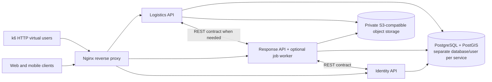
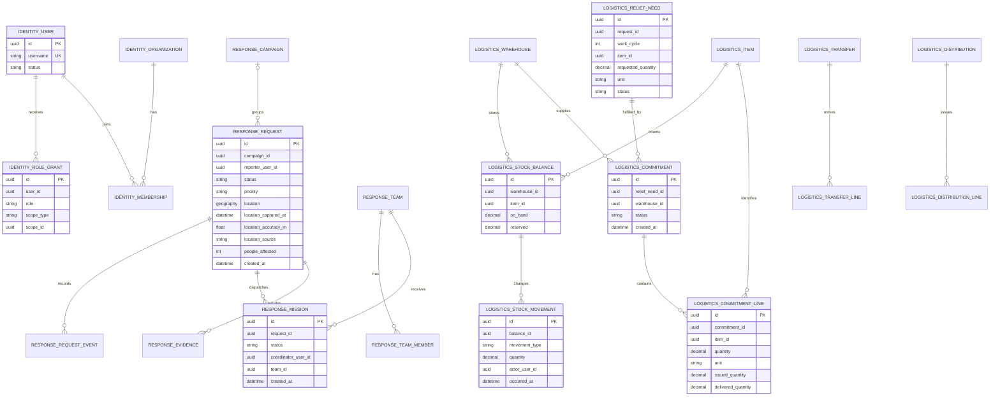
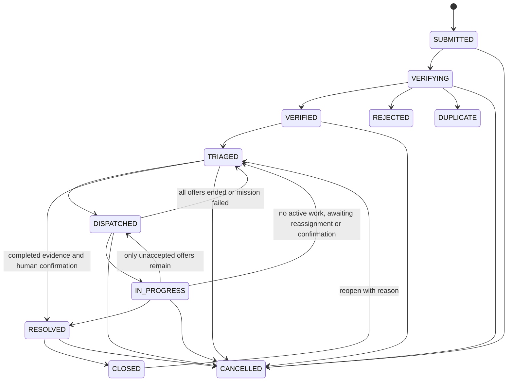
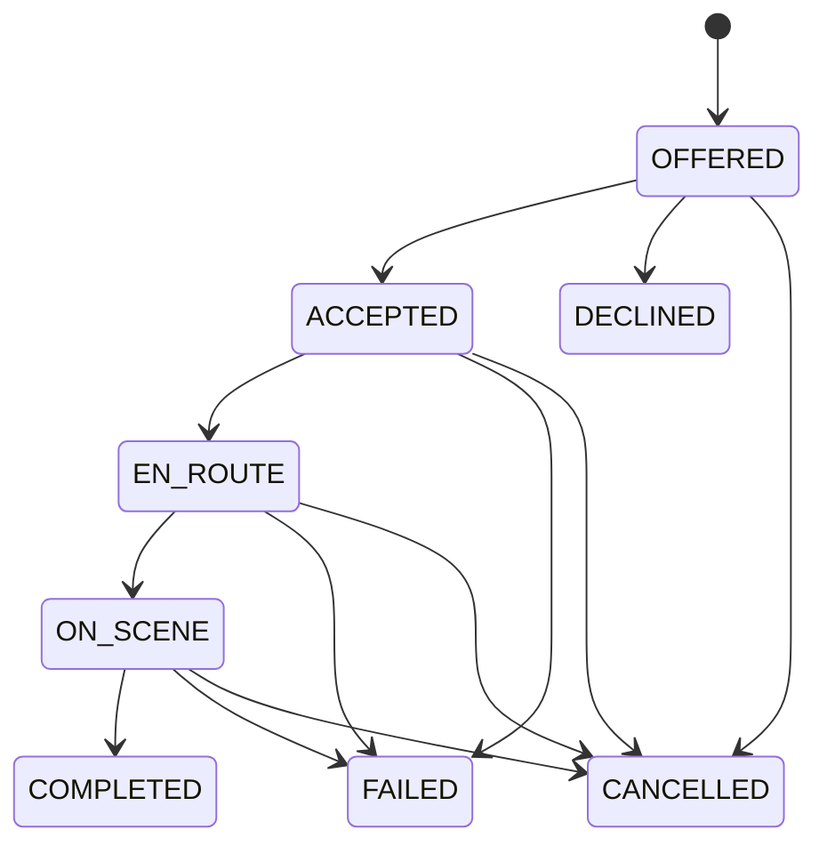
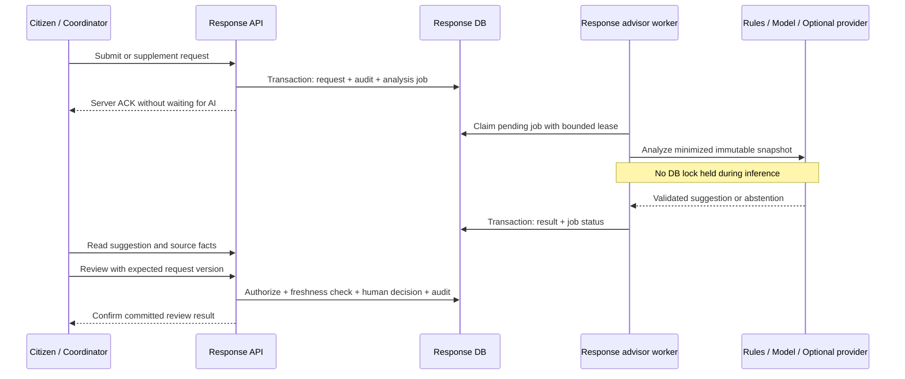
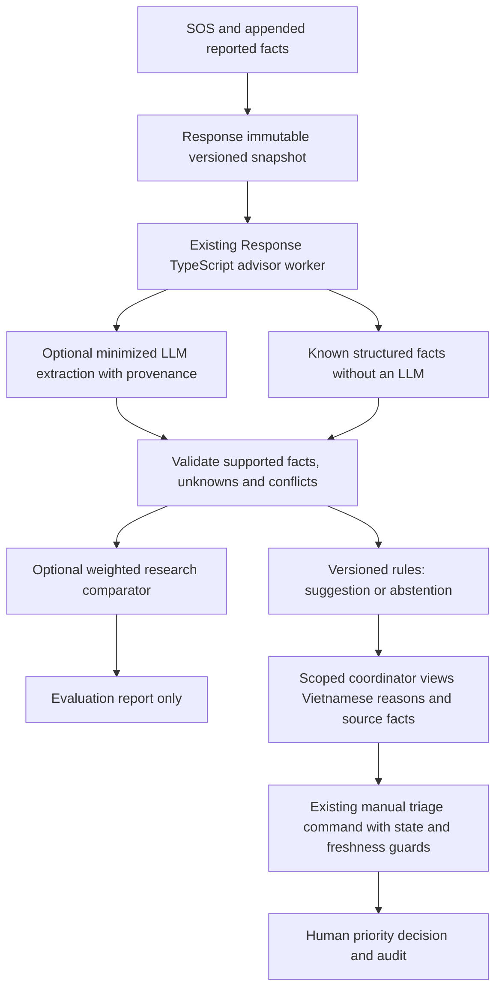

# C48 Technology and Delivery Plan

| Attribute | Value |
|---|---|
| Project | Emergency Response and Disaster Relief Management System |
| Project code | C48 |
| Version | 2.4 — workflow adaptation and three-service baseline |
| Initial research / plan revision | 2026-09-29 / 2026-09-30 |
| Team context | Three members in the project brief; backend owned by one member |
| Document role | Single technical plan for implementation and further research |

This document provides the proposed technical baseline for the SRS, SDD, database/API design, test cases, and user guide. The three-service architecture and adapted workflows below are C48 design proposals, not requirements imposed by the department or approved rescue policy.

**For implementation and further research:** this is the single technical plan. Appendix A adds execution guidance and remaining slice-specific contract gates. Section 22 defines the backend structure and business invariants; Section 12 specifies the optional AI decision-support extension; Section 6.3 records the object-storage choice. This plan does not claim implementation benchmarks or executed product tests.

## 1. Reading guide and confidence levels

| Label | Meaning |
|---|---|
| **Project brief** | Requirements consolidated in [c48-project-context.md](c48-project-context.md). |
| **Proposal** | Technical choice or business rule proposed as the capstone baseline. |
| **Needs confirmation** | A question for the supervisor or someone with relevant operational experience. |

OCHA/IFRC materials inform humanitarian workflow design; they do not replace rules issued by competent authorities in Vietnam. OCHA describes a cycle covering analysis, planning, resource mobilization, implementation, monitoring/evaluation, and reporting. [OCHA — Humanitarian Programme Cycle](https://knowledge.base.unocha.org/wiki/spaces/hpc/overview)

## 2. Recommendation summary

| Area | Proposed baseline | Rationale |
|---|---|---|
| Backend | NestJS + TypeScript on a supported Node.js LTS release | Fits the TypeScript client stack and supports modular APIs, validation, and OpenAPI. Pin compatible versions at setup. |
| Database | PostgreSQL + PostGIS, accessed through TypeORM and parameterized SQL for spatial operations | Relational workflows, inventory transactions, and indexed location queries; TypeORM documents PostgreSQL geometry/geography support. [TypeORM PostgreSQL spatial columns](https://typeorm.io/docs/drivers/postgres/) |
| Backend services | Three independently deployable services: Identity, Response, Logistics | Shows meaningful ownership boundaries while keeping the capstone deployable and testable by one backend owner. |
| Service communication | REST/JSON for user-facing and cross-service commands; local database transactions | Workflows are human-paced and need immediate responses. Broker-based messaging is deferred until a measured use case needs fan-out, replay, or independent consumers. |
| Web | React + TypeScript + Vite | Suitable for operational dashboards; authenticated screens do not require SSR/SEO. [Vite guide](https://vite.dev/guide/) |
| Mobile | React Native + Expo + TypeScript | Shares TypeScript skills and supports GPS, photos, and notifications. Request location permission when needed; no default background tracking. [React Native TypeScript](https://reactnative.dev/docs/typescript), [Expo Location](https://docs.expo.dev/versions/latest/sdk/location/) |
| Files | MinIO AIStor Free, single-node lab deployment, through the AWS SDK for JavaScript S3 client | Final capstone choice for synthetic demo data. Obtain/use it under current license terms; do not redistribute software. Free tier has no HA/SLA and excludes at-rest encryption; retain private access and tested backup. |
| Deployment | Docker Compose on one demo host; Nginx reverse proxy | Multiple containers do not require multiple physical machines. [Docker Compose production](https://docs.docker.com/compose/how-tos/production/) |
| AI | Advisor with explanations; coordinator makes the decision | An optional research direction, with no automatic priority changes or rescue dispatch. |

**Demo scale:** three application services, PostgreSQL/PostGIS with separate database credentials, object storage, and optional lightweight metrics on one demo host. k6 can generate HTTP virtual-user traffic against the APIs without Kafka. [Grafana k6 virtual users](https://grafana.com/docs/k6/latest/get-started/running-k6/)

## 3. Problem analysis and business workflow

### 3.1 Risks to address

The project context involves information passing through multiple channels and teams. Validate these risk hypotheses through interviews or surveys:

- Requests may lack location, affected-person count, or observation time.
- Duplicate reports may remain unlinked, distorting statistics or causing repeated dispatch.
- Coordinators may lack visibility into pending verification, accepted missions, and available resources.
- Inventory and aid deliveries may diverge across receipts, transfers, commitments, issues, and distributions without a traceable history.
- Weak connectivity may leave a citizen unsure whether the server received an SOS.
- Dashboards can mislead if their source, filter scope, or latest-data time is unclear.
- Broad access permissions may expose sensitive location/contact information.

These are problem hypotheses, not findings about a particular locality or authority.

### 3.2 Target workflow

1. **Intake:** a citizen submits a request with coordinates, accuracy, capture time, and location source. Offline submissions remain pending; only a server acknowledgement (ACK) means received.
2. **Screening:** validate input, use an idempotency key to prevent duplicate submission, and add the request to the operational queue.
3. **Verification:** a coordinator contacts the reporter or adds information. Rejection and duplicate linking require a reason and history.
4. **Prioritization:** a coordinator applies agreed criteria. AI output, if enabled, is supplementary.
5. **Dispatch:** offer a mission to a suitable team. The team accepts/declines and records travel, arrival, and results.
6. **Resource allocation:** a coordinator records structured needs in Logistics; one or more warehouses commit contributions. Commitments, physical issue, and confirmed delivery remain separate stages.
7. **Outcome confirmation:** the team provides results/evidence; a coordinator confirms whether needs are met. Completing one mission does not automatically close a request with remaining needs.
8. **Monitoring:** each owning service exposes its operational status and reports the time at which its current dashboard data was read.

### 3.3 Patterns adapted for C48

The recommendations below reuse workflow ideas documented in [the disaster-response platform research](research/disaster-response-platform-patterns.md). They extend the project brief as proposals; they are not official requirements.

| Inspiration | C48 adaptation | Why it fits |
|---|---|---|
| Ushahidi's review queue, moderation, and saved searches | Coordinator views for awaiting verification, verified-but-unassigned, active missions, and partially fulfilled requests; exact location/contact data stays scoped | Makes the handoff and backlog visible without automating human decisions |
| Sahana ShaRe's partial commitments and separate logistics records | A fulfillment board shows requested, committed, issued, delivered, and outstanding quantities; more than one warehouse/organization can contribute | A request can remain open while some aid has been delivered, and one contribution does not hide the remaining need |
| Peer capstones described in the CNTT catalogue: dispatch/logistics visibility, high-concurrency ticketing, and comparative traffic-simulation metrics | Add measurable workflow timings and a filtered outstanding-aid view by authorized request/region/item; use k6 for a modest API load scenario | Gives the demo a clear operational outcome and evidence without copying unrelated brokers, trading, or simulation domains |

The workbook is a catalogue of project descriptions, not evidence that every listed technology or workload was implemented. C48's distinction is the traceable workflow from report verification through mission progress and partial aid fulfillment, supported by auditable quantities and response-time measurements.

The workflow references the OCHA cycle conceptually. Validate terminology and responsibilities for this project. [OCHA HPC](https://knowledge.base.unocha.org/wiki/spaces/hpc/overview)

## 4. Technology comparisons

### 4.1 Database and NestJS persistence

| Criterion | PostgreSQL + PostGIS | MySQL 8.4 + InnoDB | MongoDB |
|---|---|---|---|
| Relationships and constraints | Strong fit for users, missions, inventory transactions, and audit | Strong; InnoDB supports transactions and foreign keys | Relationships and cross-entity reporting need more application design |
| GPS/maps | PostGIS spatial operators and GiST indexes; TypeORM maps PostgreSQL geometry/geography to GeoJSON | MySQL has spatial features, but the selected ORM/query path needs more verification | 2dsphere indexes; a document model does not simplify stock-ledger constraints |
| Concurrent inventory updates | Transactions, check/unique constraints, and row locks prevent over-issue | InnoDB supports transactions and locking | Multi-document transactions exist; inventory consistency still needs deliberate rules |
| NestJS integration | PostgreSQL driver and `@nestjs/typeorm`; TypeORM supports spatial column types | TypeORM supported; GIS is not the reason to select it | Nest provides Mongoose integration; not the chosen fit for the relational ledger |
| Decision | **Selected** | Not selected | Not selected as the primary database |

TypeORM is selected because Nest documents a maintained `@nestjs/typeorm` integration and TypeORM's PostgreSQL driver documents geometry/geography columns with GeoJSON exchange. Use migrations, not runtime schema synchronization. Use TypeORM transactions and row locks for inventory; use parameterized SQL/QueryBuilder for spatial predicates such as `ST_DWithin` where repository methods do not express the required operation. Keep SRID, index/operator choice, and geography-versus-geometry explicit. [NestJS database integrations](https://docs.nestjs.com/techniques/database), [TypeORM PostgreSQL spatial columns](https://typeorm.io/docs/drivers/postgres/), [PostGIS spatial indexes](https://postgis.net/documentation/faq/spatial-indexes/)

Prisma is a credible TypeScript alternative with generated types, but PostGIS access uses unsupported/custom-type and raw-query paths. Drizzle is also viable if the team prefers SQL-first queries and verifies migration/spatial needs. Use one ORM across services. The selection is **TypeORM**, subject to an early compatibility spike covering geometry migration, spatial query, and transaction/row-lock behavior on the selected PostgreSQL/PostGIS image. [Prisma unsupported database features](https://www.prisma.io/docs/orm/prisma-schema/data-model/unsupported-database-features), [Drizzle PostgreSQL](https://orm.drizzle.team/docs/get-started-postgresql)

Store points as GeoJSON with longitude, latitude order and SRID 4326; validate ranges before persistence. Consider `geography(Point,4326)` for meter-based radius behavior and geometry for boundaries; validate units/indexes with representative queries. [RFC 7946](https://datatracker.ietf.org/doc/html/rfc7946), [PostGIS spatial indexes](https://postgis.net/documentation/faq/spatial-indexes/)

Inventory writes use short PostgreSQL transactions, deterministic row-lock order, and constraints such as `on_hand >= 0`, `reserved >= 0`, and `reserved <= on_hand`. Do not call another service or object storage while holding database locks. Test concurrency against PostgreSQL/PostGIS, not SQLite. [PostgreSQL explicit locking](https://www.postgresql.org/docs/18/explicit-locking.html)


### 4.2 Backend framework evaluation and selection

**Evaluation method:** qualitative comparison against C48's three-service, TypeScript, PostgreSQL/PostGIS, GIS, and solo-backend needs, using official documentation reviewed on 2026-09-30. This is not a performance benchmark. NestJS/TypeScript is the selected backend; no Python framework is part of the implementation stack.

| Framework | Strengths relevant to C48 | Integration work and tradeoffs | Assessment |
|---|---|---|---|
| **NestJS (TypeScript/Node.js)** | Modules/providers/guards, TypeScript, OpenAPI and validation integrations; one language family across backend and clients | ORM/migrations, PostGIS queries, domain authorization, and operations UI still need explicit implementation | **Selected** for the three service boundaries and TypeScript development |
| **Spring Boot (Java/Kotlin)** | Mature application/security/operations ecosystem | Separate JVM language/tooling from clients; strong alternative if the team already has more Spring experience | Technically capable; larger language/tooling switch for this project |
| **Django + DRF (Python)** | Integrated ORM, admin/auth and mature API conventions | Different backend language; cross-service API contracts and domain rules still need explicit work | Capable alternative, not used in this plan |
| **FastAPI (Python)** | Type-oriented validation, generated OpenAPI, async API support | Assemble ORM/migrations, admin, auth, permissions, and GIS components | Capable for focused APIs, but adds a language/tooling split |
| **Flask (Python)** | Small core and flexible component selection | More foundational database, schema, authentication, and administration decisions across services | Flexible but adds assembly work and a language/tooling split |

**Evidence:** Nest documents modules/providers, guards, validation, OpenAPI, and database integrations. Spring Boot, Django/DRF, FastAPI, and Flask remain capable alternatives with different integration tradeoffs. [NestJS database integrations](https://docs.nestjs.com/techniques/database), [NestJS validation](https://docs.nestjs.com/techniques/validation), [NestJS OpenAPI](https://docs.nestjs.com/openapi/introduction), [Spring Boot](https://docs.spring.io/spring-boot/index.html), [Django overview](https://docs.djangoproject.com/en/5.2/intro/overview/), [FastAPI features](https://fastapi.tiangolo.com/features/), [Flask design](https://flask.palletsprojects.com/en/stable/design/)

**Selection rationale — project-specific:** NestJS matches a TypeScript client/backend workflow and documents patterns for modules, guards, OpenAPI, and validation. TypeORM's PostgreSQL spatial types support the GIS baseline. This reduces language/tooling changes while keeping database, authorization, and local transactions explicit. It does not imply Nest is universally superior or faster.

**Selected implementation choices:** three NestJS REST services on the default Express adapter; TypeScript; TypeORM + PostgreSQL/PostGIS; Nest `ValidationPipe` with DTO validation; `@nestjs/swagger` for OpenAPI; Passport/JWT for authentication; AWS SDK for JavaScript v3 S3 client for MinIO. Pin compatible Node/Nest/dependency versions after the compatibility spike; avoid floating `latest` tags.

Use one repository/workspace for three Nest applications, each with its own bootstrap, environment, image, migration set, database credentials, and deployment. Keep domain models and persistence code inside their owning service. Share API DTOs only where a concrete contract requires it; do not share domain entities or database modules across services.


### 4.3 Web, mobile, and API

| Channel | Proposal | Scope |
|---|---|---|
| Web | React + TypeScript + Vite; React Router; TanStack Query for server state | Dashboard, map/queue, verification/triage, missions, inventory, reports, admin |
| Mobile | React Native + Expo + TypeScript | Citizen SOS/status tracking; volunteer missions/progress; foreground GPS and photos |
| API | REST/JSON /api/v1; per-service OpenAPI through `@nestjs/swagger` | Web/mobile contracts, mocks, and API checks |
| Maps | Separate map UI from business logic; PostGIS queries; select tile/geocoding provider after license, quota, and privacy review | Do not send incident descriptions or personally identifiable information (PII) to map providers |

Emergency screens should minimize steps, provide accessible controls, clearly show submission status, and allow a manual pin when GPS is denied or inaccurate. Do not enable background tracking by default. Expo permissions depend on platform and access type. [Expo Location](https://docs.expo.dev/versions/latest/sdk/location/), [Expo permissions](https://docs.expo.dev/guides/permissions/)

### 4.4 Service communication and asynchronous work

| Need | C48 baseline | Add a broker only when… |
|---|---|---|
| Login, request intake, verification, mission updates, stock/fulfillment commands | REST/JSON with bounded timeouts, stable error codes, idempotency on retryable commands | A user-facing operation must fan out to many independently deployed consumers and synchronous APIs no longer fit |
| Dashboards and notifications | Read each service's authoritative API; store an in-app notice with the business change in its owning service | Independent consumers need durable event replay or measured traffic makes the current approach insufficient |
| Optional AI analysis | Response-owned job row plus a worker that claims pending jobs; intake does not wait for analysis | Job volume, independent scaling, or operational requirements justify a separate queue |

Kafka is not required for k6 virtual users: k6 sends scripted HTTP/API requests and defines virtual-user counts and thresholds in the test configuration. [Grafana k6 HTTP requests](https://grafana.com/docs/k6/latest/using-k6/http-requests/), [k6 virtual users](https://grafana.com/docs/k6/latest/get-started/running-k6/)

Reconsider Kafka only if C48 gains several independent consumers, needs durable event replay/reprocessing, or measured asynchronous backlog/fan-out cannot be handled by a small database-backed worker. Kafka provides durable event-stream storage and processing, but adds broker operation, schemas, retries, deduplication, monitoring, and recovery work. Those capabilities are not needed merely because the design has multiple services or load tests. [Apache Kafka documentation](https://kafka.apache.org/documentation/)

### 4.5 Service decomposition

| Model | Benefits | Cost/risk | Assessment |
|---|---|---|---|
| One modular monolith | Simplest deployment and cross-domain transactions | Less visible service ownership for the architecture goal | Valid fallback if service integration blocks delivery |
| Three services: Identity, Response, Logistics | Clear account, emergency workflow, and supply ownership; manageable API boundaries | Requires documented REST contracts and cross-service failure handling | **Selected** |
| Five or more services | More independently deployable components | Extra databases, contracts, and operations without a demonstrated workload need | Deferred |

Each selected service has its own application boundary and database credentials; the demo may run all three on one host and PostgreSQL server. No service reads another service's tables. Use synchronous REST for the few cross-service checks; keep each database transaction within its owner.

## 5. Proposed architecture

### 5.1 Diagram



All three services can run as containers on one demo host. A shared PostgreSQL server is acceptable for the demo, while each service uses its own database and credentials. No service can query another service's tables. k6 generates HTTP requests to the API; it is not part of the runtime architecture.

### 5.2 Boundaries and data ownership

| Service | Owns | Example API surface |
|---|---|---|
| **Identity** | Accounts, credentials, organizations, memberships, scoped role grants, refresh sessions | Registration/login/session, user/role administration |
| **Response** | Campaigns/incidents, assistance requests, verification and priority history, teams, missions/progress, request evidence, request timeline | Intake, verification, duplicate review, triage, assignment, mission actions, scoped map/queue |
| **Logistics** | Item catalog, warehouses, stock balances/ledger, relief needs and commitments linked by opaque request ID, transfers, vehicles, relief points, distribution records | Receipts/issues/transfers, partial commitments and fulfillment, stock and outstanding-need views |

Boundary rules:

- Each service owns its schema, migrations, credentials, and local transaction. IDs crossing boundaries are opaque UUID references; no cross-service foreign keys or table queries.
- Response remains authoritative for request and mission status. Logistics remains authoritative for stock, commitments, issued/delivered quantities, and fulfillment status.
- The coordinator board composes scoped Response and Logistics API results. If one API is unavailable, show which panel is stale/unavailable; never imply that the other service completed its work.
- In-app request/mission notices live in Response; stock/task notices live in Logistics. Each service exposes its own scoped reports and timestamps; there is no standalone Notification or Reporting service.
- Cross-service REST calls happen outside database transactions. Commands that may be retried use an idempotency key. Do not imply cross-service atomicity.

### 5.3 Request-to-fulfillment board

This is the main workflow adaptation from Sahana ShaRe's partial commitments and Ushahidi's human-reviewed queue. [Research details and sources](research/disaster-response-platform-patterns.md)

1. Response receives a request and keeps it in an internal verification queue. A coordinator records VERIFIED, REJECTED with reason, or DUPLICATE with a canonical request and reason. A possible duplicate search may suggest nearby reports by time, category, and location, but a person makes the decision.
2. After verification, an authorized coordinator records structured assistance needs in Logistics. Logistics links each need to an opaque `request_id` and request work-cycle identifier; the request and need can be read together through the board without sharing tables.
3. A need records requested quantity and item/unit. One or more warehouse/organization contributions can be committed. Under a transaction that locks the need row, delivered + committed/reserved + issued-but-not-delivered cannot exceed requested quantity. A cancellation releases an unissued commitment; an issued quantity must be delivered, returned, or recorded as loss.
4. Track quantities separately: requested, committed/reserved, issued, delivered, and outstanding. `outstanding = requested - delivered`; partial delivery never makes the need complete. A coordinator can explicitly reduce/cancel a need with a reason, preserving its history.
5. The request status, mission status, and fulfillment status remain separate. A mission completion does not close a request; a delivery does not mark a rescue mission complete. The coordinator confirms overall resolution after reviewing current mission and fulfillment evidence.

**Demo scenario:** a verified request needs 20 relief kits and rescue assistance. One warehouse commits and delivers 12 kits; the board shows PARTIALLY_FULFILLED with 8 outstanding, and the request remains open. A second contribution delivers the remaining 8; the board records both actors/times, and the coordinator explicitly confirms resolution. The demo also shows a suspected duplicate that a coordinator reviews and links manually.

### 5.4 REST and background-job behavior

- REST handles immediate user actions and the small number of cross-service lookups. Use bounded timeouts, Vietnamese user-facing errors, stable machine error codes, and idempotency for retries.
- Report aggregation is performed by each owning service or by the client composing two scoped API results. Include `generated_at` per response; do not call it globally real-time.
- If optional AI analysis is enabled, write a durable job to the Response database in the same transaction as its request intent. A worker claims pending jobs with a lease, calls inference outside the transaction, and stores one versioned result. A failed worker leaves retryable work in the database; no message broker is required.
- Do not add Kafka, Redis, a service mesh, schema registry, workflow engine, or a separate notification/reporting service to the baseline. Revisit only against the criteria in Section 4.4.

## 6. Data model and integrity

### 6.1 Logical ERD by service



Each mission has exactly one team; additional teams receive separate missions under the same request. A request may have no campaign until a scoped coordinator attaches it to an ACTIVE campaign. The Logistics `request_id` is an opaque cross-service reference, not an ERD relationship or foreign key. Other diagram relationships are local to a service. Implementation still requires complete timestamps, audit fields, indexes, unique constraints, migrations, and retention policies.

### 6.2 Core entities

| Database | Minimum tables/entities |
|---|---|
| Identity | User, Organization, controlled Region catalog, Membership, RoleGrant, account status, RefreshSession with rotation/revocation, AuditRecord |
| Response | Campaign, Incident, RegionBoundary referencing the controlled region code, AssistanceRequest with organization_id and nullable region/campaign, RequestEvent, RescueTeam, TeamMember with opaque user ID, VolunteerProfile, Mission with one team_id, EvidenceMetadata, scoped in-app Notification; optional AnalysisSnapshot, AnalysisJob, TriageRecommendation, RecommendationReview (Section 12) |
| Logistics | Warehouse, Item, StockBalance, StockMovement, ReliefNeed/request reference, Commitment/lines, Transfer/lines, Distribution/lines, IssuedLineSettlement, TransferTransitLine, Vehicle, ReliefPoint, scoped in-app Notification |

Define the Identity user entity and migration before other services rely on its contract; external services store opaque user UUIDs rather than duplicating credentials.

### 6.3 GPS and evidence files

- Coordinates use WGS84/SRID 4326; GeoJSON order is longitude, latitude. Validate longitude within -180..180, latitude within -90..90, and nonnegative accuracy. [RFC 7946](https://datatracker.ietf.org/doc/html/rfc7946)
- Store capture time, accuracy in meters, source (GPS, manual pin, geocoded), and server receive time separately. Device-reported accuracy is not a guarantee of field accuracy.
- Store a location snapshot with the SOS. Add location history only for an explicit requirement; continuous background tracking is outside the MVP.
- Scope map queries by authorization, region/time/status/bounding box. Do not expose all PII through map responses.
- Store files in object storage. The database holds object key, owner type/ID, validated MIME, size, checksum, uploader, time, and visibility. Keep buckets private; use short-lived signed URLs if direct access is used.
- Validate actual MIME, extension, and size; do not trust client-provided names/MIME. Uploads require authorization on the owning business object.
- Demo data must be synthetic; do not use real victims' images or personal information.
- Use the AWS SDK for JavaScript v3 S3 client from the owning NestJS service. Configure separate service credentials and private buckets for Response and Logistics. Unit tests may mock S3; provider integration and restore checks must use the selected MinIO AIStor Free lab instance.

#### Selected object storage: MinIO AIStor Free

**Final choice for this capstone: MinIO AIStor Free, single-node lab deployment, using synthetic data.** MinIO Community is not selected: its repository is archived and marked unmaintained. AIStor Free is a separate proprietary product; its agreement allows standalone educational/research use, and its operations documentation sets edition-specific limits. This is a lab choice, not a production recommendation. No MinIO artifact/license, application integration, or restore test has been installed or verified as part of this plan. [Community repository](https://github.com/minio/minio), [AIStor Free agreement](https://www.min.io/legal/aistor-free-agreement), [AIStor license operations](https://docs.min.io/aistor/operations/licenses/)

| Decision | C48 baseline |
|---|---|
| Product/edition | MinIO AIStor Free; do not substitute a Community image or third-party rebuild |
| Topology/data | One node for the lab; synthetic demo data only; no HA or production availability claim |
| License/package | Operators must obtain and use the product under the current agreement and active license. Do not modify or redistribute the AIStor binary/image or license in the repository/submission unless the applicable terms expressly allow it. Record the exact release and license validity before the demo. |
| Free-tier limits | Do not rely on distributed deployment, replication, lifecycle transitions, version-specific deletion, encryption at rest, or an SLA/SLO. The current docs state AIStor Free support begins with `minio.RELEASE.2025-12-20T04-58-37Z`; recheck the requirement against the release chosen for setup. |
| Application integration | Private S3 API; AWS SDK for JavaScript v3; separate least-privilege Response and Logistics credentials/buckets; no blanket access for other services |

Use backend-mediated uploads through the owning NestJS service for the first implementation. Authorize the business object, persist attachment state as PENDING in a short database transaction, validate and stream bounded content to a generated immutable key outside the transaction, then record READY in a second short transaction. On failure, preserve the SOS and expose a retryable FAILED/PENDING attachment; reconcile crashes between object upload and metadata commit. Enforce extension/type/size rules using detected content, not client MIME or filename. Do not hold database locks during S3 calls or claim a cross-database/object-store atomic transaction. [AWS SDK for JavaScript S3 client](https://docs.aws.amazon.com/AWSJavaScriptSDK/v3/latest/client/s3/), [OWASP file upload guidance](https://cheatsheetseries.owasp.org/cheatsheets/File_Upload_Cheat_Sheet.html)

Keep buckets private and store only object metadata (owner, generated key, detected MIME, size, checksum, uploader, timestamps, visibility/state) in PostgreSQL. Do not persist object bytes or signed URLs in PostgreSQL, logs, analytics, or reports. Authorize each download against the current business object before creating a short-lived signed URL; use a hostname reachable from the backend, browser, and physical mobile device. A signed URL remains a bearer capability until it expires, so document that revocation window or proxy downloads when immediate revocation is required. Direct client uploads are outside the initial scope: presigned upload URLs can be reused and can replace an existing key until expiry. [S3 presigned URL behavior](https://docs.aws.amazon.com/AmazonS3/latest/userguide/using-presigned-url.html)

Back up owning-service database metadata and object bytes together, with a manifest of keys, sizes, and checksums. Keep a backup outside the demo host; test restoration in an isolated environment and verify scoped download/denied access after restore. A PostgreSQL dump or a volume beside the original objects alone is not a verified backup. No backup/restore test has been executed yet.

### 6.4 Inventory and audit

- StockMovement is append-only: RECEIPT, RESERVE, RELEASE, ISSUE, TRANSFER_OUT, TRANSFER_IN, RETURN, ADJUSTMENT.
- StockBalance is the current balance/projection, updated in the same transaction as its movement; available = on_hand - reserved.
- Constraints: on_hand ≥ 0, reserved ≥ 0, reserved ≤ on_hand; quantities are positive and units match the item. Adjustments require actor, reason, and permission.
- Enforce a unique warehouse/item pair for StockBalance. Lock multiple item balances in a stable ID order to prevent duplicate updates and reduce deadlocks.
- Destination receipt is a separate transfer step. Creating a transfer alone does not increase destination stock.
- Distribution records item, quantity, warehouse/relief point, campaign, time, and actor. Do not require beneficiary names/identity documents without an approved need.
- Use unique/idempotency keys for receipt/issue/distribution retries and row locks to prevent concurrent over-issue.

## 7. System requirements

For FR priorities, **M** means required for the core demo, **S** means should have if time permits, and **O** means optional extension. These are proposed priorities, not classifications in the original brief.

### 7.1 User Requirements (UR)

| ID | Actor | Need |
|---|---|---|
| UR-01 | Citizen | Submit an SOS/request with location, affected-person count, and incident information; receive confirmation of server receipt. |
| UR-02 | Citizen | Track progress, add information, and understand rejection, duplicate, or closure reasons. |
| UR-03 | Coordinator | Verify, link duplicates, prioritize, view maps, and assign suitable teams. |
| UR-04 | Volunteer/team | Access assigned missions only; accept/decline, update progress, and submit outcome evidence. |
| UR-05 | Operations manager | Manage campaigns, warehouses, vehicles, relief points, commitments, transfers, issues, and distributions with traceability. |
| UR-06 | Admin/manager | Manage accounts/scoped permissions and view operational dashboards/reports. |
| UR-07 | Operations team | See work queues, partially fulfilled needs, service health, dashboard timestamps, and recovery guidance. |

### 7.2 Functional Requirements (FR)

| ID | Priority | Proposed functional requirement | Verification criterion |
|---|---:|---|---|
| FR-IAM-01 | M | Citizen registration, login, refresh/logout, account disabling, and credential changes | Invalid/expired tokens or disabled accounts receive 401; logout invalidates the refresh session |
| FR-IAM-02 | M | Organization/region/campaign-scoped roles; action and object checks | Citizens cannot access another citizen's request; volunteers see their team's missions only |
| FR-IAM-03 | M | Admin account, organization, and role management with least privilege | Permission changes record actor/time and before/after values |
| FR-REQ-01 | M | Create requests with category, short description, headcount, location/manual pin, time/source | Validate input; return an identifier and server receive time |
| FR-REQ-02 | M | Authenticated citizens submit and track SOS; guest endpoints disabled in capstone | Registration grants CITIZEN only; unauthenticated creation/tracking is denied |
| FR-REQ-03 | M | Idempotent SOS creation retries | Same key/payload creates no second row; same key with different payload is rejected |
| FR-REQ-04 | M | Verify, reject, and duplicate-link; rejection/duplicate decisions require reasons | Preserve duplicate requests and link them to a canonical request |
| FR-REQ-05 | M | Manual P1–P4 priority with actor/time/reason and override history | Priority is separate from status; AI cannot change it automatically |
| FR-REQ-06 | M | Scoped list/map filtering by bbox/region, status, priority, and time | Apply authorization filters before pagination |
| FR-REQ-07 | M | Citizens view timelines and supplement their own requests in permitted states | Owner-only access; supplements record actor/time |
| FR-MSN-01 | M | Manage teams, skills, availability, and members through opaque user IDs | Reject inactive/unavailable teams or missing mandatory skills |
| FR-MSN-02 | M | Create missions, offer/assign, accept/decline, transition, and record results | Only valid transitions; record actor/time/reason |
| FR-MSN-03 | M | One request may have multiple missions; one mission belongs to one request and one team in the MVP | One completed mission does not close a request with remaining needs |
| FR-MSN-04 | M | Request/mission evidence uploads and coordinator outcome confirmation | Metadata and download access follow object scope |
| FR-CAM-01 | M | Response manages campaigns/incidents, operating regions, time, and status | Scoped creation/editing; Logistics stores campaign references |
| FR-LOG-01 | M | Manage warehouses, items, vehicles, relief points, and campaign references where needed | Active/inactive entities; preserve existing history |
| FR-LOG-02 | M | Receipts, transfers, receipt confirmation, reserve/release, issue, return, adjustment | Ledger records actor/time/quantity/reason; balances never negative |
| FR-LOG-03 | M | Link Logistics needs and commitments to a request by opaque ID; record commit/release/issue/delivery locally | Multiple contributions are supported; no cross-service transaction or direct table access |
| FR-LOG-04 | M | Distribution by campaign, point, item, quantity, and actor | Retries never duplicate a distribution |
| FR-LOG-05 | M | Show requested, committed/reserved, issued, delivered, and outstanding quantities; allow partial fulfillment | Delivered + active committed/reserved + issued-but-not-delivered never exceeds requested; one partial contribution does not close the need |
| FR-REQ-08 | S | Suggest possible duplicate reports using time/category/location filters | Suggestions are visibly non-authoritative; only a coordinator may link/reject |
| FR-NOT-01 | M | In-app notices in the service that owns the changed request, mission, or stock task; push/email are extensions | Notice write is local to the business transaction; recipient scope is enforced |
| FR-RPT-01 | M | Scoped dashboards for request states/timings and stock/fulfillment gaps | Totals match a fixed dataset; each API response includes generated_at |
| FR-RPT-02 | S | Scoped CSV export with role-based PII masking | No unauthorized fields; audit sensitive exports |
| FR-AUD-01 | M | State, decision, adjustment, distribution, and role-change history | No passwords/tokens in audit; restricted readers |
| FR-EVT-01 | O | Broker-based event streaming and replay are deferred exploration | Excluded from core acceptance unless Section 4.4 revisit criteria are demonstrated |
| FR-FILE-01 | M | Private uploads, size/type validation, metadata, controlled downloads | Reject forged MIME/oversize files; expired links cannot download |
| FR-OFF-01 | S | Offline SOS drafts and retry with the same idempotency key | Distinguish QUEUED_ON_DEVICE from SUBMITTED |
| FR-AI-01 | O | AI/rule suggestions with factors/version and coordinator acceptance/override; optional detailed requirements FR-AI-02..06 in Section 12.8 | No automatic dispatch/priority overwrite; core works with AI disabled |

### 7.3 Non-functional Requirements (NFR)

The brief specifies no numeric thresholds. The numbers below are initial targets for supervisor/team confirmation.

| ID | Quality | Proposed requirement/criterion |
|---|---|---|
| NFR-SEC-01 | Security | Require authentication by default; public guest SOS only if approved. Services enforce scope and never trust client-supplied roles. |
| NFR-SEC-02 | Security | Filter list querysets by authorization; enforce detail/action object permissions, input/file validation, and suitable rate limits. route-level guards do not automatically scope returned rows; test object and list authorization separately. [NestJS guards](https://docs.nestjs.com/guards), [NestJS validation](https://docs.nestjs.com/techniques/validation) |
| NFR-SEC-03 | Security | Do not log tokens, passwords, signed URLs, or unnecessary exact locations; HTTPS outside local development. |
| NFR-PRV-01 | Privacy | Exact locations are accessible only to the subject, scoped coordinators, and assigned teams; reports aggregate by default. Retention needs confirmation. |
| NFR-REL-01 | Reliability | Nonnegative inventory, valid states, idempotent API retries, visible cross-service errors, and backup restoration checks. |
| NFR-PERF-01 | Performance | Discussion target: 10,000 requests and 20 concurrent users in the demo; common read API p95 ≤ 2 seconds; SOS creation p95 ≤ 3 seconds excluding upload. Record measurement hardware. |
| NFR-PERF-02 | Performance | Spatial indexes/bbox/result limits for maps; each dashboard panel shows its source timestamp instead of an unqualified real-time claim. |
| NFR-UX-01 | Usability | Few SOS steps, usable controls, clear submission status, manual pin, understandable GPS errors. |
| NFR-OFF-01 | Weak connectivity | If an offline queue is implemented, retries are idempotent; no continuous background location synchronization. |
| NFR-OBS-01 | Operations | Health/readiness, correlation IDs, API latency/errors, database/storage health, and optional AI-job age/failure metrics. |
| NFR-OPS-01 | Recovery | Document DB/object metadata backup and perform a demo restore; define RPO/RTO when real requirements exist. |
| NFR-COMP-01 | Compatibility | Versioned API/OpenAPI, controlled migrations, UTC backend, configurable UI timezone. |
| NFR-TEST-01 | Testing | State, object-permission, inventory-race, retry/idempotency, partial-fulfillment, API-outage, and end-to-end tests; coverage threshold remains open. |
| NFR-L10N-01 | Language — confirmed | All Web/Mobile user-facing content and backend human-readable messages are Vietnamese, including errors, notifications, and displayed AI explanations. Stable machine codes/fields remain English. Technical documents remain English. |

## 8. Business rules and state machines

### 8.1 Assistance Request



- Priority is separate from status. Draft taxonomy: P1 immediate danger, P2 very urgent, P3 assistance needed, P4 informational/nonurgent. Confirm definitions; do not imply a guaranteed SLA.
- Verification is required before triage/dispatch under this baseline.
- REJECTED requires a reason; DUPLICATE requires a canonical request ID and reason. Preserve both records.
- A partially fulfilled Logistics need does not change mission state; it never demotes progress from another active mission. Offering new work gives DISPATCHED only when no accepted work remains.
- DISPATCHED means a mission offer has been sent; IN_PROGRESS starts when the first team accepts.
- Recompute dispatch progress in the same Response transaction as a mission transition: any ACCEPTED/EN_ROUTE/ON_SCENE mission preserves IN_PROGRESS; otherwise any OFFERED mission gives DISPATCHED; otherwise the request returns to TRIAGED unless a coordinator has confirmed RESOLVED/CLOSED/CANCELLED. Completed missions remain evidence for human resolution, never an automatic closure. Section 22 specifies cancellation and reopen guards.
- A coordinator confirms RESOLVED when current-cycle needs are met; CLOSED is administrative completion. If missions were assigned, require completed evidence and no active mission; if no rescue mission was needed, record that human decision. Mission completion never closes a request automatically.
- Only scoped coordinators may reopen/cancel, with reason/audit and explicit handling of active missions.
- Canonical requests with inbound duplicate links cannot become DUPLICATE, REJECTED or CANCELLED; lock and recheck links as defined in UC-02 and Section 22.2.

### 8.2 Mission



- DECLINED, FAILED, CANCELLED, and COMPLETED terminate a mission; reassignment creates a new mission/assignment.
- Mission state is independent of stock commitment and delivery state. A team can accept/progress a mission while a separate Logistics contribution is being fulfilled; the coordinator sees both on the request board.
- Team members view assigned missions; only the active leader accepts/declines, advances and submits results/evidence. Scoped coordinators oversee missions and may cancel/fail with reason.
- Store transition actor/time, reason, note, and evidence references. Location updates are optional, without background tracking.
- Multiple missions can serve one request; a coordinator confirms the overall outcome before resolution.

### 8.3 Inventory and transfers

For each Logistics need, show requested, committed/reserved, issued, delivered, and outstanding quantities. Count a delivery only after receipt is confirmed at the designated relief point or recipient. The board labels a need OPEN before any delivery, PARTIALLY_FULFILLED when some but not all requested quantity is delivered, FULFILLED after the requested quantity is delivered and coordinator-reviewed, or CANCELLED after an authorized reasoned cancellation. These are fulfillment labels, separate from request and mission states.

```text
Commitment: PROPOSED -> COMMITTED -> ISSUED -> DELIVERED
                |           |
                +-> CANCELLED <-+
ISSUED -> RETURNED or LOSS_RECORDED (physical settlement)

Transfer: DRAFT -> RESERVED -> IN_TRANSIT -> RECEIVED
             |         |          |-> RECONCILED (received + returned + lost)
             +---------+-> CANCELLED (before dispatch only)
```

- Commands check state and permission; clients cannot arbitrarily PATCH status.
- on_hand represents stock held; reserved represents stock allocated; available = on_hand - reserved. A committed stock contribution reserves locally in Logistics; it does not change Response or mission status.
- ISSUE reduces on_hand and reserved exactly once. Cancelling an unissued commitment releases reserved quantity without increasing on_hand. Issued goods require delivery, verified return, or audited loss settlement.
- Dispatch decreases source on_hand and reserved once and creates in-transit quantities. Receipt credits only physically received quantities at the destination. After dispatch, cancellation is prohibited; verified return credits the source, and authorized loss reconciliation removes transit quantity with reason/audit. Each line satisfies dispatched = received + returned + lost + remaining_in_transit. Both warehouses belong to Logistics; short local transactions lock affected balances in stable order.
- Adjustments require reason, actor, and audit; never edit/delete old ledger entries to force a balance to match.

### 8.4 General rules

- Server UTC is the audit timestamp; keep client capture time separately.
- Commands use idempotency; expected state/version checks prevent stale updates.
- Do not hard-delete requests, missions, or stock movements with activity; use state/archive according to policy.
- Priority/AI overrides, rejection, mission cancellation, stock adjustments, and role changes require actor/time/reason.
- Response owns campaigns. Lifecycle: DRAFT → ACTIVE; ACTIVE → PAUSED; PAUSED → ACTIVE; DRAFT/ACTIVE/PAUSED → CLOSED. Scoped coordinators/managers execute commands with version checks and reasons for pause/close. Only ACTIVE campaigns accept new attachments. SOS creation never requires an existing campaign. Campaign closure is blocked while linked requests are nonterminal; Logistics returns/settlements remain allowed.

## 9. Main use cases

### UC-01 — Submit an SOS/assistance request

**Actor:** Authenticated citizen.

**Preconditions:** Citizen signed in; GPS available or user supplies a manual pin.

**Main flow:** Select assistance category → enter headcount/information → confirm location/accuracy → optionally attach photos → submit with idempotency key → Response validates and stores the request, audit, and timeline in one local transaction → returns request ID and SUBMITTED → citizen views the server-confirmed status and supplements information when state permits.

**Exceptions:** Offline submissions stay QUEUED_ON_DEVICE and are not server-received; denied GPS permits manual pin; validation errors preserve the form; the same key returns the same request on retry.

**Postconditions:** Exactly one request record with server receive time; retries return the same request.

### UC-02 — Verify and triage

**Actor:** Scoped coordinator.

**Preconditions:** Request exists and is not terminal.

**Main flow:** Open scoped queue/map → start VERIFYING → supplement/contact → choose exactly one outcome: VERIFIED, REJECTED with reason, or DUPLICATE with canonical reference/reason. Only VERIFIED proceeds to human triage with priority/reason. Each command writes state/history/audit atomically.

**Duplicate guard:** Canonical target must be a different authorized, non-DUPLICATE/non-REJECTED/non-CANCELLED request. A request already referenced as canonical cannot itself become DUPLICATE, REJECTED or CANCELLED; linkers and those transitions lock the affected request rows in sorted ID order and recheck inbound links. Do not create chains or cycles. Preserve the original report and its history; the demo does not reparent duplicate links.

**Exceptions:** Reject out-of-scope actions; return conflict if state changed; duplicates require a canonical link.

**Postconditions:** Priority remains separate from status; the scoped board reads the authoritative Response state.

### UC-03 — Assign and accept a mission

**Actors:** Coordinator and active team leader; other volunteers have read access to their team's assignments.

**Preconditions:** Request verified/triaged; team active; coordinator authorized for the scope.

**Main flow:** Select a team by skills/scope/availability → offer assignment → active team leader accepts → EN_ROUTE → ON_SCENE → results/evidence → coordinator confirms mission outcome. The team assignment proceeds independently of Logistics fulfillment; both statuses appear on the request board.

**Exceptions:** Select another team if declined/unavailable. Concurrent assignments use version/transaction checks and conflicting commands reload. PAUSED campaigns block offers/acceptance; already accepted missions may continue under the campaign rules.

**Postconditions:** Consistent mission/request history; only a coordinator confirms resolution.

### UC-04 — Commit and partially fulfill a relief need

**Actors:** Scoped coordinator and warehouse/operations manager.

**Preconditions:** Warehouse/item active; stock may be available.

**Main flow:** Open a verified request on the board → define requested items/quantities in Logistics → one or more authorized warehouses commit partial quantities → confirm physical issue and later delivery → inspect remaining outstanding quantity → repeat or explicitly cancel/reduce the need with reason.

**Exceptions:** Insufficient stock cannot be committed; retries do not duplicate; cancellation before issue releases reserved quantity; issued goods require delivery, return, or loss settlement. A partial delivery keeps the need open.

**Postconditions:** Balance matches the ledger; each need shows requested/committed/issued/delivered/outstanding values and actor/time history.

### UC-05 — Dashboard/reports

**Actors:** Scoped coordinator/manager/admin.

**Main flow:** Select time/region/campaign → scoped APIs in Response and Logistics return authoritative aggregates with generated_at → UI composes the result and shows each source timestamp → export if authorized.

**Exceptions:** API outage marks only that source panel unavailable/stale; unauthorized export is denied/audited; no-data results follow an agreed convention.

**Postconditions:** No unauthorized PII exposure; dashboards do not modify authoritative business data.

### UC-06 — Manage accounts and permissions

**Actors:** Admin; citizen registering an account; invited staff/volunteer.

**Main flow:** A citizen registers with a unique normalized username and password and receives CITIZEN only. Admin creates staff/volunteer accounts, disables accounts, or grants role/scope → Identity records audit → services apply policy → UI exposes permitted functions. Registration never accepts privileged roles or scopes from the client. Email/SMS verification and self-service password recovery are outside the initial demo; admin-assisted reset revokes sessions and requires a password change.

**Exceptions:** Cannot remove the last administrator; disabled accounts cannot refresh tokens; existing access tokens are rejected through the current-session check described in Section 22.

**Postconditions:** All APIs enforce backend authorization; hidden UI controls are not a security boundary.

### UC-07 — AI-assisted priority suggestion (extension)

**Actor:** Coordinator.

**Main flow:** Response persists an immutable minimized snapshot and durable job → a Response-owned worker returns a versioned suggestion or abstention → coordinator inspects facts/reasons → authorized review checks freshness, request version, and verified/eligible state → human accepts or overrides with reason → atomic priority/audit write. See Section 12 for job, API, and failure contracts.

**Exceptions:** Timeout/failure leaves manual triage available; insufficient or unsupported data yields abstention; stale input, competing review, wrong scope, or ineligible state rejects acceptance. AI cannot change priority itself.

**Postconditions:** Official priority changes only through coordinator action.

### UC-08 — Create and manage a relief campaign

**Actors:** Coordinator or operations manager with campaign scope.

**Preconditions:** Authenticated user with region/organization management permission.

**Main flow:** Create campaign name/objective/region/time → persist in Response → activate → attach requests → Logistics records an opaque campaign reference on related needs/commitments/distributions → manager pauses/closes when permitted.

**Exceptions:** Closed campaigns cannot accept new requests; returns/settlements remain possible; reject invalid campaign IDs; closure preserves ledger/request history.

**Postconditions:** Response is authoritative for campaign status; Logistics may store an opaque campaign reference where useful.

## 10. API and authentication

### 10.1 API conventions

- Base path /api/v1; REST/JSON; UUID identifiers; ISO-8601 UTC timestamps; bounded pagination/filters; consistent errors with code, message, field errors, and correlation ID.
- Separate OpenAPI schemas for the three APIs with shared terminology, pagination, error envelope, and authorization notes.
- Explicit business command endpoints for transitions, rather than unrestricted status PATCH.
- Significant side-effecting POST commands accept Idempotency-Key; state updates check expected state/version inside the transaction.
- Generate per-service OpenAPI with `@nestjs/swagger` and review/version the published contract. [NestJS OpenAPI](https://docs.nestjs.com/openapi/introduction)

### 10.1.1 Vietnamese user-facing responses

**Confirmed product requirement:** human-readable API messages are Vietnamese, including validation, authentication/permission failures, business conflicts, upload failures, and notifications. JSON field names, error codes, enum values, and URLs remain stable machine identifiers. Clients use codes for logic and Vietnamese labels for display; do not parse message text.

Example error envelope:

```json
{
  "code": "REQUEST_VERSION_CONFLICT",
  "message": "Yêu cầu đã được cập nhật. Vui lòng tải lại trước khi tiếp tục.",
  "field_errors": {},
  "correlation_id": "uuid"
}
```

Implement a centralized NestJS exception filter and `ValidationPipe` exception factory that map stable validation/auth/business error codes to reviewed Vietnamese messages. Do not return class-validator or provider error strings directly. Set the API locale to Vietnamese regardless of `Accept-Language`; workers use the same Vietnamese message catalog outside HTTP request context. [NestJS validation](https://docs.nestjs.com/techniques/validation), [NestJS exception filters](https://docs.nestjs.com/exception-filters)

Backend responses may contain user-entered text unchanged. Do not translate names, original reports, opaque IDs, or machine codes. Map internal AI reason codes to Vietnamese explanations; optional LLM summaries must satisfy the same language requirement before display, otherwise show a reviewed Vietnamese fallback.

### 10.2 Endpoint sketches

| Service | Example endpoints | Authorization/notes |
|---|---|---|
| Identity | POST /identity/auth/register, /login, /refresh, /logout; GET /identity/me; POST /identity/users/{id}/roles | Admin-only role grants; no PII/location in tokens |
| Response | POST /response/requests; GET /response/requests; POST /response/requests/{id}/verify, /triage, /duplicate, /resolve; POST /response/requests/{id}/missions | Authenticated citizen intake; scoped list/detail; resolution checks current Logistics fulfillment status |
| Response | POST /response/campaigns; GET /response/campaigns; POST /response/campaigns/{id}/close | Response owns campaign/incident; managers need appropriate scope |
| Response | POST /response/missions/{id}/accept, /decline, /transition, /evidence | Active team leader accepts/declines, advances and uploads evidence; scoped coordinator may cancel/fail |
| Logistics | POST /logistics/needs; POST /logistics/needs/{id}/commitments; POST /logistics/commitments/{id}/issue, /deliver, /cancel | Need/commitment row locks; partial quantities; actor/reason audit |
| Logistics | POST /logistics/receipts, /transfers, /transfers/{id}/receive, /distributions, /adjustments; GET /logistics/stock?warehouse_id=...; /vehicles; /relief-points | Idempotency, audit, unit validation, row locks, scoped report fields |
| Logistics (internal) | GET /logistics/requests/{request_id}/fulfillment?work_cycle=... | Authenticated Response-to-Logistics check for request resolution; returns current version and open/partial need totals |
| Response / Logistics | GET /{service}/notifications; POST /{service}/notifications/{id}/read | Each service returns only notices it owns and scopes by recipient |
| Response / Logistics | GET /{service}/reports/... | Reports read the owning service's data and include generated_at |

These are SDD sketches, not final contracts. Finalize complete paths through OpenAPI and UI-flow review. Internal APIs must not blindly trust client headers; use service credentials/identity where needed.

### 10.3 Authorization matrix

| Actor | Proposed core permissions |
|---|---|
| Citizen | Create, view, and supplement own requests; view own notifications. Guest SOS is disabled in the capstone baseline. |
| Volunteer | View assigned team missions and maintain own profile/availability. Only the active team leader accepts/declines, advances missions and submits results/evidence. |
| Coordinator | Scoped queue/map; verify, duplicate-link, triage, assign, cancel/reopen, confirm outcomes. |
| Operations Manager | Scoped warehouse/point/vehicle/distribution management; transfers/adjustments according to policy; operational reports. |
| Admin | Accounts/roles/configuration; case-detail access is not automatically granted without need. |

**Proposed authentication:** Identity issues asymmetric JWTs containing issuer, audience, subject, expiry, and minimum role/scope data. Services validate signatures locally. Access tokens expire after 10 minutes for the demo; refresh sessions have a 7-day absolute expiry with rotation and reuse detection; rotation does not extend that expiry. These are capstone configuration defaults. Each protected HTTP request validates the JWT locally and obtains current account/session/grants from an authenticated Identity introspection API without a positive cache. Logout revokes that session; disabling, credential reset, or role changes revoke all affected sessions. Identity unavailability returns Vietnamese 503 and fails closed. A request already authorized may finish; this is request-boundary revocation, not cancellation of in-flight transactions. Section 22 defines the availability tradeoff.

Do not encode all policy in JWTs: Response checks its own team/region/request relationships and Logistics checks warehouses/commitments. Service queries must still filter rows by scope after Nest guards authorize the action. [NestJS guards](https://docs.nestjs.com/guards)

## 11. User-interface architecture

**Language:** all user-facing Web/Mobile copy is Vietnamese, including controls, labels, placeholders, status descriptions, accessibility labels, empty/loading/error states, dialogs, notifications, and report/export headings. Render stable backend enums through Vietnamese labels; preserve original user-entered content. This requirement is independent of English technical documentation or the language used in developer conversations.

### Web

- **Coordinator:** saved views for awaiting verification, verified-but-unassigned, active missions, and partially fulfilled needs; map and scoped filters; request details, team availability, mission board, and audit timeline.
- **Operations manager:** campaigns, warehouses/items, stock ledger, commitments/transfers, vehicles, relief points, and distributions.
- **Admin:** accounts, organizations, role grants, service health; PII only with a relevant operational role.
- **Operational metrics:** cases by region/status/priority; time from receipt to verification/assignment/delivery; unfinished missions; requested/committed/issued/delivered/outstanding quantities per authorized request; source timestamps.

### Mobile

- **Citizen:** SOS submission, manual pin, optional photos, confirmation with request ID, timeline, supplementary information.
- **Volunteer:** assigned missions, necessary details, accept/decline, state actions, outcome photos.
- Offline drafts/queues clearly indicate pending synchronization and reuse the same idempotency key. Minimize local PII; decide cache deletion and platform protection before implementing persistent caches.
- Internal chat, background live tracking, turn-by-turn navigation, and a custom geocoding service are outside the MVP unless explicitly approved.

## 12. Backend AI integration — researched design

### 12.1 Purpose, scope, and evidence

**Original research: 2026-09-29; blueprint adaptation reviewed: 2026-09-30. Status: optional capstone integration design, not a validated emergency-triage system.** The goal is to help coordinators inspect incomplete reports and consider a priority suggestion, while preserving manual verification, assignment, and final decisions. Section 12.10 adapts relevant ideas from the supplied AI blueprint; the [review note](c48-ai-blueprint-review.md) records the source analysis and limitations. The architecture below is a C48 design decision; the cited sources establish technical mechanisms and evaluation practices, not the accuracy of this proposed application.

NIST AI RMF organizes risk management around Govern, Map, Measure, and Manage, including human responsibilities and ongoing evaluation. C48 applies these ideas through recorded ownership, a bounded purpose, evaluation before activation, human review, and a disable/rollback path. This is not a claim of certification or operational readiness. [NIST AI RMF Core](https://airc.nist.gov/airmf-resources/airmf/5-sec-core/)

| Candidate capability | Input/output | Value and limitations | C48 recommendation |
|---|---|---|---|
| Priority suggestion | Structured incident facts → proposed P1–P4, reasons, missing facts | Helps review consistency; depends on agreed definitions and representative labels | Primary AI research experiment, always human-reviewed |
| Missing-information detection | Required fields and contradictions → clarification checklist | Useful without a trained model; unknown facts must stay unknown | Implement as deterministic validation/rules first |
| Report summarization/category extraction | Redacted narrative → short summary and proposed category | Can reduce reading effort; may omit or invent details | Optional LLM experiment after the structured flow works |
| Duplicate candidates | Time window + PostGIS proximity + category/text similarity → possible related reports | Distinct households can share location and hazard | Optional suggestions only; never automatically merge or discard |
| Team/resource matching | Skills, scope, availability, distance → candidate list | Hard constraints and query logic already cover baseline needs | Use ordinary filters/queries first; no AI required |
| Image/video severity inference, demand forecasting, autonomous dispatch | Media/history → inferred severity/resource decision | Needs specialized data, evaluation, compute, and stronger governance | Outside this capstone AI slice |

A versioned rule engine is a decision-support baseline, not evidence of machine learning. If the capstone claims an ML contribution, include a separately trained/evaluated model and compare it with the rules. If suitable labeled data is unavailable, report that limitation and retain an integration/rules demonstration.

### 12.2 Technology options and selection

| Option | Implementation | Strength | Limitation | Decision |
|---|---|---|---|---|
| Versioned rules | TypeScript functions plus a reviewed rule table | Reproducible explanations; no training data dependency | Rule quality depends on domain review; no learned generalization | Baseline advisor mode |
| Weighted scoring | Small versioned TypeScript evaluator on explicit known factors | Explainable comparator for the blueprint experiment | Averages can dilute critical signals; weights/thresholds are unvalidated | Optional research comparator; not a directly actionable recommendation |
| Supervised model | Defer to a separate research spike using a Node-compatible inference runtime and versioned artifact | Could add learned ranking after rules baseline | Requires labels, leakage controls, class-imbalance analysis, runtime compatibility, and calibration | Not in the core delivery stack |
| Hosted LLM | Server-side provider call with a strict output schema | Useful experiment for summarization/extraction of Vietnamese narratives | Provider cost/availability, privacy, injection, hallucinations, version changes | Optional; provider remains unselected |
| Local language model | Separate inference process called by the worker | Keeps inference within the chosen environment | Hardware/memory, deployment, license, and quality still need validation | Only after hardware and evaluation justify it |

A text vectorizer does not by itself understand urgency. No ML framework or training runtime is selected for the baseline. Any later model experiment must use a Node.js-compatible runtime, version its feature transformations, and be evaluated on held-out, grouped data before it is considered for integration.

**Optional future experiment:** if suitable labeled data and a Node.js-compatible model tool are available, compare reviewed rules with a small structured-feature model, then assess whether approved text features improve held-out results. Evaluate Vietnamese text with diacritics, missing diacritics, negation, abbreviations, and contradictory statements. Do not assume that an English pretrained model works for Vietnamese emergency reports. No model/provider has been selected or benchmarked by this document.

No vector database, RAG framework, agent framework, GPU, or additional message broker is needed for the baseline. Implement rules in a small TypeScript module. Add a provider adapter only when a hosted model is actually integrated.

### 12.3 Placement within the three-service architecture

**Start with an advisor component owned by Response.** Run it as a worker process using the Response codebase and Response-owned AI tables. This is a worker for durable background work, not an independently owned service. It does not access Identity or Logistics databases directly. A future independently owned AI service would require a demonstrated scaling or governance need; do not create that boundary just to make an API call.



The job row stores a request ID, input revision/hash, policy version, state, attempt count, and lease. The worker claims one pending job in a short transaction, then reads the immutable snapshot from Response-owned tables. It uses a unique job/recommendation constraint and claim token so retries cannot commit competing results. No raw description, contact detail, file, or precise coordinate needs to pass through a broker.

Use short database transactions for job claims and result writes. Provider calls occur outside TypeORM transactions/row locks. If the worker is down, jobs remain pending for a later retry; the normal human workflow remains available. [TypeORM transactions](https://typeorm.io/docs/advanced-topics/transactions/)

### 12.4 Data model and input/output contract

All following tables belong to Response. These are proposed additions, not existing migrations.

| Entity | Minimum fields and constraints |
|---|---|
| AnalysisSnapshot | UUID, request ID, work_cycle, input revision, feature schema version, normalized/minimized feature JSON with fact provenance, input/context hash, capture/evaluation time and optional hazard source/version/validity; immutable content; protected like the request |
| AnalysisJob | UUID, snapshot ID, advisor/policy version, state, attempt count, available_at, lease_until, claim token, error code, timestamps; unique snapshot/advisor/policy tuple |
| TriageRecommendation | UUID, job ID unique, suggested priority nullable, outcome, reason codes, missing/conflicting fields, extracted claims/source references, separate data-quality/verification signals, calibrated score nullable, score semantics, model/rule/prompt version, artifact hash, evaluated_at, generated_at, expires_at; immutable result |
| RecommendationReview | UUID, recommendation ID unique for the authoritative review, decision, chosen priority nullable, reason, reviewer ID, reviewed request version, timestamp; conflict on a competing final review |

Separate the job lifecycle from the recommendation review lifecycle:

- Job: PENDING → RUNNING → SUCCEEDED or ABSTAINED; retryable failure → RETRY_WAIT → RUNNING; exhausted/permanent failure → FAILED. Disabling cancels unclaimed jobs; in-flight output is ignored or retained as disabled history, never applied.
- Recommendation: PENDING_REVIEW → ACCEPTED, OVERRIDDEN, or DISMISSED. Input changes invalidate unreviewed recommendations as STALE. Expiration is an additional freshness guard, with its duration still to be agreed. Reviewed historical results remain historical and are not relabeled as current.

Use a dedicated input revision for incident facts affecting analysis; do not invalidate a suggestion merely because a notification was marked read. Any relevant fact update creates a new snapshot/revision and makes old unreviewed results ineligible for acceptance. The review command also checks the current request version to catch competing human updates.

Keep citizen-reported facts, coordinator-verified facts and model-extracted suggestions distinct, with source/input revision and reported/inferred provenance. Extracted claims never overwrite verified facts or the request's authoritative headcount/location. Missing totals remain null in the extraction result; this does not relax the required validated headcount on SOS creation. Vulnerable groups may overlap, so their counts cannot be summed to invent total occupants. Negation, contradictions and unsupported inference produce missing/conflict indicators and, where critical facts are insufficient, abstention. Correcting facts creates a new revision/snapshot; historical output remains immutable.

Freshness also depends on time and external context. If waiting time is used, record its origin as the current work cycle's server start time (initial receipt or audited reopen), evaluated_at and expiry at the next relevant policy boundary or the configured maximum result age, whichever is earlier. An initial receipt timestamp must not age a reopened cycle. If hazard features are used, derive them locally in Response from authorized synthetic/manual geometry with source, version and validity; give providers minimized categories rather than exact GPS. Missing/stale hazard data remains unknown. Review checks work_cycle, expiry and current hazard/context version even when input_revision has not changed. Re-evaluation creates a new immutable context snapshot/job; unchanged equivalent context still deduplicates using the policy time bucket and hazard/context versions, not a different clock instant for each retry. Record actual expiry/re-evaluation configuration before enabling the affected policy.

Input uses known structured facts and explicit null/unknown values: category, reported needs, headcount, incident/capture time, and confirmed operational flags from the agreed taxonomy. Exact GPS, reporter identity, phone number, tokens, signed URLs, and images are excluded by default. If coarse location is justified, document why it is needed and assess regional bias. Unknown is not false or zero; headcount alone is not an urgency policy.

Illustrative result envelope, **not a clinical rule or executable triage policy**:

```json
{
  "recommendation_id": "uuid",
  "request_id": "uuid",
  "input_revision": 3,
  "feature_schema_version": 1,
  "advisor_kind": "rules",
  "advisor_version": "rules-v1",
  "policy_version": "draft-policy-v1",
  "outcome": "SUGGESTION",
  "suggested_priority": "P2",
  "reason_codes": ["REVIEWED_RULE_MATCH"],
  "missing_fields": [],
  "confidence": null,
  "confidence_kind": "NOT_APPLICABLE",
  "generated_at": "2026-09-29T10:30:00Z"
}
```

Validate priority/outcome enums, lengths, bounded arrays, source references, and version fields. A schema-valid response can still be factually wrong. For insufficient, contradictory, unsupported, or out-of-distribution input, use ABSTAIN with `suggested_priority = null`; route to the normal human queue. Rule match strength and an LLM's self-reported certainty are not calibrated probabilities.

Data quality and verification need are separate from urgency: improved GPS accuracy or extra evidence alone must not increase/decrease a danger level. Do not import the blueprint's `0.05 * confidence` term into the operational advisor. A pure weighted comparator may expose its versioned score only in the research view; it is ineligible for the authoritative review command. In the PDF formula, severity=100 with every other component=10 yields 37/MEDIUM, demonstrating dilution rather than a validated priority rule. Domain-reviewed critical rules take precedence over soft assistance-only rules in the advisor; until sufficient facts and a reviewed policy are available, abstain and flag human verification instead of guessing low urgency. The verification flag does not automatically change official priority, queue order or dispatch.

### 12.5 API, authorization, and human review

| Proposed endpoint under /api/v1 | Behavior and permission |
|---|---|
| POST /response/requests/{id}/analysis-jobs | Scoped coordinator requests/retries analysis; idempotency required; return job ID and 202, or existing equivalent job |
| GET /response/requests/{id}/recommendations | Scoped coordinator reads results with age, input revision, reasons, missing facts, and eligibility; no public/guest access |
| POST /response/recommendations/{id}/review | Scoped coordinator supplies ACCEPT/OVERRIDE/DISMISS, reason, chosen priority when overriding, expected request version, and idempotency key |

Automatic job creation after intake is allowed only when the AI feature is enabled; submission remains successful if AI is disabled or unavailable. An early suggestion may be displayed as unverified information. **Accept/override can affect priority only after request verification and only in a state permitting human priority changes.** Use the same domain command as manual triage; do not add a backdoor around normal guards. For VERIFIED requests it may perform the normal human-authorized transition to TRIAGED; for later eligible states it changes priority without rewinding progress. Reject terminal/ineligible states and stale input with a conflict.

In one review transaction, check role/scope, request version, current input revision/work cycle, recommendation/context freshness, advisor review eligibility, and permitted state; then write review, human-authorized priority change where applicable, and audit. Research-only weighted outputs cannot be accepted or overridden through this command; a coordinator may always use eligible manual triage separately. DISMISS records feedback without changing priority. An override requires the selected priority and a reason. A repeated identical idempotent command returns the original result; a conflicting second review fails.

The worker has no credentials for priority/mission mutation APIs. Where practical, give its database connection privileges limited to required snapshot/job/result operations; do not assume a shared application image itself enforces least privilege. Web/mobile call Response only and never receive provider API keys. The citizen/volunteer UI displays authoritative human decisions, not unreviewed model scores.

Coordinator UI must render explanations and summaries in Vietnamese, mapping stable reason codes to reviewed copy. It must show source facts beside the suggestion, mark it as advisory, distinguish missing data from low urgency, and leave manual triage available. Do not silently reorder or hide the operational queue based on AI scores. Any future AI-ranked view must be an explicitly labeled optional view with a normal queue available.

### 12.6 Reliability, privacy, and deployment

- **Retry budget:** propose at most three attempts with bounded backoff and a provider deadline; choose actual timeouts after measurement. Permanent validation/schema errors do not retry indefinitely. Rate limits respect provider guidance and a project cost budget.
- **Lease recovery:** assign a fresh claim token per attempt. After a lease expires, another worker may retry; only the current token may commit a result. This prevents a late worker overwriting a newer attempt. Maintain one committed recommendation per job.
- **External calls:** a crash after a provider response may incur a second call/cost. Use provider idempotency if supported, otherwise document this residual behavior; database deduplication cannot guarantee one billable call.
- **Failure isolation:** worker/model/provider outage leaves jobs pending/failed. Human intake, verification, priority changes, dispatch, and stock operations continue.
- **Resource limits:** begin with one worker and CPU inference; cap concurrency and memory so analysis cannot starve Response. Benchmark before adding local LLM/GPU infrastructure. A separate model server is a runtime dependency, not automatically a new domain service.
- **Data minimization:** use structured fields first; redact approved text before any external call. Redaction may be incomplete, so real sensitive-data egress still needs a provider/retention decision. Do not log full prompts, outputs, exact locations, credentials, or signed URLs by default.
- **Untrusted text:** treat citizen narratives, OCR, and retrieved content as data. Give an LLM no tools, database mutation permissions, network actions, or storage credentials. Instructions embedded in a report must not change workflow or output policy. Prompt instructions and JSON validation alone do not eliminate injection risk. [OWASP prompt injection](https://genai.owasp.org/llmrisk/llm01-prompt-injection/)
- **Model artifacts:** store trusted, versioned artifacts with checksums and training/environment metadata; load only approved artifacts. Do not accept uploaded model files from users.
- **Storage relationship:** MinIO may hold private authorized research datasets or trusted model artifacts; inference runs in the NestJS worker or an approved provider endpoint. No vector database is required to store photos, JSON, or model files. Keep research/model buckets separate from evidence and restrict access.
- **Disable/rollback:** feature flag off stops new analyses and disables review acceptance of pending suggestions; manual triage remains available. Pin the previous known version for rollback. A rollback must never undo past human decisions.
- **Observability:** job age, completion/failure/abstention rates, attempt counts, stale-result count, inference latency, review latency, override rate, and optional provider cost. Logs use job/request/correlation IDs; dashboard metrics are aggregated, access-controlled, and not claims of model accuracy.

### 12.7 Evaluation design and research validity

**Dataset first:** define the unit of analysis, allowed inputs, label taxonomy, label timestamp, and data-use basis before training. Use domain-reviewed labels with a documented disagreement/adjudication process. Do not automatically treat coordinator acceptance as ground truth: exposure to suggestions can bias decisions. Record which facts were available at prediction time; later rescue outcomes and final priority must not leak into training features.

Split by incident/campaign and, where feasible, by time so near-duplicate reports do not appear in both training and evaluation. Keep the test set untouched until the experiment is fixed. Group-aware splitting can prevent group overlap, but cannot guarantee class balance for every dataset; report rare/missing classes and limitations. Fit every learned preprocessing step on training folds only.

| Evaluation area | Report | Why it matters |
|---|---|---|
| Priority classification | Per-class precision/recall/F1, macro-F1, confusion matrix, class sample counts | Overall accuracy can conceal poor performance on rare urgent cases |
| Under-prioritization | P1/P2 cases suggested less urgent, separated by degree of error | A one-level error and an urgent-to-nonurgent error should not be hidden in one score |
| Abstention | Coverage, abstention rate, class-specific abstention, errors among answered cases | A model cannot look successful merely by avoiding difficult inputs |
| Probability output | Reliability/calibration analysis and a suitable scoring metric if probabilities are exposed | A raw score is not necessarily a meaningful probability |
| Text extraction/summary | Field correctness, unsupported claims, critical omissions, contradiction handling | Fluent language is not evidence of correct incident information |
| Robustness | Negation, missing fields, duplicates, long text, dialect/diacritics, injection, unseen categories | Checks likely input variations and unsupported cases |
| Operations | End-to-end analysis age, inference p95, CPU/RAM, failure recovery, cost | Determines whether the optional worker fits the demo environment |
| Human workflow | Review completion/time and override reasons; usability observations | Checks usefulness without assuming acceptance means correctness |

Classification metrics and calibration concepts in the C48 evaluation plan are proposals; select compatible tooling only if a model is added.

Compare manual/rule baseline and ML on the same held-out dataset. Report dataset size, provenance, class distribution, split method, preprocessing, seed, model/version, parameters, threshold selection, and uncertainty/sample limitations. Keep synthetic fixtures for workflow testing, but do not present agreement with labels generated by the same rules/LLM as independent validation. Do not invent a required accuracy or critical-case recall threshold before domain review.

For the PDF's scoring versus rule+LLM experiment, distinguish two comparisons: end-to-end evaluation on identical original snapshots, including extraction failures/missing facts; and policy-only evaluation on identical independently curated structured facts. Do not attribute gains from additional narrative information to the priority policy alone. Freeze weights, rule precedence, thresholds and prompt/model versions before the held-out evaluation. If LOW/MEDIUM/HIGH/CRITICAL research labels are used, map them explicitly to P4/P3/P2/P1 and keep existing API enums stable. The proposed 150–300 synthetic cases are an initial experiment size, not evidence of sufficient real-world accuracy; labels must be independent of the tested rules/model, with related incidents/paraphrases grouped across splits. Report extraction correctness and unsupported claims alongside urgency metrics, abstention, processing time and provider cost. [NIST AI RMF evaluation guidance](https://nvlpubs.nist.gov/nistpubs/ai/NIST.AI.100-1.pdf), [NIST Generative AI Profile](https://nvlpubs.nist.gov/nistpubs/ai/NIST.AI.600-1.pdf)

**Demo acceptance:** reproducible inference, truthful abstention, documented evaluation, no automatic decisions, validated failure recovery, and passing integration tests. **Real-world use:** requires separate operational validation and data/privacy decisions; a capstone benchmark is insufficient evidence.

### 12.8 Additional optional requirements and planned tests

These extend FR-AI-01 and UC-07 without making AI mandatory. Existing TC-26/TC-27 remain in the core matrix.

| ID | Priority | Requirement | Acceptance criterion |
|---|---|---|---|
| FR-AI-02 | O | Durable, idempotent asynchronous analysis jobs | Retries/redelivery cannot commit multiple results for one job; intake never waits for inference |
| FR-AI-03 | O | Versioned inputs/results and stale-result protection | Relevant fact edits prevent acceptance of older suggestions |
| FR-AI-04 | O | Authorized human review and audit | Only scoped coordinators can accept/override; expected version and normal state guards apply |
| FR-AI-05 | O | Abstention, timeout, disable/rollback, and operational metrics | Manual workflows continue under outage; UI never maps failure/unknown to low urgency |
| FR-AI-06 | O | Reproducible evaluation and artifact provenance | Record labels/splits/versions/metrics; no fabricated accuracy or untrusted artifacts |

All tests below are **planned, not executed**. Expand them into executable cases using the test-record fields in Section 13.2.

| Test ID | Requirement / use case | Preconditions and action | Expected result |
|---|---|---|---|
| TC-AI-01 | FR-AI-02 / UC-07 | Enable advisor; submit valid SOS while inference is blocked | SOS ACK succeeds; durable job remains pending; request priority unchanged |
| TC-AI-02 | FR-AI-02 / UC-07 | Retry the same analysis-job command and run two workers against pending jobs | One logical job and at most one committed result; claim lease prevents competing commits |
| TC-AI-03 | FR-AI-03 / UC-07 | Generate result at input revision 3; edit relevant facts to revision 4; accept old result | Conflict; no priority/state change; stale result remains historical |
| TC-AI-04 | FR-AI-04 / UC-07 | Two scoped coordinators review the same suggestion/request version concurrently | One final review succeeds; second conflicts; one authoritative decision |
| TC-AI-05 | FR-AI-04 / UC-07 | Citizen, unrelated coordinator, or worker attempts review | Denied without leaking the request or changing priority |
| TC-AI-06 | FR-AI-01, FR-AI-05 / UC-07 | Missing/contradictory inputs or unsupported category | ABSTAIN/null suggestion with reasons; manual queue retained, no default P4 |
| TC-AI-07 | FR-AI-05 / UC-07 | Provider times out/rate-limits across retry budget | Bounded retries then visible failure; intake/dispatch remain operational |
| TC-AI-08 | FR-AI-01, FR-AI-04 / UC-07 | Model proposes lower urgency than current human P1 | No automatic downgrade; only an explicit eligible human command can change it |
| TC-AI-09 | FR-AI-04 / UC-07 | Request unverified or terminal; attempt ACCEPT | State guard rejects; no bypass of verification or reopening |
| TC-AI-10 | FR-AI-02 / UC-07 | Crash after job claim; lease expires; new attempt completes; old attempt returns | Recovery works; old claim token cannot overwrite new result |
| TC-AI-11 | FR-AI-01, FR-AI-05 / UC-07 | Narrative contains instructions to ignore policy or call tools; output contains invalid priority | Text treated as data; no tool execution; invalid output rejected; no authoritative mutation |
| TC-AI-12 | FR-AI-05 / UC-07 | Disable advisor with queued/running jobs and pending suggestions | Manual workflow remains available; pending AI acceptance blocked; completed human history unchanged |
| TC-AI-13 | FR-AI-06 / UC-07 | Prepare train/test sets with related reports; inspect split and fitted preprocessing | No incident-group overlap; no test-fitted transforms; evaluation manifest records checks |
| TC-AI-14 | FR-AI-06 / UC-07 | Artifact hash/version mismatch or unapproved model file | Refuse load and expose failure; no fallback to an arbitrary artifact |
| TC-AI-15 | FR-AI-04 / UC-07 | Verified request/current suggestion; authorized ACCEPT or OVERRIDE with reason | One atomic human review/priority/audit change; retry returns original result |
| TC-AI-16 | FR-AI-05 / UC-07 | Inspect provider request/logs with seeded phone/token/location markers | Disallowed fields absent; no provider secret appears in web/mobile responses |
| TC-AI-17 | FR-AI-03/04 / UC-07 | Narrative omits total occupants, includes overlapping vulnerable groups or negated symptoms; extracted claim conflicts with verified headcount | Unsupported totals remain null; no invented sum or symptom; provenance/conflicts retained; verified request facts unchanged |
| TC-AI-18 | FR-AI-01/05 / UC-07 | Hold danger facts constant; vary GPS accuracy/evidence confidence | Data-quality/verification signals may change; urgency does not change solely because confidence changed; unknown is not default P4 |
| TC-AI-19 | FR-AI-01/04/06 / UC-07 | Evaluate the weighted dilution counterexample; try accepting its research-only result; evaluate conflicting critical and food-only rules under a reviewed fixture policy | Comparator records 37/MEDIUM and known limitation; acceptance denied; critical fixture rule takes precedence or insufficient critical facts abstain; no automatic official priority change |
| TC-AI-20 | FR-AI-03/05 / UC-07 | Waiting-time boundary passes, hazard validity/version changes, or request reopens without a relevant new narrative | Old result cannot be accepted; refreshed context creates a new deduplicated job; reopened cycle uses its own start time; absent hazard remains unknown |
| TC-AI-21 | FR-AI-04/05, NFR-L10N-01 / UC-07 | Optional provider returns English copy, malformed JSON or a late result after human correction | Reviewed Vietnamese fallback or visible abstention/failure; schema-invalid content rejected; old result cannot overwrite verified facts, official priority or mission progress |
| TC-AI-22 | FR-AI-06 / UC-07 | Compare methods with different available facts, labels generated by the tested engine, or incident paraphrases split across sets | Evaluation checks reject the invalid comparison; separate end-to-end and policy-only reports use aligned inputs, independent labels and grouped held-out cases |

### 12.9 Delivery sequence and research artifacts

1. **Contracts and fixtures:** agree advisor purpose, draft taxonomy, input schema, abstention, permissions, versions, and synthetic edge cases. Do this while Response contracts are designed.
2. **Rules integration:** build the optional Response worker, durable jobs, result/read/review APIs, coordinator panel, and failure tests after manual triage works.
3. **Optional ML experiment:** only if suitable data, evaluation support, and a Node.js-compatible runtime are available; create a reproducible dataset manifest and compare against the rules baseline. Otherwise keep the documented rules-only advisor.
4. **Optional text assistance and blueprint comparison:** add extraction/summarization only after privacy/cost/output validation decisions; measure unsupported facts and critical omissions. Run the weighted comparator and rule+LLM experiment under Section 12.7; comparator results remain research-only. Hybrid is deferred until evaluation demonstrates a benefit. Do not expand to tool-using agents.
5. **Demo/report:** show stale-result rejection, outage fallback, human override, and a reproducible evaluation. Feature-freeze with AI disabled if the integration/evaluation is incomplete.

Deliver a short advisor design note, data/label manifest, experiment report, model/rule card with intended use/limits, API schema, and the planned test execution record. Their content can live within the existing SDD/test report; a separate platform or registry is unnecessary.

### 12.10 C48-aligned integration of the supplied AI blueprint

**Adaptation decision: 2026-09-30.** The supplied blueprint, as analyzed in the [review note](c48-ai-blueprint-review.md), contributes an extraction/rules experiment and human-review workflow. C48's assigned scope, state machines, permissions, data ownership, and delivery priorities govern integration. AI remains optional; the blueprint does not replace the selected architecture or add mandatory research features.



- **Reuse the baseline:** existing Response snapshots/jobs/recommendations/reviews and TypeScript rules. LLM calls run outside DB transactions and have no operational tools or mutation permissions. Two small evaluation functions suffice for a comparison; introduce abstractions only for actual reuse.
- **Keep decisions human-owned:** extraction proposes facts; rules propose priority or verification need. Neither changes verified facts, official P1–P4, mission state or assignment. Manual processing remains available with AI disabled or unavailable.
- **Use only supported context:** preserve unknown totals, overlapping groups, negation and contradictory updates as Section 12.4 specifies. Compute optional hazard features locally; version and expire time/hazard-dependent results. The PDF's unsupported `peopleCount=4` and uncalibrated `semanticUrgency=0.95` are counterexamples, not contract defaults.
- **Separate operational advisor and experiment:** rules are the baseline advisor; optional rule+LLM supports extraction and summarization. Weighted scoring is a research comparator with documented dilution limits, separate confidence and independently reviewed labels. A future hybrid requires evaluation and an explicit policy revision before it becomes review-eligible.
- **Keep adjacent extensions deferred:** live/background tracking, route replay, forecast feeds, ETA/hazard-aware routing, Redis/WebSocket and additional service boundaries are not adopted by this AI integration. Team scope, mandatory skills and availability remain hard constraints in ordinary Response queries. The selected stack remains three NestJS services with TypeORM, PostgreSQL/PostGIS, and MinIO AIStor Free; no Python runtime or broker is introduced.

Before enabling this extension, finalize extraction provenance schemas, rule taxonomy/precedence, bounded fields, expiry/context version checks, Vietnamese reason mappings, provider/data-egress decisions when applicable and the tests in Section 12.8. The PDF's example weights and urgency rules are unvalidated research proposals, not rescue-authority policy. Core delivery proceeds independently of this optional integration.

## 13. Testing and test cases

### 13.1 Strategy

| Layer | Coverage | Suggested tools |
|---|---|---|
| Domain/unit | State transitions, priority, inventory arithmetic, permission predicates, DTO mapping | NestJS TestingModule/Jest and Supertest; use real PostgreSQL/PostGIS for locking and GIS. [NestJS testing](https://docs.nestjs.com/fundamentals/testing) |
| Database integration | PostGIS, rollback, locks/races, constraints/migrations | Real PostgreSQL/PostGIS in a Compose test profile; SQLite does not provide equivalent GIS/locking behavior |
| API/security | 401/403/404, registration/revocation, object scope/list filters, validation, rate limits, uploads | Supertest and role × endpoint × scope matrix |
| Cross-service integration | JWT/scope checks, REST timeouts/errors, idempotent retries, partial results when one API is unavailable | Supertest against the three APIs in a Compose test profile |
| Frontend | Forms, state labels, authorized navigation, stale dashboards, offline pending | Unit/component tests and smoke use cases |
| E2E/demo | Citizen submission → coordinator verification → team progress + partial Logistics fulfillment → human resolution | Playwright or manual checklist/video evidence; use synthetic data |
| NFR | API latency/error thresholds, restore, upload limits, database contention, log redaction | k6 HTTP load script, recovery scenarios, security checklist; record measurement hardware |

### 13.2 Core test cases

These are **planned test cases, not execution results**. Test records must include ID, linked FR/UR, preconditions, data, steps, expected result, actual result, status, and tested build/commit.

#### Detailed specifications for high-risk tests

| ID / FR | Preconditions and data | Steps | Expected result |
|---|---|---|---|
| TC-01 / FR-REQ-01, 03 | Authenticated demo citizen; synthetic coordinates, accuracy 12 m, 3 people; unused key | POST valid request; repeat same key/payload | One request and one ID; same retry result; separate capture/receive times |
| TC-06 / FR-IAM-02, FR-REQ-07 | Citizens A/B; request owned by B | A reads B's request, attempts update, then lists requests | Cannot read/update B's request; list contains only A's cases; no description/location disclosure |
| TC-16 / FR-LOG-02 | on_hand = 5, reserved = 0; two authorized operators; each requests direct issue-and-distribution of 4 of the same SKU/warehouse | Concurrent commands with different keys; each atomically reserves/issues its own available goods and records distribution | One succeeds; one conflicts/reports insufficient stock; available = 1; one ISSUE movement |
| TC-21 / FR-NOT-01 | Request transition and one recipient; retryable command has a fixed idempotency key | Submit the same state-change command twice | One state transition and one in-app notice for that transition/recipient |
| TC-25 / FR-OFF-01, FR-REQ-03 | Mobile SOS draft with idempotency key; network toggle available | Disable network and send; inspect UI; reconnect and retry twice | Pending before ACK, submitted afterward; exactly one server request |
| TC-30 / FR-CAM-01 | ACTIVE campaign; scoped coordinator; existing history | Attach request; attempt close while request nonterminal; complete/resolve/close request; close campaign; attempt another attachment; read history | Premature close conflicts; close after terminal request succeeds; new attachment denied; scoped history remains accessible |
| TC-31 / FR-LOG-03, FR-LOG-05, FR-MSN-02 | Verified request needs 20 kits; warehouse A can provide 12 and warehouse B can provide 8 | Create need; commit/deliver 12; inspect board; commit/deliver 8; coordinator resolves request | First contribution shows 12 delivered and 8 outstanding; second completes 20; separate mission/request/fulfillment statuses and both contribution audits remain visible |

| ID | Scenario | Expected result |
|---|---|---|
| TC-01 | Valid GPS SOS | Store location, accuracy, source, capture/receive time; return one ID and SUBMITTED |
| TC-02 | Out-of-range coordinates, negative headcount, or missing field | 400; no request or audit record |
| TC-03 | GPS denied; manual pin provided | MANUAL_PIN source; UI does not claim precise GPS |
| TC-04 | Retry same Idempotency-Key after timeout | Same request ID; no second row |
| TC-05 | Same key with different payload | Conflict; existing request unchanged |
| TC-06 | Citizen A reads/updates Citizen B's request | Access denied without sensitive disclosure |
| TC-07 | Volunteer lists missions | Only missions assigned to the team/member |
| TC-08 | Region A coordinator accesses region B case | Denied; map/list do not disclose the object |
| TC-09 | Reject without reason | Validation error; state/history unchanged |
| TC-10 | Duplicate designation without canonical request | Do not persist DUPLICATE |
| TC-11 | SUBMITTED directly to CLOSED | Conflict/validation error; state/audit unchanged |
| TC-12 | Assign inactive/unavailable team | Rejected; request not dispatched |
| TC-13 | Two coordinators assign the same request/version | One succeeds; the other conflicts and reloads |
| TC-14 | One of two missions completes | Mission completes; request does not automatically resolve/close |
| TC-15 | Issue more than available | Rollback; no movement; unchanged on_hand/reserved |
| TC-16 | Concurrent issues against the same available stock | Locks/constraints prevent total issue exceeding stock |
| TC-17 | Retry transfer receipt with same key | Destination stock credited once |
| TC-18 | Cancel an unissued commitment | Reserved quantity is released; on_hand is unchanged; need remains outstanding |
| TC-19 | Cancel a commitment after ISSUE | Reject direct cancellation; require delivery, verified return, or audited loss |
| TC-20 | Response transaction rolls back after request creation | No request or partial audit/timeline rows |
| TC-21 | Retry the same notification-triggering command | One transition and one notice per recipient for that transition |
| TC-22 | Identity or Logistics API is temporarily unavailable | Caller gets a Vietnamese retryable error; no false success or duplicate side effect after retry |
| TC-23 | One dashboard source API lags/fails | UI shows its generated_at or marks that panel stale/unavailable; other source data remains labeled correctly |
| TC-24 | Forged MIME, prohibited type, oversized upload | Reject; clean orphaned object; no download link |
| TC-25 | Repeated offline SOS retries after reconnect | Pending becomes submitted only after ACK; exactly one request |
| TC-26 | AI suggests lower urgency for coordinator-assigned P1 | No automatic downgrade/deletion; separate suggestion and audited override |
| TC-27 | AI timeout | Manual triage works; no SOS/verification/dispatch blocking |
| TC-28 | Refresh after role revocation | Refresh denied; existing access is rejected on the next protected request via Identity introspection |
| TC-29 | Restore demo backup | Requests, ledger, file metadata consistent; runbook identifies object files to restore |
| TC-30 | Attach request after campaign closure | Response rejects new attachment; scoped historical request/ledger access remains |
| TC-31 | Partially fulfill a request from multiple warehouses | Need remains partially fulfilled until delivered quantity meets the current requested quantity; each contribution reconciles to stock ledger |

### 13.3 Traceability: UR → FR → UC → Test

| UR | Main FR | Use case | Test case |
|---|---|---|---|
| UR-01 | FR-REQ-01..03, FR-FILE-01, FR-OFF-01 | UC-01 | TC-01..05, TC-24..25 |
| UR-02 | FR-REQ-04, FR-REQ-07, FR-NOT-01 | UC-01, UC-02 | TC-06, TC-09..11, TC-22 |
| UR-03 | FR-REQ-04..06, FR-MSN-01..03, FR-LOG-03 | UC-02, UC-03 | TC-06, TC-08..14, TC-31 |
| UR-04 | FR-MSN-02..04 | UC-03 | TC-07, TC-14, TC-24 |
| UR-05 | FR-CAM-01, FR-LOG-01..05 | UC-04, UC-08 | TC-15..19, TC-30..31 |
| UR-06 | FR-IAM-01..03, FR-RPT-01..02, FR-AUD-01 | UC-05, UC-06 | TC-06..08, TC-23, TC-28 |
| UR-07 | FR-LOG-05, NFR-OBS-01, NFR-OPS-01 | UC-01..05 | TC-20..23, TC-29, TC-31 |

### 13.4 Additional language and storage checks

The storage checks in Section 6.3 extend FR-FILE-01, TC-24, and TC-29, including private-policy enforcement, reachable signed links, storage-outage handling, and object-byte restoration. They are planned checks, not completed tests.

| Test ID | Requirement | Scenario | Expected result |
|---|---|---|---|
| TC-L10N-01 | NFR-L10N-01 | Exercise success, validation, login failure, denied scope, stale update, throttling, and upload failure, including English Accept-Language | Human-readable API text remains Vietnamese; stable codes and status semantics remain intact; no raw provider errors |
| TC-L10N-02 | NFR-L10N-01 | Walk through Web/Mobile forms, states, accessibility labels, notifications, and report/export headings | Vietnamese copy with proper Unicode; machine enums displayed as Vietnamese labels; original user content preserved |
| TC-L10N-03 | NFR-L10N-01, FR-AI-01 | Display rule explanation, optional model summary, abstention, and background notification | Vietnamese text or a reviewed Vietnamese fallback; no untranslated template/code exposed as user copy |

## 14. Security, privacy, and operations

- Default deny. Citizen registration/login are the public authentication routes; SOS and tracking require authentication. Guest endpoints are disabled.
- Authorization combines role, scope, and object relationship across details, lists, exports, file downloads, and push-device registration.
- Hidden frontend menus do not provide security. OWASP identifies Broken Object Level Authorization as a major API risk. [OWASP API Security Top 10 — BOLA](https://api-security.owasp.org/editions/2023/en/0xa1-broken-object-level-authorization/)
- Audit enough to trace actions without copying unnecessary PII; restrict readers and clarify retention.
- Decide location visibility, location/photo/audit retention, deletion requests, backups, and provider data exposure. IASC/ICRC guidance is reference material; use synthetic demo data. [IASC guidance](https://emergency.unhcr.org/sites/default/files/2023-11/IASC%20Operational%20Guidance%20on%20Data%20Responsibility%20in%20Humanitarian%20Action%2C%202023.pdf), [ICRC handbook](https://www.icrc.org/en/publication/430501-handbook-data-protection-humanitarian-action-second-edition)
- Single-host Compose is not high availability. Provide healthchecks, restart policies, volumes, example environment configuration, migration/seed commands, backup/restore runbook, and log rotation.
- Optional Prometheus/Grafana: API latency/errors, database connections/disk, object storage, and (only if AI worker is enabled) job age/failures. Always provide health endpoints, structured logs, and correlation IDs.

## 15. Deployment baseline

### Baseline: Docker Compose

```text
Browser / Mobile
    -> Nginx (one demo host)
    -> Identity, Response, Logistics (3 application services)
    -> PostgreSQL/PostGIS (separate database/user per service)
    -> MinIO AIStor Free S3 API (single-node lab)
    -> Prometheus/Grafana (optional profile)
```

- Provide development/test Compose configuration, healthchecks, volumes, .env.example, migrations, demo seed commands, and backup/restore procedures.
- Do not commit .env files/secrets; create demo accounts/passwords through local seeding.
- Nginx handles baseline routing/rate limits; services still authenticate and authorize.
- Disable optional metrics dashboards if RAM is constrained. Keep the Response job worker in the same application/service boundary; run a second worker process only if the optional job queue is enabled.

## 16. Backend implementation sequence

The backend owner's stated target is two to three weeks of focused backend work. Treat that as an execution estimate, not evidence that work is complete; each slice needs its tests and acceptance evidence. Keep optional features out until the core workflow is stable.

| Order | Complete slice | Exit evidence |
|---|---|---|
| 1 | Workspace, Compose, three service boundaries, migrations, Vietnamese errors, Identity registration/session/scope | Repeatable setup; auth and object-scope checks; each service starts and migrates independently |
| 2 | SOS intake, PostGIS, idempotency, request timeline, scoped verification queue | Retry creates one request; unknown/ambiguous region remains visible to designated intake staff |
| 3 | Verification outcomes, manual priority, duplicate review, team assignment and mission progress | State/permission tests; duplicates require human decision; team workflow completes without a broker |
| 4 | Logistics catalog, warehouses, stock ledger, commitments, partial issue/delivery, transfers and relief points | Inventory constraints and concurrency tests; 12-of-20 demo stays open with 8 outstanding |
| 5 | Compose board integration, dashboards/timings, storage, recovery, k6 smoke/load check, documentation and demo | Three API contracts verified together; partial outage labels are truthful; restore and end-to-end evidence recorded |

Implement one end-to-end slice at a time. The project brief describes a three-member team; the user confirmed one person owns backend work, so coordinate interfaces with the other workstreams without splitting backend ownership. No separate Notification, Reporting, AI, or broker service is part of the baseline.

### Scope reduction if the backend estimate slips

Keep authentication/scope, SOS with truthful server acknowledgement and idempotency, verification/duplicate decisions, team mission progress, stock ledger, partial fulfillment board, and core Vietnamese messages. Defer real push/email, offline retry queues, CSV export, optional AI, advanced routing, and non-required infrastructure before weakening authorization or inventory rules.

## 17. Defense demonstration

1. A citizen submits an SOS with GPS/accuracy or manual pin; retry the same key and show one request.
2. A coordinator opens the verification queue, checks a suspected duplicate, records a human decision and reason, sets priority, and assigns a team.
3. A volunteer accepts, progresses EN_ROUTE → ON_SCENE, uploads evidence, and reports completion; mission completion alone does not resolve the request.
4. Logistics records a 20-kit need. Warehouse A delivers 12, leaving the request open with 8 outstanding; warehouse B delivers the remaining 8; the coordinator confirms overall resolution.
5. Show the audit trail, quantities by fulfillment stage, time-to-verify/assign/deliver, and timestamped dashboard panels.
6. Run a small k6 HTTP scenario and report the virtual-user count, duration, p95 latency, error rate, and test hardware.
7. Optional: coordinator reviews an AI suggestion; the manual workflow still succeeds with the worker disabled.

The demo proves the workflow, authorization, GIS, inventory integrity, and measured API behavior. It does not claim nationwide capacity or automatic dispatch.

## 18. Deliverable documentation

| Document | Minimum contents |
|---|---|
| SRS | Scope, actors, glossary, assumptions, identified UR/FR/NFR with acceptance criteria, use cases, business rules, states, traceability, open decisions |
| SDD | Context/container/component views, three-service ownership, ERD, auth/RBAC, API/OpenAPI, fulfillment workflow, sequence/deployment, security/privacy, tradeoffs |
| Test plan/cases | IDs, requirement links, preconditions, data, steps, expected results; unit/API/integration/security/E2E/NFR; actual results and defects |
| Installation guide | Prerequisites, environment, Compose profiles, migrations/seeds, demo accounts, backup/restore, troubleshooting, shutdown |
| User guide | Citizen, volunteer, coordinator, manager/admin flows; GPS/offline states; screenshots/video |
| Demo/report | Synthetic data, script, diagrams, technical decisions, limitations, k6 measurements, and test evidence; optional AI extension |

## 19. Risks and open decisions

| Decision | Proposed default | Decision deadline |
|---|---|---|
| Mandatory login or guest SOS? | Authenticated citizen registration/login selected for capstone; guest disabled unless scope is explicitly changed | Settled for demo |
| Priority, SLA, who verifies/closes/reopens? | Draft P1–P4; coordinator with reasons; no implicit SLA | Before policy is represented as approved |
| Coordinator scope/team availability? | Current grants + object relationships; one-team missions, capacity one, leader actions in Section 22 | Settled for demo |
| Map/tile/geocoding provider, license, quota? | Separate map UI; compliant provider; no incident PII | Before integration |
| Push/email? | In-app demo; mock provider without credentials | Before client integration |
| Offline depth? | Honest pending/draft behavior; retry queue is Should | Before client contract freeze |
| File types/sizes/retention? | Team-proposed limits, private objects, synthetic data | Before file integration |
| Location/photo/audit/backup retention? | No invented official policy; confirm before a pilot | Before real deployment |
| Load targets/demo hardware? | Start with 20 HTTP virtual users as a discussion target; record hardware and measured result before claiming an NFR | Before performance acceptance |
| Storage edition/provider and license? | MinIO AIStor Free single-node lab selected; team members obtain it under current terms; validate private access and restore before demo | Before storage integration |
| Labeled AI data? | Do not assume availability; explainable rules suffice for PoC; AI disabled by default | Before optional evaluation |
| Partial-fulfillment policy | Demo uses coordinator-created needs and confirmed delivery; validate real workflow with domain reviewer | Before claiming operational policy |
| Kafka/event broker? | Not in baseline; revisit only if the criteria in Section 4.4 are demonstrated | Only after measured need |

## 20. Design conclusion

The proposed baseline is **NestJS/TypeScript + TypeORM + PostgreSQL/PostGIS + React/Vite + React Native/Expo**, with three services: Identity, Response, and Logistics. REST handles immediate operations; each service owns its database and reports; Logistics links partial aid commitments to opaque request IDs. Compose runs the demo on one host. Kafka, standalone Notification/Reporting services, and distributed stock-reservation sagas are deferred. MinIO AIStor Free is the selected single-node lab object store. AI is optional and provides coordinator-reviewed suggestions only.

This baseline and Section 22 support incremental backend implementation. The workflow additions are proposals inspired by humanitarian platforms and peer-project patterns; they are not official emergency-response policy. Each slice still requires reviewed API/data contracts and executed acceptance evidence before it is called complete.

## 21. References

### Business context and data

- [OCHA — Humanitarian Programme Cycle](https://knowledge.base.unocha.org/wiki/spaces/hpc/overview)
- [IFRC — Emergency Response Framework](https://www.ifrc.org/document/ifrc-emergency-response-framework)
- [IASC — Data Responsibility in Humanitarian Action](https://emergency.unhcr.org/sites/default/files/2023-11/IASC%20Operational%20Guidance%20on%20Data%20Responsibility%20in%20Humanitarian%20Action%2C%202023.pdf)
- [ICRC — Handbook on Data Protection in Humanitarian Action](https://www.icrc.org/en/publication/430501-handbook-data-protection-humanitarian-action-second-edition)

### Backend, database, API, security

- [Spring Boot documentation](https://docs.spring.io/spring-boot/index.html)
- [NestJS documentation](https://docs.nestjs.com/)
- [NestJS database integrations](https://docs.nestjs.com/techniques/database)
- [NestJS validation](https://docs.nestjs.com/techniques/validation)
- [NestJS OpenAPI](https://docs.nestjs.com/openapi/introduction)
- [NestJS authentication](https://docs.nestjs.com/techniques/authentication)
- [NestJS file upload](https://docs.nestjs.com/techniques/file-upload)
- [NestJS testing](https://docs.nestjs.com/fundamentals/testing)
- [TypeORM PostgreSQL driver and spatial columns](https://typeorm.io/docs/drivers/postgres/)
- [TypeORM transactions](https://typeorm.io/docs/advanced-topics/transactions/)
- [Django overview (framework comparison only)](https://docs.djangoproject.com/en/5.2/intro/overview/)
- [FastAPI features](https://fastapi.tiangolo.com/features/)
- [Flask design decisions](https://flask.palletsprojects.com/en/stable/design/)
- [PostgreSQL constraints](https://www.postgresql.org/docs/18/ddl-constraints.html)
- [PostgreSQL explicit locking](https://www.postgresql.org/docs/18/explicit-locking.html)
- [PostgreSQL transactions](https://www.postgresql.org/docs/18/tutorial-transactions.html)
- [PostGIS spatial indexes](https://postgis.net/documentation/faq/spatial-indexes/)
- [RFC 7946 — GeoJSON](https://datatracker.ietf.org/doc/html/rfc7946)
- [OWASP API Security Top 10 — BOLA](https://api-security.owasp.org/editions/2023/en/0xa1-broken-object-level-authorization/)
- [MongoDB geospatial indexes](https://www.mongodb.com/docs/manual/core/indexes/index-types/geospatial/2dsphere/)
- [MongoDB transactions](https://www.mongodb.com/docs/manual/core/transactions/)
- [MySQL InnoDB](https://dev.mysql.com/doc/refman/8.4/en/innodb-introduction.html)

### Messaging, storage, frontend, deployment

- [Apache Kafka event-streaming documentation](https://kafka.apache.org/documentation/)
- [Grafana k6 HTTP requests](https://grafana.com/docs/k6/latest/using-k6/http-requests/)
- [Grafana k6 virtual users and test execution](https://grafana.com/docs/k6/latest/get-started/running-k6/)
- [Sahana ShaRe request and partial-commitment use cases](https://eden-legacy.sahanafoundation.org/wiki/BluePrint/ShaRe/UseCases)
- [Sahana logistics modules](https://eden-legacy.sahanafoundation.org/wiki/DeveloperGuidelines/Logistics)
- [Ushahidi incoming-data review and moderation](https://docs.ushahidi.com/platform-user-manual/6.-managing-data-in-your-deployment)
- [Ushahidi saved searches](https://docs.ushahidi.com/platform-user-manual/7.-analysing-data-on-your-deployment/7.1-saved-searches)
- [MinIO Community repository status](https://github.com/minio/minio)
- [MinIO AIStor Free agreement](https://www.min.io/legal/aistor-free-agreement)
- [MinIO AIStor license operations and feature limits](https://docs.min.io/aistor/operations/licenses/)
- [AWS SDK for JavaScript v3 S3 client](https://docs.aws.amazon.com/AWSJavaScriptSDK/v3/latest/client/s3/)
- [Amazon S3 presigned URL behavior](https://docs.aws.amazon.com/AmazonS3/latest/userguide/using-presigned-url.html)
- [OWASP file upload guidance](https://cheatsheetseries.owasp.org/cheatsheets/File_Upload_Cheat_Sheet.html)
- [React — build an app from scratch](https://react.dev/learn/build-a-react-app-from-scratch)
- [Vite guide](https://vite.dev/guide/)
- [React Native TypeScript](https://reactnative.dev/docs/typescript)
- [Expo Location](https://docs.expo.dev/versions/latest/sdk/location/)
- [Docker Compose production](https://docs.docker.com/compose/how-tos/production/)
- [NIST AI RMF Core](https://airc.nist.gov/airmf-resources/airmf/5-sec-core/)
- [OWASP prompt injection](https://genai.owasp.org/llmrisk/llm01-prompt-injection/)

### Research notes

- Initial research was conducted on 2026-09-29; the NestJS framework comparison and MinIO AIStor Free decision were checked against linked primary sources on 2026-09-30. Versions, support schedules, APIs, license terms, and project status can change. Recheck release compatibility and current AIStor terms before implementation.
- NestJS/TypeScript was selected after a qualitative comparison with Spring Boot, Django/DRF, FastAPI, and Flask. This was not a performance benchmark; team familiarity should be confirmed during setup.
- MinIO AIStor Free single-node is the one selected capstone storage option. MinIO Community is not selected. Current terms, artifact/license validity, S3 compatibility, private policy behavior, and restoration still need to be checked during setup; none have been tested by this research.
- The workflow adaptation report reviews Ushahidi, Sahana Eden, and KoboToolbox; the separate CNTT workbook scan is summarized in that note and should be read as project descriptions, not implementation verification.
- Section 22 records the current three-service and partial-fulfillment decisions, including authenticated-only SOS. Quantitative NFRs, official priority rules, retention, external providers, and operational AI use still need the relevant confirmation.

## 22. Solo backend implementation baseline

**Decision date: 2026-09-30. Authority: the backend owner authorized correction of the plan.** These are implementation decisions for the synthetic capstone demo, not policies approved by a rescue authority. Preserve the assigned functional scope and use three core services. This revision supersedes earlier five-service, Kafka, and reservation-saga proposals throughout this document.

### 22.1 Repository structure and clean-code rules

```text
backend/
  apps/
    identity/src/
    response/src/
    logistics/src/
  packages/
    contracts/src/          # only if a contract is shared by two services
  infra/                   # Compose, Nginx, database initialization
  scripts/                 # migration, seed, backup/restore commands
```

Each app owns `main.ts`, `app.module.ts`, `config/`, `database/data-source.ts`, `database/migrations/`, and `modules/<business-module>/`. A business module uses `<name>.module.ts`, `<name>.controller.ts` when it has HTTP routes, `<name>.service.ts`, `dto/`, and `entities/` as needed. The optional AI job worker stays inside Response. Each service has its own environment validation, image, migration command, database credentials, and health/readiness routes. Create only directories used by the current slice. Use one package manager/workspace and pin versions after a primary-source compatibility check; this document selects no exact runtime releases.

- Controllers parse validated DTOs, invoke use cases, and map responses; they contain no SQL or business state transitions. Services own business guards, transaction boundaries, and authorization of actions/objects. List/map queries apply scope before pagination or aggregation.
- Use TypeORM repositories/QueryBuilder and the transaction's EntityManager directly. Add a dedicated query/persistence component only when real complexity warrants it; no generic base repository, one-implementation interface, or pass-through layer.
- Never return entities directly as public response contracts. Explicit DTO mapping avoids credentials/internal fields leaking and keeps OpenAPI stable.
- Keep entities/migrations/domain rules in their owner app. Share transport schemas and proven technical code only; no shared business services or database connection module. Do not build a platform package ahead of actual reuse.
- Enable TypeScript strict checks, ESLint and formatting. Avoid untyped `any`, swallowed errors, magic status strings, circular module dependencies, and runtime schema synchronization. Use named enums/types, bounded DTO validation, parameterized SQL, DB constraints, and reviewed migrations.
- Centralize Vietnamese exception/validation copy and stable error codes, including 404, 413, 429, auth, provider, and worker paths. Log technical codes/correlation IDs without passwords, tokens, signed links, or unnecessary PII.
- Every nontrivial slice includes meaningful automated checks for its invariants. PostgreSQL/PostGIS and API integration checks cover actual concurrency and service-boundary behavior; mocks do not establish those guarantees. Run the relevant checks before recording completion.

### 22.2 Identity, scope, and request decisions

| Area | Capstone implementation decision |
|---|---|
| Citizen onboarding | Public rate-limited registration grants CITIZEN only. Unique normalized username; passwords are hashed with an appropriate maintained implementation selected at setup. Account/password errors do not disclose credential existence. Staff/volunteer roles are admin-granted. Guest SOS is disabled. |
| Scope | Each grant binds a role/action set to one scope: organization, region, campaign or explicitly granted system scope. Alternative matching grants are OR; inside an organization/region/campaign match, the action, owning organization and selected scope must all match (AND). System scope is an explicit cross-organization exception for its named actions only, never implicit in ADMIN. Region/campaign grants carry their parent organization; geographic overlap alone never crosses organization boundaries. Owner/team relationships are separate explicit permissions, not inferred staff grants. Admin account management does not imply access to victim details. Exact GPS is limited to the reporter, authorized coordinators and assigned teams. |
| Revocation | JWT checks include approved algorithm, issuer, audience, expiry and session ID. Identity introspection is authenticated as a service and checks active account/session/current grants. No positive auth cache in demo. Identity outage fails closed with Vietnamese 503. This trades availability for simple request-boundary revocation. |
| Request intake | campaign_id is nullable. Backend configuration assigns the synthetic demo intake organization; citizens cannot set organization or staff scope. Identity owns controlled region codes; Response owns seeded region boundary geometry and derives region from the location. Unknown/ambiguous boundary results keep region null and enter an explicit unassigned queue. Only coordinators with organization-wide intake permission or explicit system intake grants can view/correct that queue; campaign-only grants cannot. No match must not reject SOS or silently hide it from all intake operators. Region correction is versioned/audited. Only authorized coordinators attach/reassign requests to ACTIVE campaigns with compatible organization/operating region. |
| Priority | P1–P4 labels remain the draft taxonomy in Section 8.1. Human coordinator selects priority/reason after verification. No SLA is implied and no automatic queue ranking/dispatch is derived from these labels. |
| Supplements | Reporter may add information in SUBMITTED/VERIFYING/VERIFIED/TRIAGED/DISPATCHED/IN_PROGRESS. Preserve earlier facts as history. Terminal requests reject supplements; coordinate reopen separately. |
| Cancellation/resolution | Scoped coordinator may cancel a nonterminal request with reason, subject to the canonical-reference guard below. In a Response transaction, cancel nonterminal missions and release team capacity; keep completed evidence. Then explicitly settle linked Logistics needs: cancel unissued commitments, and preserve issued goods for delivery/return/loss accounting. Before RESOLVED, Response performs an authenticated Logistics lookup for the current work cycle; an unavailable API or any open/partial need blocks resolution. Record the returned fulfillment version with the human confirmation. This check is not a distributed transaction; unexpected later need changes require an audited reopen. CLOSED follows RESOLVED. CLOSED reopens to TRIAGED with reason; old terminal missions remain historical. |
| Duplicate/rejection | Outcomes branch only from VERIFYING. Duplicate target must be authorized and cannot be self, DUPLICATE, REJECTED or CANCELLED. Lock source/target request rows in sorted ID order before checking state and inbound links. A canonical request with inbound duplicate links cannot become DUPLICATE, REJECTED or CANCELLED; every linker/rejection/cancellation uses the same locks and recheck. No duplicate chains/cycles or automatic link reparenting. Terminal REJECTED/DUPLICATE/CANCELLED records are historical; a new report is created for renewed need. |
| Campaign pause/close | PAUSED blocks new attachments, mission creation/offers and acceptance of existing offers. Coordinators may cancel offered missions; accepted missions may finish. New campaign-linked needs/commitments are blocked while paused; already-issued goods can still be delivered, returned, or settled. Resume is PAUSED → ACTIVE. Close requires all attached requests terminal (CLOSED/REJECTED/DUPLICATE/CANCELLED). Preserve all fulfillment and stock history after closure. |

Use a request work-cycle counter incremented on reopen; tag each new mission and Logistics need with that cycle. Historical missions/needs cannot resolve a reopened request. For request dispatch progress, recompute under a Response request-row lock after each mission transition. Accepted/travelling/on-scene work takes precedence over offers; offers take precedence over returning to TRIAGED. No mission transition changes a human terminal outcome or automatically marks RESOLVED. A request stays TRIAGED/IN_PROGRESS until a coordinator confirms the overall need is met. If the cycle has missions, resolution requires at least one completed mission with current-cycle evidence and no active missions; if no rescue mission was assigned, the coordinator records that it was not required. In both cases, perform a fresh Logistics fulfillment check before resolution.

For commands touching campaigns and requests in Response, acquire campaign rows first in sorted ID order, then request rows, team rows, and mission rows in stable order. Reopening a request attached to a CLOSED campaign requires authorized attachment to an ACTIVE compatible campaign or audited detachment first. Duplicate decisions lock affected request rows in sorted order; do not add unrelated Logistics rows to the same transaction.

### 22.3 Team, fulfillment, and stock decisions

- One mission belongs to one request/work cycle and exactly one team. Only an active team leader accepts/declines, advances, and submits results; scoped coordinators can assign or cancel with reason. Team members can view their team's work; solo volunteers use a one-member team.
- Demo teams have capacity one active mission. OFFERED, ACCEPTED, EN_ROUTE, and ON_SCENE reserve capacity; terminal transitions release it. Recheck membership, required skills, organization/operating-region compatibility, and availability in the same Response transaction as the offer. No automatic offer expiry; expose offer age for manual follow-up.
- Logistics owns ReliefNeed, Commitment, stock, transfer, and distribution records. A need references `request_id` and `work_cycle` without a cross-database foreign key. Validate request/scope through the Response API before creating a linked need; make the API call before opening a Logistics transaction.
- A need has item, unit, requested quantity, state, and version. A commitment has an immutable need/warehouse/quantity reference and states PROPOSED → COMMITTED → ISSUED → DELIVERED, with CANCELLED available before issue. Lock the need row before creating or changing commitments; `delivered + committed/reserved + issued-but-not-delivered` cannot exceed the requested quantity. Keep each organization's/warehouse's contribution separately attributable.
- Derive committed/reserved, issued, delivered, and outstanding totals from commitment lines and stock movements. `outstanding = requested - delivered`; a partial delivery never marks the need complete. An authorized coordinator may reduce or cancel a need with a reason. Do not delete prior commitments or stock movements.
- ISSUE reduces on_hand and reserved exactly once. Distribution/delivery references issued lines and never decrements warehouse stock again. Delivered + returned + recorded loss cannot exceed issued quantity. Transfers separately reconcile dispatched = received + returned + lost + remaining_in_transit; a dispatched transfer cannot be cancelled as if stock were still at the source.
- Stock quantities use fixed-precision database decimals with item unit/scale validation and decimal strings in API contracts. Reject negative/zero command quantities and incompatible units. Lock multiple item balances in stable ID order; enforce `on_hand >= 0`, `reserved >= 0`, and `reserved <= on_hand`.
- No cross-service atomicity is claimed. If Response is unavailable, Logistics cannot create a new request-linked need; if Logistics is unavailable, the SOS/mission remains in Response and the board reports Logistics unavailable. A retry uses the same idempotency key. Closing/cancelling a request requires a separate explicit Logistics settlement action for linked needs; issued items retain their physical ledger history.
- For campaign-linked commands, validate current campaign eligibility through an authenticated Response API before the local Logistics transaction. Do not hold stock locks during that call. A pause/close racing the check may be observed on the next command; the board must show the authoritative status and coordinators must settle already issued goods. This is a documented demo boundary, not a claim of distributed atomicity.

### 22.4 API and reliability contracts

Before coding each slice, review its OpenAPI contract: exact `/api/v1` paths, DTOs, success/status codes, error codes and Vietnamese messages, filters/limits, actor/scope matrix, expected_version, and idempotency examples. Include only CRUD/actions used by the clients for accounts, campaigns, incidents, teams/profiles, requests/missions, warehouses/items, vehicles/relief points, stock, commitments, notifications, and reports. Endpoint sketches in Section 10 are not substitutes for these artifacts.

- Persist idempotency records under a unique actor/service/command/key scope in the business transaction. Store the canonical validated-payload hash and original response; an identical retry returns the original result and a changed payload returns 409. Use database uniqueness/version checks for concurrent retries, not in-memory maps.
- Cross-service REST calls use service credentials, bounded timeouts, stable error codes, and no open database transaction. Retry only idempotent commands with the same key. A service outage is reported as unavailable; do not fabricate success or silently duplicate a command.
- Write in-app notices with the owning business change in the same local transaction. Uniqueness includes source record, source version, recipient, and notice type so a command retry cannot create duplicate notices. Push/email stay optional and require provider-specific retry/idempotency decisions.
- Reporting reads each service's own data and includes `generated_at`. A composed dashboard shows source timestamps and partial unavailability; it does not treat a cross-service view as a globally atomic snapshot.
- Optional AI jobs are durable Response rows claimed with a bounded lease and claim token. Unique job/result constraints prevent two workers from committing competing results; provider calls run outside database transactions.

### 22.5 Solo backend sequence and acceptance gates

| Order | Complete slice | Exit evidence |
|---|---|---|
| 1 | Workspace, Compose, three apps, migrations, errors, Identity registration/sessions/grants | Repeatable setup; auth/scope/revocation and Vietnamese-message checks |
| 2 | SOS, controlled regions, PostGIS, idempotency, own timeline, verification queue | TC-01..14, TC-BE-01..04/11/12; scoped map/list; human-reviewed duplicate and priority decisions |
| 3 | Logistics catalog/stock/commitments, request board, partial delivery, campaign/relief-point links | TC-15..19/31, TC-BE-05/06/09/10/13/15; no over-issue; partial fulfillment and API error behavior |
| 4 | UI/API integration, dashboards, file storage, recovery, k6 run, documentation/demo | TC-20..30, TC-BE-07/08/14/16, TC-L10N; truthful source timestamps, private files, backup restore, end-to-end evidence |

File metadata/contracts start with SOS/missions; do not claim evidence-upload requirements complete before storage acceptance. Each slice updates traceability, API examples, migrations, seed data, and actual command/results. The partial-fulfillment demo and authorization/inventory invariants are core; AI, CSV export, push/email, and full offline queue remain optional. Do not add another runtime, broker, or service without evidence.

### 22.6 Additional acceptance cases for corrected decisions

These planned cases extend existing IDs without renumbering them. They are not executed tests.

| ID | Linked requirements | Required assertions |
|---|---|---|
| TC-BE-01 | FR-IAM-01..03 | Registration cannot grant staff privileges; refresh reuse revokes the session family; logout/disable/reset/role change rejects the next protected call; Identity outage gives Vietnamese 503 |
| TC-BE-02 | FR-REQ-01, FR-CAM-01 | SOS succeeds without campaign; out-of-scope/inactive attachment fails; pause/resume/close guards and historical settlements are consistent |
| TC-BE-03 | FR-REQ-04, FR-MSN-03 | Verification outcomes are exclusive; self/chain/cycle duplicate links fail; accepted work survives sibling decline; offered-only fallback and human resolution behave correctly |
| TC-BE-04 | FR-MSN-01..03 | Two offers to a capacity-one team yield one winner; unauthorized member cannot accept; terminal transition releases capacity; reopened cycle excludes old outcome evidence |
| TC-BE-05 | FR-LOG-02..05 | Concurrent commitments to one need cannot exceed requested quantity; partial delivery leaves the correct outstanding amount; repeated commands do not double reserve or issue |
| TC-BE-06 | FR-LOG-02..04 | Transfer receipt/return/loss reconciles transit; in-transit cancellation fails; distribution of issued goods does not decrement stock again; over-settlement and repeated commands fail safely |
| TC-BE-07 | FR-LOG-03, FR-RPT-01 | Response or Logistics API outage is visible; resolution fails closed if Logistics cannot confirm no open need; retrying a command with the same key creates no duplicate side effect |
| TC-BE-08 | FR-NOT-01, NFR-L10N-01 | Notice is visible only to its recipient and created once per source version; HTTP and worker-facing messages shown to users remain Vietnamese |
| TC-BE-09 | FR-LOG-03, FR-LOG-05 | Cancelling an unissued commitment releases stock but preserves requested quantity; issued goods require delivery/return/loss settlement |
| TC-BE-10 | FR-MSN-02, FR-LOG-05 | Mission status changes do not fabricate stock delivery; request cannot be resolved from mission completion alone |
| TC-BE-11 | FR-REQ-04 | B links to A; attempting A → C duplicate, rejection or cancellation conflicts. Concurrent B → A and A → C cannot create a chain/cycle or an invalid canonical target |
| TC-BE-12 | FR-IAM-02, FR-REQ-01/06 | Grants match action AND organization AND selected scope, with OR across matching grants; no cross-organization access. Unknown/ambiguous region SOS succeeds and is visible to designated intake coordinator only; campaign-only coordinator cannot read it; scoped correction is audited |
| TC-BE-13 | FR-CAM-01, FR-MSN-02, FR-LOG-03 | Pause blocks new attachments, missions, and campaign-linked commitments; accepted work and already-issued goods remain visible; resume restores permitted commands; CLOSED request cannot reopen in CLOSED campaign |
| TC-BE-14 | FR-RPT-01, NFR-OBS-01 | Dashboard composes a fixed Response/Logistics dataset with correct scope, totals, separate source timestamps, and a clear unavailable state when one API is stopped |
| TC-BE-15 | FR-LOG-03..05, FR-REQ-08 | One request need is fulfilled by 12 of 20 units, then another 8; delivered/outstanding totals, stock ledger, partial state, audit actors, and human resolution all reconcile |
| TC-BE-16 | FR-REQ-06, FR-REQ-08 | Duplicate-candidate filter returns nearby/time/category matches only as suggestions; coordinator can ignore or link with a reason; unauthorized regions remain hidden |

### 22.7 Remaining decisions and current repository status

The repository currently has documentation only. No NestJS workspace, migrations, OpenAPI artifacts, running services, or executed product tests are established by this plan edit. Section 22 fixes design inconsistencies and defines the implementation path; it is not evidence of a working backend.

Before setup, verify primary-source runtime/image/client compatibility and current AIStor package/license. Before file integration, record an explicit MIME allowlist, size/count limits and signed-link TTL as demo configuration and test them. Before performance acceptance, record hardware and adopted numeric targets. External map/push/email/LLM providers remain unselected. Official priority/SLA, retention, real-data privacy and disaster-authority policies need separate confirmation before real deployment. These limitations do not block independent synthetic-demo slices.

## Appendix A. AI implementation and research handoff

**Execution guidance for AI use.** Section 22 supplies the current capstone workflow baseline; concrete OpenAPI/migration artifacts and execution evidence must be produced per slice.

### A.1 Reading order and decision authority

1. Read root AGENTS.md and any applicable directory instructions.
2. Read [project context](c48-project-context.md) for the assigned scope and deliverables.
3. Read this English plan, including the framework evaluation, expanded AI design in Section 12, storage decision in Section 6.3, open decisions, and this appendix.
4. Inspect the actual repository, existing contracts/migrations, and latest user instructions before writing code. Do not assume planned services or tests already exist.

The current technical baseline is NestJS/TypeScript, three services (Identity, Response, Logistics), REST/JSON, TypeORM, PostgreSQL/PostGIS, React/Vite, and React Native/Expo. Section 4 records the selection rationale and alternatives. The project brief defines scope; technology choices are design decisions, not requirements imposed by the brief.

Nginx and three NestJS service boundaries are the working baseline. MinIO AIStor Free is the selected single-node lab object store; each operator must obtain/use it under current terms, and the team must verify the artifact, private access, and restore path. AI remains optional. Draft business rules, numeric targets, and provider/retention policies remain open where marked.

Use the recorded baseline for implementation. Revisit it when new evidence materially changes the tradeoffs, rather than repeatedly reopening settled choices. Record new decisions and ask only for information or authorization actually missing for the affected work. Routine reversible implementation choices may proceed with documented assumptions.

### A.2 Implementation invariants

- Own database credentials and migrations per service; no direct cross-service SQL or foreign keys.
- Preserve requirement/use-case/test-case IDs across documents, code references, and test records.
- Keep priority, request lifecycle, mission lifecycle, and fulfillment state distinct.
- Enforce scope in querysets and object actions, including files, exports, and notifications.
- Commit each service's business change, audit history, and in-app notice atomically; make retryable commands idempotent.
- Preserve stock constraints, append-only movements, short transactions, deterministic locking, and idempotent commands.
- Preserve coordinate order, location source, accuracy, capture time, and server receive time.
- Never label an offline draft as received before server ACK.
- Never let AI or reporting projections become authoritative dispatch/priority decisions.
- Never report planned tests as passed, or a single-host demo as highly available.

### A.3 Decision baseline and remaining slice gates

Section 22 supersedes the earlier architecture draft: three-service ownership, REST integration, multi-mission aggregation, single-team missions, campaign optionality/resume, mutually exclusive verification, partial fulfillment, stock accounting, revocation, and notification uniqueness. Do not reintroduce broker workflows without evidence meeting Section 4.4.

Before implementing a slice, finish its OpenAPI schemas, database migration constraints/indexes, authorization cases, and executable acceptance cases. These concrete artifacts are not yet present in this documentation-only repository. Priority definitions, external providers, real-data retention, and operational SLA remain subject to domain review before real use. Ordinary reversible implementation choices may proceed under the documented demo defaults.

### A.4 Implementation workflow for a future task

1. Identify the requested slice and its UR/FR, use case, state transitions, and planned tests. Separate required behavior from Should/Optional scope.
2. Inspect existing code and contracts before adding files or dependencies. Use Nest guards/pipes, TypeORM migrations/transactions, PostgreSQL constraints, and TypeScript types where they satisfy the requirement.
3. Resolve the slice's blocking decisions. Record assumptions and decision rationale; do not quietly select a guest policy, retention period, SLA, or external provider.
4. Specify database constraints/indexes, API request/response/errors, authorization, transaction boundaries, idempotency behavior, and failure responses.
5. Implement the end-to-end slice: migrations, domain logic, API, client states, and workers only where needed. Keep resource-intensive infrastructure optional in local profiles.
6. Follow the active task's testing authorization. When implementing under the approved delivery plan, use its corresponding tests and record exact commands/results, environment, and remaining gaps. Documentation translation alone does not execute product tests.
7. Update traceability, setup instructions, and any changed contracts. Report completed work separately from recommendations and unverified behavior.

Use the implementation sequence and acceptance gates in Sections 16 and 22. Complete each slice end to end before adding optional infrastructure.

### A.5 Further research protocol

- Recheck time-sensitive facts using primary sources before pinning versions/providers: Node/Nest/TypeORM compatibility and PostgreSQL/PostGIS image support, React Native/Expo permissions, object-storage maintenance/license, and map/provider usage terms.
- Treat the 2026-09-29 research findings as dated findings, not newly verified facts. A linked version-specific page is not automatically the selected runtime version.
- Record the question, research date, primary-source URLs, findings, design impact, tradeoffs, and unresolved points. Distinguish a documented fact from an inference or recommendation.
- Preserve approved architecture unless evidence justifies a change; record the reason and obtain any necessary decision before making a material switch.
- For AI research, start with explainable rules and evaluation design. Do not claim real-world triage accuracy from synthetic demo data, or send PII to an external model without an approved basis.
- Keep new research proportional to an actual decision. Do not add infrastructure solely because it is available.

### A.6 Session handoff template

When approaching the context limit or handing work to another AI, leave a concise Markdown handoff containing:

- Objective and current authorized scope.
- Files changed and relevant commit/branch, if any.
- Completed work, incomplete work, and known defects.
- Accepted decisions, assumptions, and unresolved questions with affected requirement IDs.
- Commands/checks actually run, results, and checks not run.
- Environment/dependency details needed to resume, excluding secrets.
- The next concrete task and any real blocker.

Link this English plan and project context. Do not present partial implementation as complete or reclassify proposed policy as approved in the handoff.
