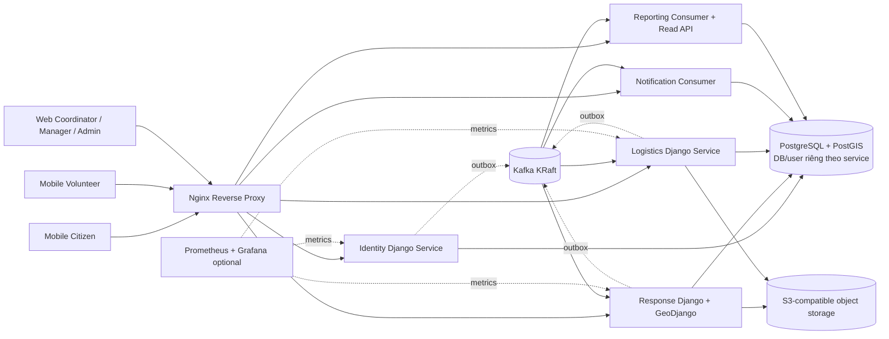
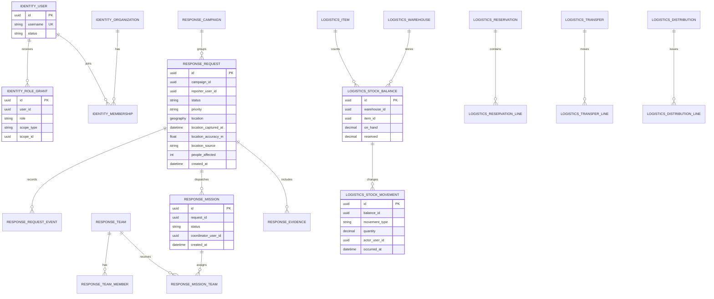
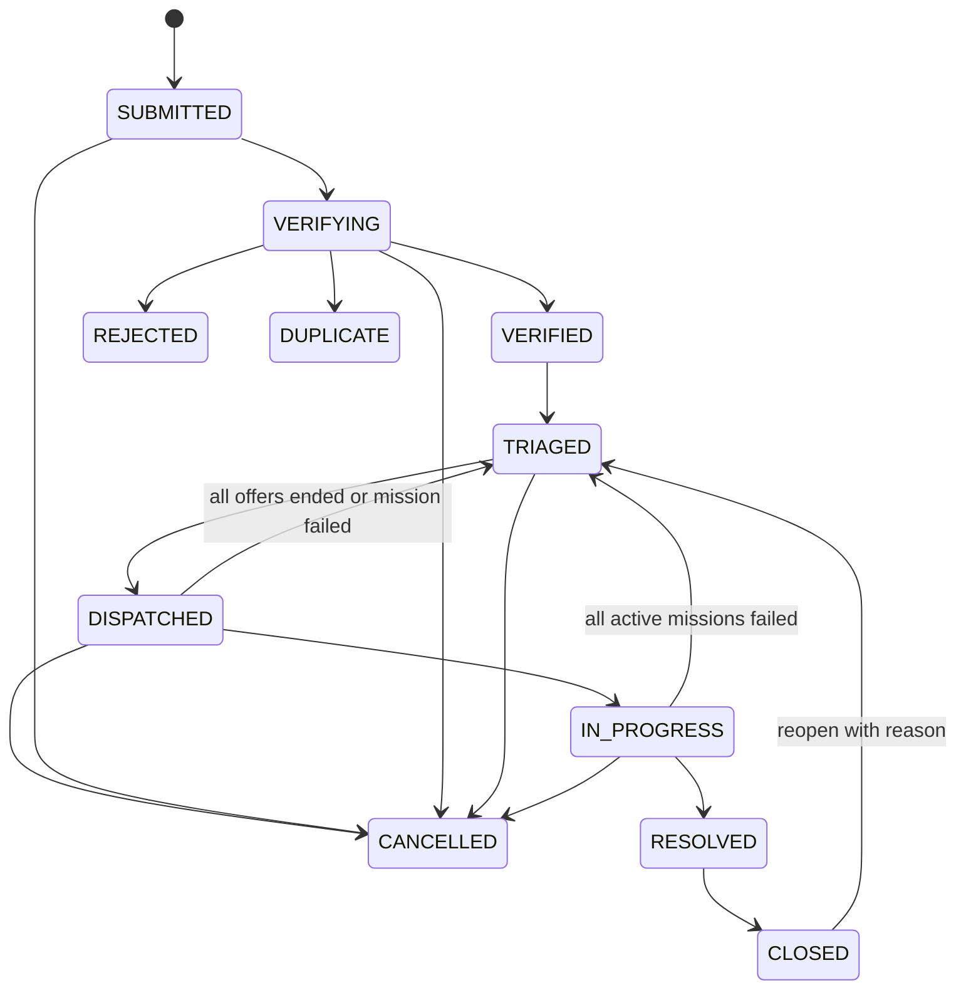
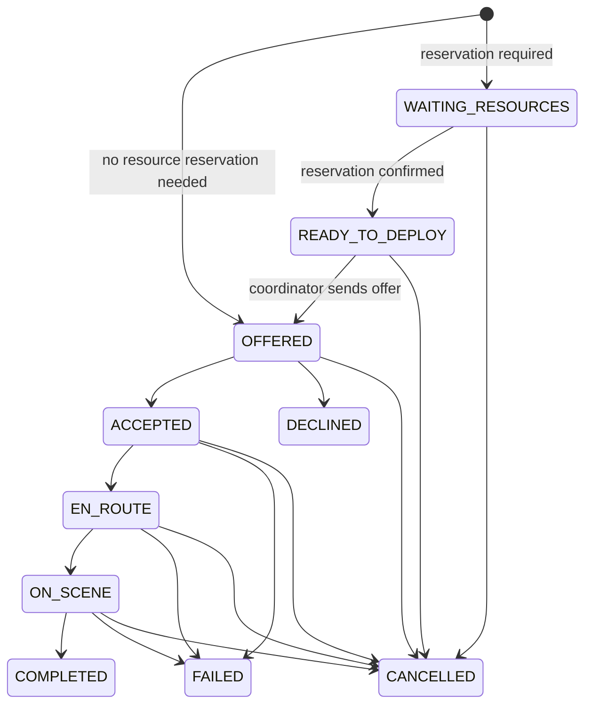

# Kế hoạch công nghệ và triển khai đồ án C48

| Thuộc tính | Giá trị |
|---|---|
| Tên đề tài | Hệ thống quản lý ứng phó khẩn cấp và cứu trợ thiên tai |
| Mã đề tài | C48 |
| Phiên bản | 1.0 — bản nghiên cứu và đề xuất thiết kế |
| Ngày nghiên cứu | 29/09/2026 |
| Thời lượng theo đề cương | 10 tuần; nhóm 3 thành viên |

Tài liệu này là baseline kỹ thuật để nhóm phát triển thành SRS, SDD, thiết kế dữ liệu/API, test case và hướng dẫn sử dụng. Nó không biến công nghệ, SLA, chính sách dữ liệu hay quy trình đề xuất thành yêu cầu đã được đơn vị cứu hộ phê duyệt.

## 1. Cách đọc và mức độ chắc chắn

| Nhãn | Ý nghĩa |
|---|---|
| **Nguồn đề cương** | Yêu cầu được tổng hợp trong [c48-project-context.md](c48-project-context.md). |
| **Đề xuất** | Lựa chọn kỹ thuật hoặc quy tắc nghiệp vụ làm baseline cho đồ án. |
| **Cần xác nhận** | Câu hỏi nhóm cần hỏi giảng viên/người có kinh nghiệm nghiệp vụ. |

Tài liệu OCHA/IFRC được dùng để tham khảo cách tổ chức quy trình nhân đạo, không thay thế quy định của cơ quan có thẩm quyền tại Việt Nam. OCHA mô tả chu trình phản ứng gồm phân tích, lập kế hoạch, huy động nguồn lực, thực hiện, giám sát/đánh giá và báo cáo. [OCHA — Humanitarian Programme Cycle](https://knowledge.base.unocha.org/wiki/spaces/hpc/overview)

## 2. Tóm tắt đề xuất

| Hạng mục | Đề xuất baseline | Lý do |
|---|---|---|
| Backend | Python + Django 5.2 LTS + Django REST Framework (DRF) | Theo mong muốn dùng Django; có ORM, migrations, authentication/admin và GeoDjango. Nhánh 5.2 LTS hiện được hỗ trợ bảo mật đến tháng 4/2028; chốt patch mới nhất khi khởi tạo repo. [Django releases](https://www.djangoproject.com/download/) |
| Database | PostgreSQL + PostGIS | Dữ liệu quan hệ, giao dịch tồn kho và truy vấn vị trí; GeoDjango có hỗ trợ PostGIS phong phú hơn MySQL. [GeoDjango database API](https://docs.djangoproject.com/en/5.2/ref/contrib/gis/db-api/) |
| Backend services | 5 service triển khai độc lập: Identity, Response, Logistics, Notification, Reporting | Đủ thể hiện service boundary, API/event và quyền sở hữu dữ liệu; không tách thành nhiều service nhỏ khó hoàn thiện trong 10 tuần. |
| Messaging | Apache Kafka KRaft + transactional outbox + consumer idempotent | Hợp với event có nhiều consumer và cần phát lại; không khẳng định toàn hệ thống “exactly once”. [Kafka](https://kafka.apache.org/intro/), [transactional outbox](https://docs.aws.amazon.com/prescriptive-guidance/latest/cloud-design-patterns/transactional-outbox.html) |
| Web | React + TypeScript + Vite | Phù hợp dashboard tác nghiệp; không cần SSR/SEO cho khu vực đăng nhập. [Vite guide](https://vite.dev/guide/) |
| Mobile | React Native + Expo + TypeScript | Dùng chung TypeScript; đáp ứng GPS, ảnh và thông báo. Chỉ xin quyền vị trí khi cần, không bật tracking nền mặc định. [React Native TypeScript](https://reactnative.dev/docs/typescript), [Expo Location](https://docs.expo.dev/versions/latest/sdk/location/) |
| File | Django storage API; SeaweedFS S3-compatible cho lab hoặc S3-compatible managed khi triển khai thật | Lưu file ngoài database. MinIO đã archive và repo ghi rõ không còn được duy trì. [MinIO repository](https://github.com/minio/minio), [SeaweedFS](https://github.com/seaweedfs/seaweedfs) |
| Deployment | Docker Compose trên một máy demo; Nginx làm reverse proxy | Có nhiều container nhưng chưa cần nhiều máy vật lý. [Docker Compose production](https://docs.docker.com/compose/how-tos/production/) |
| Kubernetes | kind là nhánh học thêm sau khi Compose end-to-end ổn | Đáp ứng mục tiêu học Kubernetes mà không chặn chức năng đồ án. kind chạy cluster local bằng Docker containers. [kind Quick Start](https://kind.sigs.k8s.io/docs/user/quick-start/) |
| AI | Advisor trả gợi ý có giải thích; điều phối viên quyết định | AI trong đề cương là hướng nghiên cứu hỗ trợ, không tự đổi ưu tiên hoặc phân công cứu hộ. |

**Quy mô demo:** 5 container ứng dụng độc lập, Nginx, Kafka, PostgreSQL/PostGIS với database/user tách theo service, object storage và tùy chọn Prometheus/Grafana. Tất cả có thể chạy trên một máy; không phải thuê năm server.

## 3. Bài toán và quy trình nghiệp vụ

### 3.1 Rủi ro cần giải quyết

Theo bối cảnh đề cương, thông tin cứu trợ có thể đi qua nhiều kênh và nhiều nhóm. Các rủi ro cần kiểm chứng qua phỏng vấn/khảo sát gồm:

- Yêu cầu thiếu vị trí, số người bị ảnh hưởng hoặc thời điểm ghi nhận.
- Báo trùng một sự cố nhưng không liên kết, làm sai thống kê hoặc điều động lặp.
- Điều phối viên khó thấy yêu cầu chờ xác minh, đội nào đã nhận nhiệm vụ, nguồn lực nào còn khả dụng.
- Tồn kho không thống nhất giữa nhập, điều chuyển, giữ chỗ, xuất và phân phối; khó truy lịch sử khi số dư lệch.
- Mạng yếu làm người gửi không biết SOS đã đến server chưa.
- Dashboard từ nhiều nguồn có thể trễ hoặc đếm trùng nếu không xử lý event lặp.
- Vị trí/thông tin liên hệ nhạy cảm có thể bị lộ nếu cấp quyền quá rộng.

Đây là giả thuyết rủi ro của bài toán, không phải kết luận về một địa phương hay cơ quan cụ thể.

### 3.2 Quy trình mục tiêu

1. **Tiếp nhận:** người dân gửi yêu cầu; ghi tọa độ, độ chính xác, thời điểm và nguồn vị trí. Nếu offline, hiện “chờ gửi”; chỉ hiện đã tiếp nhận sau server ACK.
2. **Sàng lọc:** validate dữ liệu, chống gửi lặp bằng idempotency key, đưa vào queue.
3. **Xác minh:** coordinator liên hệ/bổ sung thông tin; từ chối hoặc gắn trùng phải có lý do và lịch sử.
4. **Ưu tiên:** coordinator đặt mức ưu tiên theo tiêu chí đã xác nhận; AI nếu có chỉ là thông tin phụ.
5. **Điều động:** giao nhiệm vụ cho team phù hợp; team accept/decline, cập nhật đang đi/đã đến/kết quả.
6. **Cấp nguồn lực:** Response phát yêu cầu giữ hàng; Logistics kiểm tra tồn khả dụng. Giữ hàng và xuất hàng là hai bước riêng.
7. **Xác nhận kết quả:** đội báo kết quả/bằng chứng; coordinator xác nhận nhu cầu đã đáp ứng. Một mission hoàn tất không tự đóng request nếu còn nhu cầu khác.
8. **Theo dõi:** Notification gửi thông báo; Reporting cập nhật dashboard và hiển thị thời điểm dữ liệu mới nhất.

Quy trình tham chiếu chu trình OCHA ở mức khái niệm; cần xác nhận thuật ngữ và trách nhiệm theo bối cảnh đồ án. [OCHA HPC](https://knowledge.base.unocha.org/wiki/spaces/hpc/overview)

## 4. So sánh công nghệ

### 4.1 Database

| Tiêu chí | PostgreSQL + PostGIS | MySQL 8.4 + InnoDB | MongoDB |
|---|---|---|---|
| Quan hệ và ràng buộc | Mạnh; hợp user, mission, giao dịch kho, audit | Mạnh; InnoDB có transaction và foreign key | Quan hệ cần tổ chức thêm ở tầng ứng dụng |
| GPS/bản đồ | GeoDjango/PostGIS có nhiều phép toán và spatial index | GeoDjango ghi nhận spatial function ít phong phú hơn PostGIS | Có 2dsphere, nhưng cần tích hợp riêng với Django |
| Tồn kho cạnh tranh | Transaction, constraint, row lock phù hợp chống xuất vượt số dư | InnoDB hỗ trợ transaction/locking | Có transaction nhiều document; mô hình liên kết/báo cáo cần cân nhắc |
| Django | ORM và GeoDjango trực tiếp | ORM trực tiếp, GIS hạn chế hơn | Không phải backend ORM mặc định của Django |
| Kết luận | **Chọn** | Dự phòng nếu nhóm có kinh nghiệm/vận hành MySQL | Không chọn làm database chính |

PostGIS hỗ trợ GiST spatial index. Với điểm cần tìm trong bán kính, cân nhắc geography PointField với SRID 4326; dùng geometry cho polygon ranh giới và phép toán phù hợp. Không dùng geography cho mọi trường một cách máy móc. [PostGIS spatial indexes](https://postgis.net/documentation/faq/spatial-indexes/), [GeoDjango distance queries](https://docs.djangoproject.com/en/5.2/ref/contrib/gis/db-api/). MySQL có InnoDB transactions và MongoDB có geospatial indexes/transactions, nhưng GeoDjango ghi nhận spatial API của MySQL ít phong phú hơn PostGIS; MongoDB cần tích hợp riêng với Django. [MySQL InnoDB](https://dev.mysql.com/doc/refman/8.4/en/innodb-introduction.html), [MongoDB 2dsphere](https://www.mongodb.com/docs/manual/core/indexes/index-types/geospatial/2dsphere/), [MongoDB transactions](https://www.mongodb.com/docs/manual/core/transactions/)

Đối với tồn kho, dùng transaction, constraint và row lock trên số dư SKU/kho trong transaction ngắn. Tránh gọi Kafka hay object storage khi đang giữ database lock. [Django transactions](https://docs.djangoproject.com/en/5.2/topics/db/transactions/), [Django QuerySet locking](https://docs.djangoproject.com/en/5.2/ref/models/querysets/#select-for-update), [PostgreSQL explicit locking](https://www.postgresql.org/docs/18/explicit-locking.html)

### 4.2 Backend

| Lựa chọn | Ưu điểm | Hạn chế với C48 | Kết luận |
|---|---|---|---|
| Django + DRF | Python, ORM/migrations, admin/auth, GeoDjango, CRUD nghiệp vụ nhanh | Cần quy ước service boundary và quyền rõ ràng | **Chọn** theo ưu tiên của nhóm |
| FastAPI | Gọn cho API bất đồng bộ, OpenAPI thuận tiện | Tự ghép nhiều phần auth/admin/ORM; không tận dụng GeoDjango | Không chọn cho baseline này |
| Flask | Nhỏ và linh hoạt | Nhiều phần nền phải tự ghép, tăng boilerplate giữa 5 service | Không chọn |

Dùng Django 5.2 LTS, DRF tương thích, Python còn được Django hỗ trợ; khóa dependency/image bằng lock file/tag. Trang Django liệt kê hỗ trợ bảo mật 5.2 LTS đến tháng 4/2028; kiểm tra patch mới nhất khi setup, không sao chép số patch từ tài liệu. [Django release/support schedule](https://www.djangoproject.com/download/)

Mỗi service là Django project có cấu hình, database và migrations riêng. Dùng chung quy ước API/event bằng tài liệu; chưa cần dựng framework nội bộ dùng chung khi chỉ có một cách triển khai.

### 4.3 Web, mobile, API

| Kênh | Đề xuất | Phạm vi |
|---|---|---|
| Web | React + TypeScript + Vite; React Router; TanStack Query cho server state | Dashboard, map/queue, verify/triage, mission, kho, báo cáo, admin |
| Mobile | React Native + Expo + TypeScript | Citizen SOS/tracking; volunteer mission/progress; GPS foreground và ảnh |
| API | REST/JSON /api/v1; OpenAPI riêng từng service bằng drf-spectacular | Contract cho web/mobile, mock và kiểm tra API |
| Bản đồ | Map UI tách khỏi nghiệp vụ; PostGIS tìm kiếm; chọn tile/geocoding provider sau khi rà license, quota, privacy | Không gửi nội dung/PII sự cố sang nhà cung cấp bản đồ |

Thiết kế màn hình khẩn cấp với ít bước, nút dễ thao tác, trạng thái gửi rõ và manual pin khi GPS bị từ chối/sai lệch. Không theo dõi vị trí nền mặc định; Expo yêu cầu cấu hình permission theo nền tảng và loại truy cập. [Expo Location](https://docs.expo.dev/versions/latest/sdk/location/), [Expo permissions](https://docs.expo.dev/guides/permissions/)

### 4.4 Kafka hay queue đơn giản

| Phương án | Phù hợp khi | Với C48 |
|---|---|---|
| Kafka | Nhiều consumer, cần replay, reporting projection và học event-driven service | **Chọn** cho integration events |
| RabbitMQ/Celery | Chủ yếu cần task nền/retry, không cần đọc lại event stream | Đơn giản hơn cho job queue, nhưng kém phù hợp mục tiêu Kafka đã duyệt |

Kafka đảm bảo thứ tự trong từng partition, không có thứ tự toàn cục. Dùng aggregate ID làm key để các thay đổi cùng request/mission vào cùng partition. Message có thể giao lại; consumer phải idempotent. Không cam kết “exactly once” xuyên database, Kafka, push provider và reporting. [Kafka introduction](https://kafka.apache.org/intro/), [Kafka delivery semantics](https://kafka.apache.org/40/design/design/)

### 4.5 Chọn mức độ tách service

| Mô hình | Ưu điểm | Chi phí/rủi ro | Đánh giá |
|---|---|---|---|
| Django modular monolith + worker | Ít deploy/database, giao dịch đơn giản, dễ đạt MVP | Không thể hiện service deployment/data ownership rõ như mục tiêu học của nhóm | Phương án an toàn nếu lịch trễ |
| 5 service bounded context | Có boundary/DB/API/event độc lập; vẫn đủ gọn cho demo một host | Auth liên-service, outbox, eventual consistency và saga cần test | **Chọn theo mục tiêu đã duyệt** |
| 8+ service nhỏ | Scale/ownership có thể phân nhỏ hơn | Tăng hợp đồng, container, test tích hợp và lỗi vận hành; vượt nhu cầu đồ án | Không chọn |

Để chứng minh đây là microservice chứ không chỉ nhiều process, mỗi service có image/deploy riêng, database credential riêng, OpenAPI/event contract và không đọc bảng service khác. Chia sẻ cùng một host/PostgreSQL server trong demo không làm mất ranh giới logic; nó chỉ tạo shared host/database-server failure domain.

## 5. Kiến trúc đề xuất

### 5.1 Sơ đồ



Nginx chỉ định tuyến; mỗi service vẫn xác thực/authorize. Producer ghi event vào outbox cùng transaction nghiệp vụ rồi relay mới publish.

### 5.2 Ranh giới và quyền dữ liệu

| Service | Sở hữu dữ liệu/logic chuẩn | API chính | Event tiêu biểu |
|---|---|---|---|
| **Identity** | Tài khoản, credentials, tổ chức, membership, role grant/scope | Login/refresh/logout, quản lý user/role | identity.user.created, identity.role.changed, identity.account.disabled |
| **Response** | Campaign/incident, SOS/request, verify/priority, team/volunteer, mission/progress, evidence metadata | Gửi request, verify/triage, assign, transition, query map | response.campaign.activated/closed, response.request.submitted/verified/triaged, response.mission.assigned/status_changed/completed |
| **Logistics** | Kho, item, stock balance/ledger, campaign reference projection, reservation, transfer, vehicle, relief point, distribution | Nhập/xuất/điều chuyển/giữ hàng/cấp phát | logistics.stock.reserved/rejected/issued, logistics.transfer.received, logistics.distribution.recorded |
| **Notification** | Device destination, template, delivery attempt, retry, in-app notification | Thông báo của user, mark read, retry ops | Có thể phát delivery status nếu consumer cần |
| **Reporting** | Projection/read model cho dashboard; không sở hữu dữ liệu nghiệp vụ chuẩn | Tổng hợp campaign/time/region, export | Chủ yếu là consumer |

Boundary:

- Mỗi service có database/user riêng; trên demo cùng PostgreSQL server để tiết kiệm tài nguyên. Không có foreign key hay query bảng xuyên service.
- ID user/campaign/warehouse ngoài service là UUID tham chiếu logic. Dùng API/event/projection để xác minh.
- Response sở hữu Campaign/Incident nghiệp vụ; Logistics sở hữu kho và phân phối theo campaign ID; Reporting nối projection qua event.
- Request và mission cùng Response DB để state/assignment có transaction cục bộ. Inventory ở Logistics DB; workflow liên miền dùng saga.
- Reporting có thể trễ; hiện generated time. Quyết định cứu hộ lấy từ dữ liệu chuẩn Response/Logistics.

### 5.3 Event, outbox và retry

```json
{
  "event_id": "uuid",
  "event_type": "response.request.triaged",
  "schema_version": 1,
  "occurred_at": "2026-09-29T10:30:00Z",
  "producer": "response",
  "aggregate_type": "assistance_request",
  "aggregate_id": "uuid",
  "aggregate_version": 4,
  "correlation_id": "uuid",
  "data": {"campaign_id": "uuid", "priority": "P1", "region_code": "..."}
}
```

Không phát số điện thoại, mô tả tự do, signed URL hoặc tọa độ chính xác nếu consumer không cần. Event không phải bản sao đầy đủ của row. Version schema rõ ràng; JSON versioned envelope đủ cho scope đồ án.

1. Trong transaction, ghi business state, audit/domain event và outbox.
2. Relay gửi outbox chưa publish rồi đánh dấu. Nếu process chết sau publish nhưng trước mark, event có thể được gửi lại.
3. Consumer ghi event ID vào inbox có unique constraint cùng transaction với projection/side effect.
4. Duplicate không tạo notification/stock movement/report row lần hai. Lỗi tạm thời retry có backoff; poison event vào DLQ để kiểm tra/replay.
5. Theo dõi outbox age, consumer lag, retry và DLQ count.

Outbox tránh DB đã commit nhưng message không gửi; AWS cũng nêu nguy cơ duplicate và khuyến nghị consumer idempotent. [AWS transactional outbox](https://docs.aws.amazon.com/prescriptive-guidance/latest/cloud-design-patterns/transactional-outbox.html)

Không đưa vào baseline: Schema Registry, Avro, Debezium/CDC, service mesh, CQRS framework hay workflow engine. Chỉ bổ sung khi có nhu cầu được chứng minh.

### 5.4 Saga giữ hàng cho mission

1. Coordinator tạo/assign mission trong Response; nếu cần hàng, mission ở WAITING_RESOURCES.
2. Response ghi ReservationRequested vào outbox.
3. Logistics nhận event, khóa số dư, kiểm tra available và atomically tạo reservation hoặc từ chối; kết quả đi qua outbox.
4. Response nhận xác nhận thì mission chuyển READY_TO_DEPLOY; coordinator gửi offer cho team, request mới chuyển DISPATCHED. Team accept thì request chuyển IN_PROGRESS. Bị từ chối tài nguyên thì mission ở WAITING_RESOURCES để coordinator chọn kho/đổi lượng/hủy.
5. Kho issue thật thì Logistics ghi movement ISSUE, reservation thành ISSUED. Hủy trước issue thì release; hủy sau issue không xóa movement.
6. Hàng đã xuất quay lại phải ghi movement RETURN sau kiểm đếm.

Nếu mission bị hủy trong khi reservation còn xử lý, Response ghi cancellation/release intent. Nếu xác nhận giữ hàng đến muộn, Logistics vẫn trả kết quả idempotent và Response phát release tiếp; không để reservation mồ côi.

Đây là workflow nhiều transaction có bù trừ, không phải distributed transaction. Trạng thái trung gian/timeout phải hiện để điều phối viên xử lý.

## 6. Mô hình dữ liệu và toàn vẹn

### 6.1 ERD logic theo service



Các FK trong sơ đồ là quan hệ bên trong service. ID user/campaign bên ngoài là UUID tham chiếu logic, không có cross-database foreign key. Model thực tế cần timestamp, audit fields, indexes, unique constraints, migrations và chính sách lưu trữ.

### 6.2 Thực thể cốt lõi

| Database | Bảng/chủ thể tối thiểu |
|---|---|
| Identity | User, Organization, Membership, RoleGrant, trạng thái account, refresh session/revocation nếu dùng token rotation |
| Response | Campaign, Incident, AssistanceRequest, RequestEvent, RescueTeam, TeamMember (opaque user ID), VolunteerProfile, Mission, MissionTeam, EvidenceMetadata, Outbox, Inbox |
| Logistics | Warehouse, Item, StockBalance, StockMovement, CampaignReference projection, Reservation/lines, Transfer/lines, Distribution/lines, Vehicle, ReliefPoint, Outbox, Inbox |
| Notification | DeviceEndpoint, Notification, DeliveryAttempt, retry state, Inbox |
| Reporting | RequestDailyMetric, CampaignSnapshot, StockSnapshot, ProcessingTimeMetric, watermark/offset; chỉ tạo projection thật sự cần cho dashboard |

Tạo custom User model trong migration đầu của Identity service; thay user model sau khi đã có migration/domain data gây migration phức tạp. [Django custom user model](https://docs.djangoproject.com/en/5.2/topics/auth/customizing/)

### 6.3 GPS và file minh chứng

- Tọa độ là WGS84/SRID 4326; GeoJSON lưu theo thứ tự longitude, latitude. Validate longitude trong -180..180, latitude trong -90..90, accuracy không âm. [RFC 7946](https://datatracker.ietf.org/doc/html/rfc7946)
- Lưu capture time, accuracy mét, source (GPS, manual pin, geocoded) và server receive time riêng. Độ chính xác thiết bị không đồng nghĩa độ chính xác ngoài thực địa.
- Lưu vị trí snapshot khi tạo SOS; chỉ thêm location history nếu có yêu cầu rõ. Không tracking nền liên tục trong MVP.
- Map query giới hạn theo quyền, vùng/thời gian/status/bounding box; không trả mọi PII cho bản đồ.
- File ở object storage; DB chỉ giữ object key, owner type/id, MIME đã kiểm tra, size, checksum, uploader, thời điểm và visibility. Bucket private; signed URL ngắn hạn nếu dùng truy cập trực tiếp.
- Kiểm tra MIME thực, phần mở rộng và kích thước; không tin tên/MIME từ client. Tải lên chỉ qua nghiệp vụ có quyền.
- Dữ liệu demo phải là dữ liệu giả, không lấy ảnh hoặc thông tin người gặp nạn thật.
- Dùng Django storage API; filesystem local cho dev/test, SeaweedFS S3 gateway cho lab demo hoặc S3-compatible managed khi triển khai thật. MinIO repo đã archive ngày 25/04/2026 và ghi không còn được duy trì. Trước khi dùng SeaweedFS thật, kiểm tra compatibility, auth, backup/restore, signed URL và license. [MinIO archive notice](https://github.com/minio/minio), [SeaweedFS S3 API](https://github.com/seaweedfs/seaweedfs)

### 6.4 Tồn kho và audit

- StockMovement là sổ biến động chỉ thêm: RECEIPT, RESERVE, RELEASE, ISSUE, TRANSFER_OUT, TRANSFER_IN, RETURN, ADJUSTMENT.
- StockBalance là số dư hiện tại/projection cập nhật cùng transaction với movement; available = on_hand - reserved.
- Constraint: on_hand ≥ 0, reserved ≥ 0, reserved ≤ on_hand; quantity dương, đơn vị đo khớp item. Điều chỉnh cần actor, lý do và quyền.
- Unique constraint trên cặp warehouse/item cho StockBalance; khi reserve nhiều item, khóa theo thứ tự ID ổn định để tránh cập nhật trùng và giảm deadlock.
- Transfer nhận ở kho đích là bước riêng; không cộng kho đích chỉ vì transfer đã được tạo.
- Distribution ghi item, lượng, kho/điểm cấp, campaign, thời gian và actor. Không bắt buộc thu thập giấy tờ/tên người nhận khi không có nhu cầu được duyệt.
- Dùng unique/idempotency key chống gửi lại receipt/issue/distribution; khóa hàng số dư để hai thao tác đồng thời không xuất quá tồn.

## 7. Yêu cầu hệ thống

Trong bảng FR, **M** là cần cho demo cốt lõi, **S** là nên có nếu tiến độ cho phép, **O** là mở rộng. Đây là ưu tiên đề xuất, không có sẵn trong đề cương.

### 7.1 User Requirements (UR)

| ID | Actor | Nhu cầu |
|---|---|---|
| UR-01 | Người dân | Gửi SOS/yêu cầu có vị trí, số người, thông tin sự cố và nhận xác nhận server đã tiếp nhận. |
| UR-02 | Người dân | Theo dõi tiến độ, bổ sung thông tin và biết request bị từ chối/trùng/đóng vì lý do gì. |
| UR-03 | Coordinator | Xác minh, liên kết yêu cầu trùng, đặt ưu tiên, xem map và phân công đội phù hợp. |
| UR-04 | Volunteer/team | Chỉ xem mission được giao; accept/decline, cập nhật tiến độ và bằng chứng kết quả. |
| UR-05 | Operations manager | Quản lý campaign, kho, phương tiện, điểm cứu trợ, giữ/điều chuyển/cấp/phân phối vật tư có thể truy vết. |
| UR-06 | Admin/manager | Quản lý account/quyền theo phạm vi và xem dashboard/báo cáo hoạt động. |
| UR-07 | Nhóm vận hành | Biết dữ liệu đang chờ gửi, consumer đang trễ/lỗi, dashboard cập nhật lúc nào và có cách phục hồi demo. |

### 7.2 Functional Requirements (FR)

| ID | Mức | Yêu cầu chức năng đề xuất | Tiêu chí kiểm chứng |
|---|---:|---|---|
| FR-IAM-01 | M | Login, refresh/logout, vô hiệu hóa account và đổi thông tin xác thực | Token sai/hết hạn/account disabled nhận 401; logout vô hiệu refresh session |
| FR-IAM-02 | M | Role theo scope tổ chức/khu vực/campaign; kiểm tra cả action lẫn object | Citizen không xem request người khác; volunteer chỉ thấy mission của team |
| FR-IAM-03 | M | Admin quản lý account, organization và role theo least privilege | Ghi actor/time/trước-sau cho thay đổi quyền |
| FR-REQ-01 | M | Tạo request: category, mô tả ngắn, số người, vị trí hoặc manual pin, thời gian/source | Validate dữ liệu; trả mã và server receive time |
| FR-REQ-02 | M | Hỗ trợ người đăng nhập; guest SOS nếu quyết định được xác nhận | Guest chỉ tạo request/track capability riêng, không search/list |
| FR-REQ-03 | M | Idempotency cho retry tạo SOS | Cùng key/payload không tạo row thứ hai; cùng key khác payload bị từ chối |
| FR-REQ-04 | M | Verify, reject, duplicate-link; quyết định reject/duplicate có reason | Không xóa request trùng; duplicate link tới canonical request |
| FR-REQ-05 | M | Priority thủ công P1–P4, ghi actor/time và lý do/override | Priority độc lập với status; không tự đổi từ AI |
| FR-REQ-06 | M | List/map filter theo scope, bbox/khu vực, status, priority, time | Lọc quyền trước phân trang |
| FR-REQ-07 | M | Người dân xem timeline và bổ sung thông tin cho request của mình trong state được phép | Chủ thể xem được; người khác không truy cập; nội dung bổ sung có actor/time |
| FR-MSN-01 | M | Quản lý team, skill, availability, members qua opaque user ID | Không gán team inactive/unavailable hoặc thiếu skill bắt buộc |
| FR-MSN-02 | M | Tạo mission, offer/assign, accept/decline, transition, kết quả | Chỉ state transition hợp lệ; ghi actor/time/reason |
| FR-MSN-03 | M | Một request có thể có nhiều mission; MVP một mission gắn một request | Xong một mission không tự close request khi còn nhu cầu |
| FR-MSN-04 | M | Tải evidence cho request/mission; coordinator xác nhận kết quả | Metadata và quyền tải gắn object scope |
| FR-CAM-01 | M | Response quản lý campaign/incident, vùng hoạt động, thời gian và trạng thái | Chỉ role/scope phù hợp tạo/sửa; Logistics lưu campaign ID tham chiếu |
| FR-LOG-01 | M | Quản lý warehouse, item, vehicle, relief point; gắn campaign ID tham chiếu khi cần | Entity active/inactive; không xóa lịch sử đã phát sinh |
| FR-LOG-02 | M | Nhập, transfer, receive, reserve/release, issue, return, adjustment | Ledger có actor/time/quantity/reason; balance không âm |
| FR-LOG-03 | M | Giữ hàng cho mission qua saga Response–Logistics | Kết quả idempotent; trung gian/timeout quan sát được |
| FR-LOG-04 | M | Ghi distribution theo campaign, điểm, item, quantity, actor | Retry không nhân đôi distribution |
| FR-NOT-01 | M | In-app notification khi request/mission đổi; push/email là mở rộng | Notification lỗi không rollback SOS/mission; retry state lưu được |
| FR-RPT-01 | M | Dashboard request theo state/priority/region/campaign, lead time, stock/distribution | Khớp dataset kiểm thử; hiển thị watermark/update time |
| FR-RPT-02 | S | Export CSV theo scope, che PII theo role | Không export trường ngoài quyền; audit export nhạy cảm |
| FR-AUD-01 | M | Lưu state transition, quyết định, stock adjustment, phân phối và role change | Không ghi password/token; audit chỉ role phù hợp đọc |
| FR-EVT-01 | M | Outbox atomically với business write; relay/retry và consumer dedupe | Relay dừng không làm mất committed event; replay không lặp side effect |
| FR-FILE-01 | M | Upload private file, validate size/type, lưu metadata và kiểm soát download | MIME giả/size vượt ngưỡng bị từ chối; link hết hạn không tải |
| FR-OFF-01 | S | Draft SOS offline, retry khi có mạng bằng cùng idempotency key | UI phân biệt QUEUED_ON_DEVICE và SUBMITTED |
| FR-AI-01 | O | AI/rule trả gợi ý, yếu tố, version; người điều phối accept/override | Không auto-dispatch/ghi đè priority; có thể tắt mà core vẫn chạy |

### 7.3 Non-functional Requirements (NFR)

Đề cương chưa đưa ngưỡng số. Các con số dưới đây là mục tiêu khởi điểm cần giảng viên/nhóm xác nhận.

| ID | Chất lượng | Yêu cầu/tiêu chí đề xuất |
|---|---|---|
| NFR-SEC-01 | Bảo mật | Mặc định API yêu cầu login; chỉ endpoint guest SOS được public nếu phê duyệt. Service tự kiểm tra scope, không tin role từ client. |
| NFR-SEC-02 | Bảo mật | Queryset list lọc theo quyền; object permission cho detail/action; validate input/file và rate limit phù hợp. DRF mặc định AllowAny nếu không đặt policy, và object permission không tự lọc mọi row của list. [DRF permissions](https://www.django-rest-framework.org/api-guide/permissions/) |
| NFR-SEC-03 | Bảo mật | Không log token, password, signed URL hay vị trí chính xác nếu không cần; HTTPS ngoài môi trường local. |
| NFR-PRV-01 | Riêng tư | Vị trí chỉ chủ thể, coordinator trong scope và team được giao xem; report mặc định aggregate. Retention cần xác nhận, không tự đặt chính sách chính thức. |
| NFR-REL-01 | Tin cậy | Inventory không âm; state hợp lệ; retry không nhân đôi; consumer khôi phục; có kiểm thử restore backup. |
| NFR-PERF-01 | Hiệu năng | Mục tiêu thảo luận: dataset 10.000 request, 20 concurrent trong demo; API đọc phổ thông p95 ≤ 2 giây; SOS create p95 ≤ 3 giây không tính upload. Ghi lại cấu hình máy đo. |
| NFR-PERF-02 | Hiệu năng | Map dùng spatial index/bbox và giới hạn kết quả; dashboard hiện watermark thay vì giả realtime. |
| NFR-UX-01 | Sử dụng | SOS ít bước, nút dễ thao tác, trạng thái gửi rõ, manual pin và lỗi GPS dễ hiểu. |
| NFR-OFF-01 | Mạng yếu | Nếu làm offline queue, retry idempotent; không đồng bộ vị trí nền liên tục. |
| NFR-OBS-01 | Vận hành | Health/readiness, log có correlation ID, metric latency/error, outbox age, Kafka lag, DLQ, DB connections/disk. |
| NFR-OPS-01 | Khôi phục | Có hướng dẫn backup DB/object metadata và làm một lần restore demo; chốt RPO/RTO khi có yêu cầu thật. |
| NFR-COMP-01 | Tương thích | API có version prefix/OpenAPI; migration kiểm soát; backend dùng UTC, UI cấu hình timezone. |
| NFR-TEST-01 | Kiểm thử | Có test state, object permission, race tồn kho, duplicate event, outage/replay và end-to-end; coverage threshold chốt sau. |

## 8. Business rules và state machine

### 8.1 Assistance Request



- Priority là thuộc tính riêng, không phải status. P1–P4 là nháp: P1 nguy hiểm trực tiếp, P2 rất khẩn cấp, P3 cần hỗ trợ, P4 thông tin/không khẩn cấp. Cần xác nhận định nghĩa; hệ thống không tự hứa SLA.
- VERIFIED mới được triage/dispatch theo baseline.
- REJECTED cần reason; DUPLICATE cần canonical request ID và reason. Không xóa request gốc/trùng.
- Mission còn WAITING_RESOURCES chưa làm request rời TRIAGED; request chỉ sang DISPATCHED khi offer tới team được gửi.
- DISPATCHED khi offer nhiệm vụ đã được gửi cho team; IN_PROGRESS khi team đầu tiên accept.
- Nếu mission bị decline/fail, request vẫn DISPATCHED khi còn assignment đang hoạt động; nếu hết assignment, coordinator đưa về TRIAGED để giao lại. Reopen từ CLOSED cần reason và audit.
- RESOLVED do coordinator xác nhận nhu cầu đã đáp ứng; CLOSED là kết thúc quản trị. Mission completed không tự đóng request.
- Coordinator trong scope mới được reopen/cancel; phải có reason/audit và xử lý mission đang chạy.

### 8.2 Mission



- DECLINED, FAILED, CANCELLED, COMPLETED kết thúc một mission; reassign tạo mission/assignment mới.
- Team chỉ xem/cập nhật mission được giao; coordinator trong scope xem và điều phối.
- Lưu transition actor/time, reason, note và evidence reference; location update là tùy chọn, không tracking nền.
- Request có thể có nhiều mission; coordinator xác nhận tổng thể trước khi resolve.

### 8.3 Inventory và transfer

```text
Reservation: REQUESTED -> RESERVED -> ISSUED
                    |         |-> RELEASED
                    +-> REJECTED

Transfer: DRAFT -> RESERVED -> IN_TRANSIT -> RECEIVED
                     |              |-> CANCELLED (trước khi nhận, có audit)
```

- Command kiểm tra state/quyền; không cho client PATCH status tùy ý.
- on_hand là lượng sở hữu; reserved là lượng giữ; available = on_hand - reserved.
- ISSUE giảm on_hand và reserved khi xuất từ reservation; RELEASE giảm reserved nhưng không tăng on_hand.
- Transfer giảm kho gửi khi xuất theo policy; kho nhận tăng khi xác nhận. Không cập nhật hai DB bằng một transaction.
- Adjustment cần lý do, actor và audit; không sửa/xóa ledger cũ để “làm cho khớp”.

### 8.4 Quy tắc chung

- Server UTC là thời gian kiểm toán; client capture time được lưu riêng.
- Command retry dùng idempotency; state/version check ngăn request cũ ghi đè state mới.
- Không xóa cứng request/mission/stock movement đã có hoạt động; dùng trạng thái/archive theo policy.
- Override priority/AI, reject request, cancel mission, stock adjustment và role change phải có actor/time/reason.
- Campaign do Response sở hữu; vòng đời đề xuất DRAFT → ACTIVE → PAUSED → CLOSED. Chỉ campaign ACTIVE nhận request mới; đóng campaign không xóa request/reservation/ledger lịch sử. Logistics vẫn ghi nhận return/settlement sau khi campaign đóng.

## 9. Use Case chính

### UC-01 — Gửi SOS/yêu cầu hỗ trợ

**Actor:** Người dân; guest nếu được duyệt.

**Điều kiện trước:** Ứng dụng mở; có GPS hoặc người dùng đặt manual pin.

**Luồng chính:** Chọn loại hỗ trợ → nhập số người/thông tin → xác nhận vị trí/accuracy → thêm ảnh nếu có → gửi idempotency key → server validate và ghi request/event/outbox → trả request ID, SUBMITTED → Notification gửi xác nhận → người dân xem timeline và bổ sung thông tin khi state cho phép.

**Ngoại lệ:** Offline lưu QUEUED_ON_DEVICE, chưa được server nhận; GPS bị từ chối thì manual pin; validation lỗi giữ form; retry cùng key trả cùng request.

**Hậu điều kiện:** Request tồn tại đúng một lần, có thời gian server nhận; event được relay bất đồng bộ.

### UC-02 — Xác minh và triage

**Actor:** Coordinator có scope.

**Điều kiện trước:** Request tồn tại, chưa terminal.

**Luồng chính:** Mở queue/map → xem dữ liệu trong scope → bổ sung/liên hệ → verify → reject có lý do hoặc link duplicate canonical → đặt priority/reason → lưu state/event/audit.

**Ngoại lệ:** Ngoài scope bị từ chối; state đã đổi trả conflict; duplicate phải link bản chuẩn.

**Hậu điều kiện:** Priority tách khỏi status; dashboard cập nhật sau consumer.

### UC-03 — Giao và nhận mission

**Actor:** Coordinator, leader/volunteer team.

**Điều kiện trước:** Request verified/triaged; team active; coordinator có scope.

**Luồng chính:** Chọn team/skill/availability → nếu cần thì chờ reservation saga → offer assignment → notify → team accept → EN_ROUTE → ON_SCENE → ghi kết quả/evidence → coordinator xác nhận request.

**Ngoại lệ:** Team decline/unavailable thì chọn lại; concurrent assignment dùng version/transaction, lệnh sau conflict; cần vật tư thì chạy reservation saga.

**Hậu điều kiện:** Lịch sử mission/request nhất quán; coordinator mới xác nhận resolved.

### UC-04 — Giữ, cấp và phân phối hàng

**Actor:** Operations manager/kho; Response gửi reservation event.

**Điều kiện trước:** Kho/item active; có thể có stock.

**Luồng chính:** Kiểm tra available → reserve → xác nhận xuất thật → ghi movement/actor → ghi điểm/campaign/phân phối → dashboard nhận event.

**Ngoại lệ:** Hết hàng thì reject reservation; retry không nhân đôi; hủy trước issue release; đã issue chỉ return bằng movement.

**Hậu điều kiện:** Số dư và ledger khớp, dashboard có timestamp.

### UC-05 — Dashboard/báo cáo

**Actor:** Coordinator/manager/admin có scope.

**Luồng chính:** Chọn time/region/campaign → Reporting trả aggregate và last-updated → UI hiện phạm vi → export nếu quyền cho phép.

**Ngoại lệ:** Consumer lag thì cảnh báo stale; export thiếu quyền bị từ chối/audit; không có data hiển thị theo quy ước.

**Hậu điều kiện:** Không lộ PII ngoài quyền; projection không sửa dữ liệu nghiệp vụ.

### UC-06 — Quản lý tài khoản và quyền

**Actor:** Admin; user được mời.

**Luồng chính:** Admin tạo/vô hiệu hóa account, gán role/scope → Identity ghi audit và event → các service áp dụng policy → UI hiển thị chức năng theo quyền.

**Ngoại lệ:** Không thể tự bỏ admin cuối cùng; disabled account không refresh token; access token cũ hết hạn/revoke theo policy.

**Hậu điều kiện:** Mọi API vẫn authorize ở backend; ẩn nút UI không thay bảo mật.

### UC-07 — AI gợi ý ưu tiên (mở rộng)

**Actor:** Coordinator.

**Luồng chính:** Backend gửi trường cấu trúc tối thiểu → advisor trả gợi ý/yếu tố/version → coordinator accept hoặc override kèm reason → audit.

**Ngoại lệ:** Timeout thì triage thủ công; thiếu data/score thấp thì không gợi ý.

**Hậu điều kiện:** Priority chính thức chỉ đổi bằng hành động coordinator.

### UC-08 — Tạo và quản lý campaign cứu trợ

**Actor:** Coordinator hoặc operations manager có scope campaign.

**Điều kiện trước:** Người dùng đăng nhập, có quyền quản lý khu vực/tổ chức.

**Luồng chính:** Tạo campaign với tên, mục tiêu, vùng và thời gian → lưu ở Response → mở campaign → gắn request vào campaign → Logistics dùng campaign ID để ghi reservation/distribution → manager tạm dừng/đóng campaign khi được phép.

**Ngoại lệ:** Campaign đóng không nhận request mới; logistics vẫn có thể ghi nhận return/settlement; campaign ID không hợp lệ bị từ chối; đóng campaign không xóa ledger/request lịch sử.

**Hậu điều kiện:** Response là nguồn chuẩn campaign status; Logistics/Reporting chỉ giữ reference/projection.

## 10. API và xác thực

### 10.1 Quy ước API

- Base path /api/v1; REST/JSON; UUID; timestamp ISO-8601 UTC; pagination/filter có giới hạn; lỗi thống nhất gồm code, message, field errors và correlation ID.
- Mỗi service có OpenAPI schema riêng, cùng thuật ngữ, pagination, error envelope và event definitions.
- Dùng command endpoint tường minh cho transition nghiệp vụ, tránh PATCH status tổng quát.
- POST có side effect lớn nhận Idempotency-Key; update state kiểm tra expected version/state trong transaction.
- DRF giới thiệu drf-spectacular như lựa chọn tạo OpenAPI schema. [DRF schema generation](https://www.django-rest-framework.org/api-guide/schemas/)

### 10.2 Endpoint phác thảo

| Service | Endpoint minh họa | Quyền/ghi chú |
|---|---|---|
| Identity | POST /identity/auth/login, /refresh, /logout; GET /identity/me; POST /identity/users/{id}/roles | Gán role chỉ bởi admin; token không chứa PII/vị trí |
| Response | POST /response/requests; GET /response/requests; POST /response/requests/{id}/verify, /triage, /duplicate; POST /response/requests/{id}/missions | Guest SOS nếu được duyệt là route AllowAny riêng; list/detail lọc theo scope |
| Response | POST /response/campaigns; GET /response/campaigns; POST /response/campaigns/{id}/close | Campaign/incident thuộc Response; manager cần scope phù hợp |
| Response | POST /response/missions/{id}/accept, /decline, /transition, /evidence | Volunteer chỉ sửa mission của team mình |
| Logistics | POST /logistics/receipts, /transfers, /transfers/{id}/receive, /distributions, /adjustments | Idempotency, audit, unit validation, row locking |
| Logistics | GET /logistics/stock?warehouse_id=...; /vehicles; /relief-points | Scope kho/khu vực |
| Notification | GET /notifications; POST /notifications/{id}/read | Chỉ người nhận xem/đánh dấu |
| Reporting | GET /reports/campaigns/{id}/summary, /requests-by-region, /inventory, /processing-times | Aggregate/read; kết quả kèm generated_at |

Các path là bản phác thảo cho SDD; chốt lại sau OpenAPI và review luồng UI. API nội bộ không tin mù quáng header do client gửi; dùng credential/service identity nếu cần.

### 10.3 Ma trận quyền

| Tác nhân | Quyền cốt lõi đề xuất |
|---|---|
| Citizen | Tạo request, xem/bổ sung request của mình, xem thông báo của mình. Guest chỉ dùng secret capability khó đoán nếu phương án guest được duyệt. |
| Volunteer | Xem mission team mình, accept/decline/update/evidence theo state; quản lý availability/profile giới hạn. |
| Coordinator | Queue/map trong scope; verify, link duplicate, triage, assign, cancel/reopen và xác nhận kết quả. |
| Operations Manager | Quản lý kho/điểm/xe/cấp phát trong scope; transfer/adjust theo policy; xem report vận hành. |
| Admin | Quản lý account/role/config; quyền đọc case detail không tự động cấp nếu không cần. |

**Đề xuất auth:** Identity phát JWT bất đối xứng có issuer, audience, subject, expiry và role/scope tối thiểu; service xác thực chữ ký cục bộ. Access token ngắn hạn (mục tiêu 10–15 phút, cần xác nhận), refresh rotation; web/mobile lưu token theo cơ chế bảo vệ phù hợp nền tảng. Khi role bị thu hồi, vô hiệu refresh ngay; access token cũ hết hạn theo TTL hoặc bị chặn qua revocation mechanism nếu thực sự cần tức thời.

Không đặt toàn bộ policy trong JWT: Response kiểm tra team/khu vực/request mà nó sở hữu; Logistics kiểm tra kho; Reporting kiểm tra scope trước khi aggregate. DRF không tự lọc object permission cho mọi row ở endpoint list, vì vậy phải lọc queryset theo quyền. [DRF object permissions and queryset filtering](https://www.django-rest-framework.org/api-guide/permissions/)

## 11. Kiến trúc giao diện

### Web

- **Coordinator:** SOS queue/map, filter priority/status/age, request detail, verify/triage, team availability, mission board và audit timeline.
- **Operations manager:** campaign, warehouse/item, stock ledger, reservation/transfer, vehicle, relief point, distribution.
- **Admin:** account, organization, role grant, health/event overview; chỉ xem PII khi có vai trò tác nghiệp cụ thể.
- **Reporting:** case theo vùng/status/priority; thời gian nhận→xác minh→điều động→đến nơi; mission chưa xong; stock received/reserved/issued/distributed; watermark projection.

### Mobile

- **Citizen:** gửi SOS; manual pin; ảnh tùy chọn; xác nhận có request ID; xem timeline và bổ sung thông tin.
- **Volunteer:** mission được giao, thông tin cần thiết, accept/decline, các nút state, ảnh kết quả.
- Offline thì giữ draft/queue cục bộ, hiện rõ chưa đồng bộ và retry cùng idempotency key. Hạn chế PII local; cần quyết định thời gian xóa cache và bảo vệ theo nền tảng.
- Không xây chat nội bộ, live tracking nền, turn-by-turn navigation hoặc geocoding riêng trong MVP nếu chưa có yêu cầu xác nhận.

## 12. Tích hợp AI ở mức backend

```text
Response API -> validate/persist -> optional triage event
  -> AI advisor/rules worker -> recommendation + factors + version
  -> coordinator accepts/overrides -> audit event for final priority
```

- Đầu vào bắt đầu từ trường có cấu trúc: category, số người, thời gian, hazard/nhu cầu khẩn cấp; dữ liệu nhạy cảm chỉ dùng khi có cơ sở thu thập. Không gửi ảnh/định danh cho LLM ngoài theo mặc định.
- Baseline là rule minh bạch/versioned; nếu dùng model, lưu model/version, feature version, score, yếu tố giải thích và thời điểm.
- AI không thay xác minh, không tự tạo mission, không tự đổi priority, không loại request vì score thấp. Coordinator accept/override và ghi lý do.
- Có timeout/fallback; lỗi AI không ảnh hưởng luồng cứu hộ. Đánh giá false negative cẩn trọng; demo data không chứng minh độ chính xác thực tế.
- Chỉ train model khi có dữ liệu gán nhãn phù hợp và cách đánh giá sai lệch/an toàn. NIST AI RMF nhấn mạnh human role và quản trị rủi ro; dùng làm tài liệu tham khảo, không tuyên bố đạt chuẩn chỉ vì có model. [NIST AI RMF Core](https://airc.nist.gov/airmf-resources/airmf/5-sec-core/)

## 13. Kiểm thử và test case

### 13.1 Chiến lược

| Tầng | Nội dung | Công cụ gợi ý |
|---|---|---|
| Domain/unit | State transitions, priority, stock math, permission predicates, event mapping | Django TestCase/unittest, DRF APIClient. [Django testing](https://docs.djangoproject.com/en/5.2/topics/testing/overview/), [DRF testing](https://www.django-rest-framework.org/api-guide/testing/) |
| Database integration | PostGIS query, rollback, row lock/race, constraint/migration | PostgreSQL/PostGIS thật trong compose test profile; SQLite không thay thế được GIS/locking tương đương |
| API/security | 401/403/404, object scope/list filter, validation, guest route, rate limit, upload | APIClient và ma trận role × endpoint × scope |
| Event integration | Outbox relay, duplicate, retry, DLQ, replay, lag, reservation saga | Kafka + DB integration profile, event fixture có ID cố định |
| Frontend | Form, state labels, navigation theo quyền, stale dashboard, offline pending | Unit/component tests; smoke use cases |
| E2E/demo | Citizen send → coordinator triage → team update → Logistics issue → report | Playwright hoặc manual checklist/video evidence; chọn một cách để kiểm soát thời gian |
| NFR | p95 theo đề xuất, restore, upload bounds, consumer restart, log redaction | Script tải nhỏ, kịch bản khôi phục và checklist security; ghi cấu hình đo |

### 13.2 Test case cốt lõi

Các dòng dưới đây là thiết kế test case, chưa phải kết quả chạy. Khi đưa vào test management, giữ tối thiểu: ID, FR/UR liên kết, precondition, test data, steps, expected result, actual result, status và build/commit được kiểm thử.

#### Đặc tả chi tiết cho test rủi ro cao

| ID / FR | Precondition và dữ liệu | Steps | Expected result |
|---|---|---|---|
| TC-01 / FR-REQ-01, 03 | Citizen demo đã login; tọa độ giả, accuracy 12 m, 3 người; key chưa tồn tại | POST request hợp lệ; gửi lại cùng key/payload | Một request row và một outbox row; retry trả cùng kết quả; server receive time tách khỏi location capture time |
| TC-06 / FR-IAM-02, FR-REQ-07 | Citizen A, Citizen B và request thuộc B | A GET request B; A gọi update; A gọi list | A không đọc/sửa request B; list chỉ chứa case của A; response không tiết lộ mô tả/vị trí |
| TC-16 / FR-LOG-02 | Kho có available = 5; hai operator có quyền; mỗi lệnh issue 4 cùng SKU/kho | Gửi đồng thời hai lệnh issue với key khác nhau | Một lệnh thành công, lệnh kia conflict/insufficient stock; available còn 1; chỉ có một movement ISSUE |
| TC-21 / FR-EVT-01, FR-NOT-01 | Một event ID chưa có trong inbox; notification consumer đang chạy | Publish cùng event ID hai lần | Inbox unique; mỗi notification recipient/channel chỉ tạo một lần; duplicate được metric/log mà không làm consumer chết |
| TC-25 / FR-OFF-01, FR-REQ-03 | Mobile có SOS draft và idempotency key; test network toggle khả dụng | Tắt mạng và gửi; kiểm tra UI; bật mạng và retry hai lần | Trước ACK là pending; sau ACK là submitted; server chỉ có một request |
| TC-30 / FR-CAM-01 | Campaign ACTIVE, coordinator có scope và dữ liệu lịch sử | Gắn request mới; đóng campaign; thử gắn request nữa; đọc lại lịch sử | Lần đầu thành công; lần sau bị từ chối; lịch sử request/ledger vẫn đọc đúng scope |
| TC-31 / FR-LOG-03, FR-MSN-02 | Request TRIAGED; mission cần item chưa được reserve | Tạo mission; kiểm tra state/offer; xác nhận reservation; coordinator gửi offer; team accept | Trước reservation, mission WAITING_RESOURCES, request chưa DISPATCHED và team chưa nhận offer; sau xác nhận, mission READY_TO_DEPLOY → OFFERED → ACCEPTED, request DISPATCHED → IN_PROGRESS |

| ID | Kịch bản | Kết quả mong đợi |
|---|---|---|
| TC-01 | Gửi SOS hợp lệ với GPS | Lưu location, accuracy, source, capture/receive time; trả một ID và SUBMITTED |
| TC-02 | Lat/lon ngoài miền, people count âm hoặc thiếu field | 400; không có request/outbox |
| TC-03 | GPS bị từ chối, đặt manual pin | source là MANUAL_PIN; UI không nói đây là GPS chính xác |
| TC-04 | Retry cùng Idempotency-Key sau timeout | Cùng request ID; không tạo row/event creation thứ hai |
| TC-05 | Dùng cùng key với payload khác | Conflict; request cũ không bị ghi đè |
| TC-06 | Citizen A GET/POST request của Citizen B | Không đọc/sửa được; không lộ dữ liệu nhạy cảm |
| TC-07 | Volunteer lấy list mission | Chỉ mission được gán cho team/member |
| TC-08 | Coordinator khu vực A đọc case khu vực B | Bị từ chối; map/list không lộ object |
| TC-09 | Reject request thiếu reason | Validation error; state và event không đổi |
| TC-10 | Đánh duplicate nhưng không có canonical request | Không ghi state DUPLICATE |
| TC-11 | Transition SUBMITTED trực tiếp sang CLOSED | Conflict/validation; state/audit không đổi |
| TC-12 | Assign team inactive/unavailable | Bị từ chối; request không thành dispatched |
| TC-13 | Hai coordinator assign cùng request/version | Một lệnh thắng; lệnh còn lại conflict và phải tải lại |
| TC-14 | Một trong hai mission của request hoàn tất | Mission complete; request không tự resolve/close |
| TC-15 | Issue vượt available stock | Rollback; không tạo movement; on_hand/reserved giữ nguyên |
| TC-16 | Hai lệnh issue đồng thời cùng số lượng khả dụng | Lock/constraint không cho tổng issue vượt tồn |
| TC-17 | Nhận transfer retry cùng key | Chỉ cộng kho nhận một lần |
| TC-18 | Cancel trước issue khi reservation đã RESERVED | Reservation release; available tăng, on_hand không đổi |
| TC-19 | Cancel sau khi hàng ISSUE | Không xóa movement; return là movement mới có actor/reason |
| TC-20 | Response transaction rollback sau khi tạo request | Không request, không committed outbox event |
| TC-21 | Relay publish xong nhưng chết trước mark | Có thể duplicate; inbox chặn side effect thứ hai |
| TC-22 | Notification consumer dừng rồi chạy lại | Catch-up; một notification record cho mỗi event ID; giao nhận push bên ngoài tùy semantics của provider |
| TC-23 | Reporting consumer lag | Dashboard hiện watermark cũ và stale warning |
| TC-24 | Upload MIME giả, loại cấm hoặc quá size | Từ chối; object rác cleanup; không cấp link |
| TC-25 | Offline SOS retry nhiều lần sau reconnect | Pending chỉ thành submitted sau ACK; backend có đúng một request |
| TC-26 | AI gợi ý thấp cho request coordinator đặt P1 | Không tự đổi P1/không xóa request; gợi ý riêng và có audit khi override |
| TC-27 | AI service timeout | Triage thủ công hoạt động; không block SOS/verify/dispatch |
| TC-28 | Role bị thu hồi, refresh token sau đó | Refresh bị từ chối; access token cũ hết hạn/revoke theo policy |
| TC-29 | Backup/restore môi trường demo | Request, ledger và file metadata khớp; runbook nêu file object cần khôi phục |
| TC-30 | Đóng campaign rồi thử gắn request mới | Response từ chối request mới; request/ledger lịch sử vẫn đọc được trong scope |
| TC-31 | Dispatch mission cần vật tư | Không offer trước khi reservation xác nhận; sau xác nhận mới gửi offer và cập nhật request state |

### 13.3 Traceability UR → FR → UC → Test

| UR | FR chính | Use case | Test case |
|---|---|---|---|
| UR-01 | FR-REQ-01..03, FR-FILE-01, FR-OFF-01 | UC-01 | TC-01..05, TC-24..25 |
| UR-02 | FR-REQ-04, FR-REQ-07, FR-NOT-01 | UC-01, UC-02 | TC-06, TC-09..11, TC-22 |
| UR-03 | FR-REQ-04..06, FR-MSN-01..03, FR-LOG-03 | UC-02, UC-03 | TC-06, TC-08..14, TC-31 |
| UR-04 | FR-MSN-02..04 | UC-03 | TC-07, TC-14, TC-24 |
| UR-05 | FR-CAM-01, FR-LOG-01..04 | UC-04, UC-08 | TC-15..19, TC-30..31 |
| UR-06 | FR-IAM-01..03, FR-RPT-01..02, FR-AUD-01 | UC-05, UC-06 | TC-06..08, TC-23, TC-28 |
| UR-07 | FR-EVT-01, NFR-OBS-01, NFR-OPS-01 | UC-01..05 | TC-20..23, TC-29 |

## 14. Bảo mật, quyền riêng tư và vận hành

- Default deny; guest endpoint nếu có thì tách riêng, chỉ tạo SOS/track bằng secret capability, không search/list.
- Authorization gồm role + scope + object relationship; áp dụng cả detail, list, export, file download và đăng ký thiết bị push.
- Không dùng menu ẩn trên frontend làm bảo mật. OWASP API Security nêu Broken Object Level Authorization là rủi ro API trọng yếu. [OWASP API Security Top 10 — BOLA](https://api-security.owasp.org/editions/2023/en/0xa1-broken-object-level-authorization/)
- Audit đủ truy vết nhưng không sao chép PII; giới hạn role đọc và làm rõ retention.
- Xác định quyền xem vị trí, thời gian lưu vị trí/ảnh/audit, xử lý yêu cầu xóa, backup và provider nhận dữ liệu. IASC/ICRC data responsibility là tài liệu tham khảo; không dùng dữ liệu nạn nhân thật cho demo. [IASC guidance](https://emergency.unhcr.org/sites/default/files/2023-11/IASC%20Operational%20Guidance%20on%20Data%20Responsibility%20in%20Humanitarian%20Action%2C%202023.pdf), [ICRC handbook](https://www.icrc.org/en/publication/430501-handbook-data-protection-humanitarian-action-second-edition)
- Compose single-host không phải high availability. Dùng healthchecks, restart policy, volumes, env example, migration/seed command, backup/restore runbook và log rotation.
- Kafka single-broker KRaft có thể dùng cho demo tiết kiệm RAM; ghi rõ broker đơn không chịu lỗi node. Không dựng ba broker chỉ để tạo hình thức production.
- Observability tùy chọn: Prometheus/Grafana cho API latency/error, consumer lag, outbox age, DLQ, DB connections/disk và storage. Tối thiểu luôn có health endpoint, structured log và correlation ID.

## 15. Docker Compose và Kubernetes

### Baseline: Docker Compose

```text
Browser / Mobile
    -> Nginx (một máy demo)
    -> 5 application containers
    -> PostgreSQL/PostGIS (database/user riêng theo service)
    -> Kafka KRaft (single broker ở demo)
    -> SeaweedFS S3 API (local profile)
    -> Prometheus/Grafana (optional profile)
```

- Có compose config cho dev/test và profile observability; healthcheck, volumes, .env.example, migration, seed/demo command, backup/restore.
- Không commit .env/secrets; demo account/password tạo qua seed local.
- Nginx định tuyến/rate limit baseline; backend vẫn xác thực/authorize.
- Có thể tắt Grafana profile hoặc chạy Notification/Reporting gọn nếu máy thiếu RAM.

### Nhánh học Kubernetes

Dùng kind sau khi Compose end-to-end ổn. Deploy Nginx và application services dưới dạng Deployment/Service; cấu hình bằng ConfigMap/Secret, readiness/liveness probes. Ingress/autoscaling chỉ là bài học mở rộng. Một node kind không phải HA hoặc production. [kind Quick Start](https://kind.sigs.k8s.io/docs/user/quick-start/), [Kubernetes Deployments](https://kubernetes.io/docs/concepts/workloads/controllers/deployment/), [ConfigMaps](https://kubernetes.io/docs/concepts/configuration/configmap/), [Probes](https://kubernetes.io/docs/concepts/workloads/pods/probes/)

Đặt timebox 2–3 ngày công sau tuần 7. Chỉ chuyển nếu app pod kết nối được PostgreSQL/Kafka/object storage và route vào cluster hoạt động. Dependency có thể nằm ngoài cluster cho lab, nhưng kiểm tra networking sớm; nếu tốn quá nhiều thời gian, giữ Compose là demo chính và trình bày đúng giới hạn của kind lab. Không chuyển stateful infra sang Kubernetes trong MVP. Kubernetes Secret không tự có nghĩa là mã hóa at rest; không commit secret production trong manifest. [Kubernetes Secrets](https://kubernetes.io/docs/concepts/configuration/secret/)

## 16. Kế hoạch 10 tuần

Kế hoạch giữ mốc đề cương: tuần 1 phân tích; tuần 2 thiết kế/setup; tuần 3–6 phát triển; tuần 7 tích hợp/kiểm thử; tuần 8 tài liệu/demo; tuần 9 bảo vệ; tuần 10 dự phòng.

| Tuần | Công việc | Bàn giao/checkpoint |
|---|---|---|
| 1 | Khảo sát stakeholder; glossary/process map; UR/FR/NFR; state machine; xác nhận guest SOS, priority, role/scope | SRS v0.1, use case, quyết định mở; review giảng viên |
| 2 | C4/container, DB/ERD, API/event contracts, wireframe, repo/Compose/CI/migrations; custom User từ đầu | SDD v0.1; skeleton 5 service healthy; OpenAPI nháp; Compose lên một máy |
| 3 | Identity/auth/RBAC; Response skeleton; Web shell/login; Mobile shell và GPS permission spike | Login + permission matrix; seed role/data |
| 4 | SOS, GPS/manual pin, idempotency, evidence storage, response list/map, mobile pending/ACK | Vertical slice citizen → API → PostGIS; TC-01..05/24..25 |
| 5 | Verify/duplicate/priority, team/volunteer, mission assign/accept/update, audit | Luồng coordinator → team; state/permission tests |
| 6 | Campaign, kho/item, stock ledger, transfer, distribution, reservation/release | Inventory không âm; race/idempotency tests |
| 7 | Kafka KRaft, outbox/inbox, Notification/Reporting consumers, saga, dashboard projection, security/integration | Tắt/bật consumer, replay/dedupe; TC-15..23 |
| 8 | Hoàn thiện Web/Mobile/map/filter/report; NFR baseline; tài liệu; AI rule prototype nếu còn sức; thử kind có timebox | Feature freeze; quyết định đưa AI/kind vào demo |
| 9 | E2E regression, seed demo, backup/restore, demo script, slide, fix lỗi nghiêm trọng | Release candidate; bảo vệ theo đề cương |
| 10 | Buffer cho lỗi bảo vệ/giảng viên, hướng dẫn cài đặt, tag release, bàn giao | Bản ổn định; không nhận feature lớn |

### Phân công gợi ý cho ba thành viên

| Vai trò trọng tâm | Sở hữu chính | Phối hợp |
|---|---|---|
| A — Domain/Response | Nghiệp vụ, Response/PostGIS, request/mission/state machine, map API | Review permission; tích hợp coordinator UI |
| B — Platform/Logistics | Identity/Logistics, Kafka/outbox/saga, Compose, database consistency/backup | Review event contract; CI/observability |
| C — Client/Quality | Web/Mobile, API integration, Notification/Reporting UI, test matrix/user guide/demo | Review API/UX; theo dõi traceability |

Đây là trọng tâm, không cô lập ownership. Mỗi tuần có integration session; thay đổi contract cần một người ngoài owner review. A/B cùng review saga; C không nên là người duy nhất kiểm thử.

### Cut line nếu trễ lịch

Giữ: auth/scope, SOS + GPS/manual pin + server ACK/idempotency, verify/triage, assignment/progress, stock ledger/distribution, in-app notification, dashboard có timestamp, Kafka outbox/dedupe, test case và tài liệu/demo.

Giảm/bỏ theo thứ tự: provider push thật; offline queue đầy đủ (giữ draft/pending trung thực); Kubernetes; Grafana; CSV export; AI model (giữ rule PoC); vehicle tracking; map nâng cao/geocoding; nhiều cấp phê duyệt. Không bỏ authorization, inventory invariants, event dedupe hoặc restore demo để giữ feature phụ.

## 17. Kịch bản demo bảo vệ

1. Citizen gửi SOS có vị trí/accuracy hoặc manual pin; retry cùng key và chứng minh chỉ có một request.
2. Coordinator mở queue/map, verify, link request duplicate, đặt priority/lý do và giao team.
3. Volunteer nhận mission, cập nhật EN_ROUTE → ON_SCENE, tải evidence, báo hoàn tất; request còn chờ coordinator xác nhận.
4. Mission cần vật tư: Logistics nhận reservation, kho giữ/cấp hàng và ghi ledger; thử issue vượt available để chứng minh bị chặn.
5. Kafka gửi notification và cập nhật Reporting; dashboard hiển thị generated time.
6. Dừng Reporting/Notification consumer, phát event, bật lại; chứng minh catch-up không nhân đôi.
7. Tùy chọn: AI suggestion được coordinator override; hoặc trình bày kind app deployment nếu qua checkpoint.

Kịch bản thể hiện nghiệp vụ, quyền, GIS, saga và event reliability; không cần giả lập tải cấp quốc gia.

## 18. Tài liệu bàn giao

| Tài liệu | Nội dung tối thiểu |
|---|---|
| SRS | Scope, actors, glossary, assumptions, UR/FR/NFR có ID/acceptance criteria, use case, business rules, state machine, traceability, open decisions |
| SDD | Context/container/component, service ownership, ERD, auth/RBAC, API/OpenAPI, event catalog/schema, outbox/saga, sequence/deployment, security/privacy, tradeoffs |
| Test plan/cases | ID, requirement link, precondition, data, steps, expected result; unit/API/integration/security/E2E/NFR; kết quả và defect |
| Cài đặt | Prerequisite, env, Compose profiles, migration/seed, demo accounts, backup/restore, troubleshooting, shutdown |
| Hướng dẫn dùng | Luồng citizen, volunteer, coordinator, manager/admin; GPS/offline states; screenshot/video |
| Demo/báo cáo | Dữ liệu giả, script, sơ đồ, quyết định kỹ thuật, giới hạn, test evidence; AI/Kubernetes là extension có kiểm soát |

## 19. Rủi ro và quyết định còn mở

| Quyết định | Mặc định đề xuất | Khi chốt |
|---|---|---|
| Login bắt buộc hay guest SOS? | Guest capability secret + rate limit, trừ khi giảng viên yêu cầu account | Tuần 1 |
| Priority, SLA, ai verify/close/reopen? | P1–P4 nháp; coordinator có reason; không tự hứa SLA | Tuần 1, cần người hiểu nghiệp vụ |
| Scope coordinator/team availability? | Role + campaign/khu vực + membership | Tuần 1–2 |
| Map/tile/geocoding provider/license/quota? | UI map adapter; chọn provider đúng điều khoản; không gửi case PII | Trước tuần 4 |
| Push/email? | In-app notification cho demo; provider mock nếu chưa có credential | Tuần 2 |
| Offline sâu đến mức nào? | MVP hiển thị draft/pending trung thực; retry queue là Should | Tuần 1 |
| File type/size/retention? | Giới hạn do nhóm đề xuất, private object, synthetic demo data | Tuần 2 |
| Lưu vị trí/ảnh/audit/backup bao lâu? | Không tự đặt policy chính thức; cần xác nhận trước pilot | Trước deploy thật |
| NFR tải và máy demo? | 10k request/20 concurrent là target thảo luận, hiệu chỉnh theo máy | Tuần 2 |
| S3 self-host/managed? | SeaweedFS lab qua storage abstraction; managed khi có deploy environment | Tuần 2–4 |
| Có data nhãn AI? | Không giả định; rule explainable đủ cho PoC; AI tắt mặc định | Tuần 8 |
| Kubernetes tiêu chí chấm hay mục tiêu học? | kind stretch 2–3 ngày sau khi Compose core ổn | Sau tuần 7 |

## 20. Kết luận thiết kế

Baseline đề xuất là **Django/DRF + PostgreSQL/PostGIS + React/Vite + React Native/Expo**, năm service sở hữu dữ liệu rõ, Kafka qua outbox/inbox cho notification/report và saga cho giữ hàng. Compose chạy trên một máy demo; Kubernetes kind là bài học có timebox. AI chỉ gợi ý có giải thích để coordinator duyệt.

Đây là baseline để viết SRS/SDD, không thay các quyết định nghiệp vụ còn mở. Ba quyết định cần chốt trước tiên: guest SOS, quy tắc priority/đóng request và scope truy cập vị trí.

## 21. Nguồn tham khảo

### Context nghiệp vụ và dữ liệu

- [OCHA — Humanitarian Programme Cycle](https://knowledge.base.unocha.org/wiki/spaces/hpc/overview)
- [IFRC — Emergency Response Framework](https://www.ifrc.org/document/ifrc-emergency-response-framework)
- [IASC — Data Responsibility in Humanitarian Action](https://emergency.unhcr.org/sites/default/files/2023-11/IASC%20Operational%20Guidance%20on%20Data%20Responsibility%20in%20Humanitarian%20Action%2C%202023.pdf)
- [ICRC — Handbook on Data Protection in Humanitarian Action](https://www.icrc.org/en/publication/430501-handbook-data-protection-humanitarian-action-second-edition)

### Backend, database, API, security

- [Django releases/support schedule](https://www.djangoproject.com/download/)
- [Django 5.2 GeoDjango Database API](https://docs.djangoproject.com/en/5.2/ref/contrib/gis/db-api/)
- [Django transactions](https://docs.djangoproject.com/en/5.2/topics/db/transactions/)
- [Django QuerySet select_for_update](https://docs.djangoproject.com/en/5.2/ref/models/querysets/#select-for-update)
- [Django custom user model](https://docs.djangoproject.com/en/5.2/topics/auth/customizing/)
- [PostgreSQL constraints](https://www.postgresql.org/docs/18/ddl-constraints.html)
- [PostgreSQL explicit locking](https://www.postgresql.org/docs/18/explicit-locking.html)
- [PostGIS spatial indexes](https://postgis.net/documentation/faq/spatial-indexes/)
- [RFC 7946 — GeoJSON](https://datatracker.ietf.org/doc/html/rfc7946)
- [DRF permissions](https://www.django-rest-framework.org/api-guide/permissions/)
- [DRF schema generation](https://www.django-rest-framework.org/api-guide/schemas/)
- [OWASP API Security Top 10 — BOLA](https://api-security.owasp.org/editions/2023/en/0xa1-broken-object-level-authorization/)
- [MongoDB geospatial indexes](https://www.mongodb.com/docs/manual/core/indexes/index-types/geospatial/2dsphere/)
- [MongoDB transactions](https://www.mongodb.com/docs/manual/core/transactions/)
- [MySQL InnoDB](https://dev.mysql.com/doc/refman/8.4/en/innodb-introduction.html)

### Messaging, storage, frontend, deployment

- [Apache Kafka introduction](https://kafka.apache.org/intro/)
- [Apache Kafka delivery semantics](https://kafka.apache.org/40/design/design/)
- [Apache Kafka 4.0 KRaft release announcement](https://kafka.apache.org/blog/2025/03/18/apache-kafka-4.0.0-release-announcement/)
- [AWS transactional outbox](https://docs.aws.amazon.com/prescriptive-guidance/latest/cloud-design-patterns/transactional-outbox.html)
- [MinIO repository archive/maintenance notice](https://github.com/minio/minio)
- [SeaweedFS repository and S3 gateway](https://github.com/seaweedfs/seaweedfs)
- [React — build an app from scratch](https://react.dev/learn/build-a-react-app-from-scratch)
- [Vite guide](https://vite.dev/guide/)
- [React Native TypeScript](https://reactnative.dev/docs/typescript)
- [Expo Location](https://docs.expo.dev/versions/latest/sdk/location/)
- [Docker Compose production](https://docs.docker.com/compose/how-tos/production/)
- [kind Quick Start](https://kind.sigs.k8s.io/docs/user/quick-start/)
- [Kubernetes Deployments](https://kubernetes.io/docs/concepts/workloads/controllers/deployment/)
- [Kubernetes ConfigMaps](https://kubernetes.io/docs/concepts/configuration/configmap/)
- [Kubernetes Secrets](https://kubernetes.io/docs/concepts/configuration/secret/)
- [Kubernetes probes](https://kubernetes.io/docs/concepts/workloads/pods/probes/)
- [NIST AI RMF Core](https://airc.nist.gov/airmf-resources/airmf/5-sec-core/)

### Ghi chú nghiên cứu

- Tài liệu kỹ thuật được đối chiếu với nguồn chính thức ngày 29/09/2026; phiên bản, lịch hỗ trợ, API và trạng thái dự án có thể đổi. Kiểm tra dependency/tag trước khi khóa môi trường.
- Chọn Django 5.2 vì nhánh LTS và GeoDjango, không phải vì đây là bản mới nhất. Không pin patch cũ từ tài liệu này.
- SeaweedFS là lựa chọn self-host để thay MinIO đã archive; cần thử compatibility, auth, signed URL, backup/restore và license trước khi triển khai thật.
- NFR định lượng, guest SOS, priority, retention, provider bản đồ/file/notification và cách dùng AI vẫn cần người hướng dẫn/nghiệp vụ xác nhận.
