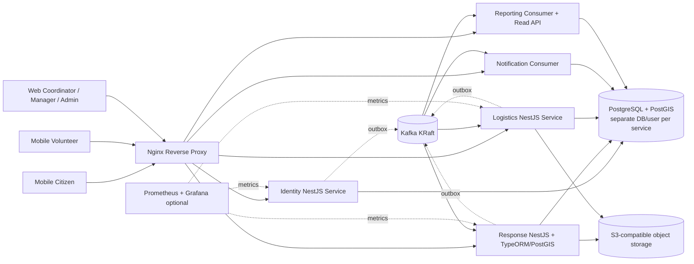
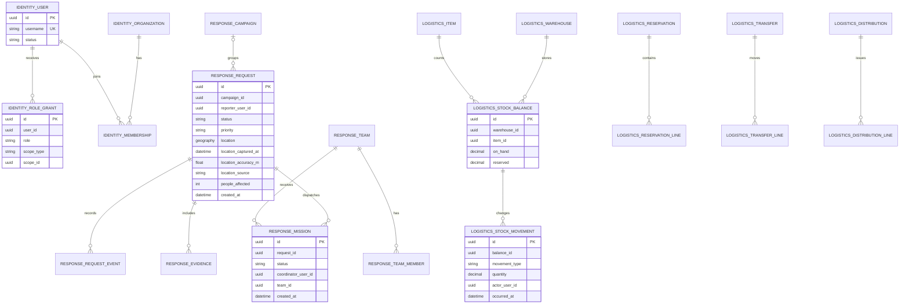
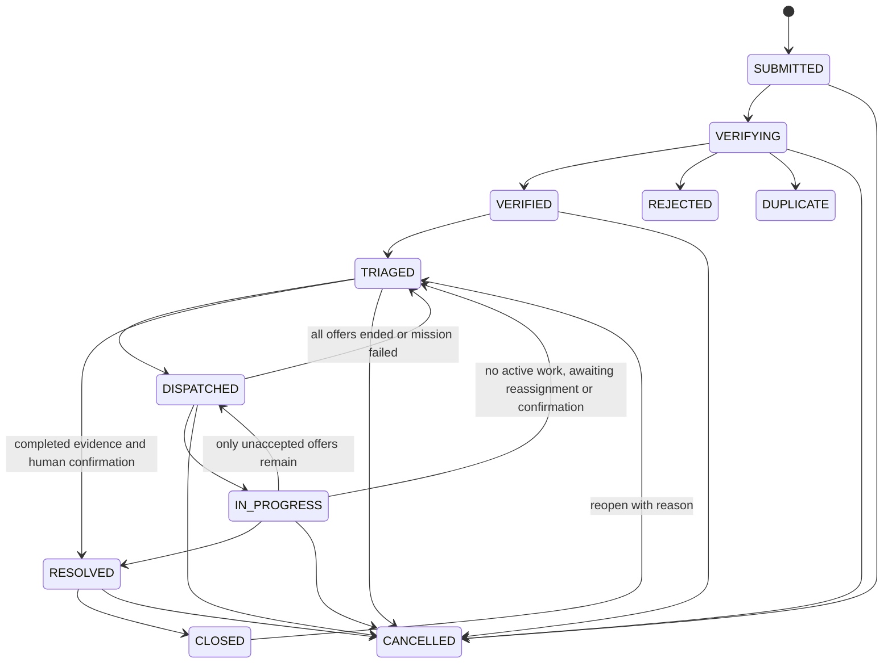
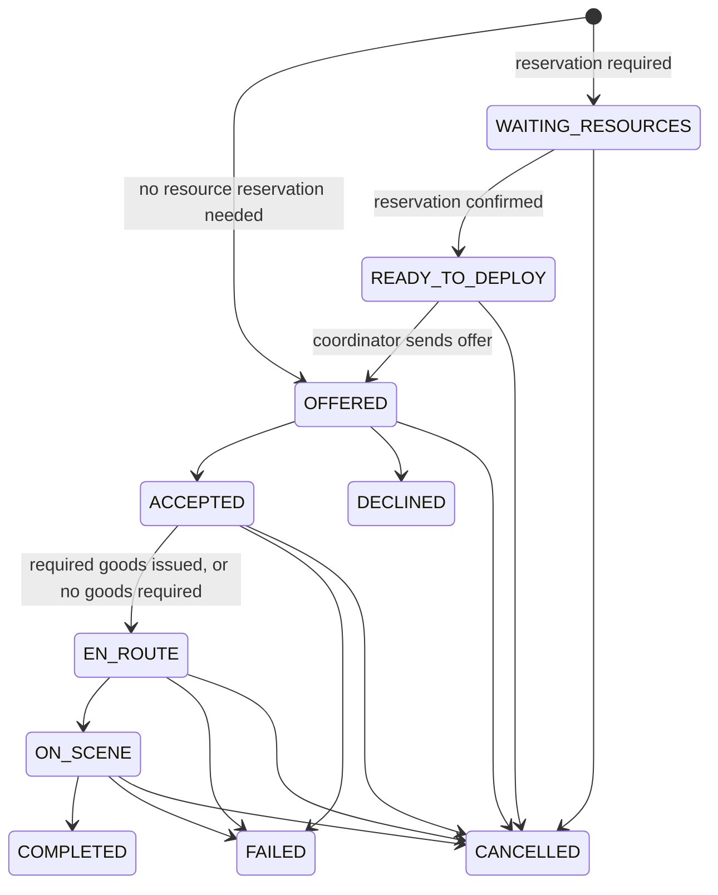
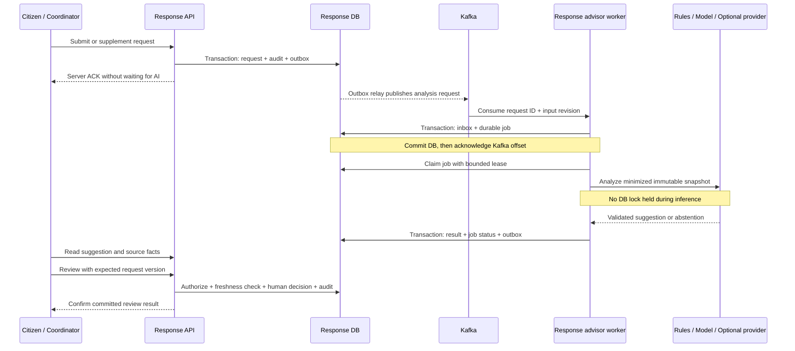
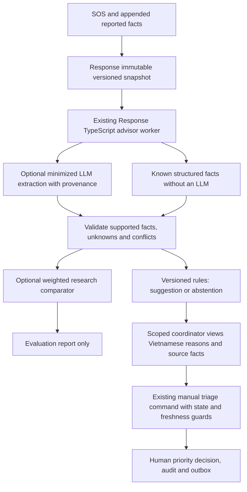

# C48 Technology and Delivery Plan

| Attribute | Value |
|---|---|
| Project | Emergency Response and Disaster Relief Management System |
| Project code | C48 |
| Version | 2.3 — C48-aligned AI blueprint integration and acceptance cases |
| Original research date | 2026-09-29 |
| Duration in the project brief | 10 weeks; three team members |
| Document role | Single technical plan for implementation and further research |

This document provides the technical baseline for the SRS, SDD, database/API design, test cases, and user guide. Proposed technologies, service levels, data policies, and workflows are not thereby approved by a rescue authority.

**For AI implementation and further research:** this is the single plan. Appendix A adds execution guidance and remaining slice-specific contract gates. Section 4.2 compares frameworks; Section 22 defines the solo-backend structure, decision baseline, and implementation gates; Section 12 specifies AI integration; Section 6.3 settles object storage. This plan does not claim implementation benchmarks or executed product tests.

## 1. Reading guide and confidence levels

| Label | Meaning |
|---|---|
| **Project brief** | Requirements consolidated in [c48-project-context.md](c48-project-context.md). |
| **Proposal** | Technical choice or business rule proposed as the capstone baseline. |
| **Needs confirmation** | A question for the supervisor or someone with relevant operational experience. |

OCHA/IFRC materials inform humanitarian workflow design; they do not replace rules issued by competent authorities in Vietnam. OCHA describes a cycle covering analysis, planning, resource mobilization, implementation, monitoring/evaluation, and reporting. [OCHA — Humanitarian Programme Cycle](https://knowledge.base.unocha.org/wiki/spaces/hpc/overview)

## 2. Recommendation summary

| Area | Proposed baseline | Rationale |
|---|---|---|
| Backend | NestJS + TypeScript on a supported Node.js LTS release | Selected after comparing NestJS with Spring Boot, Django/DRF, FastAPI, and Flask; it fits the TypeScript client stack and documents modular services, validation, OpenAPI, and Kafka integration. Pin compatible versions at setup. |
| Database | PostgreSQL + PostGIS, accessed through TypeORM and parameterized SQL for spatial operations | Relational workflows, inventory transactions, and indexed location queries; TypeORM documents PostgreSQL geometry/geography support. [TypeORM PostgreSQL spatial columns](https://typeorm.io/docs/drivers/postgres/) |
| Backend services | Five independently deployable services: Identity, Response, Logistics, Notification, Reporting | Demonstrates boundaries, APIs/events, and data ownership within a ten-week project. |
| Messaging | Apache Kafka KRaft + transactional outbox + idempotent consumers | Supports multiple consumers and replay; no end-to-end exactly-once guarantee is claimed. [Kafka](https://kafka.apache.org/intro/), [transactional outbox](https://docs.aws.amazon.com/prescriptive-guidance/latest/cloud-design-patterns/transactional-outbox.html) |
| Web | React + TypeScript + Vite | Suitable for operational dashboards; authenticated screens do not require SSR/SEO. [Vite guide](https://vite.dev/guide/) |
| Mobile | React Native + Expo + TypeScript | Shares TypeScript skills and supports GPS, photos, and notifications. Request location permission when needed; no default background tracking. [React Native TypeScript](https://reactnative.dev/docs/typescript), [Expo Location](https://docs.expo.dev/versions/latest/sdk/location/) |
| Files | MinIO AIStor Free, single-node lab deployment, through the AWS SDK for JavaScript S3 client | Final capstone choice for synthetic demo data. Obtain/use it under current license terms; do not redistribute software. Free tier has no HA/SLA and excludes at-rest encryption; retain private access and tested backup. |
| Deployment | Docker Compose on one demo host; Nginx reverse proxy | Multiple containers do not require multiple physical machines. [Docker Compose production](https://docs.docker.com/compose/how-tos/production/) |
| Kubernetes | kind learning extension after the Compose end-to-end workflow is stable | Supports the learning goal without blocking the capstone. kind runs local clusters in Docker containers. [kind Quick Start](https://kind.sigs.k8s.io/docs/user/quick-start/) |
| AI | Advisor with explanations; coordinator makes the decision | An optional research direction, with no automatic priority changes or rescue dispatch. |

**Demo scale:** five independent application containers, Nginx, Kafka, PostgreSQL/PostGIS with separate databases/users per service, object storage, and optional Prometheus/Grafana. All can share one machine; five rented servers are unnecessary.

## 3. Problem analysis and business workflow

### 3.1 Risks to address

The project context involves information passing through multiple channels and teams. Validate these risk hypotheses through interviews or surveys:

- Requests may lack location, affected-person count, or observation time.
- Duplicate reports may remain unlinked, distorting statistics or causing repeated dispatch.
- Coordinators may lack visibility into pending verification, accepted missions, and available resources.
- Inventory may diverge across receipts, transfers, reservations, issues, and distributions, with insufficient history to explain differences.
- Weak connectivity may leave a citizen unsure whether the server received an SOS.
- Dashboards may lag or double-count events from multiple sources.
- Broad access permissions may expose sensitive location/contact information.

These are problem hypotheses, not findings about a particular locality or authority.

### 3.2 Target workflow

1. **Intake:** a citizen submits a request with coordinates, accuracy, capture time, and location source. Offline submissions remain pending; only a server acknowledgement (ACK) means received.
2. **Screening:** validate input, use an idempotency key to prevent duplicate submission, and add the request to the operational queue.
3. **Verification:** a coordinator contacts the reporter or adds information. Rejection and duplicate linking require a reason and history.
4. **Prioritization:** a coordinator applies agreed criteria. AI output, if enabled, is supplementary.
5. **Dispatch:** offer a mission to a suitable team. The team accepts/declines and records travel, arrival, and results.
6. **Resource allocation:** Response requests a reservation; Logistics checks available stock. Reservation and physical issue are separate steps.
7. **Outcome confirmation:** the team provides results/evidence; a coordinator confirms whether needs are met. Completing one mission does not automatically close a request with remaining needs.
8. **Monitoring:** Notification delivers updates; Reporting refreshes dashboards and exposes the latest data timestamp.

The workflow references the OCHA cycle conceptually. Validate terminology and responsibilities for this project. [OCHA HPC](https://knowledge.base.unocha.org/wiki/spaces/hpc/overview)

## 4. Technology comparisons

### 4.1 Database and NestJS persistence

| Criterion | PostgreSQL + PostGIS | MySQL 8.4 + InnoDB | MongoDB |
|---|---|---|---|
| Relationships and constraints | Strong fit for users, missions, inventory transactions, and audit | Strong; InnoDB supports transactions and foreign keys | Relationships and cross-entity reporting need more application design |
| GPS/maps | PostGIS spatial operators and GiST indexes; TypeORM maps PostgreSQL geometry/geography to GeoJSON | MySQL has spatial features, but the selected ORM/query path needs more verification | 2dsphere indexes; a document model does not simplify stock-ledger constraints |
| Concurrent inventory updates | Transactions, check/unique constraints, and row locks prevent over-issue | InnoDB supports transactions and locking | Multi-document transactions exist; inventory consistency still needs deliberate rules |
| NestJS integration | PostgreSQL driver and `@nestjs/typeorm`; TypeORM supports spatial column types | TypeORM supported; GIS is not the reason to select it | Nest provides Mongoose integration; not the chosen fit for the relational ledger |
| Decision | **Selected** | Not selected | Not selected as the primary database |

TypeORM is selected because Nest documents a maintained `@nestjs/typeorm` integration and TypeORM's PostgreSQL driver documents geometry/geography columns with GeoJSON exchange. Use migrations, not runtime schema synchronization. Use TypeORM transactions and row locks for inventory; use parameterized SQL/QueryBuilder for spatial predicates such as `ST_DWithin` where repository methods do not express the required operation. Keep SRID, index/operator choice, and geography-versus-geometry explicit. [NestJS database integrations](https://docs.nestjs.com/techniques/database), [TypeORM PostgreSQL spatial columns](https://typeorm.io/docs/drivers/postgres/), [PostGIS spatial indexes](https://postgis.net/documentation/faq/spatial-indexes/)

Prisma is a credible TypeScript alternative with generated types, but PostGIS access uses unsupported/custom-type and raw-query paths. Drizzle is also viable if the team prefers SQL-first queries and verifies migration/spatial needs. Use one ORM across services. The selection is **TypeORM**, subject to an early compatibility spike covering geometry migration, spatial query, and transaction/row-lock behavior on the selected PostgreSQL/PostGIS image. [Prisma unsupported database features](https://www.prisma.io/docs/orm/prisma-schema/data-model/unsupported-database-features), [Drizzle PostgreSQL](https://orm.drizzle.team/docs/get-started-postgresql)

Store points as GeoJSON with longitude, latitude order and SRID 4326; validate ranges before persistence. Consider `geography(Point,4326)` for meter-based radius behavior and geometry for boundaries; validate units/indexes with representative queries. [RFC 7946](https://datatracker.ietf.org/doc/html/rfc7946), [PostGIS spatial indexes](https://postgis.net/documentation/faq/spatial-indexes/)

Inventory writes use short PostgreSQL transactions, deterministic row-lock order, and constraints such as `on_hand >= 0`, `reserved >= 0`, and `reserved <= on_hand`. Do not call Kafka or object storage while holding database locks. Test concurrency against PostgreSQL/PostGIS, not SQLite. [PostgreSQL explicit locking](https://www.postgresql.org/docs/18/explicit-locking.html)


### 4.2 Backend framework evaluation and selection

**Evaluation method:** qualitative comparison against C48's five-service, TypeScript-client, PostgreSQL/PostGIS, Kafka, and ten-week delivery needs, using official documentation reviewed on 2026-09-30. This is not a performance benchmark. NestJS/TypeScript is the selected backend; no Python framework is part of the implementation stack.

| Framework | Strengths relevant to C48 | Integration work and tradeoffs | Assessment |
|---|---|---|---|
| **NestJS (TypeScript/Node.js)** | Modules/providers/guards, TypeScript, OpenAPI and validation integrations, Kafka transport; one language family across backend and clients | ORM/migrations, PostGIS queries, domain authorization, outbox/saga, and operations UI need explicit implementation | **Selected** for five independently deployed services and TypeScript development |
| **Spring Boot (Java/Kotlin)** | Mature application/security/operations ecosystem and Spring for Apache Kafka | Separate JVM language/tooling from clients; strong alternative if the team already has more Spring experience | Technically capable; larger language/tooling switch for this project |
| **Django + DRF (Python)** | Integrated ORM, admin/auth and mature API conventions | Different backend language; Kafka/outbox reliability and domain rules still need explicit work | Capable alternative, not used in this plan |
| **FastAPI (Python)** | Type-oriented validation, generated OpenAPI, async API support | Assemble ORM/migrations, admin, auth, permissions, GIS, and event reliability components | Capable for focused APIs, but adds a language/tooling split |
| **Flask (Python)** | Small core and flexible component selection | More foundational database, schema, authentication, and administration decisions across services | Flexible but adds assembly work and a language/tooling split |

**Evidence:** Nest documents modules/providers, guards, validation, OpenAPI, database integrations, and Kafka transport. Spring documents standalone applications and operational features; Spring for Apache Kafka provides Kafka integration. Django/DRF, FastAPI, and Flask remain capable alternatives with different integration tradeoffs. [NestJS database integrations](https://docs.nestjs.com/techniques/database), [NestJS validation](https://docs.nestjs.com/techniques/validation), [NestJS OpenAPI](https://docs.nestjs.com/openapi/introduction), [NestJS Kafka transport](https://docs.nestjs.com/microservices/kafka), [Spring Boot](https://docs.spring.io/spring-boot/index.html), [Spring for Apache Kafka](https://docs.spring.io/spring-kafka/reference/), [Django overview](https://docs.djangoproject.com/en/5.2/intro/overview/), [FastAPI features](https://fastapi.tiangolo.com/features/), [Flask design](https://flask.palletsprojects.com/en/stable/design/)

**Selection rationale — project-specific:** NestJS matches a TypeScript client/backend workflow and documents patterns for modules, guards, OpenAPI, validation, and Kafka. TypeORM's PostgreSQL spatial types support the GIS baseline. This reduces language/tooling changes while keeping database, authorization, transactions, and events explicit. It does not imply Nest is universally superior or faster.

**Selected implementation choices:** NestJS REST services on the default Express adapter; TypeScript; TypeORM + PostgreSQL/PostGIS; Nest `ValidationPipe` with DTO validation; `@nestjs/swagger` for OpenAPI; Passport/JWT for authentication; Nest Kafka transport/KafkaJS for events; AWS SDK for JavaScript v3 S3 client for MinIO. Pin compatible Node/Nest/dependency versions after the compatibility spike; avoid floating `latest` tags.

Use one repository/workspace for five Nest applications, each with its own bootstrap, environment, image, migration set, database credentials, and deployment. Keep domain models and persistence code inside their owning service. Share only versioned API/event schemas where useful; do not share domain entities or database modules across services.


### 4.3 Web, mobile, and API

| Channel | Proposal | Scope |
|---|---|---|
| Web | React + TypeScript + Vite; React Router; TanStack Query for server state | Dashboard, map/queue, verification/triage, missions, inventory, reports, admin |
| Mobile | React Native + Expo + TypeScript | Citizen SOS/status tracking; volunteer missions/progress; foreground GPS and photos |
| API | REST/JSON /api/v1; per-service OpenAPI through `@nestjs/swagger` | Web/mobile contracts, mocks, and API checks |
| Maps | Separate map UI from business logic; PostGIS queries; select tile/geocoding provider after license, quota, and privacy review | Do not send incident descriptions or personally identifiable information (PII) to map providers |

Emergency screens should minimize steps, provide accessible controls, clearly show submission status, and allow a manual pin when GPS is denied or inaccurate. Do not enable background tracking by default. Expo permissions depend on platform and access type. [Expo Location](https://docs.expo.dev/versions/latest/sdk/location/), [Expo permissions](https://docs.expo.dev/guides/permissions/)

### 4.4 Kafka versus a simpler queue

| Option | Appropriate when | C48 decision |
|---|---|---|
| Kafka | Multiple consumers, replay, reporting projections, learning event-driven services | **Selected** for integration events |
| RabbitMQ/job queue | Background tasks/retries without replaying an event stream | Simpler for isolated jobs, but less aligned with the replay and multi-consumer integration goals |

Kafka ordering is per partition, not global. Use the aggregate ID as the message key to place changes for the same request/mission in the same partition. Messages may be redelivered; consumers must be idempotent. Do not promise exactly-once processing across databases, Kafka, push providers, and reporting. [Kafka introduction](https://kafka.apache.org/intro/), [Kafka delivery semantics](https://kafka.apache.org/40/design/design/)

### 4.5 Service decomposition

| Model | Benefits | Cost/risk | Assessment |
|---|---|---|---|
| NestJS modular monolith + workers | Fewer deployments/databases, simpler transactions, easier MVP delivery | Less explicit independent deployment and data ownership | Fallback if the schedule slips |
| Five services with bounded contexts | Independent boundaries, databases, APIs, and events; feasible on one host | Cross-service auth, outbox, eventual consistency, and saga testing | **Selected for explicit service ownership and deployment boundaries** |
| Eight or more small services | Finer ownership/scaling possibilities | More contracts, containers, integration tests, and operational failures | Not selected |

Each service has its own image/deployment, database credentials, OpenAPI/event contracts, and no direct access to another service's tables. Sharing a host/PostgreSQL server for the demo preserves logical boundaries but creates a shared failure domain.

## 5. Proposed architecture

### 5.1 Diagram



Nginx routes traffic; each service still authenticates and authorizes requests. Producers write to the outbox in the business transaction; a relay publishes afterward.

### 5.2 Boundaries and data ownership

| Service | Authoritative data/logic | Main APIs | Representative events |
|---|---|---|---|
| **Identity** | Accounts, credentials, organizations, memberships, scoped role grants | Login/refresh/logout, user/role management | identity.user.created, identity.role.changed, identity.account.disabled |
| **Response** | Campaign/incident, SOS/requests, verification/priority, teams/volunteers, missions/progress, evidence metadata | Submit, verify/triage, assign, transition, map queries | response.campaign.activated/closed, response.request.submitted/verified/triaged, response.mission.assigned/status_changed/completed |
| **Logistics** | Warehouses, items, stock balances/ledger, campaign reference projection, reservations, transfers, vehicles, relief points, distributions | Receipt/issue/transfer/reservation/distribution | logistics.stock.reserved/rejected/issued, logistics.transfer.received, logistics.distribution.recorded |
| **Notification** | Device destinations, templates, delivery attempts, retries, in-app notifications | User notifications, mark read, operational retries | Delivery status events if needed by a consumer |
| **Reporting** | Dashboard projections/read models; no authoritative business data | Campaign/time/region aggregates, export | Primarily a consumer |

Boundary rules:

- Each service has a separate database/user; the demo may share one PostgreSQL server. No cross-service foreign keys or table queries.
- External user/campaign/warehouse IDs are opaque UUID references. Validate them through APIs, events, or projections.
- Response owns Campaign/Incident; Logistics owns inventory/distribution referenced by campaign ID; Reporting joins event-derived projections.
- Requests and missions share the Response database for local state/assignment transactions. Inventory belongs to Logistics; cross-domain workflows use a saga.
- Reporting may lag and must show its generated time. Operational decisions use authoritative Response/Logistics data.

### 5.3 Events, outbox, and retries

```json
{
  "event_id": "uuid",
  "event_type": "response.request.triaged",
  "schema_version": 1,
  "occurred_at": "2026-09-29T10:30:00Z",
  "producer": "response",
  "aggregate_type": "assistance_request",
  "aggregate_id": "uuid",
  "aggregate_version": 4,
  "correlation_id": "uuid",
  "data": {"campaign_id": "uuid", "priority": "P1", "region_code": "..."}
}
```

Do not include phone numbers, free text, signed URLs, or exact coordinates unless the consumer needs them. An event is not a full database row copy. Use explicit schema versions; a versioned JSON envelope is sufficient for the capstone.

1. Write business state, audit/domain events, and the outbox inside one transaction.
2. The relay publishes pending entries and then marks them published. A crash between those steps can cause redelivery.
3. A consumer records the event ID in a uniquely constrained inbox in the same transaction as its projection/database side effect.
4. Duplicates must not create another notification, stock movement, or report row. Retry temporary failures with backoff; route poison events to a dead-letter queue (DLQ) for inspection/replay.
5. Monitor outbox age, consumer lag, retries, and DLQ count.

Outbox prevents committed business data from losing its event intent. Duplicate delivery remains possible and requires idempotent consumers. [AWS transactional outbox](https://docs.aws.amazon.com/prescriptive-guidance/latest/cloud-design-patterns/transactional-outbox.html)

Schema Registry, Avro, Debezium/CDC, a service mesh, a CQRS framework, and a workflow engine are outside the baseline. Add them only for a demonstrated need.

### 5.4 Mission resource-reservation saga

1. A coordinator creates/assigns a mission in Response. If goods are required, the mission starts in WAITING_RESOURCES.
2. Response records ReservationRequested in its outbox.
3. Logistics consumes the event, locks balances, checks available stock, and atomically creates or rejects the reservation. The result goes through its outbox.
4. A confirmed reservation moves the mission to READY_TO_DEPLOY. The coordinator sends the team an offer, moving the request to DISPATCHED. Team acceptance moves the request to IN_PROGRESS. Rejection leaves the mission WAITING_RESOURCES so the coordinator can change warehouse/quantity or cancel.
5. Physical issue creates an ISSUE movement and changes the reservation to ISSUED. A supply-dependent mission cannot enter EN_ROUTE until Response has confirmed all required lines were issued through a Logistics result or authenticated reconciliation. Terminal missions release unissued reservations; already-issued goods require distribution/return/loss settlement, never deletion of movements.
6. Returned goods create a RETURN movement after physical verification/counting.

If a mission is cancelled while reservation processing is pending, Response records cancellation/release intent. A late reservation confirmation must trigger a release compensation; retries remain idempotent and must not leave an orphaned reservation.

This is a workflow with multiple local transactions and compensating actions, not a distributed transaction. Intermediate states and timeouts must be visible to coordinators.

## 6. Data model and integrity

### 6.1 Logical ERD by service



Each mission has exactly one team; additional teams receive separate missions under the same request. A request may have no campaign until a scoped coordinator attaches it to an ACTIVE campaign. Diagram relationships are local to a service. External user/campaign IDs are logical UUID references, with no cross-database foreign keys. Implementation still requires complete timestamps, audit fields, indexes, unique constraints, migrations, and retention policies.

### 6.2 Core entities

| Database | Minimum tables/entities |
|---|---|
| Identity | User, Organization, controlled Region catalog, Membership, RoleGrant, account status, RefreshSession with rotation/revocation, AuditRecord, Outbox |
| Response | Campaign, Incident, RegionBoundary referencing the controlled region code, AssistanceRequest with organization_id and nullable region/campaign, RequestEvent, RescueTeam, TeamMember with opaque user ID, VolunteerProfile, Mission with one team_id, EvidenceMetadata, Outbox, Inbox; optional AnalysisSnapshot, AnalysisJob, TriageRecommendation, RecommendationReview (Section 12) |
| Logistics | Warehouse, Item, StockBalance, StockMovement, CampaignReference projection, Reservation/lines, Transfer/lines, Distribution/lines, IssuedLineSettlement, TransferTransitLine, Vehicle, ReliefPoint, Outbox, Inbox |
| Notification | DeviceEndpoint, Notification, DeliveryAttempt, retry state, Inbox |
| Reporting | Inbox, PendingProjectionEvent, RequestDailyMetric, CampaignSnapshot, StockSnapshot, ProcessingTimeMetric, watermark/offset; create only projections used by the dashboard |

Define the Identity user entity and migration before other services rely on its contract; external services store opaque user UUIDs rather than duplicating credentials.

### 6.3 GPS and evidence files

- Coordinates use WGS84/SRID 4326; GeoJSON order is longitude, latitude. Validate longitude within -180..180, latitude within -90..90, and nonnegative accuracy. [RFC 7946](https://datatracker.ietf.org/doc/html/rfc7946)
- Store capture time, accuracy in meters, source (GPS, manual pin, geocoded), and server receive time separately. Device-reported accuracy is not a guarantee of field accuracy.
- Store a location snapshot with the SOS. Add location history only for an explicit requirement; continuous background tracking is outside the MVP.
- Scope map queries by authorization, region/time/status/bounding box. Do not expose all PII through map responses.
- Store files in object storage. The database holds object key, owner type/ID, validated MIME, size, checksum, uploader, time, and visibility. Keep buckets private; use short-lived signed URLs if direct access is used.
- Validate actual MIME, extension, and size; do not trust client-provided names/MIME. Uploads require authorization on the owning business object.
- Demo data must be synthetic; do not use real victims' images or personal information.
- Use the AWS SDK for JavaScript v3 S3 client from the owning NestJS service. Configure separate service credentials and private buckets for Response and Logistics. Unit tests may mock S3; provider integration and restore checks must use the selected MinIO AIStor Free lab instance.

#### Selected object storage: MinIO AIStor Free

**Final choice for this capstone: MinIO AIStor Free, single-node lab deployment, using synthetic data.** MinIO Community is not selected: its repository is archived and marked unmaintained. AIStor Free is a separate proprietary product; its agreement allows standalone educational/research use, and its operations documentation sets edition-specific limits. This is a lab choice, not a production recommendation. No MinIO artifact/license, application integration, or restore test has been installed or verified as part of this plan. [Community repository](https://github.com/minio/minio), [AIStor Free agreement](https://www.min.io/legal/aistor-free-agreement), [AIStor license operations](https://docs.min.io/aistor/operations/licenses/)

| Decision | C48 baseline |
|---|---|
| Product/edition | MinIO AIStor Free; do not substitute a Community image or third-party rebuild |
| Topology/data | One node for the lab; synthetic demo data only; no HA or production availability claim |
| License/package | Operators must obtain and use the product under the current agreement and active license. Do not modify or redistribute the AIStor binary/image or license in the repository/submission unless the applicable terms expressly allow it. Record the exact release and license validity before the demo. |
| Free-tier limits | Do not rely on distributed deployment, replication, lifecycle transitions, version-specific deletion, encryption at rest, or an SLA/SLO. The current docs state AIStor Free support begins with `minio.RELEASE.2025-12-20T04-58-37Z`; recheck the requirement against the release chosen for setup. |
| Application integration | Private S3 API; AWS SDK for JavaScript v3; separate least-privilege Response and Logistics credentials/buckets; no blanket access for other services |

Use backend-mediated uploads through the owning NestJS service for the first implementation. Authorize the business object, persist attachment state as PENDING in a short database transaction, validate and stream bounded content to a generated immutable key outside the transaction, then record READY in a second short transaction. On failure, preserve the SOS and expose a retryable FAILED/PENDING attachment; reconcile crashes between object upload and metadata commit. Enforce extension/type/size rules using detected content, not client MIME or filename. Do not hold database locks during S3 calls or claim a cross-database/object-store atomic transaction. [AWS SDK for JavaScript S3 client](https://docs.aws.amazon.com/AWSJavaScriptSDK/v3/latest/client/s3/), [OWASP file upload guidance](https://cheatsheetseries.owasp.org/cheatsheets/File_Upload_Cheat_Sheet.html)

Keep buckets private and store only object metadata (owner, generated key, detected MIME, size, checksum, uploader, timestamps, visibility/state) in PostgreSQL. Do not persist object bytes or signed URLs in PostgreSQL, Kafka, logs, analytics, or reports. Authorize each download against the current business object before creating a short-lived signed URL; use a hostname reachable from the backend, browser, and physical mobile device. A signed URL remains a bearer capability until it expires, so document that revocation window or proxy downloads when immediate revocation is required. Direct client uploads are outside the initial scope: presigned upload URLs can be reused and can replace an existing key until expiry. [S3 presigned URL behavior](https://docs.aws.amazon.com/AmazonS3/latest/userguide/using-presigned-url.html)

Back up owning-service database metadata and object bytes together, with a manifest of keys, sizes, and checksums. Keep a backup outside the demo host; test restoration in an isolated environment and verify scoped download/denied access after restore. A PostgreSQL dump or a volume beside the original objects alone is not a verified backup. No backup/restore test has been executed yet.

### 6.4 Inventory and audit

- StockMovement is append-only: RECEIPT, RESERVE, RELEASE, ISSUE, TRANSFER_OUT, TRANSFER_IN, RETURN, ADJUSTMENT.
- StockBalance is the current balance/projection, updated in the same transaction as its movement; available = on_hand - reserved.
- Constraints: on_hand ≥ 0, reserved ≥ 0, reserved ≤ on_hand; quantities are positive and units match the item. Adjustments require actor, reason, and permission.
- Enforce a unique warehouse/item pair for StockBalance. Lock multiple item balances in a stable ID order to prevent duplicate updates and reduce deadlocks.
- Destination receipt is a separate transfer step. Creating a transfer alone does not increase destination stock.
- Distribution records item, quantity, warehouse/relief point, campaign, time, and actor. Do not require beneficiary names/identity documents without an approved need.
- Use unique/idempotency keys for receipt/issue/distribution retries and row locks to prevent concurrent over-issue.

## 7. System requirements

For FR priorities, **M** means required for the core demo, **S** means should have if time permits, and **O** means optional extension. These are proposed priorities, not classifications in the original brief.

### 7.1 User Requirements (UR)

| ID | Actor | Need |
|---|---|---|
| UR-01 | Citizen | Submit an SOS/request with location, affected-person count, and incident information; receive confirmation of server receipt. |
| UR-02 | Citizen | Track progress, add information, and understand rejection, duplicate, or closure reasons. |
| UR-03 | Coordinator | Verify, link duplicates, prioritize, view maps, and assign suitable teams. |
| UR-04 | Volunteer/team | Access assigned missions only; accept/decline, update progress, and submit outcome evidence. |
| UR-05 | Operations manager | Manage campaigns, warehouses, vehicles, relief points, reservations, transfers, issues, and distributions with traceability. |
| UR-06 | Admin/manager | Manage accounts/scoped permissions and view operational dashboards/reports. |
| UR-07 | Operations team | See pending submissions, delayed/failed consumers, dashboard freshness, and recovery procedures. |

### 7.2 Functional Requirements (FR)

| ID | Priority | Proposed functional requirement | Verification criterion |
|---|---:|---|---|
| FR-IAM-01 | M | Citizen registration, login, refresh/logout, account disabling, and credential changes | Invalid/expired tokens or disabled accounts receive 401; logout invalidates the refresh session |
| FR-IAM-02 | M | Organization/region/campaign-scoped roles; action and object checks | Citizens cannot access another citizen's request; volunteers see their team's missions only |
| FR-IAM-03 | M | Admin account, organization, and role management with least privilege | Permission changes record actor/time and before/after values |
| FR-REQ-01 | M | Create requests with category, short description, headcount, location/manual pin, time/source | Validate input; return an identifier and server receive time |
| FR-REQ-02 | M | Authenticated citizens submit and track SOS; guest endpoints disabled in capstone | Registration grants CITIZEN only; unauthenticated creation/tracking is denied |
| FR-REQ-03 | M | Idempotent SOS creation retries | Same key/payload creates no second row; same key with different payload is rejected |
| FR-REQ-04 | M | Verify, reject, and duplicate-link; rejection/duplicate decisions require reasons | Preserve duplicate requests and link them to a canonical request |
| FR-REQ-05 | M | Manual P1–P4 priority with actor/time/reason and override history | Priority is separate from status; AI cannot change it automatically |
| FR-REQ-06 | M | Scoped list/map filtering by bbox/region, status, priority, and time | Apply authorization filters before pagination |
| FR-REQ-07 | M | Citizens view timelines and supplement their own requests in permitted states | Owner-only access; supplements record actor/time |
| FR-MSN-01 | M | Manage teams, skills, availability, and members through opaque user IDs | Reject inactive/unavailable teams or missing mandatory skills |
| FR-MSN-02 | M | Create missions, offer/assign, accept/decline, transition, and record results | Only valid transitions; record actor/time/reason |
| FR-MSN-03 | M | One request may have multiple missions; one mission belongs to one request and one team in the MVP | One completed mission does not close a request with remaining needs |
| FR-MSN-04 | M | Request/mission evidence uploads and coordinator outcome confirmation | Metadata and download access follow object scope |
| FR-CAM-01 | M | Response manages campaigns/incidents, operating regions, time, and status | Scoped creation/editing; Logistics stores campaign references |
| FR-LOG-01 | M | Manage warehouses, items, vehicles, relief points, and campaign references where needed | Active/inactive entities; preserve existing history |
| FR-LOG-02 | M | Receipts, transfers, receipt confirmation, reserve/release, issue, return, adjustment | Ledger records actor/time/quantity/reason; balances never negative |
| FR-LOG-03 | M | Mission stock reservations through a Response–Logistics saga | Idempotent results; observable intermediate states/timeouts |
| FR-LOG-04 | M | Distribution by campaign, point, item, quantity, and actor | Retries never duplicate a distribution |
| FR-NOT-01 | M | In-app request/mission notifications; push/email are extensions | Notification failure never rolls back SOS/mission changes; persist retry state |
| FR-RPT-01 | M | Dashboard by state/priority/region/campaign, lead time, stock/distribution | Matches the test dataset; exposes watermark/update time |
| FR-RPT-02 | S | Scoped CSV export with role-based PII masking | No unauthorized fields; audit sensitive exports |
| FR-AUD-01 | M | State, decision, adjustment, distribution, and role-change history | No passwords/tokens in audit; restricted readers |
| FR-EVT-01 | M | Atomic business/outbox writes, relay/retry, consumer deduplication | Relay outages do not lose committed events; replay does not repeat side effects |
| FR-FILE-01 | M | Private uploads, size/type validation, metadata, controlled downloads | Reject forged MIME/oversize files; expired links cannot download |
| FR-OFF-01 | S | Offline SOS drafts and retry with the same idempotency key | Distinguish QUEUED_ON_DEVICE from SUBMITTED |
| FR-AI-01 | O | AI/rule suggestions with factors/version and coordinator acceptance/override; optional detailed requirements FR-AI-02..06 in Section 12.8 | No automatic dispatch/priority overwrite; core works with AI disabled |

### 7.3 Non-functional Requirements (NFR)

The brief specifies no numeric thresholds. The numbers below are initial targets for supervisor/team confirmation.

| ID | Quality | Proposed requirement/criterion |
|---|---|---|
| NFR-SEC-01 | Security | Require authentication by default; public guest SOS only if approved. Services enforce scope and never trust client-supplied roles. |
| NFR-SEC-02 | Security | Filter list querysets by authorization; enforce detail/action object permissions, input/file validation, and suitable rate limits. route-level guards do not automatically scope returned rows; test object and list authorization separately. [NestJS guards](https://docs.nestjs.com/guards), [NestJS validation](https://docs.nestjs.com/techniques/validation) |
| NFR-SEC-03 | Security | Do not log tokens, passwords, signed URLs, or unnecessary exact locations; HTTPS outside local development. |
| NFR-PRV-01 | Privacy | Exact locations are accessible only to the subject, scoped coordinators, and assigned teams; reports aggregate by default. Retention needs confirmation. |
| NFR-REL-01 | Reliability | Nonnegative inventory, valid states, idempotent retries, consumer recovery, and backup restoration checks. |
| NFR-PERF-01 | Performance | Discussion target: 10,000 requests and 20 concurrent users in the demo; common read API p95 ≤ 2 seconds; SOS creation p95 ≤ 3 seconds excluding upload. Record measurement hardware. |
| NFR-PERF-02 | Performance | Spatial indexes/bbox/result limits for maps; dashboard watermark instead of an unqualified real-time claim. |
| NFR-UX-01 | Usability | Few SOS steps, usable controls, clear submission status, manual pin, understandable GPS errors. |
| NFR-OFF-01 | Weak connectivity | If an offline queue is implemented, retries are idempotent; no continuous background location synchronization. |
| NFR-OBS-01 | Operations | Health/readiness, correlation IDs, latency/error metrics, outbox age, Kafka lag, DLQ, DB connections/disk. |
| NFR-OPS-01 | Recovery | Document DB/object metadata backup and perform a demo restore; define RPO/RTO when real requirements exist. |
| NFR-COMP-01 | Compatibility | Versioned API/OpenAPI, controlled migrations, UTC backend, configurable UI timezone. |
| NFR-TEST-01 | Testing | State, object-permission, inventory-race, duplicate-event, outage/replay, and end-to-end tests; coverage threshold remains open. |
| NFR-L10N-01 | Language — confirmed | All Web/Mobile user-facing content and backend human-readable messages are Vietnamese, including errors, notifications, and displayed AI explanations. Stable machine codes/fields remain English. Technical documents remain English. |

## 8. Business rules and state machines

### 8.1 Assistance Request



- Priority is separate from status. Draft taxonomy: P1 immediate danger, P2 very urgent, P3 assistance needed, P4 informational/nonurgent. Confirm definitions; do not imply a guaranteed SLA.
- Verification is required before triage/dispatch under this baseline.
- REJECTED requires a reason; DUPLICATE requires a canonical request ID and reason. Preserve both records.
- A WAITING_RESOURCES mission alone leaves the request TRIAGED; it never demotes progress from another active mission. Offering new work gives DISPATCHED only when no accepted work remains.
- DISPATCHED means a mission offer has been sent; IN_PROGRESS starts when the first team accepts.
- Recompute dispatch progress in the same Response transaction as a mission transition: any ACCEPTED/EN_ROUTE/ON_SCENE mission preserves IN_PROGRESS; otherwise any OFFERED mission gives DISPATCHED; otherwise the request returns to TRIAGED unless a coordinator has confirmed RESOLVED/CLOSED/CANCELLED. Completed missions remain evidence for human resolution, never an automatic closure. Section 22 specifies cancellation and reopen guards.
- A coordinator confirms RESOLVED when needs are met; CLOSED is administrative completion. Mission completion never closes a request automatically.
- Only scoped coordinators may reopen/cancel, with reason/audit and explicit handling of active missions.
- Canonical requests with inbound duplicate links cannot become DUPLICATE, REJECTED or CANCELLED; lock and recheck links as defined in UC-02 and Section 22.2.

### 8.2 Mission



- DECLINED, FAILED, CANCELLED, and COMPLETED terminate a mission; reassignment creates a new mission/assignment.
- Every terminal transition records durable cleanup intent for unissued reservations in the same Response transaction. Late reservation confirmations still trigger release; issued goods remain an outstanding settlement until physically distributed, returned, or recorded lost.
- Team members view assigned missions; only the active leader accepts/declines, advances and submits results/evidence. Scoped coordinators oversee missions and may cancel/fail with reason.
- Store transition actor/time, reason, note, and evidence references. Location updates are optional, without background tracking.
- Multiple missions can serve one request; a coordinator confirms the overall outcome before resolution.

### 8.3 Inventory and transfers

```text
Reservation: REQUESTED -> RESERVED -> ISSUED
                    |         |-> RELEASED
                    +-> REJECTED
                    +-> RELEASED (release tombstone before reservation confirmation)

Transfer: DRAFT -> RESERVED -> IN_TRANSIT -> RECEIVED
             |         |          |-> RECONCILED (received + returned + lost)
             +---------+-> CANCELLED (before dispatch only)
```

- Commands check state and permission; clients cannot arbitrarily PATCH status.
- on_hand represents stock held; reserved represents stock allocated; available = on_hand - reserved.
- ISSUE from a reservation reduces on_hand and reserved. RELEASE reduces reserved without increasing on_hand.
- Dispatch decreases source on_hand and reserved once and creates in-transit quantities. Receipt credits only physically received quantities at the destination. After dispatch, cancellation is prohibited; verified return credits the source, and authorized loss reconciliation removes transit quantity with reason/audit. Each line satisfies dispatched = received + returned + lost + remaining_in_transit. Both warehouses belong to Logistics; short local transactions lock affected balances in stable order.
- Adjustments require reason, actor, and audit; never edit/delete old ledger entries to force a balance to match.

### 8.4 General rules

- Server UTC is the audit timestamp; keep client capture time separately.
- Commands use idempotency; expected state/version checks prevent stale updates.
- Do not hard-delete requests, missions, or stock movements with activity; use state/archive according to policy.
- Priority/AI overrides, rejection, mission cancellation, stock adjustments, and role changes require actor/time/reason.
- Response owns campaigns. Lifecycle: DRAFT → ACTIVE; ACTIVE → PAUSED; PAUSED → ACTIVE; DRAFT/ACTIVE/PAUSED → CLOSED. Scoped coordinators/managers execute commands with version checks and reasons for pause/close. Only ACTIVE campaigns accept new attachments. SOS creation never requires an existing campaign. Closure is blocked while linked requests are nonterminal; Logistics returns/settlements remain allowed. Section 22 defines resource-command validation.

## 9. Main use cases

### UC-01 — Submit an SOS/assistance request

**Actor:** Authenticated citizen.

**Preconditions:** Citizen signed in; GPS available or user supplies a manual pin.

**Main flow:** Select assistance category → enter headcount/information → confirm location/accuracy → optionally attach photos → submit with idempotency key → server validates and writes request/event/outbox → returns request ID and SUBMITTED → Notification delivers confirmation → citizen views timeline and supplements information when state permits.

**Exceptions:** Offline submissions stay QUEUED_ON_DEVICE and are not server-received; denied GPS permits manual pin; validation errors preserve the form; the same key returns the same request on retry.

**Postconditions:** Exactly one request record with server receive time; asynchronous event relay.

### UC-02 — Verify and triage

**Actor:** Scoped coordinator.

**Preconditions:** Request exists and is not terminal.

**Main flow:** Open scoped queue/map → start VERIFYING → supplement/contact → choose exactly one outcome: VERIFIED, REJECTED with reason, or DUPLICATE with canonical reference/reason. Only VERIFIED proceeds to human triage with priority/reason. Each command writes state/event/audit atomically.

**Duplicate guard:** Canonical target must be a different authorized, non-DUPLICATE/non-REJECTED/non-CANCELLED request. A request already referenced as canonical cannot itself become DUPLICATE, REJECTED or CANCELLED; linkers and those transitions lock the affected request rows in sorted ID order and recheck inbound links. Do not create chains or cycles. Preserve the original report and its history; the demo does not reparent duplicate links.

**Exceptions:** Reject out-of-scope actions; return conflict if state changed; duplicates require a canonical link.

**Postconditions:** Priority remains separate from status; the dashboard updates after consumer processing.

### UC-03 — Assign and accept a mission

**Actors:** Coordinator and active team leader; other volunteers have read access to their team's assignments.

**Preconditions:** Request verified/triaged; team active; coordinator authorized for the scope.

**Main flow:** Select by team/skills/scope/availability → await reservation saga if needed → offer assignment → notify → active team leader accepts → confirm physical issue of required goods → EN_ROUTE → ON_SCENE → results/evidence → coordinator confirms the request outcome. Resource-free missions skip the issue check.

**Exceptions:** Select another team if declined/unavailable; terminal transitions trigger reservation cleanup. Concurrent assignments use version/transaction checks and conflicting commands reload. PAUSED campaigns block offers/acceptance; already accepted missions may continue under Section 22.3, including validated issue of their existing reservation.

**Postconditions:** Consistent mission/request history; only a coordinator confirms resolution.

### UC-04 — Reserve, issue, and distribute goods

**Actors:** Operations manager/warehouse operator; Response emits reservation events.

**Preconditions:** Warehouse/item active; stock may be available.

**Main flow:** Check available → reserve → confirm physical issue → record movement/actor → record point/campaign/distribution → dashboard receives events.

**Exceptions:** Reject reservations for insufficient stock; retries do not duplicate; cancellation before issue releases; after issue, returns require new movements.

**Postconditions:** Balance matches the ledger; dashboard includes a timestamp.

### UC-05 — Dashboard/reports

**Actors:** Scoped coordinator/manager/admin.

**Main flow:** Select time/region/campaign → Reporting returns aggregates and last-updated time → UI displays scope → export if authorized.

**Exceptions:** Consumer lag displays a stale warning; unauthorized export is denied/audited; no-data results follow an agreed convention.

**Postconditions:** No unauthorized PII exposure; projections never modify authoritative business data.

### UC-06 — Manage accounts and permissions

**Actors:** Admin; citizen registering an account; invited staff/volunteer.

**Main flow:** A citizen registers with a unique normalized username and password and receives CITIZEN only. Admin creates staff/volunteer accounts, disables accounts, or grants role/scope → Identity records audit/event → services apply policy → UI exposes permitted functions. Registration never accepts privileged roles or scopes from the client. Email/SMS verification and self-service password recovery are outside the initial provider-free demo; admin-assisted reset revokes sessions and requires a password change.

**Exceptions:** Cannot remove the last administrator; disabled accounts cannot refresh tokens; existing access tokens are rejected through the current-session check described in Section 22.

**Postconditions:** All APIs enforce backend authorization; hidden UI controls are not a security boundary.

### UC-07 — AI-assisted priority suggestion (extension)

**Actor:** Coordinator.

**Main flow:** Response persists an immutable minimized snapshot/job intent → asynchronous advisor returns versioned suggestion or abstention → coordinator inspects facts/reasons → authorized review checks freshness, request version, and verified/eligible state → human accepts or overrides with reason → atomic audit/priority/outbox write. See Section 12 for job, API, and failure contracts.

**Exceptions:** Timeout/failure leaves manual triage available; insufficient or unsupported data yields abstention; stale input, competing review, wrong scope, or ineligible state rejects acceptance. AI cannot change priority itself.

**Postconditions:** Official priority changes only through coordinator action.

### UC-08 — Create and manage a relief campaign

**Actors:** Coordinator or operations manager with campaign scope.

**Preconditions:** Authenticated user with region/organization management permission.

**Main flow:** Create campaign name/objective/region/time → persist in Response → activate → attach requests → Logistics references the campaign ID in reservations/distributions → manager pauses/closes when permitted.

**Exceptions:** Closed campaigns cannot accept new requests; returns/settlements remain possible; reject invalid campaign IDs; closure preserves ledger/request history.

**Postconditions:** Response is authoritative for campaign status; Logistics/Reporting hold references/projections only.

## 10. API and authentication

### 10.1 API conventions

- Base path /api/v1; REST/JSON; UUID identifiers; ISO-8601 UTC timestamps; bounded pagination/filters; consistent errors with code, message, field errors, and correlation ID.
- Separate per-service OpenAPI schemas with shared terminology, pagination, error envelope, and event definitions.
- Explicit business command endpoints for transitions, rather than unrestricted status PATCH.
- Significant side-effecting POST commands accept Idempotency-Key; state updates check expected state/version inside the transaction.
- Generate per-service OpenAPI with `@nestjs/swagger` and review/version the published contract. [NestJS OpenAPI](https://docs.nestjs.com/openapi/introduction)

### 10.1.1 Vietnamese user-facing responses

**Confirmed product requirement:** human-readable API messages are Vietnamese, including validation, authentication/permission failures, business conflicts, upload failures, and notifications. JSON field names, error codes, enum values, event names, and URLs remain stable machine identifiers. Clients use codes for logic and Vietnamese labels for display; do not parse message text.

Example error envelope:

```json
{
  "code": "REQUEST_VERSION_CONFLICT",
  "message": "Yêu cầu đã được cập nhật. Vui lòng tải lại trước khi tiếp tục.",
  "field_errors": {},
  "correlation_id": "uuid"
}
```

Implement a centralized NestJS exception filter and `ValidationPipe` exception factory that map stable validation/auth/business error codes to reviewed Vietnamese messages. Do not return class-validator or provider error strings directly. Set the API locale to Vietnamese regardless of `Accept-Language`; workers use the same Vietnamese message catalog outside HTTP request context. [NestJS validation](https://docs.nestjs.com/techniques/validation), [NestJS exception filters](https://docs.nestjs.com/exception-filters)

Backend responses may contain user-entered text unchanged. Do not translate names, original reports, opaque IDs, or machine codes. Map internal AI reason codes to Vietnamese explanations; optional LLM summaries must satisfy the same language requirement before display, otherwise show a reviewed Vietnamese fallback.

### 10.2 Endpoint sketches

| Service | Example endpoints | Authorization/notes |
|---|---|---|
| Identity | POST /identity/auth/register, /login, /refresh, /logout; GET /identity/me; POST /identity/users/{id}/roles | Admin-only role grants; no PII/location in tokens |
| Response | POST /response/requests; GET /response/requests; POST /response/requests/{id}/verify, /triage, /duplicate; POST /response/requests/{id}/missions | Authenticated citizen intake; scope list/detail access; no guest route |
| Response | POST /response/campaigns; GET /response/campaigns; POST /response/campaigns/{id}/close | Response owns campaign/incident; managers need appropriate scope |
| Response | POST /response/missions/{id}/accept, /decline, /transition, /evidence | Active team leader accepts/declines, advances and uploads evidence; scoped coordinator may cancel/fail |
| Logistics | POST /logistics/receipts, /transfers, /transfers/{id}/receive, /distributions, /adjustments | Idempotency, audit, unit validation, row locks |
| Logistics | GET /logistics/stock?warehouse_id=...; /vehicles; /relief-points | Warehouse/region scope |
| Notification | GET /notifications; POST /notifications/{id}/read | Recipient-only access/marking |
| Reporting | GET /reports/campaigns/{id}/summary, /requests-by-region, /inventory, /processing-times | Read/aggregate with generated_at |

These are SDD sketches, not final contracts. Finalize complete paths through OpenAPI and UI-flow review. Internal APIs must not blindly trust client headers; use service credentials/identity where needed.

### 10.3 Authorization matrix

| Actor | Proposed core permissions |
|---|---|
| Citizen | Create, view, and supplement own requests; view own notifications. Guest SOS is disabled in the capstone baseline. |
| Volunteer | View assigned team missions and maintain own profile/availability. Only the active team leader accepts/declines, advances missions and submits results/evidence. |
| Coordinator | Scoped queue/map; verify, duplicate-link, triage, assign, cancel/reopen, confirm outcomes. |
| Operations Manager | Scoped warehouse/point/vehicle/distribution management; transfers/adjustments according to policy; operational reports. |
| Admin | Accounts/roles/configuration; case-detail access is not automatically granted without need. |

**Proposed authentication:** Identity issues asymmetric JWTs containing issuer, audience, subject, expiry, and minimum role/scope data. Services validate signatures locally. Access tokens expire after 10 minutes for the demo; refresh sessions have a 7-day absolute expiry with rotation and reuse detection; rotation does not extend that expiry. These are capstone configuration defaults. Each protected HTTP request validates the JWT locally and obtains current account/session/grants from an authenticated Identity introspection API without a positive cache. Logout revokes that session; disabling, credential reset, or role changes revoke all affected sessions. Identity unavailability returns Vietnamese 503 and fails closed. A request already authorized may finish; this is request-boundary revocation, not cancellation of in-flight transactions. Section 22 defines the availability tradeoff.

Do not encode all policy in JWTs: Response checks its own team/region/request relationships, Logistics checks warehouses, and Reporting scopes before aggregation. service queries must still filter rows by scope after Nest guards authorize the action. [NestJS guards](https://docs.nestjs.com/guards)

## 11. User-interface architecture

**Language:** all user-facing Web/Mobile copy is Vietnamese, including controls, labels, placeholders, status descriptions, accessibility labels, empty/loading/error states, dialogs, notifications, and report/export headings. Render stable backend enums through Vietnamese labels; preserve original user-entered content. This requirement is independent of English technical documentation or the language used in developer conversations.

### Web

- **Coordinator:** SOS queue/map, priority/status/age filters, request details, verification/triage, team availability, mission board, audit timeline.
- **Operations manager:** campaigns, warehouses/items, stock ledger, reservations/transfers, vehicles, relief points, distributions.
- **Admin:** accounts, organizations, role grants, health/event overview; PII only with a relevant operational role.
- **Reporting:** cases by region/status/priority; receipt-to-verification-to-dispatch-to-arrival times; unfinished missions; received/reserved/issued/distributed stock; projection watermark.

### Mobile

- **Citizen:** SOS submission, manual pin, optional photos, confirmation with request ID, timeline, supplementary information.
- **Volunteer:** assigned missions, necessary details, accept/decline, state actions, outcome photos.
- Offline drafts/queues clearly indicate pending synchronization and reuse the same idempotency key. Minimize local PII; decide cache deletion and platform protection before implementing persistent caches.
- Internal chat, background live tracking, turn-by-turn navigation, and a custom geocoding service are outside the MVP unless explicitly approved.

## 12. Backend AI integration — researched design

### 12.1 Purpose, scope, and evidence

**Original research: 2026-09-29; blueprint adaptation reviewed: 2026-09-30. Status: optional capstone integration design, not a validated emergency-triage system.** The goal is to help coordinators inspect incomplete reports and consider a priority suggestion, while preserving manual verification, assignment, and final decisions. Section 12.10 adapts the relevant ideas from [the supplied AI blueprint](Cuu_tro_thien_tai.pdf) to C48; the [review note](c48-ai-blueprint-review.md) records its limitations. The architecture below is a C48 design decision; the cited sources establish technical mechanisms and evaluation practices, not the accuracy of this proposed application.

NIST AI RMF organizes risk management around Govern, Map, Measure, and Manage, including human responsibilities and ongoing evaluation. C48 applies these ideas through recorded ownership, a bounded purpose, evaluation before activation, human review, and a disable/rollback path. This is not a claim of certification or operational readiness. [NIST AI RMF Core](https://airc.nist.gov/airmf-resources/airmf/5-sec-core/)

| Candidate capability | Input/output | Value and limitations | C48 recommendation |
|---|---|---|---|
| Priority suggestion | Structured incident facts → proposed P1–P4, reasons, missing facts | Helps review consistency; depends on agreed definitions and representative labels | Primary AI research experiment, always human-reviewed |
| Missing-information detection | Required fields and contradictions → clarification checklist | Useful without a trained model; unknown facts must stay unknown | Implement as deterministic validation/rules first |
| Report summarization/category extraction | Redacted narrative → short summary and proposed category | Can reduce reading effort; may omit or invent details | Optional LLM experiment after the structured flow works |
| Duplicate candidates | Time window + PostGIS proximity + category/text similarity → possible related reports | Distinct households can share location and hazard | Optional suggestions only; never automatically merge or discard |
| Team/resource matching | Skills, scope, availability, distance → candidate list | Hard constraints and query logic already cover baseline needs | Use ordinary filters/queries first; no AI required |
| Image/video severity inference, demand forecasting, autonomous dispatch | Media/history → inferred severity/resource decision | Needs specialized data, evaluation, compute, and stronger governance | Outside this capstone AI slice |

A versioned rule engine is a decision-support baseline, not evidence of machine learning. If the capstone claims an ML contribution, include a separately trained/evaluated model and compare it with the rules. If suitable labeled data is unavailable, report that limitation and retain an integration/rules demonstration.

### 12.2 Technology options and selection

| Option | Implementation | Strength | Limitation | Decision |
|---|---|---|---|---|
| Versioned rules | TypeScript functions plus a reviewed rule table | Reproducible explanations; no training data dependency | Rule quality depends on domain review; no learned generalization | Baseline advisor mode |
| Weighted scoring | Small versioned TypeScript evaluator on explicit known factors | Explainable comparator for the blueprint experiment | Averages can dilute critical signals; weights/thresholds are unvalidated | Optional research comparator; not a directly actionable recommendation |
| Supervised model | Defer to a separate research spike using a Node-compatible inference runtime and versioned artifact | Could add learned ranking after rules baseline | Requires labels, leakage controls, class-imbalance analysis, runtime compatibility, and calibration | Not in the core delivery stack |
| Hosted LLM | Server-side provider call with a strict output schema | Useful experiment for summarization/extraction of Vietnamese narratives | Provider cost/availability, privacy, injection, hallucinations, version changes | Optional; provider remains unselected |
| Local language model | Separate inference process called by the worker | Keeps inference within the chosen environment | Hardware/memory, deployment, license, and quality still need validation | Only after hardware and evaluation justify it |

A text vectorizer does not by itself understand urgency. No ML framework or training runtime is selected for the baseline. Any later model experiment must use a Node.js-compatible runtime, version its feature transformations, and be evaluated on held-out, grouped data before it is considered for integration.

**Optional future experiment:** if suitable labeled data and a Node.js-compatible model tool are available, compare reviewed rules with a small structured-feature model, then assess whether approved text features improve held-out results. Evaluate Vietnamese text with diacritics, missing diacritics, negation, abbreviations, and contradictory statements. Do not assume that an English pretrained model works for Vietnamese emergency reports. No model/provider has been selected or benchmarked by this document.

No vector database, RAG framework, agent framework, GPU, or additional message broker is needed for the baseline. Implement rules in a small TypeScript module. Add a provider adapter only when a hosted model is actually integrated.

### 12.3 Placement within the five-service architecture

**Start with an advisor component owned by Response.** Run it as a separate worker process/container using the Response codebase and Response-owned AI tables. This is a worker deployment, not a sixth independently owned microservice. It does not access Identity, Logistics, or Reporting databases directly. A future independently owned AI service would require its own database and API/event boundary; do not create that boundary merely to call the project microservices.



The worker consumes `response.triage.analysis_requested.v1` on a dedicated consumer group. Use a topic such as `c48.response.ai.v1`, restricted to the necessary components, with request ID as the Kafka key. The exact topic name is a proposal. The event carries job ID, request ID, input revision/hash, policy version, and correlation ID, not raw descriptions, contact details, files, or precise coordinates. The worker reads the immutable snapshot from Response-owned tables.

The consumer transaction creates the durable job and inbox record before committing the Kafka offset. A worker crash then leaves recoverable work in the job table; an inference call does not hold a partition open for its full duration. Kafka ordering/delivery semantics do not make database or external-provider side effects exactly once. [Kafka design and delivery semantics](https://kafka.apache.org/40/design/design/)

Use short database transactions for job claims and result writes. Nest lifecycle hooks/in-process callbacks are not a durable substitute for the outbox. Provider calls occur outside TypeORM transactions/row locks. [TypeORM transactions](https://typeorm.io/docs/advanced-topics/transactions/)

### 12.4 Data model and input/output contract

All following tables belong to Response. These are proposed additions, not existing migrations.

| Entity | Minimum fields and constraints |
|---|---|
| AnalysisSnapshot | UUID, request ID, work_cycle, input revision, feature schema version, normalized/minimized feature JSON with fact provenance, input/context hash, capture/evaluation time and optional hazard source/version/validity; immutable content; protected like the request |
| AnalysisJob | UUID, snapshot ID, advisor/policy version, state, attempt count, available_at, lease_until, claim token, error code, timestamps; unique snapshot/advisor/policy tuple |
| TriageRecommendation | UUID, job ID unique, suggested priority nullable, outcome, reason codes, missing/conflicting fields, extracted claims/source references, separate data-quality/verification signals, calibrated score nullable, score semantics, model/rule/prompt version, artifact hash, evaluated_at, generated_at, expires_at; immutable result |
| RecommendationReview | UUID, recommendation ID unique for the authoritative review, decision, chosen priority nullable, reason, reviewer ID, reviewed request version, timestamp; conflict on a competing final review |

Separate the job lifecycle from the recommendation review lifecycle:

- Job: PENDING → RUNNING → SUCCEEDED or ABSTAINED; retryable failure → RETRY_WAIT → RUNNING; exhausted/permanent failure → FAILED. Disabling cancels unclaimed jobs; in-flight output is ignored or retained as disabled history, never applied.
- Recommendation: PENDING_REVIEW → ACCEPTED, OVERRIDDEN, or DISMISSED. Input changes invalidate unreviewed recommendations as STALE. Expiration is an additional freshness guard, with its duration still to be agreed. Reviewed historical results remain historical and are not relabeled as current.

Use a dedicated input revision for incident facts affecting analysis; do not invalidate a suggestion merely because a notification was marked read. Any relevant fact update creates a new snapshot/revision and makes old unreviewed results ineligible for acceptance. The review command also checks the current request version to catch competing human updates.

Keep citizen-reported facts, coordinator-verified facts and model-extracted suggestions distinct, with source/input revision and reported/inferred provenance. Extracted claims never overwrite verified facts or the request's authoritative headcount/location. Missing totals remain null in the extraction result; this does not relax the required validated headcount on SOS creation. Vulnerable groups may overlap, so their counts cannot be summed to invent total occupants. Negation, contradictions and unsupported inference produce missing/conflict indicators and, where critical facts are insufficient, abstention. Correcting facts creates a new revision/snapshot; historical output remains immutable.

Freshness also depends on time and external context. If waiting time is used, record its origin as the current work cycle's server start time (initial receipt or audited reopen), evaluated_at and expiry at the next relevant policy boundary or the configured maximum result age, whichever is earlier. An initial receipt timestamp must not age a reopened cycle. If hazard features are used, derive them locally in Response from authorized synthetic/manual geometry with source, version and validity; give providers minimized categories rather than exact GPS. Missing/stale hazard data remains unknown. Review checks work_cycle, expiry and current hazard/context version even when input_revision has not changed. Re-evaluation creates a new immutable context snapshot/job; unchanged equivalent context still deduplicates using the policy time bucket and hazard/context versions, not a different clock instant for each retry. Record actual expiry/re-evaluation configuration before enabling the affected policy.

Input uses known structured facts and explicit null/unknown values: category, reported needs, headcount, incident/capture time, and confirmed operational flags from the agreed taxonomy. Exact GPS, reporter identity, phone number, tokens, signed URLs, and images are excluded by default. If coarse location is justified, document why it is needed and assess regional bias. Unknown is not false or zero; headcount alone is not an urgency policy.

Illustrative result envelope, **not a clinical rule or executable triage policy**:

```json
{
  "recommendation_id": "uuid",
  "request_id": "uuid",
  "input_revision": 3,
  "feature_schema_version": 1,
  "advisor_kind": "rules",
  "advisor_version": "rules-v1",
  "policy_version": "draft-policy-v1",
  "outcome": "SUGGESTION",
  "suggested_priority": "P2",
  "reason_codes": ["REVIEWED_RULE_MATCH"],
  "missing_fields": [],
  "confidence": null,
  "confidence_kind": "NOT_APPLICABLE",
  "generated_at": "2026-09-29T10:30:00Z"
}
```

Validate priority/outcome enums, lengths, bounded arrays, source references, and version fields. A schema-valid response can still be factually wrong. For insufficient, contradictory, unsupported, or out-of-distribution input, use ABSTAIN with `suggested_priority = null`; route to the normal human queue. Rule match strength and an LLM's self-reported certainty are not calibrated probabilities.

Data quality and verification need are separate from urgency: improved GPS accuracy or extra evidence alone must not increase/decrease a danger level. Do not import the blueprint's `0.05 * confidence` term into the operational advisor. A pure weighted comparator may expose its versioned score only in the research view; it is ineligible for the authoritative review command. In the PDF formula, severity=100 with every other component=10 yields 37/MEDIUM, demonstrating dilution rather than a validated priority rule. Domain-reviewed critical rules take precedence over soft assistance-only rules in the advisor; until sufficient facts and a reviewed policy are available, abstain and flag human verification instead of guessing low urgency. The verification flag does not automatically change official priority, queue order or dispatch.

### 12.5 API, authorization, and human review

| Proposed endpoint under /api/v1 | Behavior and permission |
|---|---|
| POST /response/requests/{id}/analysis-jobs | Scoped coordinator requests/retries analysis; idempotency required; return job ID and 202, or existing equivalent job |
| GET /response/requests/{id}/recommendations | Scoped coordinator reads results with age, input revision, reasons, missing facts, and eligibility; no public/guest access |
| POST /response/recommendations/{id}/review | Scoped coordinator supplies ACCEPT/OVERRIDE/DISMISS, reason, chosen priority when overriding, expected request version, and idempotency key |

Automatic job creation after intake is allowed only when the AI feature is enabled; submission remains successful if AI is disabled or unavailable. An early suggestion may be displayed as unverified information. **Accept/override can affect priority only after request verification and only in a state permitting human priority changes.** Use the same domain command as manual triage; do not add a backdoor around normal guards. For VERIFIED requests it may perform the normal human-authorized transition to TRIAGED; for later eligible states it changes priority without rewinding progress. Reject terminal/ineligible states and stale input with a conflict.

In one review transaction, check role/scope, request version, current input revision/work cycle, recommendation/context freshness, advisor review eligibility, and permitted state; then write review, human-authorized priority change where applicable, audit, and outbox. Research-only weighted outputs cannot be accepted or overridden through this command; a coordinator may always use eligible manual triage separately. DISMISS records feedback without changing priority. An override requires the selected priority and a reason. A repeated identical idempotent command returns the original result; a conflicting second review fails.

The worker has no credentials for priority/mission mutation APIs. Where practical, give its database connection privileges limited to required snapshot/job/result/inbox/outbox operations; do not assume a shared application image itself enforces least privilege. Web/mobile call Response only and never receive provider API keys. The citizen/volunteer UI displays authoritative human decisions, not unreviewed model scores.

Coordinator UI must render explanations and summaries in Vietnamese, mapping stable reason codes to reviewed copy. It must show source facts beside the suggestion, mark it as advisory, distinguish missing data from low urgency, and leave manual triage available. Do not silently reorder or hide the operational queue based on AI scores. Any future AI-ranked view must be an explicitly labeled optional view with a normal queue available.

### 12.6 Reliability, privacy, and deployment

- **Retry budget:** propose at most three attempts with bounded backoff and a provider deadline; choose actual timeouts after measurement. Permanent validation/schema errors do not retry indefinitely. Rate limits respect provider guidance and a project cost budget.
- **Lease recovery:** assign a fresh claim token per attempt. After a lease expires, another worker may retry; only the current token may commit a result. This prevents a late worker overwriting a newer attempt. Maintain one committed recommendation per job.
- **External calls:** a crash after a provider response may incur a second call/cost. Use provider idempotency if supported, otherwise document this residual behavior; database deduplication cannot guarantee one billable call.
- **Failure isolation:** Kafka outage leaves outbox intent pending; worker/model/provider outage leaves jobs pending/failed. Human intake, verification, priority changes, dispatch, and stock operations continue.
- **Resource limits:** begin with one worker and CPU inference; cap concurrency and memory so analysis cannot starve Response. Benchmark before adding local LLM/GPU infrastructure. A separate model server is a runtime dependency, not automatically a new domain service.
- **Data minimization:** use structured fields first; redact approved text before any external call. Redaction may be incomplete, so real sensitive-data egress still needs a provider/retention decision. Do not log full prompts, outputs, exact locations, credentials, or signed URLs by default.
- **Untrusted text:** treat citizen narratives, OCR, and retrieved content as data. Give an LLM no tools, database mutation permissions, network actions, or storage credentials. Instructions embedded in a report must not change workflow or output policy. Prompt instructions and JSON validation alone do not eliminate injection risk. [OWASP prompt injection](https://genai.owasp.org/llmrisk/llm01-prompt-injection/)
- **Model artifacts:** store trusted, versioned artifacts with checksums and training/environment metadata; load only approved artifacts. Do not accept uploaded model files from users.
- **Storage relationship:** MinIO may hold private authorized research datasets or trusted model artifacts; inference runs in the NestJS worker or an approved provider endpoint. No vector database is required to store photos, JSON, or model files. Keep research/model buckets separate from evidence and restrict access.
- **Disable/rollback:** feature flag off stops new analyses and disables review acceptance of pending suggestions; manual triage remains available. Pin the previous known version for rollback. A rollback must never undo past human decisions.
- **Observability:** job age, completion/failure/abstention rates, attempt counts, stale-result count, inference latency, review latency, override rate, and optional provider cost. Logs use job/request/correlation IDs; dashboard metrics are aggregated, access-controlled, and not claims of model accuracy.

### 12.7 Evaluation design and research validity

**Dataset first:** define the unit of analysis, allowed inputs, label taxonomy, label timestamp, and data-use basis before training. Use domain-reviewed labels with a documented disagreement/adjudication process. Do not automatically treat coordinator acceptance as ground truth: exposure to suggestions can bias decisions. Record which facts were available at prediction time; later rescue outcomes and final priority must not leak into training features.

Split by incident/campaign and, where feasible, by time so near-duplicate reports do not appear in both training and evaluation. Keep the test set untouched until the experiment is fixed. Group-aware splitting can prevent group overlap, but cannot guarantee class balance for every dataset; report rare/missing classes and limitations. Fit every learned preprocessing step on training folds only.

| Evaluation area | Report | Why it matters |
|---|---|---|
| Priority classification | Per-class precision/recall/F1, macro-F1, confusion matrix, class sample counts | Overall accuracy can conceal poor performance on rare urgent cases |
| Under-prioritization | P1/P2 cases suggested less urgent, separated by degree of error | A one-level error and an urgent-to-nonurgent error should not be hidden in one score |
| Abstention | Coverage, abstention rate, class-specific abstention, errors among answered cases | A model cannot look successful merely by avoiding difficult inputs |
| Probability output | Reliability/calibration analysis and a suitable scoring metric if probabilities are exposed | A raw score is not necessarily a meaningful probability |
| Text extraction/summary | Field correctness, unsupported claims, critical omissions, contradiction handling | Fluent language is not evidence of correct incident information |
| Robustness | Negation, missing fields, duplicates, long text, dialect/diacritics, injection, unseen categories | Checks likely input variations and unsupported cases |
| Operations | End-to-end analysis age, inference p95, CPU/RAM, failure recovery, cost | Determines whether the optional worker fits the demo environment |
| Human workflow | Review completion/time and override reasons; usability observations | Checks usefulness without assuming acceptance means correctness |

Classification metrics and calibration concepts in the C48 evaluation plan are proposals; select compatible tooling only if a model is added.

Compare manual/rule baseline and ML on the same held-out dataset. Report dataset size, provenance, class distribution, split method, preprocessing, seed, model/version, parameters, threshold selection, and uncertainty/sample limitations. Keep synthetic fixtures for workflow testing, but do not present agreement with labels generated by the same rules/LLM as independent validation. Do not invent a required accuracy or critical-case recall threshold before domain review.

For the PDF's scoring versus rule+LLM experiment, distinguish two comparisons: end-to-end evaluation on identical original snapshots, including extraction failures/missing facts; and policy-only evaluation on identical independently curated structured facts. Do not attribute gains from additional narrative information to the priority policy alone. Freeze weights, rule precedence, thresholds and prompt/model versions before the held-out evaluation. If LOW/MEDIUM/HIGH/CRITICAL research labels are used, map them explicitly to P4/P3/P2/P1 and keep existing API enums stable. The proposed 150–300 synthetic cases are an initial experiment size, not evidence of sufficient real-world accuracy; labels must be independent of the tested rules/model, with related incidents/paraphrases grouped across splits. Report extraction correctness and unsupported claims alongside urgency metrics, abstention, processing time and provider cost. [NIST AI RMF evaluation guidance](https://nvlpubs.nist.gov/nistpubs/ai/NIST.AI.100-1.pdf), [NIST Generative AI Profile](https://nvlpubs.nist.gov/nistpubs/ai/NIST.AI.600-1.pdf)

**Demo acceptance:** reproducible inference, truthful abstention, documented evaluation, no automatic decisions, validated failure recovery, and passing integration tests. **Real-world use:** requires separate operational validation and data/privacy decisions; a capstone benchmark is insufficient evidence.

### 12.8 Additional optional requirements and planned tests

These extend FR-AI-01 and UC-07 without making AI mandatory. Existing TC-26/TC-27 remain in the core matrix.

| ID | Priority | Requirement | Acceptance criterion |
|---|---|---|---|
| FR-AI-02 | O | Durable, idempotent asynchronous analysis jobs | Retries/redelivery cannot commit multiple results for one job; intake never waits for inference |
| FR-AI-03 | O | Versioned inputs/results and stale-result protection | Relevant fact edits prevent acceptance of older suggestions |
| FR-AI-04 | O | Authorized human review and audit | Only scoped coordinators can accept/override; expected version and normal state guards apply |
| FR-AI-05 | O | Abstention, timeout, disable/rollback, and operational metrics | Manual workflows continue under outage; UI never maps failure/unknown to low urgency |
| FR-AI-06 | O | Reproducible evaluation and artifact provenance | Record labels/splits/versions/metrics; no fabricated accuracy or untrusted artifacts |

All tests below are **planned, not executed**. Expand them into executable cases using the test-record fields in Section 13.2.

| Test ID | Requirement / use case | Preconditions and action | Expected result |
|---|---|---|---|
| TC-AI-01 | FR-AI-02 / UC-07 | Enable advisor; submit valid SOS while inference is blocked | SOS ACK succeeds; durable job remains pending; request priority unchanged |
| TC-AI-02 | FR-AI-02 / UC-07 | Redeliver one analysis event and retry the trigger key | One logical job and at most one committed result; duplicate inbox is harmless |
| TC-AI-03 | FR-AI-03 / UC-07 | Generate result at input revision 3; edit relevant facts to revision 4; accept old result | Conflict; no priority/state change; stale result remains historical |
| TC-AI-04 | FR-AI-04 / UC-07 | Two scoped coordinators review the same suggestion/request version concurrently | One final review succeeds; second conflicts; one authoritative decision/event |
| TC-AI-05 | FR-AI-04 / UC-07 | Citizen, unrelated coordinator, or worker attempts review | Denied without leaking the request or changing priority |
| TC-AI-06 | FR-AI-01, FR-AI-05 / UC-07 | Missing/contradictory inputs or unsupported category | ABSTAIN/null suggestion with reasons; manual queue retained, no default P4 |
| TC-AI-07 | FR-AI-05 / UC-07 | Provider times out/rate-limits across retry budget | Bounded retries then visible failure; intake/dispatch remain operational |
| TC-AI-08 | FR-AI-01, FR-AI-04 / UC-07 | Model proposes lower urgency than current human P1 | No automatic downgrade; only an explicit eligible human command can change it |
| TC-AI-09 | FR-AI-04 / UC-07 | Request unverified or terminal; attempt ACCEPT | State guard rejects; no bypass of verification or reopening |
| TC-AI-10 | FR-AI-02 / UC-07 | Crash after job claim; lease expires; new attempt completes; old attempt returns | Recovery works; old claim token cannot overwrite new result |
| TC-AI-11 | FR-AI-01, FR-AI-05 / UC-07 | Narrative contains instructions to ignore policy or call tools; output contains invalid priority | Text treated as data; no tool execution; invalid output rejected; no authoritative mutation |
| TC-AI-12 | FR-AI-05 / UC-07 | Disable advisor with queued/running jobs and pending suggestions | Manual workflow remains available; pending AI acceptance blocked; completed human history unchanged |
| TC-AI-13 | FR-AI-06 / UC-07 | Prepare train/test sets with related reports; inspect split and fitted preprocessing | No incident-group overlap; no test-fitted transforms; evaluation manifest records checks |
| TC-AI-14 | FR-AI-06 / UC-07 | Artifact hash/version mismatch or unapproved model file | Refuse load and expose failure; no fallback to an arbitrary artifact |
| TC-AI-15 | FR-AI-04 / UC-07 | Verified request/current suggestion; authorized ACCEPT or OVERRIDE with reason | One atomic human review/priority/audit/outbox change; replay returns original result |
| TC-AI-16 | FR-AI-05 / UC-07 | Inspect provider request/logs with seeded phone/token/location markers | Disallowed fields absent; no provider secret appears in web/mobile responses |
| TC-AI-17 | FR-AI-03/04 / UC-07 | Narrative omits total occupants, includes overlapping vulnerable groups or negated symptoms; extracted claim conflicts with verified headcount | Unsupported totals remain null; no invented sum or symptom; provenance/conflicts retained; verified request facts unchanged |
| TC-AI-18 | FR-AI-01/05 / UC-07 | Hold danger facts constant; vary GPS accuracy/evidence confidence | Data-quality/verification signals may change; urgency does not change solely because confidence changed; unknown is not default P4 |
| TC-AI-19 | FR-AI-01/04/06 / UC-07 | Evaluate the weighted dilution counterexample; try accepting its research-only result; evaluate conflicting critical and food-only rules under a reviewed fixture policy | Comparator records 37/MEDIUM and known limitation; acceptance denied; critical fixture rule takes precedence or insufficient critical facts abstain; no automatic official priority change |
| TC-AI-20 | FR-AI-03/05 / UC-07 | Waiting-time boundary passes, hazard validity/version changes, or request reopens without a relevant new narrative | Old result cannot be accepted; refreshed context creates a new deduplicated job; reopened cycle uses its own start time; absent hazard remains unknown |
| TC-AI-21 | FR-AI-04/05, NFR-L10N-01 / UC-07 | Optional provider returns English copy, malformed JSON or a late result after human correction | Reviewed Vietnamese fallback or visible abstention/failure; schema-invalid content rejected; old result cannot overwrite verified facts, official priority or mission progress |
| TC-AI-22 | FR-AI-06 / UC-07 | Compare methods with different available facts, labels generated by the tested engine, or incident paraphrases split across sets | Evaluation checks reject the invalid comparison; separate end-to-end and policy-only reports use aligned inputs, independent labels and grouped held-out cases |

### 12.9 Delivery sequence and research artifacts

1. **Contracts and fixtures:** agree advisor purpose, draft taxonomy, input schema, abstention, permissions, versions, and synthetic edge cases. Do this while Response contracts are designed.
2. **Rules integration:** build the optional Response worker, durable jobs, result/read/review APIs, coordinator panel, and failure tests after manual triage works.
3. **Optional ML experiment:** only if suitable data, evaluation support, and a Node.js-compatible runtime are available; create a reproducible dataset manifest and compare against the rules baseline. Otherwise keep the documented rules-only advisor.
4. **Optional text assistance and blueprint comparison:** add extraction/summarization only after privacy/cost/output validation decisions; measure unsupported facts and critical omissions. Run the weighted comparator and rule+LLM experiment under Section 12.7; comparator results remain research-only. Hybrid is deferred until evaluation demonstrates a benefit. Do not expand to tool-using agents.
5. **Demo/report:** show stale-result rejection, outage fallback, human override, and a reproducible evaluation. Feature-freeze with AI disabled if the integration/evaluation is incomplete.

Deliver a short advisor design note, data/label manifest, experiment report, model/rule card with intended use/limits, API/event schema, and the planned test execution record. Their content can live within the existing SDD/test report; a separate platform or registry is unnecessary.

### 12.10 C48-aligned integration of the supplied AI blueprint

**Adaptation decision: 2026-09-30.** The supplied [blueprint](Cuu_tro_thien_tai.pdf), especially its Sections 16–24 and 70–75, contributes an extraction/rules experiment and human-review workflow. C48's assigned scope, state machines, permissions, data ownership and delivery priorities govern integration. AI remains optional; importing the PDF does not replace the selected architecture or add mandatory research features.



- **Reuse the baseline:** existing Response snapshots/jobs/recommendations/reviews, TypeScript rules and Kafka/outbox/inbox recovery. LLM calls run outside DB transactions and have no operational tools or mutation permissions. Two small evaluation functions suffice for a comparison; introduce abstractions only for actual reuse.
- **Keep decisions human-owned:** extraction proposes facts; rules propose priority or verification need. Neither changes verified facts, official P1–P4, mission state or assignment. Manual processing remains available with AI disabled or unavailable.
- **Use only supported context:** preserve unknown totals, overlapping groups, negation and contradictory updates as Section 12.4 specifies. Compute optional hazard features locally; version and expire time/hazard-dependent results. The PDF's unsupported `peopleCount=4` and uncalibrated `semanticUrgency=0.95` are counterexamples, not contract defaults.
- **Separate operational advisor and experiment:** rules are the baseline advisor; optional rule+LLM supports extraction and summarization. Weighted scoring is a research comparator with documented dilution limits, separate confidence and independently reviewed labels. A future hybrid requires evaluation and an explicit policy revision before it becomes review-eligible.
- **Keep adjacent extensions deferred:** live/background tracking, route replay, forecast feeds, ETA/hazard-aware routing, Redis/WebSocket and additional role/service boundaries are not adopted by this AI integration. Team scope, mandatory skills and availability remain hard constraints in ordinary Response queries. The selected stack remains five NestJS services with TypeORM, PostgreSQL/PostGIS, Kafka and MinIO AIStor Free; no Python runtime is introduced.

Before enabling this extension, finalize extraction provenance schemas, rule taxonomy/precedence, bounded fields, expiry/context version checks, Vietnamese reason mappings, provider/data-egress decisions when applicable and the tests in Section 12.8. The PDF's example weights and urgency rules are unvalidated research proposals, not rescue-authority policy. Core delivery proceeds independently of this optional integration.

## 13. Testing and test cases

### 13.1 Strategy

| Layer | Coverage | Suggested tools |
|---|---|---|
| Domain/unit | State transitions, priority, inventory arithmetic, permission predicates, event mapping | NestJS TestingModule/Jest and Supertest; use real PostgreSQL/PostGIS for locking and GIS. [NestJS testing](https://docs.nestjs.com/fundamentals/testing) |
| Database integration | PostGIS, rollback, locks/races, constraints/migrations | Real PostgreSQL/PostGIS in a Compose test profile; SQLite does not provide equivalent GIS/locking behavior |
| API/security | 401/403/404, registration/revocation, object scope/list filters, validation, rate limits, uploads | Supertest and role × endpoint × scope matrix |
| Event integration | Outbox relay, duplicates, retries, DLQ, replay, lag, reservation saga | Kafka + DB integration profile; fixed event IDs |
| Frontend | Forms, state labels, authorized navigation, stale dashboards, offline pending | Unit/component tests and smoke use cases |
| E2E/demo | Citizen submission → coordinator triage → team progress → Logistics issue → report | Playwright or manual checklist/video evidence; choose a controlled scope |
| NFR | Proposed p95 targets, restore, upload limits, consumer restart, log redaction | Small load scripts, recovery scenarios, security checklist; record measurement hardware |

### 13.2 Core test cases

These are **planned test cases, not execution results**. Test records must include ID, linked FR/UR, preconditions, data, steps, expected result, actual result, status, and tested build/commit.

#### Detailed specifications for high-risk tests

| ID / FR | Preconditions and data | Steps | Expected result |
|---|---|---|---|
| TC-01 / FR-REQ-01, 03 | Authenticated demo citizen; synthetic coordinates, accuracy 12 m, 3 people; unused key | POST valid request; repeat same key/payload | One request and one creation outbox row; same retry result; separate capture/receive times |
| TC-06 / FR-IAM-02, FR-REQ-07 | Citizens A/B; request owned by B | A reads B's request, attempts update, then lists requests | Cannot read/update B's request; list contains only A's cases; no description/location disclosure |
| TC-16 / FR-LOG-02 | on_hand = 5, reserved = 0; two authorized operators; each requests direct issue-and-distribution of 4 of the same SKU/warehouse | Concurrent commands with different keys; each atomically reserves/issues its own available goods and records distribution | One succeeds; one conflicts/reports insufficient stock; available = 1; one ISSUE movement |
| TC-21 / FR-EVT-01, FR-NOT-01 | Event ID absent from inbox; notification consumer running | Publish the same event ID twice | Unique inbox; each recipient/channel notification created once; duplicate logged/metered without crashing consumer |
| TC-25 / FR-OFF-01, FR-REQ-03 | Mobile SOS draft with idempotency key; network toggle available | Disable network and send; inspect UI; reconnect and retry twice | Pending before ACK, submitted afterward; exactly one server request |
| TC-30 / FR-CAM-01 | ACTIVE campaign; scoped coordinator; existing history | Attach request; attempt close while request nonterminal; complete/resolve/close request; close campaign; attempt another attachment; read history | Premature close conflicts; close after terminal request succeeds; new attachment denied; scoped history remains accessible |
| TC-31 / FR-LOG-03, FR-MSN-02 | TRIAGED request; mission requires unreserved goods | Create mission; inspect state/offer; confirm reservation; coordinator offers; team accepts | Before reservation: WAITING_RESOURCES, no DISPATCHED request/offer. After confirmation: READY_TO_DEPLOY → OFFERED → ACCEPTED; request DISPATCHED → IN_PROGRESS |

| ID | Scenario | Expected result |
|---|---|---|
| TC-01 | Valid GPS SOS | Store location, accuracy, source, capture/receive time; return one ID and SUBMITTED |
| TC-02 | Out-of-range coordinates, negative headcount, or missing field | 400; no request/outbox |
| TC-03 | GPS denied; manual pin provided | MANUAL_PIN source; UI does not claim precise GPS |
| TC-04 | Retry same Idempotency-Key after timeout | Same request ID; no second row/creation event |
| TC-05 | Same key with different payload | Conflict; existing request unchanged |
| TC-06 | Citizen A reads/updates Citizen B's request | Access denied without sensitive disclosure |
| TC-07 | Volunteer lists missions | Only missions assigned to the team/member |
| TC-08 | Region A coordinator accesses region B case | Denied; map/list do not disclose the object |
| TC-09 | Reject without reason | Validation error; state/event unchanged |
| TC-10 | Duplicate designation without canonical request | Do not persist DUPLICATE |
| TC-11 | SUBMITTED directly to CLOSED | Conflict/validation error; state/audit unchanged |
| TC-12 | Assign inactive/unavailable team | Rejected; request not dispatched |
| TC-13 | Two coordinators assign the same request/version | One succeeds; the other conflicts and reloads |
| TC-14 | One of two missions completes | Mission completes; request does not automatically resolve/close |
| TC-15 | Issue more than available | Rollback; no movement; unchanged on_hand/reserved |
| TC-16 | Concurrent issues against the same available stock | Locks/constraints prevent total issue exceeding stock |
| TC-17 | Retry transfer receipt with same key | Destination stock credited once |
| TC-18 | Cancel a RESERVED reservation before issue | Release reservation; available increases, on_hand unchanged |
| TC-19 | Cancel after ISSUE | Preserve movement; return is a new movement with actor/reason |
| TC-20 | Response transaction rolls back after request creation | No request or committed outbox event |
| TC-21 | Relay crashes after publish but before marking | Redelivery possible; inbox prevents repeated side effects |
| TC-22 | Notification consumer stops and restarts | Catch-up; one notification per event ID + recipient ID + channel; external push semantics depend on provider |
| TC-23 | Reporting consumer lags | Old watermark and stale warning displayed |
| TC-24 | Forged MIME, prohibited type, oversized upload | Reject; clean orphaned object; no download link |
| TC-25 | Repeated offline SOS retries after reconnect | Pending becomes submitted only after ACK; exactly one request |
| TC-26 | AI suggests lower urgency for coordinator-assigned P1 | No automatic downgrade/deletion; separate suggestion and audited override |
| TC-27 | AI timeout | Manual triage works; no SOS/verification/dispatch blocking |
| TC-28 | Refresh after role revocation | Refresh denied; existing access is rejected on the next protected request via Identity introspection |
| TC-29 | Restore demo backup | Requests, ledger, file metadata consistent; runbook identifies object files to restore |
| TC-30 | Attach request after campaign closure | Response rejects new attachment; scoped historical request/ledger access remains |
| TC-31 | Dispatch a mission requiring supplies | No offer until reservation confirmation; then offer and request state update |

### 13.3 Traceability: UR → FR → UC → Test

| UR | Main FR | Use case | Test case |
|---|---|---|---|
| UR-01 | FR-REQ-01..03, FR-FILE-01, FR-OFF-01 | UC-01 | TC-01..05, TC-24..25 |
| UR-02 | FR-REQ-04, FR-REQ-07, FR-NOT-01 | UC-01, UC-02 | TC-06, TC-09..11, TC-22 |
| UR-03 | FR-REQ-04..06, FR-MSN-01..03, FR-LOG-03 | UC-02, UC-03 | TC-06, TC-08..14, TC-31 |
| UR-04 | FR-MSN-02..04 | UC-03 | TC-07, TC-14, TC-24 |
| UR-05 | FR-CAM-01, FR-LOG-01..04 | UC-04, UC-08 | TC-15..19, TC-30..31 |
| UR-06 | FR-IAM-01..03, FR-RPT-01..02, FR-AUD-01 | UC-05, UC-06 | TC-06..08, TC-23, TC-28 |
| UR-07 | FR-EVT-01, NFR-OBS-01, NFR-OPS-01 | UC-01..05 | TC-20..23, TC-29 |

### 13.4 Additional language and storage checks

The storage checks in Section 6.3 extend FR-FILE-01, TC-24, and TC-29, including private-policy enforcement, reachable signed links, storage-outage handling, and object-byte restoration. They are planned checks, not completed tests.

| Test ID | Requirement | Scenario | Expected result |
|---|---|---|---|
| TC-L10N-01 | NFR-L10N-01 | Exercise success, validation, login failure, denied scope, stale update, throttling, and upload failure, including English Accept-Language | Human-readable API text remains Vietnamese; stable codes and status semantics remain intact; no raw provider errors |
| TC-L10N-02 | NFR-L10N-01 | Walk through Web/Mobile forms, states, accessibility labels, notifications, and report/export headings | Vietnamese copy with proper Unicode; machine enums displayed as Vietnamese labels; original user content preserved |
| TC-L10N-03 | NFR-L10N-01, FR-AI-01 | Display rule explanation, optional model summary, abstention, and background notification | Vietnamese text or a reviewed Vietnamese fallback; no untranslated template/code exposed as user copy |

## 14. Security, privacy, and operations

- Default deny. Citizen registration/login are the public authentication routes; SOS and tracking require authentication. Guest endpoints are disabled.
- Authorization combines role, scope, and object relationship across details, lists, exports, file downloads, and push-device registration.
- Hidden frontend menus do not provide security. OWASP identifies Broken Object Level Authorization as a major API risk. [OWASP API Security Top 10 — BOLA](https://api-security.owasp.org/editions/2023/en/0xa1-broken-object-level-authorization/)
- Audit enough to trace actions without copying unnecessary PII; restrict readers and clarify retention.
- Decide location visibility, location/photo/audit retention, deletion requests, backups, and provider data exposure. IASC/ICRC guidance is reference material; use synthetic demo data. [IASC guidance](https://emergency.unhcr.org/sites/default/files/2023-11/IASC%20Operational%20Guidance%20on%20Data%20Responsibility%20in%20Humanitarian%20Action%2C%202023.pdf), [ICRC handbook](https://www.icrc.org/en/publication/430501-handbook-data-protection-humanitarian-action-second-edition)
- Single-host Compose is not high availability. Provide healthchecks, restart policies, volumes, example environment configuration, migration/seed commands, backup/restore runbook, and log rotation.
- Single-broker KRaft is acceptable for the demo to reduce RAM needs; document lack of node-failure tolerance. Three brokers are not needed merely to resemble production.
- Optional Prometheus/Grafana: API latency/errors, lag, outbox age, DLQ, DB connections/disk, storage. Always provide health endpoints, structured logs, and correlation IDs.

## 15. Docker Compose and Kubernetes

### Baseline: Docker Compose

```text
Browser / Mobile
    -> Nginx (one demo host)
    -> 5 application containers
    -> PostgreSQL/PostGIS (separate database/user per service)
    -> Kafka KRaft (single broker for demo)
    -> MinIO AIStor Free S3 API (single-node lab)
    -> Prometheus/Grafana (optional profile)
```

- Provide development/test Compose configuration and an observability profile, healthchecks, volumes, .env.example, migrations, demo seed commands, and backup/restore procedures.
- Do not commit .env files/secrets; create demo accounts/passwords through local seeding.
- Nginx handles baseline routing/rate limits; services still authenticate and authorize.
- Disable optional Grafana or use lightweight Notification/Reporting processes if RAM is constrained.

### Kubernetes learning extension

Use kind after Compose end-to-end workflows stabilize. Deploy Nginx and application services with Deployment/Service resources, ConfigMap/Secret configuration, and readiness/liveness probes. Ingress/autoscaling are further learning exercises. A single-node kind cluster is neither HA nor a production deployment. [kind Quick Start](https://kind.sigs.k8s.io/docs/user/quick-start/), [Kubernetes Deployments](https://kubernetes.io/docs/concepts/workloads/controllers/deployment/), [ConfigMaps](https://kubernetes.io/docs/concepts/configuration/configmap/), [Probes](https://kubernetes.io/docs/concepts/workloads/pods/probes/)

Timebox to 2–3 person-days after week 7. Proceed only if app pods can connect to PostgreSQL/Kafka/object storage and external routing works. Dependencies may stay outside the cluster for the lab; check networking early. Keep Compose as the main demo if the extension consumes excessive time, and describe kind's limitations accurately. Do not migrate stateful infrastructure into Kubernetes for the MVP. Kubernetes Secrets do not automatically imply encryption at rest; do not commit production secrets in manifests. [Kubernetes Secrets](https://kubernetes.io/docs/concepts/configuration/secret/)

## 16. Ten-week delivery plan

Preserve the brief's milestones: week 1 analysis; week 2 design/setup; weeks 3–6 development; week 7 integration/testing; week 8 documentation/demo; week 9 defense; week 10 buffer.

| Week | Work | Deliverable/checkpoint |
|---|---|---|
| 1 | Stakeholder research, glossary/process map, UR/FR/NFR, state machines, guest SOS/priority/role-scope decisions | SRS v0.1, use cases, open decisions, supervisor review |
| 2 | C4/container, DB/ERD, API/event contracts, wireframes, repo/Compose/CI/migrations, custom User | SDD v0.1; five healthy service skeletons; draft OpenAPI; one-host Compose |
| 3 | Identity/auth/RBAC; Response skeleton; web shell/login; mobile shell/GPS permission spike | Login, permission matrix, seeded roles/data |
| 4 | SOS, GPS/manual pin, idempotency, evidence storage, list/map, mobile pending/ACK; first outbox → Kafka → Notification inbox path | Citizen → API → PostGIS → notification slice; TC-01..06/08/20..22; TC-24 and TC-25 when storage/offline queue is included |
| 5 | Verification/duplicates/priority, teams/volunteers, mission assignment/acceptance/progress, audit | Coordinator → team workflow; state/permission tests |
| 6 | Campaigns, warehouses/items, stock ledger, transfers, distribution, reservation/release | Nonnegative inventory; race/idempotency tests |
| 7 | Harden existing Kafka/outbox/inbox and reservation saga; integrate Reporting/rebuild, security and recovery | Consumer restart, replay/dedupe; TC-15..23 and TC-BE-07/14 |
| 8 | Web/mobile/map/filter/report polish, NFR baseline, documentation; AI/kind only after core acceptance | Feature freeze; disable incomplete optional work |
| 9 | E2E regression, demo seed, backup/restore, demo script, slides, critical fixes | Release candidate; defense per brief |
| 10 | Defense/supervisor feedback buffer, installation guide, release tag, handover | Stable delivery; no major new features |

### Solo backend ownership and integration

The project brief still describes three team members; the user confirmed on 2026-09-30 that one person owns the entire backend. Client/documentation work can be coordinated with the remaining team; do not assign backend modules to hypothetical additional developers.

Implement one complete slice at a time, including migrations, API, permissions, events, tests, and contract updates. Keep the five-service baseline, one workspace, and one Compose host. Do not develop five unfinished services in parallel. Establish an outbox → Kafka → inbox path during the first SOS slice; week 7 is recovery/integration hardening, not the first messaging integration. Section 22 gives the backend sequence and exit gates. The ten-week dates remain planning targets; optional work must not displace core acceptance.

### Scope reduction if delayed

Preserve auth/scope; SOS + GPS/manual pin + truthful ACK/idempotency; verification/triage; assignment/progress; stock ledger/distribution; in-app notifications; timestamped dashboards; Kafka outbox/deduplication; test cases, documentation, and demo.

Reduce in order: real push provider, full offline queue (retain honest draft/pending UI), Kubernetes, Grafana, CSV export, all AI integration (a rules proof of concept is optional too), vehicle tracking, advanced maps/geocoding, multilevel approvals. Never cut authorization, inventory invariants, event deduplication, or the restore demonstration to retain secondary features.

## 17. Defense demonstration

1. A citizen submits an SOS with GPS/accuracy or manual pin; retry the same key and show one request.
2. A coordinator opens queue/map, verifies, links a duplicate, sets priority/reason, and assigns a team.
3. A volunteer accepts, progresses EN_ROUTE → ON_SCENE, uploads evidence, and reports completion; the request awaits coordinator confirmation.
4. For a supply-dependent mission, Logistics reserves/issues stock and records the ledger; demonstrate rejection of an issue exceeding available stock.
5. Kafka feeds notifications and Reporting; the dashboard shows generated time.
6. Stop Reporting/Notification consumers, produce events, restart, and demonstrate catch-up without duplication.
7. Optional: coordinator overrides an AI suggestion, or demonstrate kind app deployment after its checkpoint.

The demo demonstrates domain logic, authorization, GIS, saga, and event reliability; national-scale load simulation is unnecessary.

## 18. Deliverable documentation

| Document | Minimum contents |
|---|---|
| SRS | Scope, actors, glossary, assumptions, identified UR/FR/NFR with acceptance criteria, use cases, business rules, states, traceability, open decisions |
| SDD | Context/container/component views, ownership, ERD, auth/RBAC, API/OpenAPI, event catalog/schema, outbox/saga, sequence/deployment, security/privacy, tradeoffs |
| Test plan/cases | IDs, requirement links, preconditions, data, steps, expected results; unit/API/integration/security/E2E/NFR; actual results and defects |
| Installation guide | Prerequisites, environment, Compose profiles, migrations/seeds, demo accounts, backup/restore, troubleshooting, shutdown |
| User guide | Citizen, volunteer, coordinator, manager/admin flows; GPS/offline states; screenshots/video |
| Demo/report | Synthetic data, script, diagrams, technical decisions, limitations, test evidence; controlled AI/Kubernetes extensions |

## 19. Risks and open decisions

| Decision | Proposed default | Decision deadline |
|---|---|---|
| Mandatory login or guest SOS? | Authenticated citizen registration/login selected for capstone; guest disabled unless scope is explicitly changed | Settled for demo |
| Priority, SLA, who verifies/closes/reopens? | Draft P1–P4; coordinator with reasons; no implicit SLA | Week 1 with domain input |
| Coordinator scope/team availability? | Current grants + object relationships; one-team missions, capacity one, leader actions in Section 22 | Settled for demo |
| Map/tile/geocoding provider, license, quota? | Separate map UI; compliant provider; no incident PII | Before week 4 |
| Push/email? | In-app demo; mock provider without credentials | Week 2 |
| Offline depth? | Honest drafts/pending in MVP; retry queue is Should | Week 1 |
| File types/sizes/retention? | Team-proposed limits, private objects, synthetic data | Week 2 |
| Location/photo/audit/backup retention? | No invented official policy; confirm before a pilot | Before real deployment |
| Load targets/demo hardware? | 10k requests/20 concurrent as discussion targets, adjusted to measured hardware | Week 2 |
| Storage edition/provider and license? | MinIO AIStor Free single-node lab selected; team members obtain it under current terms; validate private access and restore before demo | Weeks 2–4 |
| Labeled AI data? | Do not assume availability; explainable rules suffice for PoC; AI disabled by default | Week 8 |
| Kubernetes grading requirement or learning goal? | kind stretch, 2–3 days after stable Compose core | After week 7 |

## 20. Design conclusion

The proposed baseline is **NestJS/TypeScript + TypeORM + PostgreSQL/PostGIS + React/Vite + React Native/Expo**, five services with explicit ownership, Kafka outbox/inbox for notifications/reporting, MinIO AIStor Free for synthetic single-node lab storage, and a reservation saga. Compose runs on one demo host; Kubernetes kind is a timeboxed learning extension. AI provides explanations and suggestions for coordinator review only.

This baseline and Section 22 support incremental backend implementation. The solo-developer capstone decisions resolve the earlier workflow contradictions; they are project assumptions, not official emergency-response policy. Each slice still requires complete reviewed API/event/data contracts and executed acceptance evidence before it is called complete.

## 21. References

### Business context and data

- [OCHA — Humanitarian Programme Cycle](https://knowledge.base.unocha.org/wiki/spaces/hpc/overview)
- [IFRC — Emergency Response Framework](https://www.ifrc.org/document/ifrc-emergency-response-framework)
- [IASC — Data Responsibility in Humanitarian Action](https://emergency.unhcr.org/sites/default/files/2023-11/IASC%20Operational%20Guidance%20on%20Data%20Responsibility%20in%20Humanitarian%20Action%2C%202023.pdf)
- [ICRC — Handbook on Data Protection in Humanitarian Action](https://www.icrc.org/en/publication/430501-handbook-data-protection-humanitarian-action-second-edition)

### Backend, database, API, security

- [Spring Boot documentation](https://docs.spring.io/spring-boot/index.html)
- [Spring for Apache Kafka](https://docs.spring.io/spring-kafka/reference/)
- [NestJS documentation](https://docs.nestjs.com/)
- [NestJS database integrations](https://docs.nestjs.com/techniques/database)
- [NestJS validation](https://docs.nestjs.com/techniques/validation)
- [NestJS OpenAPI](https://docs.nestjs.com/openapi/introduction)
- [NestJS authentication](https://docs.nestjs.com/techniques/authentication)
- [NestJS file upload](https://docs.nestjs.com/techniques/file-upload)
- [NestJS testing](https://docs.nestjs.com/fundamentals/testing)
- [NestJS Kafka transport](https://docs.nestjs.com/microservices/kafka)
- [TypeORM PostgreSQL driver and spatial columns](https://typeorm.io/docs/drivers/postgres/)
- [TypeORM transactions](https://typeorm.io/docs/advanced-topics/transactions/)
- [Django overview (framework comparison only)](https://docs.djangoproject.com/en/5.2/intro/overview/)
- [FastAPI features](https://fastapi.tiangolo.com/features/)
- [Flask design decisions](https://flask.palletsprojects.com/en/stable/design/)
- [PostgreSQL constraints](https://www.postgresql.org/docs/18/ddl-constraints.html)
- [PostgreSQL explicit locking](https://www.postgresql.org/docs/18/explicit-locking.html)
- [PostgreSQL transactions](https://www.postgresql.org/docs/18/tutorial-transactions.html)
- [PostGIS spatial indexes](https://postgis.net/documentation/faq/spatial-indexes/)
- [RFC 7946 — GeoJSON](https://datatracker.ietf.org/doc/html/rfc7946)
- [OWASP API Security Top 10 — BOLA](https://api-security.owasp.org/editions/2023/en/0xa1-broken-object-level-authorization/)
- [MongoDB geospatial indexes](https://www.mongodb.com/docs/manual/core/indexes/index-types/geospatial/2dsphere/)
- [MongoDB transactions](https://www.mongodb.com/docs/manual/core/transactions/)
- [MySQL InnoDB](https://dev.mysql.com/doc/refman/8.4/en/innodb-introduction.html)

### Messaging, storage, frontend, deployment

- [Apache Kafka introduction](https://kafka.apache.org/intro/)
- [Apache Kafka delivery semantics](https://kafka.apache.org/40/design/design/)
- [Apache Kafka 4.0 KRaft release announcement](https://kafka.apache.org/blog/2025/03/18/apache-kafka-4.0.0-release-announcement/)
- [AWS transactional outbox](https://docs.aws.amazon.com/prescriptive-guidance/latest/cloud-design-patterns/transactional-outbox.html)
- [MinIO Community repository status](https://github.com/minio/minio)
- [MinIO AIStor Free agreement](https://www.min.io/legal/aistor-free-agreement)
- [MinIO AIStor license operations and feature limits](https://docs.min.io/aistor/operations/licenses/)
- [AWS SDK for JavaScript v3 S3 client](https://docs.aws.amazon.com/AWSJavaScriptSDK/v3/latest/client/s3/)
- [Amazon S3 presigned URL behavior](https://docs.aws.amazon.com/AmazonS3/latest/userguide/using-presigned-url.html)
- [OWASP file upload guidance](https://cheatsheetseries.owasp.org/cheatsheets/File_Upload_Cheat_Sheet.html)
- [React — build an app from scratch](https://react.dev/learn/build-a-react-app-from-scratch)
- [Vite guide](https://vite.dev/guide/)
- [React Native TypeScript](https://reactnative.dev/docs/typescript)
- [Expo Location](https://docs.expo.dev/versions/latest/sdk/location/)
- [Docker Compose production](https://docs.docker.com/compose/how-tos/production/)
- [kind Quick Start](https://kind.sigs.k8s.io/docs/user/quick-start/)
- [Kubernetes Deployments](https://kubernetes.io/docs/concepts/workloads/controllers/deployment/)
- [Kubernetes ConfigMaps](https://kubernetes.io/docs/concepts/configuration/configmap/)
- [Kubernetes Secrets](https://kubernetes.io/docs/concepts/configuration/secret/)
- [Kubernetes probes](https://kubernetes.io/docs/concepts/workloads/pods/probes/)
- [NIST AI RMF Core](https://airc.nist.gov/airmf-resources/airmf/5-sec-core/)
- [OWASP prompt injection](https://genai.owasp.org/llmrisk/llm01-prompt-injection/)

### Research notes

- Initial research was conducted on 2026-09-29; the NestJS framework comparison and MinIO AIStor Free decision were checked against linked primary sources on 2026-09-30. Versions, support schedules, APIs, license terms, and project status can change. Recheck release compatibility and current AIStor terms before implementation.
- NestJS/TypeScript was selected after a qualitative comparison with Spring Boot, Django/DRF, FastAPI, and Flask. This was not a performance benchmark; team familiarity should be confirmed during setup.
- MinIO AIStor Free single-node is the one selected capstone storage option. MinIO Community is not selected. Current terms, artifact/license validity, S3 compatibility, private policy behavior, and restoration still need to be checked during setup; none have been tested by this research.
- Section 22 records the later solo-backend decisions, including authenticated-only SOS. Quantitative NFRs, official priority rules, retention, external providers and AI operational use still need the relevant confirmation.

## 22. Solo backend implementation baseline

**Decision date: 2026-09-30. Authority: the backend owner authorized correction of the plan.** These are implementation decisions for the synthetic capstone demo, not policies approved by a rescue authority. Preserve the assigned functional scope and the five-service architecture. Sections 8–10 use these decisions; replace conflicting wording rather than implementing both alternatives.

### 22.1 Repository structure and clean-code rules

```text
backend/
  apps/
    identity/src/
    response/src/
    logistics/src/
    notification/src/
    reporting/src/
  packages/
    contracts/src/          # versioned transport schemas/types, no entities
    platform/src/           # reused technical bootstrap/errors/auth only
  infra/                   # Compose, Nginx, database initialization
  scripts/                 # migration, seed, backup/restore commands
```

Each app owns `main.ts`, `app.module.ts`, `config/`, `database/data-source.ts`, `database/migrations/`, and `modules/<business-module>/`. A business module uses `<name>.module.ts`, `<name>.controller.ts` when it has HTTP routes, `<name>.service.ts`, `dto/`, and `entities/` as needed. Keep workers and outbox/inbox infrastructure within the owning app. Each app has its own environment validation, image, migration command, database credentials, and health/readiness routes. Create only directories used by the current slice. Use one package manager/workspace and pin versions after a primary-source compatibility check; this document selects no exact runtime releases.

- Controllers parse validated DTOs, invoke use cases, and map responses; they contain no SQL or business state transitions. Services own business guards, transaction boundaries, and authorization of actions/objects. List/map queries apply scope before pagination or aggregation.
- Use TypeORM repositories/QueryBuilder and the transaction's EntityManager directly. Add a dedicated query/persistence component only when real complexity warrants it; no generic base repository, one-implementation interface, or pass-through layer.
- Never return entities directly as public response contracts. Explicit DTO mapping avoids credentials/internal fields leaking and keeps OpenAPI stable.
- Keep entities/migrations/domain rules in their owner app. Share transport schemas and proven technical code only; no shared business services or database connection module. Do not build a platform package ahead of actual reuse.
- Enable TypeScript strict checks, ESLint and formatting. Avoid untyped `any`, swallowed errors, magic status strings, circular module dependencies, and runtime schema synchronization. Use named enums/types, bounded DTO validation, parameterized SQL, DB constraints, and reviewed migrations.
- Centralize Vietnamese exception/validation copy and stable error codes, including 404, 413, 429, auth, provider, and worker paths. Log technical codes/correlation IDs without passwords, tokens, signed links, or unnecessary PII.
- Every nontrivial slice includes meaningful automated checks for its invariants. PostgreSQL/PostGIS and Kafka integration checks cover actual concurrency/replay behavior; mocks do not establish those guarantees. Run the relevant checks before recording completion.

### 22.2 Identity, scope, and request decisions

| Area | Capstone implementation decision |
|---|---|
| Citizen onboarding | Public rate-limited registration grants CITIZEN only. Unique normalized username; passwords are hashed with an appropriate maintained implementation selected at setup. Account/password errors do not disclose credential existence. Staff/volunteer roles are admin-granted. Guest SOS is disabled. |
| Scope | Each grant binds a role/action set to one scope: organization, region, campaign or explicitly granted system scope. Alternative matching grants are OR; inside an organization/region/campaign match, the action, owning organization and selected scope must all match (AND). System scope is an explicit cross-organization exception for its named actions only, never implicit in ADMIN. Region/campaign grants carry their parent organization; geographic overlap alone never crosses organization boundaries. Owner/team relationships are separate explicit permissions, not inferred staff grants. Admin account management does not imply access to victim details. Exact GPS is limited to the reporter, authorized coordinators and assigned teams. |
| Revocation | JWT local checks include approved algorithm, issuer, audience, expiry and session ID. Identity introspection is authenticated as a service, checks active account/session and returns current grants. No positive auth cache in demo. Identity outage fails closed with 503; recovery restores authenticated access. Notifications/reporting background projection work continues without making new user-authorized mutations. This trades availability for simple request-boundary revocation. |
| Request intake | campaign_id is nullable. Backend configuration assigns the synthetic demo intake organization; citizens cannot set organization or staff scope. Identity owns controlled region codes; Response owns seeded region boundary geometry and derives region from the location. Unknown/ambiguous boundary results keep region null and enter an explicit unassigned queue. Only coordinators with organization-wide intake permission or explicit system intake grants can view/correct that queue; campaign-only grants cannot. No match must not reject SOS or silently hide it from all intake operators. Region correction is versioned/audited. Only authorized coordinators attach/reassign requests to ACTIVE campaigns with compatible organization/operating region. |
| Priority | P1–P4 labels remain the draft taxonomy in Section 8.1. Human coordinator selects priority/reason after verification. No SLA is implied and no automatic queue ranking/dispatch is derived from these labels. |
| Supplements | Reporter may add information in SUBMITTED/VERIFYING/VERIFIED/TRIAGED/DISPATCHED/IN_PROGRESS. Preserve earlier facts as history. Terminal requests reject supplements; coordinate reopen separately. |
| Cancellation/resolution | Scoped coordinator may cancel a nonterminal request with reason, subject to the canonical-reference guard below. Acquire request locks in sorted ID order, then team IDs sorted, then mission IDs sorted; cancel nonterminal missions, release team capacity and enqueue reservation cleanup atomically in Response. COMPLETED evidence is preserved. Coordinator resolves from IN_PROGRESS or TRIAGED with completed evidence, no nonterminal missions, and a recorded needs-met confirmation; CLOSED follows RESOLVED. CLOSED reopens to TRIAGED with reason; old terminal missions remain historical. |
| Duplicate/rejection | Outcomes branch only from VERIFYING. Duplicate target must be authorized and cannot be self, DUPLICATE, REJECTED or CANCELLED. Lock source/target request rows in sorted ID order before checking state and inbound links. A canonical request with inbound duplicate links cannot become DUPLICATE, REJECTED or CANCELLED; every linker/rejection/cancellation uses the same locks and recheck. No duplicate chains/cycles or automatic link reparenting. Terminal REJECTED/DUPLICATE/CANCELLED records are historical; a new report is created for renewed need. |
| Campaign pause/close | PAUSED blocks new attachments, mission creation/offers and acceptance of existing offers. Coordinators may cancel waiting/ready/offered missions; existing reservations remain visible until resume or explicit cleanup, never silently expire. Already ACCEPTED/EN_ROUTE/ON_SCENE missions may continue, including physical issue against their existing reservation under the continuation validation below. Resume is PAUSED → ACTIVE. Close requires all attached requests terminal (CLOSED/REJECTED/DUPLICATE/CANCELLED). Returns, receipts and issued-goods settlements remain allowed after closure. |

Use a request work_cycle counter incremented on reopen; tag each new mission with that cycle. Historical completed missions cannot resolve a reopened request without current-cycle evidence. For active request dispatch progress, compute under a request row lock after every mission offer/accept/decline/failure/completion. Ignore historical missions for newly reopened work. Accepted/travelling/on-scene work takes precedence over offers; offers take precedence over returning to TRIAGED. No mission event changes a human terminal outcome or automatically marks RESOLVED. A fully completed set remains TRIAGED pending explicit coordinator confirmation; the resolution command may also transition TRIAGED → RESOLVED when completed mission evidence exists, no active mission remains, and the coordinator confirms all needs met. This additional edge must be present in the state diagram and transition tests.

For commands touching campaigns and requests, acquire campaign rows first in sorted ID order, then request rows sorted, teams sorted and missions sorted. Campaign close and request attachment/reassignment/reopen use this same order and recheck linked states. Reopening a request attached to a CLOSED campaign requires authorized attachment to an ACTIVE compatible campaign or audited detachment first; do not leave a nonterminal request attached to a CLOSED campaign. Duplicate decisions lock all affected requests in sorted order without acquiring campaign locks afterward.

### 22.3 Team, reservation, and stock decisions

- One mission belongs to one request and exactly one team. Team leader is an active team member and the only volunteer actor allowed to accept/decline or advance that mission; coordinator can cancel/fail with reason. Team leader writes results/evidence. Individual volunteers can view assigned team work and maintain their own profile/availability; solo volunteers use a one-member team.
- Demo teams have capacity one active mission. Under locks acquired in one documented order (request IDs sorted, then team IDs sorted, then mission IDs sorted), OFFERED reserves team availability until accept/decline/cancel; ACCEPTED/EN_ROUTE/ON_SCENE retain it; terminal transition releases it. WAITING_RESOURCES/READY_TO_DEPLOY do not reserve a team; recheck membership, required skills, organization/operating-region compatibility and availability when offering. Campaign-linked creation/offer/accept also locks its campaign before request/team/mission locks, so pause and those commands serialize locally. No automatic offer expiration in the demo; expose offer age for manual cancellation. Concurrent offers cannot both acquire the same team.
- Resource-free rescue can be offered immediately after triage. Coordinator explicitly marks whether a mission requires stock; only those missions enter WAITING_RESOURCES. Reservation confirmation gives READY_TO_DEPLOY; rejection remains visible with its reason. Retry with changed warehouse/quantity creates a new reservation intent after the previous intent is REJECTED or confirmed RELEASED; never silently overwrite an old intent.
- Each reservation intent has a unique ID and immutable mission/warehouse/item/quantity payload. REQUESTED → RESERVED/REJECTED/RELEASED; RESERVED → ISSUED/RELEASED. Release received before request creates a RELEASED tombstone, so late request cannot reserve. All commands lock the intent, deduplicate event/command IDs and enforce the payload identity. A release racing issue has exactly one winner: release prevents issue; issue prevents a stock release and produces an already-issued result.
- Every DECLINED/FAILED/CANCELLED/COMPLETED transition atomically records Response-owned reservation cleanup intent and retries compensation; Logistics owns stock transitions. REQUESTED/RESERVED intents are released, including release tombstones and late confirmations for any terminal mission. ISSUED intents never receive artificial stock credit: remaining quantities require physical distribution/return or documented loss, visible as outstanding settlement. REJECTED/RELEASED intents need no stock effect. Mission completion does not imply inventory settlement; campaign closure preserves outstanding settlement records. Do not expire stock reservations automatically. A configurable demo overdue threshold exposes pending work; timeout does not prove rejection. Reconciliation queries authenticated owning-service APIs by intent ID and retries the original idempotent command.
- Supply-dependent missions require authoritative confirmation that all required lines of the current intent are ISSUED before ACCEPTED → EN_ROUTE. A RESERVED result is insufficient. Response stores the confirmed result through its inbox or authenticated reconciliation; stale results from previous intents cannot unlock departure. Resource-free missions bypass this check. No pickup-at-scene exception is included in the demo.
- ISSUE reduces on_hand and reserved exactly once. Direct issue-and-distribution atomically checks available stock, reserves/issues its own quantity and records distribution in one Logistics transaction. Distribution references issued lines and records beneficiaries' aggregate quantities; it never decrements the warehouse again. Distributed + returned + recorded loss cannot exceed issued quantity. Direct distribution records against the issue created in that same transaction. Transfers use their separate dispatch/transit/receipt accounting and cannot masquerade as beneficiary distributions.
- Stock quantities use fixed-precision database decimals with item unit/scale validation and decimal strings in API contracts; no JavaScript floating-point balance arithmetic. Negative/zero command quantities and incompatible units are rejected. Reservation and physical issue remain separate.
- Before new campaign-linked reserve/issue/transfer commands and direct issue-and-distribution commands, Logistics validates ACTIVE status through an authenticated Response API outside DB locks; a stale projection is insufficient. The sole PAUSED exception is issue against an existing reservation for a mission already ACCEPTED/EN_ROUTE/ON_SCENE: Response validates mission state, current intent and campaign in the same authenticated continuation check. CLOSED never permits new issue. Logistics also checks caller warehouse permissions and warehouse/campaign organization compatibility; transfers require authority over both source and destination. Unavailability returns retryable 503. Validation may precede concurrent pause/close/cancellation: document this request-boundary window and compensate issue/cancellation races; do not claim global atomic campaign closure. Release, return, receipt and beneficiary settlement of already-issued goods remain possible without ACTIVE status.

### 22.4 API, event, and reliability contracts

Before coding each slice, add full contracts alongside that slice in `backend/packages/contracts` and review its per-service OpenAPI: exact `/api/v1` paths, DTOs, success/status codes, error codes and Vietnamese messages, filters/limits, actor/scope matrix, expected_version, idempotency and event examples. Include complete CRUD/actions used by the clients for accounts, campaigns, incidents, teams/profiles, requests/missions, warehouses/items, vehicles/relief points, stock, notifications and reports. Endpoint sketches in Section 10 are not substitutes for these artifacts.

- Persist idempotency records under a unique actor/service/command/key scope in the business transaction. Store canonical validated-payload hash and original response; identical replay returns the original result, changed payload returns 409. Preserve records for the demo; retention must be defined before cleanup. Unique constraints and version checks govern concurrent retries, not in-memory maps.
- Producers maintain an incrementing per-aggregate event sequence independent of optimistic entity version; use that sequence as aggregate_version in the event envelope. Unique aggregate/type/sequence constraints and request/team/stock locks serialize conflicting writes. Publish with aggregate ID as Kafka key.
- Run one outbox relay per producer app in the demo, protected by a database advisory leadership lock. Publish committed rows in sequence; mark only acknowledged sends. Do not publish later rows for an aggregate while its earlier row is pending. Failure stops that aggregate until retry; other aggregates may continue. This deliberate throughput ceiling can move to partitioned relays when measurement justifies it.
- Use versioned topics `c48.identity.events.v1`, `c48.response.events.v1`, `c48.logistics.events.v1` and service-specific consumer groups. Optional AI uses its separately restricted topic. Build a catalog enumerating each event, required payload, authorized consumers, key, schema version and failure policy before adding its producer.
- Consumer DB side effects and inbox commit together; Kafka offsets commit afterward with auto-commit disabled. Store only the next contiguous processed offset per partition. Crashes can redeliver, and inbox uniqueness absorbs duplicates. Unknown schema/permanent invalid payload moves to a durable DLQ before advancing its offset. Temporary failures retry with bounded backoff; do not silently skip.
- Version-aware projections subscribe to a documented complete aggregate event stream. Stale versions do not regress state; gaps are persisted as pending and alerted while the complete stream or an authenticated snapshot repairs them. Do not apply later arithmetic deltas across a gap. A durably stored pending event may acknowledge Kafka, but its database side effect remains incomplete until reconciliation. Command consumers rely on intent state/identity and inbox rather than assuming every aggregate event is relevant.
- Notification uniqueness is `(event_id, recipient_id, channel)`. In-app is the mandatory channel. External providers remain optional; delivery attempt/retry is separate from inbox consumption because DB rollback cannot undo an external send.
- Reporting owns event-derived scoped aggregates with watermark, not business decisions. Dashboard contracts define totals, time windows, timezone, lead-time formula, empty results and stale threshold per slice; do not compare unaligned snapshots as exact live totals.
- Configure Reporting subscriptions with fromBeginning=true for new consumer groups; existing groups resume committed offsets. Keep all demo integration events with explicit retention.ms=-1 and retention.bytes=-1, cleanup.policy=delete, bounded synthetic input and disk monitoring; no compaction or topic deletion during the demo. Rebuild pauses the old projector, creates a fresh projection generation/inbox with a new group, replays the complete retained streams and reconciles against an authoritative fixed dataset before switching the read API. Capture and reach per-topic/partition end-offset watermarks, drain pending gaps, and continue consumption after the switch; fixed-dataset equality alone is not a live cutover guarantee. Never clear only projection rows while retaining the deduplication inbox. If history is incomplete, mark rebuild unavailable/stale and restore a matching Kafka+projection backup or reset/reseed the synthetic environment; do not present partial aggregates as complete. Define a finite retention and snapshot bootstrap protocol before any real deployment. [KafkaJS consumer start offsets](https://kafka.js.org/docs/consuming), [Kafka topic retention configuration](https://kafka.apache.org/42/configuration/topic-configs/)

### 22.5 Solo backend sequence and acceptance gates

| Order | Complete slice | Exit evidence |
|---|---|---|
| 1 | Workspace, Compose, five app boundaries as needed, config, migrations, errors, Identity registration/sessions/grants | Repeatable setup; strict type/lint/build checks; auth/scope/revocation/outage and Vietnamese-message checks |
| 2 | SOS, nullable campaign, controlled regions/unassigned intake, PostGIS, idempotency, own timeline, first outbox/Kafka/Notification path | TC-01..06/08, TC-20..22, TC-BE-12; one committed SOS under retries; scoped map/list; consumer recovery |
| 3 | Campaign/incident, verification branches, human priority, duplicate links | TC-09..11, TC-BE-11; transition/duplicate/campaign guards; scope and audit evidence; UC-02/08 |
| 4 | Team/profile/availability, one-team missions, progress/confirmation/cancellation | TC-07/12..14, TC-BE-04/13; aggregation combinations; concurrent team offers; owner/leader permissions; pause continuation with stock is verified in slice 5 |
| 5 | Warehouse/item/vehicle/point, receipts/ledger/reservations/issue, mission saga | TC-15..19/31, TC-BE-09/10 and stock continuation in TC-BE-13; cancellation/late-confirmation/issue races; real database constraint checks |
| 6 | Transfers/transit reconciliation, distribution/returns/loss, Reporting | TC-BE-06/14; quantity reconciliation; no double decrement; dashboards match fixed dataset; watermark/lag/rebuild checks |
| 7 | File integration and full recovery/security/demo hardening | TC-24/29/30 and TC-L10N; private uploads/downloads; bounded files; object+DB restore; complete E2E |

File metadata/contracts start with SOS/missions; real object-store integration may be completed earlier when the licensed lab artifact is available. Do not claim evidence-upload FRs complete before storage acceptance. Each slice updates traceability, contract examples, migrations, seed data and actual command/results. Core FRs marked M must all be covered before full backend completion; AI, CSV export, push/email, full offline queue and kind remain optional/Should. Do not create a parallel Python runtime, new brokers or a sixth domain service.

### 22.6 Additional acceptance cases for corrected decisions

These planned cases extend existing IDs without renumbering them. They are not executed tests.

| ID | Linked requirements | Required assertions |
|---|---|---|
| TC-BE-01 | FR-IAM-01..03 | Registration cannot grant staff privileges; refresh reuse revokes the session family; logout/disable/reset/role change rejects the next protected call; Identity outage gives Vietnamese 503 |
| TC-BE-02 | FR-REQ-01, FR-CAM-01 | SOS succeeds without campaign; out-of-scope/inactive attachment fails; pause/resume/close guards and historical settlements are consistent |
| TC-BE-03 | FR-REQ-04, FR-MSN-03 | Verification outcomes are exclusive; self/chain/cycle duplicate links fail; accepted work survives sibling decline; offered-only fallback and human resolution behave correctly |
| TC-BE-04 | FR-MSN-01..03 | Two offers to a capacity-one team yield one winner; unauthorized member cannot accept; terminal transition releases capacity; reopened cycle excludes old outcome evidence |
| TC-BE-05 | FR-LOG-02..03 | Release-before-request tombstone prevents reservation; cancellation with late confirmation converges; concurrent issue/release cannot both consume or credit stock; timeout never proves rejection |
| TC-BE-06 | FR-LOG-02..04 | Transfer receipt/return/loss reconciles transit; in-transit cancellation fails; distribution of issued goods does not decrement stock again; over-settlement and repeated commands fail safely |
| TC-BE-07 | FR-EVT-01, FR-RPT-01 | Relay preserves aggregate sequence; duplicate/stale/gap/schema failures cannot regress projections; offsets follow durable DB writes; pending/DLQ replay repairs without duplicate effects |
| TC-BE-08 | FR-NOT-01, NFR-L10N-01 | One event can create multiple recipient notifications once each; cross-recipient access fails; HTTP, worker and reverse-proxy error messages exposed to clients remain Vietnamese |
| TC-BE-09 | FR-MSN-02, FR-LOG-03 | DECLINED/FAILED/CANCELLED/COMPLETED with pending/reserved goods records durable cleanup; late confirmation releases once; issued goods remain visible for settlement without artificial stock credit |
| TC-BE-10 | FR-MSN-02, FR-LOG-03 | Required goods RESERVED cannot unlock EN_ROUTE; confirmation of all current-intent issued lines unlocks departure; old-intent results do not; resource-free mission can depart without stock |
| TC-BE-11 | FR-REQ-04 | B links to A; attempting A → C duplicate, rejection or cancellation conflicts. Concurrent B → A and A → C cannot create a chain/cycle or an invalid canonical target |
| TC-BE-12 | FR-IAM-02, FR-REQ-01/06 | Grants match action AND organization AND selected scope, with OR across matching grants; no cross-organization access. Unknown/ambiguous region SOS succeeds and is visible to designated intake coordinator only; campaign-only coordinator cannot read it; scoped correction is audited |
| TC-BE-13 | FR-CAM-01, FR-MSN-02, FR-LOG-03 | Pause blocks creation/offer/acceptance, including existing OFFERED work. Already accepted mission may obtain existing reserved goods through continuation validation and finish; unaccepted work cannot issue. Cancel releases unissued goods; resume restores permitted commands; CLOSED request cannot reopen in CLOSED campaign |
| TC-BE-14 | FR-EVT-01, FR-RPT-01 | Start Reporting after historical SOS/mission/stock events; fromBeginning replay matches fixed dataset. Rebuild with fresh inbox/group yields identical totals without duplication; incomplete retained history is reported unavailable/stale rather than complete |

### 22.7 Remaining decisions and current repository status

The repository currently has documentation only. No NestJS workspace, migrations, OpenAPI artifacts, running services, or executed product tests are established by this plan edit. Section 22 fixes design inconsistencies and defines the implementation path; it is not evidence of a working backend.

Before setup, verify primary-source runtime/image/client compatibility and current AIStor package/license. Before file integration, record an explicit MIME allowlist, size/count limits and signed-link TTL as demo configuration and test them. Before performance acceptance, record hardware and adopted numeric targets. External map/push/email/LLM providers remain unselected. Official priority/SLA, retention, real-data privacy and disaster-authority policies need separate confirmation before real deployment. These limitations do not block independent synthetic-demo slices.

## Appendix A. AI implementation and research handoff

**Execution guidance for AI use.** Section 22 supplies the corrected capstone workflow baseline; concrete OpenAPI/event/migration artifacts and execution evidence must be produced per slice.

### A.1 Reading order and decision authority

1. Read root AGENTS.md and any applicable directory instructions.
2. Read [project context](c48-project-context.md) for the assigned scope and deliverables.
3. Read this English plan, including the framework evaluation, expanded AI design in Section 12, storage decision in Section 6.3, open decisions, and this appendix.
4. Inspect the actual repository, existing contracts/migrations, and latest user instructions before writing code. Do not assume planned services or tests already exist.

The current technical baseline is NestJS/TypeScript, five services with Kafka/outbox, TypeORM, PostgreSQL/PostGIS, React/Vite, and React Native/Expo. Section 4 records the selection rationale and alternatives. The project brief defines scope; technology choices are design decisions, not requirements imposed by the brief.

Nginx and five NestJS service boundaries are the working baseline. MinIO AIStor Free is the selected single-node lab object store; each operator must obtain/use it under current terms, and the team must verify the artifact, private access, and restore path. AI remains optional; Kubernetes is a learning extension that must not block core delivery. Draft business rules, numeric targets, and provider/retention policies remain open where marked.

Use the recorded baseline for implementation. Revisit it when new evidence materially changes the tradeoffs, rather than repeatedly reopening settled choices. Record new decisions and ask only for information or authorization actually missing for the affected work. Routine reversible implementation choices may proceed with documented assumptions.

### A.2 Implementation invariants

- Own database credentials and migrations per service; no direct cross-service SQL or foreign keys.
- Preserve requirement/use-case/test-case IDs across documents, code references, and test records.
- Keep priority, request lifecycle, mission lifecycle, and stock reservation state distinct.
- Enforce scope in querysets and object actions, including files, exports, and notifications.
- Commit business changes and outbox intent atomically; deduplicate consumer database effects with a transactional inbox.
- Preserve stock constraints, append-only movements, short transactions, deterministic locking, and idempotent commands.
- Preserve coordinate order, location source, accuracy, capture time, and server receive time.
- Never label an offline draft as received before server ACK.
- Never let AI or reporting projections become authoritative dispatch/priority decisions.
- Never report planned tests as passed, or a single-host demo as highly available.

### A.3 Decision baseline and remaining slice gates

Section 22 supersedes the earlier unresolved technical review list: multi-mission aggregation, single-team missions, campaign optionality/resume, mutually exclusive verification, reservation compensation, transfer accounting, revocation, event ordering, and notification uniqueness now have capstone decisions. Do not reopen them without evidence or a changed user instruction.

Before implementing a slice, finish its OpenAPI schemas, database migration constraints/indexes, event payload/topic catalog, authorization cases, and executable acceptance cases. These concrete artifacts are not yet present in this documentation-only repository. Priority definitions, external providers, real-data retention, and operational SLA remain subject to domain review before real use. Ordinary reversible implementation choices may proceed under the documented demo defaults.

### A.4 Implementation workflow for a future task

1. Identify the requested slice and its UR/FR, use case, state transitions, and planned tests. Separate required behavior from Should/Optional scope.
2. Inspect existing code and contracts before adding files or dependencies. Use Nest guards/pipes, TypeORM migrations/transactions, PostgreSQL constraints, and TypeScript types where they satisfy the requirement.
3. Resolve the slice's blocking decisions. Record assumptions and decision rationale; do not quietly select a guest policy, retention period, SLA, or external provider.
4. Specify database constraints/indexes, API request/response/errors, authorization, event schema/version/key, transaction boundaries, and failure behavior.
5. Implement the end-to-end slice: migrations, domain logic, API, client states, and workers only where needed. Keep resource-intensive infrastructure optional in local profiles.
6. Follow the active task's testing authorization. When implementing under the approved delivery plan, use its corresponding tests and record exact commands/results, environment, and remaining gaps. Documentation translation alone does not execute product tests.
7. Update traceability, setup instructions, and any changed contracts. Report completed work separately from recommendations and unverified behavior.

The ten-week schedule is a planning baseline, not a command to delay all integration until week 7. Establish event contracts and a small integration path early enough to expose service-boundary errors.

### A.5 Further research protocol

- Recheck time-sensitive facts using primary sources before pinning versions/providers: Node/Nest/TypeORM compatibility and PostgreSQL/PostGIS image support, Kafka client/broker support, React Native/Expo permissions, object-storage maintenance/license, Kubernetes versions, and map/provider usage terms.
- Treat the 2026-09-29 research findings as dated findings, not newly verified facts. A linked version-specific page is not automatically the selected runtime version.
- Record the question, research date, primary-source URLs, findings, design impact, tradeoffs, and unresolved points. Distinguish a documented fact from an inference or recommendation.
- Preserve approved architecture unless evidence justifies a change; record the reason and obtain any necessary decision before making a material switch.
- For AI research, start with explainable rules and evaluation design. Do not claim real-world triage accuracy from synthetic demo data, or send PII to an external model without an approved basis.
- Keep new research proportional to an actual decision. Do not add infrastructure solely because it is available.

### A.6 Session handoff template

When approaching the context limit or handing work to another AI, leave a concise Markdown handoff containing:

- Objective and current authorized scope.
- Files changed and relevant commit/branch, if any.
- Completed work, incomplete work, and known defects.
- Accepted decisions, assumptions, and unresolved questions with affected requirement IDs.
- Commands/checks actually run, results, and checks not run.
- Environment/dependency details needed to resume, excluding secrets.
- The next concrete task and any real blocker.

Link this English plan and project context. Do not present partial implementation as complete or reclassify proposed policy as approved in the handoff.
